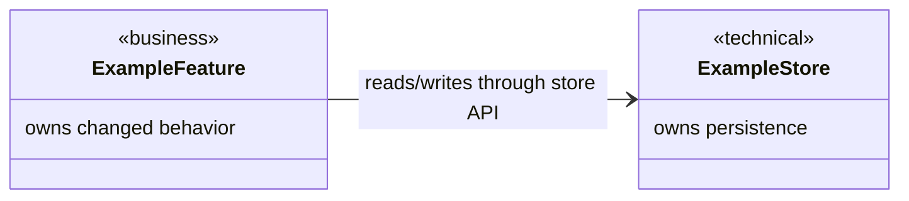
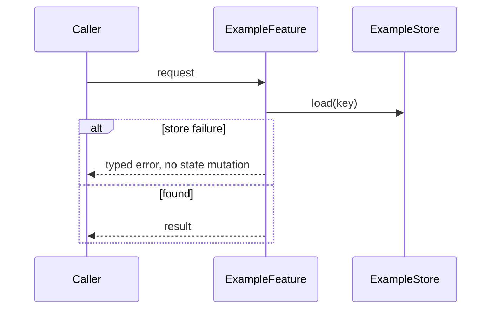
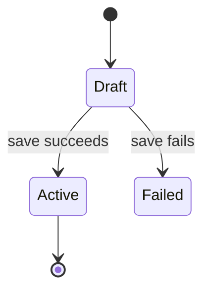

# [Module Name] Design

> Keep this document implementation-ready and readable. Put module relationships in UML diagrams, describe file-level interfaces with source-language signatures, and omit anything that does not affect implementation, admission, or acceptance. Do not design test cases or test plans here.

## Design Scope
### Goals
### Non-goals

## Useful Context
<!-- Only record facts that materially affect the design: existing constraints, selected proposal items, compatibility obligations, runtime limits, or repo-local rules. Do not restate the whole proposal. -->

## Overall Approach
<!-- Short prose summary of the chosen implementation shape and why it is the smallest sufficient approach. -->

## Layered Design Document Index
<!-- Design top-down. The root `design.md` covers the whole affected module/task. Each child submodule or nested submodule must have its own design document under the parent module document directory's `design/` directory, named after the child submodule, for example `design/<submodule>.md`. List every level that exists; if the task has no child level, include `not-applicable: <reason>`. -->
| level | parent_document | unit | design_document | responsibility |
|-------|-----------------|------|-----------------|----------------|
| root | `design.md` | affected module/task | `design.md` | overall design and child index |
| submodule | `design.md` | ExampleFeature | `design/ExampleFeature.md` | owns changed behavior |

## Module Relationship UML
<!-- Required for every level where this task changes relationships among project modules, submodules, nested submodules, or file-level modules. Use UML-style Mermaid diagrams, normally classDiagram for static dependencies. Draw only same-parent/same-level relationships; cross-parent relationships move to the nearest common parent. The graph must be acyclic. For single-unit changes, include `not-applicable: <reason>`. -->



## File-Level Interfaces
<!-- When the design reaches source files, describe interfaces in the current project's implementation language. Use fenced code blocks with the real language identifier (`rust`, `typescript`, `python`, etc.) and show only signatures, types, traits/classes, exported functions, errors, and compatibility notes needed by implementers and reviewers. Do not use prose tables for file-level interfaces. If no file-level interface is relevant, record `not-applicable: <reason>`. -->

```python
class ExampleStore:
    def load(self, key: str) -> ExampleRecord | None: ...
    def save(self, record: ExampleRecord) -> None: ...
```

- Consumer: `ExampleFeature` / `CHG-example`
- Compatibility: new / backward-compatible / migration-required / breaking
- Migration path when required:

## Key Flows
<!-- Use sequence diagrams for cross-module or cross-submodule runtime flows. Include failure, timeout, retry, idempotency, and partial-completion behavior only when those behaviors affect this change. For no cross-boundary flow, record `not-applicable: <reason>`. -->



## State and Ownership
<!-- Record only persistent data or shared state affected by this task. Each datum has one owner. Use a stateDiagram-v2 when lifecycle transitions matter; otherwise use concise bullets. Stateless changes record `not-applicable: <reason>`. -->



- Owner:
- Access path for other modules:
- Invariants to preserve:

## Directly Mapped Change Items
| change_id | target_module | proposal_id | Design Coverage | Scope Paths | Interface / Boundary Impact | Notes |
|-----------|---------------|-------------|-----------------|-------------|-----------------------------|-------|
| CHG-example | example-module | P-001 | sections or diagrams in this file | `path/or/component` | none / describe impact | |

## Implementation Order
<!-- Keep this to ordering constraints that affect correctness or review. Omit obvious sequential chores. -->
| Phase | Goal | Depends On | Output |
|-------|------|------------|--------|
| 1 | | | |

## File-Level Implementation Sequence
<!-- Finalize the concrete source files to create or modify, ordered by same-level dependency. Implementation child tasks are created from this sequence and should receive only the relevant proposal/design excerpts, scope paths, interfaces, and source files for that file-level module. -->
| sequence | file_level_module | action | depends_on | change_id | scope_path | implementation_task |
|----------|-------------------|--------|------------|-----------|------------|---------------------|
| 1 | `path/to/example_store.py` | create / modify | none | CHG-example | `path/to/example_store.py` | I-001 |

## Design Notes
<!-- Record only decisions a future implementer/reviewer needs: rejected alternatives, new abstraction justification, rollout/rollback constraints, or large-module submodule decisions. Do not record test cases, test plans, test strategy, validation IDs, testability seams, fixtures, or test implementation here. Use bullets, not mandatory filler tables. -->
- Rejected alternative:
- New abstraction justification:
- Test-stage details: intentionally omitted; testing-stage owns test-case design and test implementation.
- Large-module submodule decision:

## Risks and Rollback
<!-- Material implementation, migration, compatibility, rollback, or operational risks only. -->

## Design Guardrails
- Do not rewrite approved proposal intent in `design.md`.
- Module and submodule relationships must be represented with UML-style Mermaid diagrams, normally `classDiagram` for static dependencies and `sequenceDiagram` for boundary-crossing flows.
- Design proceeds top-down from the whole affected module to submodules, nested submodules, and file-level modules. Every level must have a same-level design description before implementation.
- Each child submodule or nested submodule design lives in an independent design document under the parent module document directory's `design/` directory, named after the child submodule, and is indexed in `## Layered Design Document Index`.
- Describe relationships only between same-level units that share the same parent. Represent cross-parent collaboration at the nearest common parent level.
- Keep module and submodule dependencies acyclic. Resolve circular dependencies before implementation.
- Split by business responsibility first; shared or technical submodules exist only when they have a nameable responsibility and visible consumers.
- File-level module interfaces must be shown as source-language signatures in fenced code blocks, not prose-only descriptions or generic tables.
- Every exported interface must name a real consumer or mapped `change_id`, and must record compatibility as `new`, `backward-compatible`, `migration-required`, or `breaking`.
- Every persistent datum or shared state has exactly one owner; other modules access it through the owner's interface.
- Include failure behavior only where it affects a boundary, state transition, compatibility promise, or acceptance risk.
- Keep only useful design content. Remove placeholder sections, speculative extension points, idealized architecture, repeated proposal text, test planning, and low-level implementation detail that does not affect contracts, dependencies, state ownership, admission, or acceptance.
- Every implementation-ready design item must carry the same `change_id` used in `proposal.md`.
- Every file-level module to create or modify must appear in `## File-Level Implementation Sequence` in dependency order.
- Do not include test-stage planning, fixtures, validation identifiers, implementation, or expected results in design-stage documents.
- `Scope Paths` must be concrete repo-relative path prefixes or globs that cover exactly the allowed implementation area. Over-broad entries such as `src` are design findings.
- When implementation structure or architectural behavior changes, update `docs/architecture/` only if repo-local project rules require global architecture documentation changes.

## Approval Record
<!-- Fill only when the user explicitly approves this document. Agents MUST NOT fill this section or set `status: approved` on their own initiative. `approver` must match front matter `approved_by`; `user_statement` must quote the user's approval instruction verbatim. The same edit must record front matter `approved_content_sha256` (generate via `schema-check.py --print-approval-hash <this-file>`); any later content edit invalidates approved evidence and MUST NOT be repaired by refreshing the hash. Use a sibling amendment/fix task for approved-document corrections. Auto-pipeline approvals use front matter plus `pipeline/plan.md` launch evidence instead of this section. -->
- approver:
- approval_date:
- user_statement: ""
