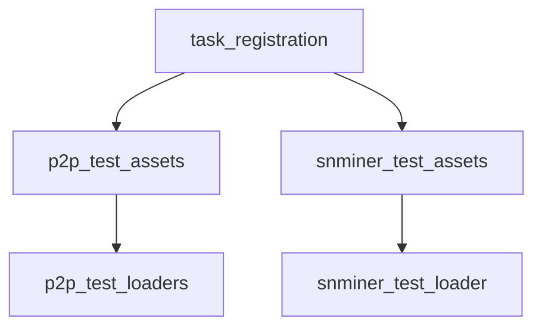

# Pipeline Plan

## Trigger
- Proposal: docs/versions/v0.1/modules/globals/021-relocate-nat-type-aware-tests/proposal.md
- User launch confirmed: yes
- User launch statement: “确认，自动完成任务”
- Per-stage user confirmation: skipped by explicit user auto-pipeline authorization
- Auto-confirm completed document stages: no design/testing Markdown documents generated; repository-local document extensions only
- Auto-pipeline document policy: no design/testing markdown docs; testplan.yaml required
- Version: v0.1
- Packet module: globals
- Task name: 021-relocate-nat-type-aware-tests
- Target module(s): p2p-frame, sn-miner
- change_id values: nat_type_aware_test_file_layout, nat_type_aware_test_registration_parity

## Acceptance Baseline
- Final acceptance is judged against:
  - `proposal.md`

## Stage Graph
| Task ID | Stage | Responsibility | Scope | Parent Task | Depends On | Output | Done Condition |
|---------|-------|----------------|-------|-------------|------------|--------|----------------|
| D-1 | design | map the 020-owned test assets, private-access loaders, exact crate destinations, and verification invariants | task-local plan mappings for p2p-frame and sn-miner | root | none | validated plan/state design mapping | pipeline-plan-check and design scope check pass without design/testing Markdown documents |
| I-1 | implementation | confirm that relocation needs no production implementation and freeze both crates' release boundary | admitted p2p-frame and sn-miner source boundaries | root | I-NOOP-P2P-1, I-NOOP-SNMINER-1 | no production-code change plus cross-target admission evidence | both no-op children, target admissions, and implementation scope checks pass |
| T-1 | testing | aggregate file relocation, inline-test extraction, registration parity, static location checks, and runnable evidence | both crates' `tests/**`, task testplan/state/artifact | root | T-P2P-RELOCATE-1, T-SNMINER-RELOCATE-1 | testplan.yaml, task run artifact, coverage and testing scope evidence | all relocated tests execute non-zero, paths are visible to Git, and testing checks pass |
| A-1 | acceptance | independently falsify layout, release/API invariance, registration parity, scope, and evidence | complete 021 packet and delivered paths | root | T-1 | acceptance-report.md | acceptance report checker passes with accepted conclusion |

## Submodule Tasks
| Task ID | Stage | Responsibility | Submodule | Parent Task | Depends On | Output | Done Condition |
|---------|-------|----------------|-----------|-------------|------------|--------|----------------|
| I-NOOP-P2P-1 | implementation | inspect and preserve the p2p-frame production/test boundary without editing production behavior | p2p-frame test-only boundary | I-1 | D-1 | recorded p2p-frame no-op implementation result | source changes are deferred to testing because every affected line is inside an existing cfg-test item |
| I-NOOP-SNMINER-1 | implementation | inspect and preserve the sn-miner production/test boundary without editing production behavior | sn-miner test-only boundary | I-1 | D-1 | recorded sn-miner no-op implementation result | parser remains private and its existing cfg-test loader is deferred to atomic testing relocation |
| T-P2P-RELOCATE-1 | testing | atomically move 020-owned standalone/inline tests and update only existing cfg-test loaders | p2p-frame NAT-aware tests | T-1 | I-1 | exact `p2p-frame/tests/unit/**` files, loader updates, and old-path removals | every allowlisted old file/body has one new destination, the 18 moved test names match the pre-move inventory, and no ignored copy remains |
| T-SNMINER-RELOCATE-1 | testing | atomically move the 020 parser test and update its existing cfg-test loader | sn-miner NAT probe config tests | T-1 | I-1 | `sn-miner-rust/tests/unit/nat_probe_config_tests.rs`, loader update, and old-path removal | private parser tests compile and execute from the new path without a public seam |

## Parallel Scheduling
- Strategy: dependency-ready-set
- Concurrency: use all runtime-available child-agent slots
- Shared artifact owner: parent-orchestrator
- Lock directory: `.harness/locks/`
- Dispatch rule: launch the maximum dependency-ready set with disjoint exclusive write scopes before waiting; immediately backfill free slots
- Serialization reasons: explicit dependency, overlapping write scope, or exhausted concurrency capacity only
- Evidence: record launched task ids and serialization reasons in sibling `pipeline/state.json` scheduler waves

## Dependency Graphs


| Level | Parent | Node | Depends On |
|-------|--------|------|------------|
| submodule | test_layout | p2p_test_loaders | none |
| submodule | test_layout | snminer_test_loader | none |
| submodule | test_layout | p2p_test_assets | p2p_test_loaders |
| submodule | test_layout | snminer_test_assets | snminer_test_loader |
| submodule | test_layout | task_registration | p2p_test_assets, snminer_test_assets |

## Exported Interfaces
| Interface | Owner | Consumer | Compatibility | Affected Callers | Migration Path |
|-----------|-------|----------|---------------|------------------|----------------|
| p2p-frame test-only module loaders | p2p-frame source modules under `#[cfg(test)]` | relocated `p2p-frame/tests/unit/**` modules | backward-compatible | crate unit-test build only | preserve existing module names and private scope; release build has no symbol |
| sn-miner test-only parser module loader | `sn-miner-rust/src/main.rs` under `#[cfg(test)]` | `sn-miner-rust/tests/unit/nat_probe_config_tests.rs` | backward-compatible | sn-miner unit-test build only | preserve `nat_probe_config_tests` module identity without exporting parser helpers |

## API and Build Surface Impact
- Public API impact: none
- Crate-root export change: no
- Build-surface change: no
- Test-build note: test source paths and test-only module assembly change, while release compilation remains unchanged
- Documentation examples affected: no
- Wire/protocol impact: none; all NAT profile, SN and tunnel behavior remains owned by accepted task 020

## Consumer Migration Closure
| Old Symbol | New Path | change_id | Consumer Path | Consumer Kind | Migration Status |
|------------|----------|-----------|---------------|---------------|------------------|
| 020 p2p-frame test bodies under `src/**` | `p2p-frame/tests/unit/**` | nat_type_aware_test_file_layout | p2p-frame `#[cfg(test)]` module loaders | internal test consumer | planned |
| `sn-miner-rust/src/nat_probe_config_tests.rs` | `sn-miner-rust/tests/unit/nat_probe_config_tests.rs` | nat_type_aware_test_file_layout | `sn-miner-rust/src/main.rs` test loader | internal test consumer | planned |
| 020 exact test filters | preserved module/test names or updated 021 testplan filters | nat_type_aware_test_registration_parity | `harness/scripts/test-run.py` task-plan loader | test runner consumer | planned |

## Test Asset Relocation Map
| Ownership | Old Location or Inline Test | New Location | Assembly / Compatibility |
|-----------|-----------------------------|--------------|--------------------------|
| 020 standalone | `p2p-frame/src/nat_type/tests.rs` | `p2p-frame/tests/unit/nat_type/tests.rs` | loaded as `nat_type::tests`; preserve case names |
| 020 standalone | `p2p-frame/src/networks/network/punch_only_default_tests.rs` | `p2p-frame/tests/unit/networks/network/punch_only_default_tests.rs` | included under existing `network::tests::punch_only_default` |
| 020 standalone | `p2p-frame/src/sn/nat_probe/tests.rs` | `p2p-frame/tests/unit/sn_tests/nat_probe/tests.rs` | loaded as `sn::nat_probe::tests`; `sn_tests` avoids the root ignore rule while retaining SN ownership |
| 020 standalone and currently ignored | `p2p-frame/src/sn/protocol/sn/nat_type_wire_tests.rs` | `p2p-frame/tests/unit/sn_tests/protocol/common/nat_type_wire_tests.rs` | loaded as `sn::protocol::sn::nat_type_wire_tests`; neither destination directory segment may be the ignored exact name `sn` |
| 020 standalone | `p2p-frame/src/sn/protocol/v0/nat_type_wire_tests.rs` | `p2p-frame/tests/unit/sn_tests/protocol/v0/nat_type_wire_tests.rs` | loaded as `sn::protocol::v0::nat_type_wire_tests` |
| 020 standalone | `p2p-frame/src/sn/service/service/nat_probe_config_tests.rs` | `p2p-frame/tests/unit/sn_tests/service/service/nat_probe_config_tests.rs` | loaded as `sn::service::service::nat_probe_config_tests` |
| 020 standalone | `p2p-frame/src/tunnel/nat_connect_plan/tests.rs` | `p2p-frame/tests/unit/tunnel/nat_connect_plan/tests.rs` | loaded as `tunnel::nat_connect_plan::tests` |
| 020 inline | `p2p-frame/src/sn/service/peer_manager.rs` test `reported_net_profile_is_available_only_until_its_own_expiry` | `p2p-frame/tests/unit/sn_tests/service/reported_net_profile_tests.rs` | direct `include!` inside existing `peer_manager::tests` preserves exact filter |
| 020 inline and fixture additions | `p2p-frame/src/sn/inter_sn/mod.rs` test `sn_distributed_detail_response_forwards_profile_without_replication` plus its 020-only detail fake/state | `p2p-frame/tests/unit/sn_tests/inter_sn_profile_tests.rs` | direct `include!` inside existing `inter_sn::tests`; define a dedicated profile fake and leave the historical fixture free of 020-only state |
| 020 inline and fixture | `p2p-frame/src/sn/service/service.rs` `DirectInterSnClient` plus `cold_distributed_query_returns_remote_profile_in_final_sn_query_response` | `p2p-frame/tests/unit/sn_tests/service/distributed_nat_profile_tests.rs` | direct `include!` inside existing `service::tests` preserves filter and moves only 020-owned fake/test |
| 020 standalone | `sn-miner-rust/src/nat_probe_config_tests.rs` | `sn-miner-rust/tests/unit/nat_probe_config_tests.rs` | loaded as existing `nat_probe_config_tests` module; parser stays private |
| already correct | `p2p-frame/tests/nat_profile_public_api.rs`, `p2p-frame/tests/nat_type_aware/sn_profile_flow_tests.rs`, `p2p-frame/tests/nat_type_aware/tunnel_manager_tests.rs` | unchanged | validate only; no relocation |
| historical exclusion | `p2p-frame/src/networks/quic/listener/tests.rs`, `p2p-frame/src/networks/quic/network/punch_owner_tests.rs` | unchanged | owned by 017—019 and excluded from 021 relocation/static allowlist |

Authoritative ownership input is task 020 `testplan.yaml` `evidence_inputs` plus the current 020 diff. The pre-move inventory contains 15 tests in the seven p2p-frame standalone source files, three mapped p2p-frame inline tests, and one sn-miner test. The already-correct tree contributes one public-API test, two SN profile-flow tests, and eight TunnelManager tests and is validation-only. The ignored common-wire source has pre-move SHA-256 `5110c42e07e74c3ef47ac64ff3199d6ed6b99f7c2e8698d838d1e0af00f18cf2`; testing must verify the moved file has the same content hash before source-loader rewrites and formatting.

## Test-Only Loader Shape

Complete dedicated modules retain their existing module name and load a crate-owned file only in test builds:

```rust
#[cfg(test)]
mod tests {
    include!(concat!(env!("CARGO_MANIFEST_DIR"), "/tests/unit/nat_type/tests.rs"));
}
```

An extracted inline body is included directly at the original `mod tests` level so its full filter path does not gain an extra module segment:

```rust
#[cfg(test)]
mod tests {
    // Existing historical fixtures and tests remain here.
    include!(concat!(env!("CARGO_MANIFEST_DIR"), "/tests/unit/sn_tests/service/reported_net_profile_tests.rs"));
}
```

No relocation may add a production `pub` seam. `tests/unit.rs` and `tests/unit/main.rs` must remain absent so Cargo does not create an unintended standalone integration target.

## State Ownership
| State | Owner | Access Interface | Lifecycle | Failure Transitions |
|-------|-------|------------------|-----------|---------------------|
| relocated test source files | each owning crate `tests/unit/**` tree | test-only module loader | source checkout -> unit-test compile -> test execution; absent from release build | missing or ignored file fails static check or test compilation; duplicate old/new file fails layout check |
| task registration evidence | 021 `testplan.yaml` and pipeline state | unified task runner | generated after relocation -> executed -> bound artifact -> acceptance | zero-test filter, missing step, stale path or failed exit code blocks testing completion |

## Failure Flows
| Flow | Boundary | Failure | Handling |
|------|----------|---------|----------|
| test-only loader resolution | crate `src` declaration -> crate `tests/unit` file | relative path or include target is wrong | Rust test compilation fails; do not expose production symbols as a workaround |
| source relocation | old `src` path -> new `tests` path | old copy remains or new file is ignored | static path and `git check-ignore` checks fail before acceptance |
| private unit-test access | relocated module -> crate-private implementation | file is compiled as a top-level integration crate | keep it under `tests/unit/**` and include it into the original `#[cfg(test)]` module context |
| exact test invocation | 021 testplan -> Cargo filter | renamed module silently loses cases despite exit zero | capture `cargo test -- --list` names before and after, require equality for the 18 p2p-frame and one sn-miner moved tests, and reject zero-test steps |
| release build | production crate -> cfg-disabled test loader | test path is unavailable outside test builds | `#[cfg(test)]` removes loader from release compilation; package checks prove unchanged release closure |

## Rejected Alternatives
| Decision Type | Selected | Rejected | Reason |
|---------------|----------|----------|--------|
| boundary | move only 020-owned test implementations and fixtures | relocate every historical test under all workspace `src` trees | the user scoped this correction to related 020 tests and unrelated historical ownership would widen review risk |
| technical | `tests/unit/sn_tests/**` for SN-owned files plus `#[cfg(test)]` include loaders | `tests/unit/sn/**`, force-add ignored files, or flatten private tests into top-level integration targets | the root unanchored `sn/` ignore rule hides any exact `sn` directory; force-add leaves the path ignored, while top-level integration crates cannot access private items |
| collaboration | disjoint p2p-frame and sn-miner loader/relocation children with parent-owned testplan | mix both crates and shared evidence in one child | separate crate ownership permits safe parallel review while preserving one shared task registration owner |

## Implementation Scope Bindings
| change_id | target_module | proposal_id | design_coverage | scope_paths | design_rules_applied |
|-----------|---------------|-------------|-----------------|-------------|----------------------|
| nat_type_aware_test_file_layout | p2p-frame | P-NTATL-1 | no production implementation; testing atomically replaces 020-owned standalone/inline test bodies with test-only loaders and exact crate-owned `tests/unit` destinations without changing release visibility | `p2p-frame/src/nat_type.rs`, `p2p-frame/src/networks/network.rs`, `p2p-frame/src/sn/nat_probe.rs`, `p2p-frame/src/sn/protocol/sn.rs`, `p2p-frame/src/sn/protocol/v0.rs`, `p2p-frame/src/sn/service/peer_manager.rs`, `p2p-frame/src/sn/inter_sn/mod.rs`, `p2p-frame/src/sn/service/service.rs`, `p2p-frame/src/tunnel/nat_connect_plan.rs`, `p2p-frame/src/nat_type/tests.rs`, `p2p-frame/src/networks/network/punch_only_default_tests.rs`, `p2p-frame/src/sn/nat_probe/tests.rs`, `p2p-frame/src/sn/protocol/sn/nat_type_wire_tests.rs`, `p2p-frame/src/sn/protocol/v0/nat_type_wire_tests.rs`, `p2p-frame/src/sn/service/service/nat_probe_config_tests.rs`, `p2p-frame/src/tunnel/nat_connect_plan/tests.rs`, `p2p-frame/tests/unit/nat_type/tests.rs`, `p2p-frame/tests/unit/networks/network/punch_only_default_tests.rs`, `p2p-frame/tests/unit/sn_tests/nat_probe/tests.rs`, `p2p-frame/tests/unit/sn_tests/protocol/common/nat_type_wire_tests.rs`, `p2p-frame/tests/unit/sn_tests/protocol/v0/nat_type_wire_tests.rs`, `p2p-frame/tests/unit/sn_tests/service/service/nat_probe_config_tests.rs`, `p2p-frame/tests/unit/tunnel/nat_connect_plan/tests.rs`, `p2p-frame/tests/unit/sn_tests/service/reported_net_profile_tests.rs`, `p2p-frame/tests/unit/sn_tests/inter_sn_profile_tests.rs`, `p2p-frame/tests/unit/sn_tests/service/distributed_nat_profile_tests.rs` | testing-stage ownership, test-only boundary, explicit private consumer, release compatibility, exact old-to-new allowlist, root-ignore-safe SN ownership path |
| nat_type_aware_test_file_layout | sn-miner | P-NTATL-1 | no production implementation; testing atomically moves the parser test body to the sn-miner tests tree and updates its cfg-disabled source loader | `sn-miner-rust/src/main.rs`, `sn-miner-rust/src/nat_probe_config_tests.rs`, `sn-miner-rust/tests/unit/nat_probe_config_tests.rs` | testing-stage ownership, private parser ownership, no public/build/config change |
| nat_type_aware_test_registration_parity | p2p-frame | P-NTATL-2 | preserve the exact pre-move name set for 18 relocated p2p-frame tests, keep the already-correct 1 public/2 SN-flow/8 TunnelManager tests runnable, and reject zero-test filters | `p2p-frame/tests/unit`, `p2p-frame/tests/nat_type_aware`, `p2p-frame/tests/nat_profile_public_api.rs` | pre/post list equality, runnable consumer mapping, zero-test rejection, unit/DV/integration parity |
| nat_type_aware_test_registration_parity | sn-miner | P-NTATL-2 | preserve the exact pre-move name of the one sn-miner parser test and task-run coverage after relocation | `sn-miner-rust/tests/unit/nat_probe_config_tests.rs` | pre/post list equality, runnable consumer mapping, zero-test rejection, unit parity |

## File-Level Implementation Sequence
| Sequence | Task ID | File-Level Module | Action | Depends On | change_id | target_module | Scope Paths | Context Sources |
|----------|---------|-------------------|--------|------------|-----------|---------------|-------------|-----------------|
| 1 | I-NOOP-P2P-1 | `p2p-frame/src/nat_type.rs` | no production modification; verify all mapped source edits are confined to existing cfg-test modules and belong to atomic testing relocation | none | nat_type_aware_test_file_layout | p2p-frame | `p2p-frame/src/nat_type.rs` | proposal P-NTATL-1, exact relocation map, testing-stage ownership, current cfg-test boundary |
| 2 | I-NOOP-SNMINER-1 | `sn-miner-rust/src/main.rs` | no production modification; verify the parser stays private and only its existing cfg-test loader belongs to atomic testing relocation | none | nat_type_aware_test_file_layout | sn-miner | `sn-miner-rust/src/main.rs` | proposal P-NTATL-1, exact relocation map, testing-stage ownership, current cfg-test boundary |

## Return Rules
- If acceptance finds proposal ambiguity:
  - stop the pipeline and ask the user to decide; do not infer whether unrelated historical tests should be migrated
- If acceptance finds design mismatch:
  - return to design when private-access assembly, exact ownership, release isolation, or old-to-new mapping is absent or wrong
- If acceptance finds implementation defect:
  - return to implementation only when relocation adds a production visibility seam or otherwise changes release behavior
- If acceptance finds testing implementation gap:
  - return to testing for source loaders retaining 020 test bodies, resolving outside the owning crate, missing relocated files, ignored/duplicate paths, zero-test filters, assertion changes, or incomplete p2p-frame/sn-miner parity evidence
- For non-requirement findings:
  - repeat design -> implementation -> testing, then rerun acceptance
- If the same unresolved issue remains after more than 5 unsuccessful iterations:
  - stop and report the issue to the user

Execution status, testing evidence, return records, and final acceptance are stored in sibling `state.json`. They are deliberately excluded from this admission-bound plan.
