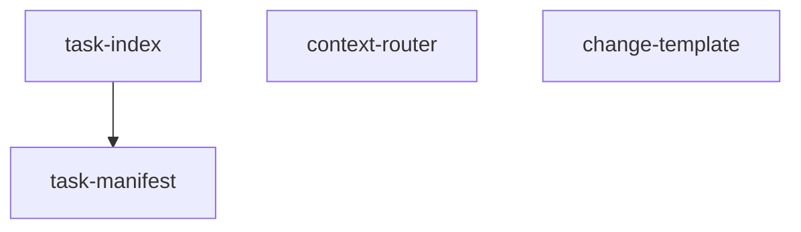

# Pipeline Plan

Workflow tier: high-risk

Risk profile: ../risk-profile.yaml

## Trigger
- Proposal: docs/versions/v0.1/modules/globals/030-complete-harness-scaffold-files/proposal.md
- User launch confirmed: yes
- User launch statement: “确认，自动完成”
- Launch stage: proposal
- First auto stage: design
- Design source: pipeline/plan.md
- Per-stage user confirmation: skipped by explicit user auto-pipeline authorization
- Auto-confirm completed document stages: no design/testing Markdown documents generated; repository-local document extensions only
- Auto-pipeline document policy: stage-selective; no design/testing markdown docs; automatic design uses pipeline plan; automatic testing uses runtime state; testplan.yaml required for automatic testing
- Version: v0.1
- Packet module: globals
- Task name: 030-complete-harness-scaffold-files
- Target module(s): p2p-frame, cyfs-p2p
- change_id values: complete_harness_scaffold_files, validate_cross_module_harness_routing

## Acceptance Baseline
- Final acceptance is judged against:
  - `proposal.md`

## Stage Graph
| Task ID | Stage | Execution Mode | Responsibility | Scope | Parent Task | Depends On | Output | Done Condition |
|---------|-------|----------------|----------------|-------|-------------|------------|--------|----------------|
| D-1 | design | auto-pipeline | map the four required scaffold files and their dependencies | bound task packet | root | none | pipeline plan design mappings and scope bindings | pipeline plan passes structural validation without design Markdown |
| I-1 | implementation | auto-pipeline | install the four bootstrap-kit-derived files | bound task packet | root | D-1 | four repository files | exact scoped files exist and compile or parse |
| T-1 | testing | auto-pipeline | derive and run router, index, template, and self-check cases | bound task packet | root | I-MANIFEST, I-INDEX, I-CONTEXT, I-TEMPLATE | testplan.yaml plus machine-readable run evidence | task-scoped testplan passes all enabled steps |
| A-1 | acceptance | auto-pipeline | independently falsify requirement, design, implementation, and validation claims | bound task packet | root | T-1 | acceptance-report.md | acceptance report passes and concludes accepted |

## Submodule Tasks
| Task ID | Stage | Execution Mode | Responsibility | Submodule | Parent Task | Depends On | Output | Done Condition |
|---------|-------|----------------|----------------|-----------|-------------|------------|--------|----------------|
| I-MANIFEST | implementation | auto-pipeline | install the shared canonical task manifest parser | task-manifest | I-1 | D-1 | `harness/scripts/task_manifest.py` | parser imports and parses the bound task manifest |
| I-INDEX | implementation | auto-pipeline | install the unfinished-task index CLI | task-index | I-1 | I-MANIFEST | `harness/scripts/task-index.py` | index lifecycle commands run against canonical task packets |
| I-CONTEXT | implementation | auto-pipeline | install the indexed Harness context router | context-router | I-1 | D-1 | `harness/scripts/context.py` | index validation and module routing run locally |
| I-TEMPLATE | implementation | auto-pipeline | install the standard-tier change record template | change-template | I-1 | D-1 | `docs/changes/_template.md` | template contains current required fields and no unresolved bootstrap mismatch |

## Parallel Scheduling
- Strategy: dependency-ready-set
- Concurrency: use all runtime-available child-agent slots
- Shared artifact owner: parent-orchestrator
- Lock directory: `.harness/locks/`
- Dispatch rule: launch dependency-ready work with practical edit coordination and available capacity
- Serialization reasons: explicit dependency, edit coordination, or exhausted concurrency capacity
- Evidence: record launched task ids and serialization reasons in `.harness/pipelines/v0.1/globals/030-complete-harness-scaffold-files/state.json` scheduler waves

## Dependency Graphs

| Level | Parent | Node | Depends On |
|-------|--------|------|------------|
| submodule | workspace-harness | task-manifest | none |
| submodule | workspace-harness | task-index | task-manifest |
| submodule | workspace-harness | context-router | none |
| submodule | workspace-harness | change-template | none |

## Exported Interfaces
| Interface | Owner | Consumer | Compatibility | Affected Callers | Migration Path |
|-----------|-------|----------|---------------|------------------|----------------|
| `context.py` command line | context-router | repository agents, complete_harness_scaffold_files, and validate_cross_module_harness_routing | new | none | none |
| `task-index.py` command line | task-index | repository task-entry workflow and complete_harness_scaffold_files | new | none | none |
| `parse_task_manifest(path)` | task-manifest | `harness/scripts/task-index.py` | new | none | none |
| `docs/changes/_template.md` fields | change-template | future standard-tier tasks | new | none | none |

## API and Build Surface Impact
- Public API impact: backward-compatible
- Crate-root export change: no
- Build-surface change: no
- Documentation examples affected: no

## Consumer Migration Closure
| Old Symbol | New Path | change_id | Consumer Path | Consumer Kind | Migration Status |
|------------|----------|-----------|---------------|---------------|------------------|
| not-applicable | additive files only | complete_harness_scaffold_files | not-applicable | not-applicable | verified-none |

## State Ownership
| State | Owner | Access Interface | Lifecycle | Failure Transitions |
|-------|-------|------------------|-----------|---------------------|
| `.harness/tasks/v0.1/tasks.json` | task-index | `init`, `add`, `remove`, `list`, `contains`, `validate` commands | absent -> initialized -> entries added/removed -> validated | malformed input or unsafe path returns non-zero; atomic temporary replacement preserves the previous valid index |

## Failure Flows
| Flow | Boundary | Failure | Handling |
|------|----------|---------|----------|
| context routing | index files -> router output | duplicate, stale, unsafe, or unknown rule metadata | fail closed with non-zero exit and no partial routing output |
| task registration | task packet -> runtime task index | malformed manifest, missing proposal, duplicate id, or unsafe path | fail before index mutation; successful writes use temporary-file replacement |
| standard change creation | template -> future standard task | placeholder fields left unresolved | later lower-tier completion validation rejects incomplete change records; template itself remains inert |

## Rejected Alternatives
| Decision Type | Selected | Rejected | Reason |
|---------------|----------|----------|--------|
| boundary | install four directly required files | refresh every missing latest Harness script | the user asked to close the reported gap; a full scaffold migration is materially broader |
| technical | adapt current bootstrap-kit templates | reimplement router and manifest parsing locally | template reuse preserves current schema and avoids a divergent parser |
| collaboration | one dependency-ordered merged task | split each small file into separate execution ownership | the files share one closeout boundary and only task-index/task-manifest have a real dependency |

## Implementation Scope Bindings
| change_id | target_module | proposal_id | design_coverage | scope_paths | design_rules_applied |
|-----------|---------------|-------------|-----------------|-------------|----------------------|
| complete_harness_scaffold_files | p2p-frame | P-001 | Dependency graph, exported interfaces, state ownership, failure flows, rejected alternatives, and file sequence in this plan | `harness/scripts/context.py`; `harness/scripts/task-index.py`; `harness/scripts/task_manifest.py`; `docs/changes/_template.md` | workspace Harness boundary, acyclic dependency, concrete consumers, single state owner, failure handling |
| validate_cross_module_harness_routing | cyfs-p2p | P-002 | Cross-module router/index consumer mapping and task-scoped validation defined in this plan | `harness/scripts/context.py`; `harness/scripts/task-index.py`; `harness/scripts/task_manifest.py`; `docs/changes/_template.md` | globals packet binding, concrete module consumer, cross-module routing validation |

## File-Level Implementation Sequence
| Sequence | Task ID | File-Level Module | Action | Depends On | change_id | target_module | Scope Paths | Context Sources |
|----------|---------|-------------------|--------|------------|-----------|---------------|-------------|-----------------|
| 1 | I-MANIFEST | `harness/scripts/task_manifest.py` | create from bootstrap kit | none | complete_harness_scaffold_files | p2p-frame | `harness/scripts/task_manifest.py` | proposal, parser template, task-index consumer |
| 2 | I-INDEX | `harness/scripts/task-index.py` | create from bootstrap kit | I-MANIFEST | complete_harness_scaffold_files | p2p-frame | `harness/scripts/task-index.py` | proposal, task-index template, parser interface |
| 3 | I-CONTEXT | `harness/scripts/context.py` | create from bootstrap kit | none | validate_cross_module_harness_routing | cyfs-p2p | `harness/scripts/context.py` | proposal, rule indexes, context template, module consumers |
| 4 | I-TEMPLATE | `docs/changes/_template.md` | create from bootstrap kit | none | complete_harness_scaffold_files | p2p-frame | `docs/changes/_template.md` | proposal, standard-tier rule, change template |

## Return Rules
- If acceptance finds proposal ambiguity, record a blocking requirement finding and rejected report, then stop for the user.
- If acceptance finds a design defect, return to automatic design and revise this plan before implementation.
- If acceptance finds an implementation defect, return to implementation.
- If acceptance finds inadequate or non-runnable validation, return to testing.
- If the same unresolved issue remains after more than 5 unsuccessful iterations, stop and report the issue to the user.

Execution status, testing evidence, return records, and final acceptance are stored in `.harness/pipelines/v0.1/globals/030-complete-harness-scaffold-files/state.json`. They are deliberately excluded from this immutable design-and-scope plan.
