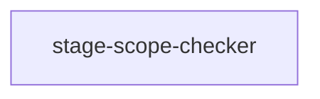

# Pipeline Plan

Workflow tier: high-risk

Risk profile: ../risk-profile.yaml

## Trigger
- Proposal: docs/versions/v0.1/modules/globals/031-allow-harness-tooling-implementation-scope/proposal.md
- User launch confirmed: yes
- User launch statement: “确认，自动完成”
- Launch stage: proposal
- First auto stage: design
- Design source: pipeline/plan.md
- Per-stage user confirmation: skipped by explicit user auto-pipeline authorization
- Auto-confirm completed document stages: no design/testing Markdown documents generated; repository-local document extensions only
- Auto-pipeline document policy: stage-selective; no design/testing markdown docs; automatic design uses pipeline plan; automatic testing uses runtime state; testplan.yaml required for automatic testing
- Version: v0.1
- Packet module: globals
- Task name: 031-allow-harness-tooling-implementation-scope
- Target module(s): p2p-frame, cyfs-p2p
- change_id values: define_harness_tooling_implementation_artifacts, enforce_globals_harness_tooling_scope

## Acceptance Baseline
- Final acceptance is judged against:
  - `proposal.md`

## Stage Graph
| Task ID | Stage | Execution Mode | Responsibility | Scope | Parent Task | Depends On | Output | Done Condition |
|---------|-------|----------------|----------------|-------|-------------|------------|--------|----------------|
| D-1 | design | auto-pipeline | define the narrow stage classification and self-hosting checker update | bound task packet | root | none | pipeline plan design mappings and scope bindings | pipeline plan passes structural validation without design Markdown |
| I-1 | implementation | auto-pipeline | refresh and update the stage-scope checker after direct rule maintenance | bound task packet | root | D-1 | one checker | checker encodes the rule-defined narrow classification |
| T-1 | testing | auto-pipeline | derive and run positive and negative classification cases | bound task packet | root | I-CHECKER | testplan.yaml plus machine-readable run evidence | task-scoped testplan passes all enabled steps |
| A-1 | acceptance | auto-pipeline | independently falsify bypass, drift, implementation, and validation claims | bound task packet | root | T-1 | acceptance-report.md | acceptance report passes and concludes accepted |

## Submodule Tasks
| Task ID | Stage | Execution Mode | Responsibility | Submodule | Parent Task | Depends On | Output | Done Condition |
|---------|-------|----------------|----------------|-----------|-------------|------------|--------|----------------|
| I-CHECKER | implementation | auto-pipeline | refresh and implement the rule-defined boundary mechanically | stage-scope-checker | I-1 | D-1 | `harness/scripts/stage-scope-check.py` | current checker contract accepts only the intended Harness-script implementation case |

## Parallel Scheduling
- Strategy: dependency-ready-set
- Concurrency: use all runtime-available child-agent slots
- Shared artifact owner: parent-orchestrator
- Lock directory: `.harness/locks/`
- Dispatch rule: launch dependency-ready work with practical edit coordination and available capacity
- Serialization reasons: explicit dependency, edit coordination, or exhausted concurrency capacity
- Evidence: record launched task ids and serialization reasons in `.harness/pipelines/v0.1/globals/031-allow-harness-tooling-implementation-scope/state.json` scheduler waves

## Dependency Graphs

| Level | Parent | Node | Depends On |
|-------|--------|------|------------|
| submodule | workspace-harness | stage-scope-checker | none |

## Exported Interfaces
| Interface | Owner | Consumer | Compatibility | Affected Callers | Migration Path |
|-----------|-------|----------|---------------|------------------|----------------|
| implementation artifact classification | implementation-rules | define_harness_tooling_implementation_artifacts and future globals Harness-tooling tasks | backward-compatible | globals Harness-process packets | existing product and policy classifications remain unchanged |
| `stage-scope-check.py --stage implementation` | stage-scope-checker | enforce_globals_harness_tooling_scope, task 030, repository agents | backward-compatible | globals Harness-tooling completion checks | no caller syntax change; one formerly impossible valid case becomes accepted |

## API and Build Surface Impact
- Public API impact: backward-compatible
- Crate-root export change: no
- Build-surface change: no
- Documentation examples affected: no

## Consumer Migration Closure
| Old Symbol | New Path | change_id | Consumer Path | Consumer Kind | Migration Status |
|------------|----------|-----------|---------------|---------------|------------------|
| unconditional `harness/` implementation rejection | globals scripts-only classification | define_harness_tooling_implementation_artifacts | `harness/scripts/stage-scope-check.py` | repository checker | implementation planned |

## State Ownership
| State | Owner | Access Interface | Lifecycle | Failure Transitions |
|-------|-------|------------------|-----------|---------------------|
| stage-scope decision | stage-scope-checker | `stage-scope-check.py --stage implementation` | parse bound manifest -> classify every path -> pass or reject | malformed binding, non-globals packet, missing sibling task, globals target, policy path, or out-of-stage artifact returns non-zero |

## Failure Flows
| Flow | Boundary | Failure | Handling |
|------|----------|---------|----------|
| globals Harness-script completion | task binding -> implementation classifier | packet is not globals, submodule is absent, or target is globals | reject the Harness script path with non-zero exit |
| policy isolation | Harness path -> artifact category | path belongs to rules, custom rules, process rules, checklists, or human rules | reject as non-implementation policy artifact |
| self-hosting checker update | pre-update contract -> updated checker | refreshed checker accidentally broadens another stage or path category | positive/negative task plan fails before acceptance |

## Rejected Alternatives
| Decision Type | Selected | Rejected | Reason |
|---------------|----------|----------|--------|
| boundary | globals + sibling + concrete target + scripts-only | allow all `harness/` paths in implementation | blanket allowance would hide rule-policy and cross-stage drift |
| technical | refresh to current checker baseline and add narrow branch | patch only the old blanket rejection line | the local checker already misses current task.yaml and `.harness` runtime semantics |
| collaboration | keep Scope Paths descriptive | use design Scope Paths as an implementation allowlist | Harness stages and path metadata are workflow evidence, not filesystem permission |

## Implementation Scope Bindings
| change_id | target_module | proposal_id | design_coverage | scope_paths | design_rules_applied |
|-----------|---------------|-------------|-----------------|-------------|----------------------|
| define_harness_tooling_implementation_artifacts | p2p-frame | P-001 | Stage classification, retained policy exclusions, consumers, failure flows, and ordered rule/checker sequence | `harness/rules/task-entry-gate-rules.md`; `harness/rules/implementation-rules.md`; `harness/scripts/stage-scope-check.py` | workspace Harness boundary, backward compatibility, negative boundaries, no path authorization |
| enforce_globals_harness_tooling_scope | cyfs-p2p | P-002 | Mechanical predicate, self-hosting failure flow, concrete consumers, and positive/negative completion evidence | `harness/rules/task-entry-gate-rules.md`; `harness/rules/implementation-rules.md`; `harness/scripts/stage-scope-check.py` | globals packet binding, fail-closed conditions, consumer closure, testable branch behavior |

## File-Level Implementation Sequence
| Sequence | Task ID | File-Level Module | Action | Depends On | change_id | target_module | Scope Paths | Context Sources |
|----------|---------|-------------------|--------|------------|-----------|---------------|-------------|-----------------|
| 1 | I-CHECKER | `harness/scripts/stage-scope-check.py` | refresh from bootstrap kit and implement classification | none | enforce_globals_harness_tooling_scope | cyfs-p2p | `harness/scripts/stage-scope-check.py` | proposal, directly maintained rule files, current checker template |

## Return Rules
- If acceptance finds proposal ambiguity, record a blocking requirement finding and rejected report, then stop for the user.
- If acceptance finds a design defect, return to automatic design and revise this plan before implementation.
- If acceptance finds an implementation defect, return to implementation.
- If acceptance finds inadequate or non-runnable validation, return to testing.
- If the same unresolved issue remains after more than 5 unsuccessful iterations, stop and report the issue to the user.

Execution status, testing evidence, return records, and final acceptance are stored in `.harness/pipelines/v0.1/globals/031-allow-harness-tooling-implementation-scope/state.json`. They are deliberately excluded from this immutable design-and-scope plan.
