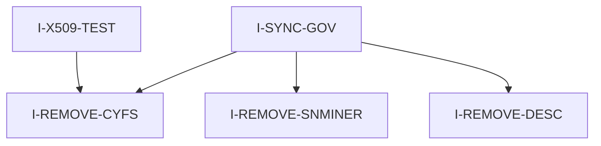

# Pipeline Plan

Workflow tier: high-risk

Risk profile: ./risk-profile.yaml

## Trigger
- Proposal: docs/versions/v0.1/modules/globals/077-remove-cyfs-legacy-tools-x509-test-identity/proposal.md
- User launch confirmed: yes
- User launch statement: “确认，自动完成”
- Launch stage: proposal
- First auto stage: design
- Design source: pipeline/plan.md
- Per-stage user confirmation: skipped by explicit user auto-pipeline authorization
- Auto-confirm completed document stages: no design/testing Markdown documents generated; repository-local document extensions only
- Auto-pipeline document policy: stage-selective; no design/testing markdown docs; automatic design uses pipeline plan; automatic testing uses runtime state; testplan.yaml required for automatic testing
- Version: v0.1
- Packet module: globals
- Task name: 077-remove-cyfs-legacy-tools-x509-test-identity
- Target module(s): cyfs-p2p, sn-miner, desc-tool, cyfs-p2p-test, workspace-harness
- change_id values: remove_cyfs_p2p_crate, remove_sn_miner_crate, remove_desc_tool_crate, x509_identity_cyfs_p2p_test, sync_workspace_governance

## Acceptance Baseline
- Final acceptance is judged against:
  - `proposal.md`

## Stage Graph
| Task ID | Stage | Execution Mode | Responsibility | Scope | Parent Task | Depends On | Output | Done Condition |
|---------|-------|----------------|----------------|-------|-------------|------------|--------|----------------|
| D-1 | design | auto-pipeline | map removal, workspace synchronization, and x509 identity replacement | bound task packet | root | none | pipeline plan design mappings and scope bindings | pipeline plan passes structural validation without design Markdown |
| I-1 | implementation | auto-pipeline | delete legacy CYFS crates and rewrite cyfs-p2p-test identity | bound task packet | root | D-1 | reduced workspace and x509-based cyfs-p2p-test | workspace builds and no live legacy references remain |
| T-1 | testing | auto-pipeline | derive and run removal and x509 verification cases | bound task packet | root | I-1 | testplan.yaml plus machine-readable run evidence | task-scoped testplan passes all enabled steps |
| A-1 | acceptance | auto-pipeline | independently falsify removal, identity, governance, and validation claims | bound task packet | root | T-1 | acceptance-report.md | acceptance report passes and concludes accepted |

## Submodule Tasks
| Task ID | Stage | Execution Mode | Responsibility | Submodule | Parent Task | Depends On | Output | Done Condition |
|---------|-------|----------------|----------------|-----------|-------------|------------|--------|----------------|
| I-REMOVE-CYFS | implementation | auto-pipeline | delete cyfs-p2p crate and its workspace membership | cyfs-p2p | I-1 | D-1 | `cyfs-p2p/` removed | no live cyfs-p2p reference remains and workspace parses |
| I-REMOVE-SNMINER | implementation | auto-pipeline | delete sn-miner-rust crate and its workspace membership | sn-miner | I-1 | D-1 | `sn-miner-rust/` removed | no live sn-miner reference remains and workspace parses |
| I-REMOVE-DESC | implementation | auto-pipeline | delete desc-tool crate and its workspace membership | desc-tool | I-1 | D-1 | `desc-tool/` removed | no live desc-tool reference remains and workspace parses |
| I-X509-TEST | implementation | auto-pipeline | rewrite cyfs-p2p-test to use p2p-frame x509 identity | cyfs-p2p-test | I-1 | I-REMOVE-CYFS | x509-based cyfs-p2p-test source | cyfs-p2p-test compiles without bucky/cyfs deps |
| I-SYNC-GOV | implementation | auto-pipeline | synchronize active workspace governance, docs, and verify scripts | workspace-harness | I-1 | I-REMOVE-CYFS, I-REMOVE-SNMINER, I-REMOVE-DESC, I-X509-TEST | updated governance and module references | workspace verification passes with reduced module list |

## Parallel Scheduling
- Strategy: dependency-ready-set
- Concurrency: use all runtime-available child-agent slots
- Shared artifact owner: parent-orchestrator
- Lock directory: `.harness/locks/`
- Dispatch rule: launch dependency-ready work with practical edit coordination and available capacity
- Serialization reasons: explicit dependency, edit coordination, or exhausted concurrency capacity
- Evidence: record launched task ids and serialization reasons in `.harness/pipelines/v0.1/globals/077-remove-cyfs-legacy-tools-x509-test-identity/state.json` scheduler waves

## Dependency Graphs

| Level | Parent | Node | Depends On |
|-------|--------|------|------------|
| submodule | root | I-REMOVE-CYFS | none |
| submodule | root | I-REMOVE-SNMINER | none |
| submodule | root | I-REMOVE-DESC | none |
| submodule | root | I-X509-TEST | I-REMOVE-CYFS |
| submodule | root | I-SYNC-GOV | I-REMOVE-CYFS, I-REMOVE-SNMINER, I-REMOVE-DESC |

## Exported Interfaces
| Interface | Owner | Consumer | Compatibility | Affected Callers | Migration Path |
|-----------|-------|----------|---------------|------------------|----------------|
| workspace members in root `Cargo.toml` | root workspace | cargo build/test, CI, verify-workspace-harness | breaking | `Cargo.toml`, `harness/workspace-governance.yaml`, `harness/scripts/verify-workspace-harness.py`, AGENTS/docs | remove cyfs-p2p, sn-miner, desc-tool members and all live references |
| `cyfs_p2p` crate identifiers and CYFS device identity helpers | cyfs-p2p | cyfs-p2p-test | breaking | `cyfs-p2p-test/src/main.rs` | migrate to `p2p_frame::stack` and `p2p_frame::x509` API |
| `p2p_frame::x509::X509Identity*` | p2p-frame | cyfs-p2p-test and p2p-frame tests | backward-compatible | cyfs-p2p-test | no syntax change; only adopt in cyfs-p2p-test |

## API and Build Surface Impact
- Public API impact: breaking
- Crate-root export change: yes
- Build-surface change: yes
- Documentation examples affected: yes

## Consumer Migration Closure
| Old Symbol | New Path | change_id | Consumer Path | Consumer Kind | Migration Status |
|------------|----------|-----------|---------------|---------------|------------------|
| workspace members `cyfs-p2p` / `sn-miner-rust` / `desc-tool` | root `Cargo.toml` members list without them | remove_cyfs_p2p_crate, remove_sn_miner_crate, remove_desc_tool_crate | Cargo.toml | build config | migrated |
| `cyfs_p2p::CyfsIdentity` and related factories | `p2p_frame::x509::X509Identity` / factories | x509_identity_cyfs_p2p_test | cyfs-p2p-test/src/main.rs | source | migrated |
| `cyfs_p2p::create_cyfs_p2p_config` / `create_cyfs_p2p_stack_config` | `p2p_frame::stack::{P2pConfig, P2pStackConfig}` construction | x509_identity_cyfs_p2p_test | cyfs-p2p-test/src/main.rs | source | migrated |
| active module matrix entries for removed crates | reduced governance/module docs | sync_workspace_governance | harness/workspace-governance.yaml | governance config | migrated |

## State Ownership
| State | Owner | Access Interface | Lifecycle | Failure Transitions |
|-------|-------|------------------|-----------|---------------------|
| workspace member registry | I-SYNC-GOV | `cargo metadata` and `harness/scripts/verify-workspace-harness.py` | members parsed at build and verification time | stale member or missing directory fails cargo/verify; fix by synchronizing Cargo.toml and governance |
| cyfs-p2p-test identity configuration | I-X509-TEST | `p2p_frame::x509::generate_rsa_x509_identity` and `P2pStackConfig` | generated per process; cert factory/identity factory bind at stack creation | invalid factory or signing type fails compile/stack creation; return to implementation |
| auto-pipeline execution state | parent-orchestrator | `.harness/pipelines/v0.1/globals/077-remove-cyfs-legacy-tools-x509-test-identity/state.json` | task status transitions pending -> confirmed/complete per stage | incomplete/blocked stage record prevents downstream advancement |

## Failure Flows
| Flow | Boundary | Failure | Handling |
|------|----------|---------|----------|
| workspace build after removal | cargo resolves members and lockfile | stale reference to removed crate or package | full `rg` sweep plus `cargo check --workspace`; return to implementation |
| x509 identity replacement | cyfs-p2p-test stack assembly | mismatched identity cert/factory/stack config or leftover CYFS imports | compile check and p2p-frame x509 tests; return to implementation |
| governance drift | AGENTS/governance/verify script module list | verify-workspace-harness or docs reference removed modules | synchronize all active references; return to implementation |
| bucky-crypto build blocker | dependency graph | removed crates still pull bucky-crypto/ecies needlessly | confirm only remaining required raw-codec dependencies; run locked workspace build |

## Rejected Alternatives
| Decision Type | Selected | Rejected | Reason |
|---------------|----------|----------|--------|
| boundary | remove the three legacy crates | pin `ecies = "0.2.9"` and keep them | removal matches the requested architecture and eliminates the legacy dependency chain instead of freezing it |
| technical | dynamically generate x509 identity per run | persist PEM/DER identity files through new p2p-frame public API | proposal default and confirmed boundary keep scope local to cyfs-p2p-test |
| collaboration | preserve versioned historical docs | delete `docs/versions/v0.1/modules/{cyfs-p2p,sn-miner,desc-tool}/` | proposal default confirmed by user; history remains recoverable and auditable |

## Implementation Scope Bindings
| change_id | target_module | proposal_id | design_coverage | scope_paths | design_rules_applied |
|-----------|---------------|-------------|-----------------|-------------|----------------------|
| remove_cyfs_p2p_crate | cyfs-p2p | P-001 | workspace member removal, live reference sweep, lockfile regeneration | `cyfs-p2p/**`, `Cargo.toml`, `Cargo.lock` | build-graph boundary, no path authorization, no historical doc rewrite |
| remove_sn_miner_crate | sn-miner | P-002 | workspace member removal, operational binary removal, live reference sweep | `sn-miner-rust/**`, `Cargo.toml`, `Cargo.lock` | build-graph boundary, runtime artifact removal, no role migration |
| remove_desc_tool_crate | desc-tool | P-003 | workspace member removal, tool removal, live reference sweep | `desc-tool/**`, `Cargo.toml`, `Cargo.lock` | build-graph boundary, no desc tool migration |
| x509_identity_cyfs_p2p_test | cyfs-p2p-test | P-004 | dependency removal, x509 identity/config replacement, stack assembly migration | `cyfs-p2p-test/**`, `Cargo.toml`, `Cargo.lock` | security-identity boundary, custom cyfs-p2p-test stage ban, API consumer closure |
| sync_workspace_governance | workspace-harness | P-005 | AGENTS, governance, architecture/module docs, verify script synchronization | `AGENTS.md`, `harness/workspace-governance.yaml`, `harness/scripts/verify-workspace-harness.py`, `docs/architecture/principles.md`, `docs/architecture/workspace-constraints.md`, `docs/modules/cyfs-p2p.md`, `docs/modules/cyfs-p2p-test.md`, `docs/modules/sn-miner.md`, `docs/modules/desc-tool.md`, `harness/human-rules/module-tier-matrix.md` | harness-process boundary, no rule-policy rewrite |

## File-Level Implementation Sequence
| Sequence | Task ID | File-Level Module | Action | Depends On | change_id | target_module | Scope Paths | Context Sources |
|----------|---------|-------------------|--------|------------|-----------|---------------|-------------|-----------------|
| 1 | I-REMOVE-CYFS | cyfs-p2p | delete `cyfs-p2p/` and remove workspace member | none | remove_cyfs_p2p_crate | cyfs-p2p | `cyfs-p2p/**`, `Cargo.toml`, `Cargo.lock` | proposal P-001, workspace governance, lockfile |
| 2 | I-REMOVE-SNMINER | sn-miner | delete `sn-miner-rust/` and remove workspace member | none | remove_sn_miner_crate | sn-miner | `sn-miner-rust/**`, `Cargo.toml`, `Cargo.lock` | proposal P-002, workspace governance, lockfile |
| 3 | I-REMOVE-DESC | desc-tool | delete `desc-tool/` and remove workspace member | none | remove_desc_tool_crate | desc-tool | `desc-tool/**`, `Cargo.toml`, `Cargo.lock` | proposal P-003, workspace governance, lockfile |
| 4 | I-X509-TEST | cyfs-p2p-test | rewrite identity and stack assembly to p2p-frame x509, drop legacy deps | I-REMOVE-CYFS | x509_identity_cyfs_p2p_test | cyfs-p2p-test | `cyfs-p2p-test/**`, `Cargo.toml`, `Cargo.lock` | proposal P-004, p2p-frame x509 API, current main.rs references |
| 5 | I-SYNC-GOV | workspace-harness | synchronize AGENTS, governance, module docs, architecture docs, verify script | I-REMOVE-CYFS, I-REMOVE-SNMINER, I-REMOVE-DESC, I-X509-TEST | sync_workspace_governance | workspace-harness | `AGENTS.md`, `harness/workspace-governance.yaml`, `harness/scripts/verify-workspace-harness.py`, `docs/architecture/principles.md`, `docs/architecture/workspace-constraints.md`, `docs/modules/cyfs-p2p.md`, `docs/modules/cyfs-p2p-test.md`, `docs/modules/sn-miner.md`, `docs/modules/desc-tool.md`, `harness/human-rules/module-tier-matrix.md` | proposal P-005, rg reference sweep |

## Return Rules
- If acceptance finds proposal ambiguity, record a blocking requirement finding and rejected report, then stop for the user.
- If acceptance finds a design defect, return to automatic design and revise this plan before implementation.
- If acceptance finds an implementation defect, return to implementation.
- If acceptance finds inadequate or non-runnable validation, return to testing.
- If the same unresolved issue remains after more than 5 unsuccessful iterations, stop and report the issue to the user.

Execution status, testing evidence, return records, and final acceptance are stored in `.harness/pipelines/v0.1/globals/077-remove-cyfs-legacy-tools-x509-test-identity/state.json`. They are deliberately excluded from this immutable design-and-scope plan.
