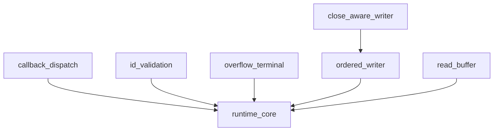

# Pipeline Plan

## Trigger
- Proposal: docs/versions/v0.1/modules/p2p-frame/001-control-stream-runtime-fixes/proposal.md
- User launch confirmed: yes
- User launch statement: 确认，自动处理后续步骤
- Per-stage user confirmation: skipped by explicit user auto-pipeline authorization
- Auto-confirm completed document stages: no design/testing Markdown documents generated; repository-local document extensions only
- Auto-pipeline document policy: no design/testing markdown docs; testplan.yaml required
- Version: v0.1
- Packet module: p2p-frame
- Task name: 001-control-stream-runtime-fixes
- Target module(s): p2p-frame
- change_id values: control_stream_callback_dispatch, control_stream_per_stream_overflow, control_stream_id_validation, control_stream_ordered_shutdown, control_stream_terminal_delivery, control_stream_tunnel_close_writes, control_stream_read_buffer_performance

## Acceptance Baseline
- Final acceptance is judged against:
  - `proposal.md`

## Stage Graph
| Task ID | Stage | Responsibility | Scope | Parent Task | Depends On | Output | Done Condition |
|---------|-------|----------------|-------|-------------|------------|--------|----------------|
| D-1 | design | convert the confirmed control-stream fixes into an executable state and failure model | task-local pipeline design mappings | root | none | validated pipeline plan and scope bindings | pipeline-plan-check passes without design/testing Markdown documents |
| I-1 | implementation | coordinate the cohesive production runtime update | `p2p-frame/src/networks/control_stream.rs` | root | D-1 | production implementation | all implementation child tasks complete and implementation scope check passes |
| T-1 | testing | generate post-implementation tests and task testplan from proposal, plan, and delivered code | dedicated control-stream test module and task testplan | root | I-1 | tests, testplan.yaml, test-run evidence, state coverage | coverage checker and task all entry pass with machine evidence |
| A-1 | acceptance | audit proposal-plan-code-tests-evidence consistency and correctness | bound task packet and delivered paths | root | T-1 | acceptance-report.md | quality and acceptance report checks pass with accepted conclusion |

## Submodule Tasks
| Task ID | Stage | Responsibility | Submodule | Parent Task | Depends On | Output | Done Condition |
|---------|-------|----------------|-----------|-------------|------------|--------|----------------|
| I-CS-1 | implementation | detach callback execution from the control receive loop | callback dispatch in control-stream runtime | I-1 | D-1 | spawned callback dispatch | callback future is never awaited by frame processing and spawn failure/lifetime is handled |
| I-CS-2 | implementation | validate peer-owned stream IDs without replacing live state | stream-id admission in control-stream runtime | I-1 | I-CS-1 | ID validation and collision handling | parity, duplicate, pending, and active conflicts cannot overwrite existing entries |
| I-CS-3 | implementation | isolate inbound overflow and preserve ordered terminal state | per-stream inbound state and delivery | I-1 | I-CS-2 | per-stream overflow/terminal handling | overflow terminates only the affected stream and terminal state cannot be lost on a full data queue |
| I-CS-4 | implementation | order shutdown behind accepted writes | AsyncWrite state machine | I-1 | I-CS-3 | Data-before-Fin shutdown behavior | shutdown polls pending write first and propagates its error before Fin |
| I-CS-5 | implementation | bind returned writers to runtime closure | shared runtime/write lifecycle | I-1 | I-CS-4 | close-aware writer behavior | old and pending writers observe runtime close and fail without relying on transport teardown |
| I-CS-6 | implementation | remove front-drain buffer movement | AsyncRead remainder storage | I-1 | I-CS-5 | offset-based remainder reads | partial reads preserve byte order without moving the unread suffix on every poll |
| I-CS-7 | implementation | integrate and review the cohesive runtime state transitions | whole `control_stream.rs` runtime | I-1 | I-CS-6 | integrated production file | all seven change bindings are implemented without public or transport API changes |

## Dependency Graphs

| Level | Parent | Node | Depends On |
|-------|--------|------|------------|
| submodule | control_stream_runtime | runtime_core | none |
| submodule | control_stream_runtime | callback_dispatch | runtime_core |
| submodule | control_stream_runtime | id_validation | runtime_core |
| submodule | control_stream_runtime | overflow_terminal | runtime_core |
| submodule | control_stream_runtime | ordered_writer | runtime_core |
| submodule | control_stream_runtime | close_aware_writer | ordered_writer |
| submodule | control_stream_runtime | read_buffer | runtime_core |

## Exported Interfaces
| Interface | Owner | Consumer | Compatibility | Affected Callers | Migration Path |
|-----------|-------|----------|---------------|------------------|----------------|
| `ControlStreamRuntime::listen/open/on_data/close_all` crate-private behavior | control_stream_runtime | TCP, QUIC, and PN tunnel adapters | backward-compatible | existing tunnel adapters and public Tunnel methods | no caller migration; signatures remain unchanged |
| `TunnelStreamRead` AsyncRead behavior | read_buffer | StreamManager, TTP, and SN control command consumers | backward-compatible | existing read consumers | no migration; byte order, EOF, and interrupted errors remain compatible |
| `TunnelStreamWrite` AsyncWrite behavior | ordered_writer and close_aware_writer | StreamManager, TTP, and SN control command producers | backward-compatible | existing write consumers | no migration; shutdown becomes more strictly ordered and close-aware |
| `ControlStreamFrame` private wire variants | runtime_core | peer control-stream runtime | backward-compatible | TCP, QUIC, and PN peers using the existing private protocol | no wire variant or field migration |

## State Ownership
| State | Owner | Access Interface | Lifecycle | Failure Transitions |
|-------|-------|------------------|-----------|---------------------|
| runtime closed flag and close reason | `ControlStreamRuntimeInner` | shared close token read by runtime and writers | open -> closed exactly once | send failure, transport close, protocol error, or local Tunnel close sets closed and wakes/fails dependent operations |
| pending outbound opens | `ControlStreamRuntimeInner::pending_opens` | `open`, `handle_open_resp`, close cleanup | allocated -> awaiting response -> active or rejected/timeout/closed | timeout/cancel removes local pending; close returns the shared close error; late response cannot replace active state |
| active inbound stream registry | `ControlStreamRuntimeInner::streams` | validated Open, Data, Fin, Reset, close_all | absent -> active -> terminal/removed | invalid ID rejected; overflow/Fin/Reset/close removes only the owned entry and records a terminal result |
| per-stream inbound data and terminal state | per-stream inbound state owned by control_stream runtime | runtime delivery plus ControlStreamRead polling | open with bounded queue -> data sequence -> terminal consumed | overflow discards the rejected frame and sets stream terminal; runtime close records terminal even when data capacity is full |
| writer pending Data and Fin futures | `ControlStreamWrite` | AsyncWrite poll methods plus shared close state | idle -> data pending -> idle -> fin pending -> closed | pending data error or runtime close fails write; shutdown cannot start Fin until data pending completes |
| reader remainder and offset | `ControlStreamRead` | AsyncRead poll method | empty -> frame remainder with offset -> empty | terminal is returned after accepted bytes; no front-drain movement or byte reordering |

## Failure Flows
| Flow | Boundary | Failure | Handling |
|------|----------|---------|----------|
| inbound Open to application callback | runtime -> callback task | callback blocks, fails to make progress, or task cannot consume stream | Open handling returns after spawning; callback lifetime cannot block control receive; abandoned local stream follows per-stream terminal cleanup |
| inbound Open ID admission | peer frame -> runtime registry | wrong parity, duplicate ID, or collision with local pending/active state | reject or Reset only the invalid requested stream without overwriting existing state or closing Tunnel |
| inbound Data to bounded per-stream storage | control loop -> virtual stream reader | target queue has no data capacity or reader is gone | discard rejected frame, remove/terminate only target stream, and keep control loop/Tunnel/other streams operational |
| Tunnel closure to returned writer | runtime close -> AsyncWrite | write is idle or sender future is pending while control transport closes | shared close state causes pending and subsequent writes to fail; no successful post-close Data is reported |
| AsyncWrite shutdown | caller -> pending Data sender -> Fin sender | pending Data is blocked or fails | poll pending Data first; on failure return error and do not send Fin; on success enqueue Fin afterward |
| terminal delivery to reader | close/Reset/overflow -> bounded inbound state | data queue is full | retain terminal outside data capacity or reserve terminal capacity so it is observed after accepted Data and cannot be lost |
| partial AsyncRead | stored frame -> caller buffer | caller repeatedly supplies a small buffer | advance an offset/slice cursor and release frame once consumed without shifting the remaining bytes |

## Rejected Alternatives
| Decision Type | Selected | Rejected | Reason |
|---------------|----------|----------|--------|
| boundary | retain private virtual-stream runtime and unchanged Tunnel API | expose the raw transport control stream or alter TCP/QUIC/PN adapters | confirmed proposal explicitly preserves public and transport boundaries |
| technical | terminate only the overflowing virtual stream with an ordered terminal state | silently drop bytes and keep the reliable AsyncRead stream healthy, or propagate overflow to close the Tunnel | silent loss corrupts stream semantics while Tunnel-wide failure violates per-stream isolation |
| collaboration | one serial implementation chain for the cohesive `control_stream.rs` state machine | parallel edits to the same production file or separate nested task packets | the changes share invariants and one file; serial child tasks avoid conflicting ownership while remaining individually traceable |

## Implementation Scope Bindings
| change_id | target_module | proposal_id | design_coverage | scope_paths | design_rules_applied |
|-----------|---------------|-------------|-----------------|-------------|----------------------|
| control_stream_callback_dispatch | p2p-frame | P-CSRF-1 | `handle_open` confirms the peer then spawns callback ownership so the receive loop immediately resumes; callback task owns delivered read/write values | `p2p-frame/src/networks/control_stream.rs` | callback boundary, progress, task lifetime, unchanged API |
| control_stream_per_stream_overflow | p2p-frame | P-CSRF-2 | inbound delivery converts full/closed receiver outcomes into target-stream removal and ordered terminal state without returning a Tunnel-fatal error | `p2p-frame/src/networks/control_stream.rs` | bounded capacity, isolation, failure recovery |
| control_stream_id_validation | p2p-frame | P-CSRF-3 | runtime stores peer-owned parity from initiator role and rejects wrong-parity, duplicate active, and pending collisions before registry mutation | `p2p-frame/src/networks/control_stream.rs` | protocol integrity, ownership, collision safety |
| control_stream_ordered_shutdown | p2p-frame | P-CSRF-4 | AsyncWrite shutdown completes pending Data before constructing/polling Fin and propagates Data failure | `p2p-frame/src/networks/control_stream.rs` | state ordering, error propagation, progress |
| control_stream_terminal_delivery | p2p-frame | P-CSRF-5 | per-stream inbound representation separates bounded Data capacity from reliable ordered terminal observation | `p2p-frame/src/networks/control_stream.rs` | single-owner state, bounded data, terminal reliability |
| control_stream_tunnel_close_writes | p2p-frame | P-CSRF-6 | writer holds shared runtime close state and checks it before/during sends; close_all wakes pending send state and forbids reported post-close success | `p2p-frame/src/networks/control_stream.rs` | lifecycle dominance, cancellation, shared failure state |
| control_stream_read_buffer_performance | p2p-frame | P-CSRF-7 | reader stores one pending frame with a consumption offset and clears it after the suffix is consumed | `p2p-frame/src/networks/control_stream.rs` | data integrity, bounded memory, linear consumption |

## File-Level Implementation Sequence
| Sequence | Task ID | File-Level Module | Action | Depends On | change_id | target_module | Scope Paths | Context Sources |
|----------|---------|-------------------|--------|------------|-----------|---------------|-------------|-----------------|
| 1 | I-CS-1 | `p2p-frame/src/networks/control_stream.rs` | modify callback dispatch | none | control_stream_callback_dispatch | p2p-frame | `p2p-frame/src/networks/control_stream.rs` | proposal P-CSRF-1, callback failure flow, current handle_open |
| 2 | I-CS-2 | `p2p-frame/src/networks/control_stream.rs` | add ID admission | I-CS-1 | control_stream_id_validation | p2p-frame | `p2p-frame/src/networks/control_stream.rs` | proposal P-CSRF-3, ID state ownership, current maps |
| 3 | I-CS-3 | `p2p-frame/src/networks/control_stream.rs` | refactor inbound overflow and terminal state | I-CS-2 | control_stream_per_stream_overflow | p2p-frame | `p2p-frame/src/networks/control_stream.rs` | proposal P-CSRF-2 and P-CSRF-5, bounded delivery paths |
| 4 | I-CS-4 | `p2p-frame/src/networks/control_stream.rs` | order pending Data before Fin | I-CS-3 | control_stream_ordered_shutdown | p2p-frame | `p2p-frame/src/networks/control_stream.rs` | proposal P-CSRF-4, AsyncWrite state |
| 5 | I-CS-5 | `p2p-frame/src/networks/control_stream.rs` | bind writer to runtime close | I-CS-4 | control_stream_tunnel_close_writes | p2p-frame | `p2p-frame/src/networks/control_stream.rs` | proposal P-CSRF-6, close_all and sender state |
| 6 | I-CS-6 | `p2p-frame/src/networks/control_stream.rs` | replace front-drain remainder reads | I-CS-5 | control_stream_read_buffer_performance | p2p-frame | `p2p-frame/src/networks/control_stream.rs` | proposal P-CSRF-7, AsyncRead state |
| 7 | I-CS-7 | `p2p-frame/src/networks/control_stream.rs` | integrate reliable terminal delivery | I-CS-6 | control_stream_terminal_delivery | p2p-frame | `p2p-frame/src/networks/control_stream.rs` | proposal P-CSRF-5, complete runtime invariants |

## Return Rules
- If acceptance finds proposal ambiguity:
  - stop the pipeline and ask the user to decide; do not infer the requirement or create an automatic proposal return task
- If acceptance finds design mismatch:
  - return to design when the architecture, algorithm, state/concurrency/resource model, interface contract, or failure strategy is absent or wrong
- If acceptance finds implementation defect:
  - return to implementation when adequate design exists but delivered code is defective
- If acceptance finds testing implementation gap:
  - return to testing task
- For non-requirement findings:
  - repeat design -> implementation -> testing, then rerun acceptance
- If the same unresolved issue remains after more than 5 unsuccessful iterations:
  - stop and report the issue to the user

Execution status, testing evidence, return records, and final acceptance are stored in sibling `state.json`. They are deliberately excluded from this admission-bound plan.
