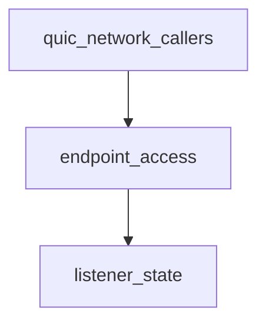

# Pipeline Plan

## Trigger
- Proposal: docs/versions/v0.1/modules/p2p-frame/002-quic-listener-close-connect-race/proposal.md
- User launch confirmed: yes
- User launch statement: 批准，自动处理后续步骤
- Per-stage user confirmation: skipped by explicit user auto-pipeline authorization
- Auto-confirm completed document stages: no design/testing Markdown documents generated; repository-local document extensions only
- Auto-pipeline document policy: no design/testing markdown docs; testplan.yaml required
- Version: v0.1
- Packet module: p2p-frame
- Task name: 002-quic-listener-close-connect-race
- Target module(s): p2p-frame
- change_id values: quic_listener_close_connect_race

## Acceptance Baseline
- Final acceptance is judged against:
  - `proposal.md`

## Stage Graph
| Task ID | Stage | Responsibility | Scope | Parent Task | Depends On | Output | Done Condition |
|---------|-------|----------------|-------|-------------|------------|--------|----------------|
| D-1 | design | map the listener lifecycle race into an executable lock, error, and caller-propagation design | task-local pipeline design mappings | root | none | validated pipeline plan and scope bindings | pipeline-plan-check passes without design/testing Markdown documents |
| I-1 | implementation | make worker endpoint access fallible and race-safe | QUIC listener selection and direct callers | root | D-1 | production implementation | implementation child tasks complete and implementation scope check passes |
| T-1 | testing | derive post-implementation lifecycle/error cases and generate runnable coverage | dedicated QUIC listener tests and task testplan | root | I-1 | tests, testplan.yaml, test-run evidence, state coverage | coverage checker and task all entry pass with machine evidence |
| A-1 | acceptance | audit proposal-plan-code-tests-evidence consistency and concurrent lifecycle correctness | bound task packet and delivered paths | root | T-1 | acceptance-report.md | acceptance report check passes with accepted conclusion |

## Submodule Tasks
| Task ID | Stage | Responsibility | Submodule | Parent Task | Depends On | Output | Done Condition |
|---------|-------|----------------|-----------|-------------|------------|--------|----------------|
| I-QL-1 | implementation | select or inspect a worker endpoint only after one locked closed/empty check | listener worker-state access | I-1 | D-1 | fallible listener endpoint access | empty collections never reach unwrap/index/random range and error priority is stable |
| I-QL-2 | implementation | propagate fallible bound-local access without changing public TunnelNetwork signatures | QUIC network caller adaptation | I-1 | I-QL-1 | compatible caller error handling | connect paths preserve lifecycle errors and listener info enumeration omits unavailable closed listeners |

## Dependency Graphs

| Level | Parent | Node | Depends On |
|-------|--------|------|------------|
| submodule | quic_listener | listener_state | none |
| submodule | quic_listener | endpoint_access | listener_state |
| submodule | quic_listener | quic_network_callers | endpoint_access |

## Exported Interfaces
| Interface | Owner | Consumer | Compatibility | Affected Callers | Migration Path |
|-----------|-------|----------|---------------|------------------|----------------|
| fallible crate-private `QuicTunnelListener::bound_local` method | listener endpoint access | `QuicTunnelNetwork` connection, filtering, logging, and info paths | migration-required | call sites in `p2p-frame/src/networks/quic/network.rs` | propagate with `?` where the public operation is fallible; omit unavailable listener entries from infallible info snapshots |
| `QuicTunnelListener::connect_with_owner_runtime(...)` | listener endpoint access | `QuicTunnelNetwork::open_or_connect` | backward-compatible | existing QUIC active-connect path | no external migration; closed/empty states now return errors instead of panicking |
| `TunnelNetwork` public methods | QUIC network adapter | tunnel manager and downstream crates | backward-compatible | all current callers | no migration |

## State Ownership
| State | Owner | Access Interface | Lifecycle | Failure Transitions |
|-------|-------|------------------|-----------|---------------------|
| listener closed flag | `QuicTunnelListener` lifecycle | checked while holding `state` read/write lock around endpoint access/clear | open -> closed exactly once | close marks closed before endpoint removal; endpoint reads observing closed return Interrupted |
| worker endpoint vector | `QuicTunnelListenerState` | state read/write lock | empty before start -> nonempty while serving -> empty on close | open+empty returns ErrorState; closed state takes precedence over empty-state diagnosis |
| selected worker endpoint clone | one active connect attempt | locked selection followed by worker-runtime spawn | absent -> selected clone -> connect completed/failed | close after selection may close the clone and yield a normal connect error, never an index panic |

## Failure Flows
| Flow | Boundary | Failure | Handling |
|------|----------|---------|----------|
| bound-local inspection | QUIC listener state -> QUIC network caller | listener is closed | return `Interrupted`; fallible callers propagate and infallible listener-info snapshots omit the unavailable entry |
| bound-local inspection | QUIC listener state -> QUIC network caller | listener is open but endpoints are empty | return `ErrorState`; no unwrap or synthesized address |
| active endpoint selection | connect request -> listener worker state | listener is closed | return `Interrupted` while holding the same state read lock used to inspect endpoints |
| active endpoint selection | connect request -> listener worker state | listener is open but endpoints are empty | return `ErrorState` before generating a random index |
| close after successful selection | selected endpoint clone -> worker runtime connect | close clears/closes registered endpoints after the read guard is released | connect finishes or reports its existing transport/task error; no collection access occurs after unlock |

## Rejected Alternatives
| Decision Type | Selected | Rejected | Reason |
|---------------|----------|----------|--------|
| boundary | make crate-private bound-local access fallible and adapt only QUIC network callers | retain infallible `bound_local` with a fallback/synthetic endpoint | a fallback hides closed/invalid state and cannot satisfy Interrupted/ErrorState semantics |
| technical | check closed first and nonempty second under the endpoint state lock, then clone/select | clamp the random upper bound, use index zero by default, or check collection length outside the lock | clamping/defaulting remains invalid for an empty collection; split checks preserve a race window |
| collaboration | serial edits across listener ownership then its direct network callers | parallel edits to coupled signatures or a cross-crate redesign | the change is small, signature-coupled, and has one lifecycle invariant |

## Implementation Scope Bindings
| change_id | target_module | proposal_id | design_coverage | scope_paths | design_rules_applied |
|-----------|---------------|-------------|-----------------|-------------|----------------------|
| quic_listener_close_connect_race | p2p-frame | P-QLCCR-1 | listener endpoint access holds the state read lock, checks closed before empty, and only then clones the first or random endpoint; bound-local becomes fallible and QUIC network callers propagate or omit unavailable entries without changing public interfaces | `p2p-frame/src/networks/quic/listener.rs`, `p2p-frame/src/networks/quic/network.rs` | module decomposition, dependency order, crate-private interface migration, single-owner state, concurrency ordering, failure priority, compatibility |

## File-Level Implementation Sequence
| Sequence | Task ID | File-Level Module | Action | Depends On | change_id | target_module | Scope Paths | Context Sources |
|----------|---------|-------------------|--------|------------|-----------|---------------|-------------|-----------------|
| 1 | I-QL-1 | `p2p-frame/src/networks/quic/listener.rs` | replace infallible/unchecked endpoint access with locked fallible selection | none | quic_listener_close_connect_race | p2p-frame | `p2p-frame/src/networks/quic/listener.rs` | proposal P-QLCCR-1, state ownership, failure flows, current listener lifecycle |
| 2 | I-QL-2 | `p2p-frame/src/networks/quic/network.rs` | adapt direct bound-local callers and preserve original connect errors | I-QL-1 | quic_listener_close_connect_race | p2p-frame | `p2p-frame/src/networks/quic/network.rs` | proposal P-QLCCR-1, exported interface mapping, current QUIC network callers |

## Return Rules
- If acceptance finds proposal ambiguity:
  - stop the pipeline and ask the user to decide; do not infer the requirement or create an automatic proposal return task
- If acceptance finds design mismatch:
  - return to design when the architecture, algorithm, state/concurrency/resource model, interface contract, or failure strategy is absent or wrong
- If acceptance finds implementation defect:
  - return to implementation when adequate design exists but delivered code is defective
- If acceptance finds testing implementation gap:
  - return to testing task
- For non-requirement findings:
  - repeat design -> implementation -> testing, then rerun acceptance
- If the same unresolved issue remains after more than 5 unsuccessful iterations:
  - stop and report the issue to the user

Execution status, testing evidence, return records, and final acceptance are stored in sibling `state.json`. They are deliberately excluded from this admission-bound plan.
