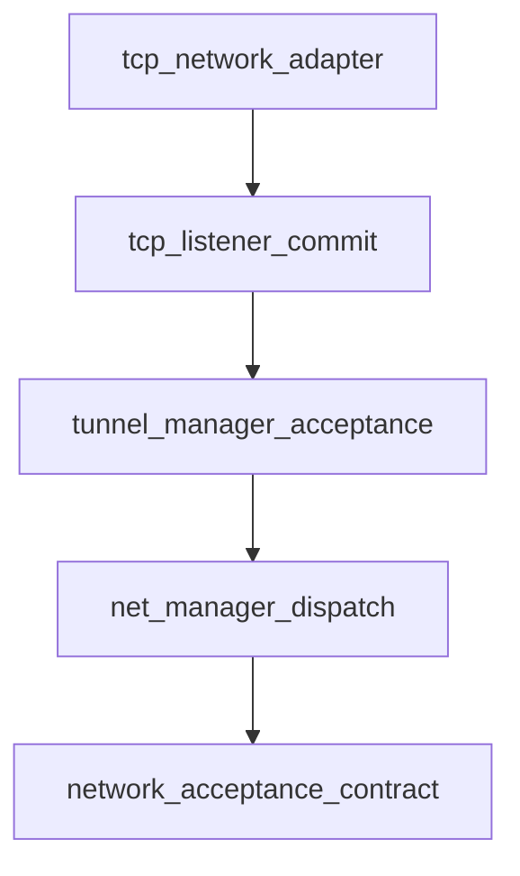

# Pipeline Plan

## Trigger
- Proposal: docs/versions/v0.1/modules/p2p-frame/003-tcp-control-tunnel-register-if-absent/proposal.md
- User launch confirmed: yes
- User launch statement: 批准，自动处理后续步骤
- Per-stage user confirmation: skipped by explicit user auto-pipeline authorization
- Auto-confirm completed document stages: no design/testing Markdown documents generated; repository-local document extensions only
- Auto-pipeline document policy: no design/testing markdown docs; testplan.yaml required
- Version: v0.1
- Packet module: p2p-frame
- Task name: 003-tcp-control-tunnel-register-if-absent
- Target module(s): p2p-frame
- change_id values: tcp_control_tunnel_commit_after_accept

## Acceptance Baseline
- Final acceptance is judged against:
  - `proposal.md`

## Stage Graph
| Task ID | Stage | Responsibility | Scope | Parent Task | Depends On | Output | Done Condition |
|---------|-------|----------------|-------|-------------|------------|--------|----------------|
| D-1 | design | map explicit upper-layer acceptance through network dispatch to TCP registry commit | task-local pipeline design mappings | root | none | validated pipeline plan and scope bindings | pipeline-plan-check passes without design/testing Markdown documents |
| I-1 | implementation | deliver acceptance-aware dispatch and post-accept TCP registry commit | five bound production files | root | D-1 | production implementation | implementation child tasks complete and implementation scope check passes |
| T-1 | testing | derive post-implementation acceptance/rejection/concurrency cases and generate runnable coverage | dedicated TCP/NetManager tests and task testplan | root | I-1 | tests, testplan.yaml, test-run evidence, state coverage | coverage checker and task all entry pass with machine evidence |
| A-1 | acceptance | audit proposal-plan-code-tests-evidence consistency and registry winner correctness | bound task packet and delivered paths | root | T-1 | acceptance-report.md | acceptance report check passes with accepted conclusion |

## Submodule Tasks
| Task ID | Stage | Responsibility | Submodule | Parent Task | Depends On | Output | Done Condition |
|---------|-------|----------------|-----------|-------------|------------|--------|----------------|
| I-NW-1 | implementation | add an acceptance-aware listener callback path while retaining the existing callback API as a compatibility shim | generic network listener contract | I-1 | D-1 | additive acceptance callback and default trait adapter | existing TunnelNetwork implementors retain source compatibility |
| I-NM-2 | implementation | add an acceptance-aware subscriber path while preserving legacy subscriber liveness callbacks | NetManager dispatch | I-1 | I-NW-1 | explicit managed dispatch outcome plus legacy compatibility | TunnelManager reject/error/no-subscriber paths are not accepted; existing TTP subscribers retain their bool contract |
| I-TM-3 | implementation | report the real TunnelManager registration/reverse-waiter result to NetManager | tunnel manager incoming handler | I-1 | I-NM-2 | explicit manager acceptance result | duplicate and unmatched reverse tunnels report not accepted after close |
| I-TL-4 | implementation | defer registry replacement until the acceptance callback succeeds | TCP listener and registry | I-1 | I-TM-3 | post-accept registry commit | callback pending/reject/error never replaces the old mapping |
| I-TN-5 | implementation | route NetManager through the TCP acceptance-aware listener path and preserve direct legacy listen behavior | TCP network adapter | I-1 | I-TL-4 | TCP listen adapters | managed TCP flow uses explicit outcome; legacy callback completion remains compatible |

## Dependency Graphs

| Level | Parent | Node | Depends On |
|-------|--------|------|------------|
| submodule | incoming_tunnel_flow | network_acceptance_contract | none |
| submodule | incoming_tunnel_flow | net_manager_dispatch | network_acceptance_contract |
| submodule | incoming_tunnel_flow | tunnel_manager_acceptance | net_manager_dispatch |
| submodule | incoming_tunnel_flow | tcp_listener_commit | tunnel_manager_acceptance |
| submodule | incoming_tunnel_flow | tcp_network_adapter | tcp_listener_commit |

## Exported Interfaces
| Interface | Owner | Consumer | Compatibility | Affected Callers | Migration Path |
|-----------|-------|----------|---------------|------------------|----------------|
| additive `IncomingTunnelAcceptance` and `IncomingTunnelAcceptanceCallback` | generic network listener contract | `NetManager` and `TcpTunnelNetwork` | new | no existing callers | managed listeners opt into the new acceptance-aware path |
| additive default `TunnelNetwork::listen_with_acceptance(...)` | generic network listener contract | `NetManager::listen` and protocol network implementations | backward-compatible | existing external `TunnelNetwork` implementations | default adapter delegates to existing `listen`; TCP overrides for post-accept commit |
| additive `IncomingTunnelAcceptanceSubscriber` and registration method | NetManager dispatch | `TunnelManager` incoming registration | new | no existing callers | TunnelManager opts into explicit acceptance; existing `IncomingTunnelSubscriber` bool/liveness API remains unchanged for TTP and other consumers |
| `TcpTunnelListener` acceptance-aware delivery | TCP listener | `TcpTunnelNetwork` | backward-compatible | crate-private TCP listener construction | adapter supplies either managed explicit acceptance or legacy completion-as-acceptance |

## API and Build Surface Impact
- Public API impact: backward-compatible
- Crate-root export change: no
- Build-surface change: no
- Documentation examples affected: no

## State Ownership
| State | Owner | Access Interface | Lifecycle | Failure Transitions |
|-------|-------|------------------|-----------|---------------------|
| committed TCP tunnel mapping | `TcpTunnelRegistry` in TCP listener | `register` after acceptance and `find_tunnel` for data connections | absent/old accepted mapping -> accepted replacement -> stale cleanup | pending/rejected/error leaves current mapping unchanged; accepted-but-concurrently-closed is removed by existing lookup/cleanup checks |
| incoming tunnel acceptance outcome | `NetManager` dispatch invocation | acceptance-aware callback future result | pending -> accepted or rejected exactly once | validator reject/error, absent subscriber, subscriber rejection, duplicate manager error, or unmatched reverse close -> rejected |
| subscriber handler mode and liveness | `NetManager` subscription registry | legacy bool subscriber or acceptance-aware subscriber variant | registered -> retained or removed | legacy callbacks retain bool/liveness semantics; acceptance-aware rejection is independent from handler registration lifetime |

## Failure Flows
| Flow | Boundary | Failure | Handling |
|------|----------|---------|----------|
| TCP control delivery | TCP listener -> NetManager validator | validator rejects or errors | close the new tunnel, return rejected, and leave registry unchanged |
| validated delivery | NetManager -> subscriber | no subscriber or subscriber no longer live | close/reject the new tunnel, remove closed subscription when applicable, and leave registry unchanged |
| candidate registration | subscriber -> TunnelManager | duplicate candidate | TunnelManager closes the new tunnel and returns rejection/error; NetManager returns rejected; listener does not commit |
| reverse candidate registration | TunnelManager -> reverse waiter | no matching waiter | close and explicitly report not accepted; listener does not commit |
| accepted candidate commit | acceptance future -> TCP registry | accepted tunnel closes concurrently before/after commit | short lock-only commit; existing `find_tunnel` and cleanup remove closed mappings, with no callback or IO under the registry lock |
| pending data connection | data listener -> TCP registry | new control candidate has not yet been accepted | old committed mapping remains visible; if none exists, preserve existing `TunnelNotFound` behavior |

## Rejected Alternatives
| Decision Type | Selected | Rejected | Reason |
|---------------|----------|----------|--------|
| boundary | propagate an explicit acceptance outcome from TunnelManager through NetManager to TCP listener | let `TcpTunnelRegistry` independently choose a winner with register-if-absent | the approved proposal assigns winner choice to the existing upper layer and forbids registry winner logic |
| technical | add acceptance-aware listener and subscriber paths while preserving legacy callback types | retype the shared `IncomingTunnelSubscriber`, infer acceptance from `is_closed`/liveness, or use delayed rollback | retyping unnecessarily migrates TTP node/server; inference conflates lifecycle states and rollback leaves an invalid visibility window |
| technical | preserve existing `listen` through a default/legacy compatibility adapter | change the existing public callback output across QUIC, PN, SN, stream, datagram, and external implementations | the additive path contains migration to the affected TCP managed flow and avoids unrelated protocol behavior changes |
| collaboration | serialize edits in contract-to-consumer dependency order | parallel edits to coupled callback/result signatures | each consumer depends directly on the preceding contract and the change is small enough to validate sequentially |

## Implementation Scope Bindings
| change_id | target_module | proposal_id | design_coverage | scope_paths | design_rules_applied |
|-----------|---------------|-------------|-----------------|-------------|----------------------|
| tcp_control_tunnel_commit_after_accept | p2p-frame | P-TCTPAC-1 | add acceptance-aware listener and subscriber paths; make NetManager validator/acceptance-subscriber dispatch return explicit accepted/rejected while retaining the legacy bool subscriber API; make TunnelManager opt in and report duplicate/reverse-waiter outcomes; remove TCP pre-registration and commit only the exact accepted `TcpTunnel`; adapt TCP network construction without changing wire/TLS/key semantics | `p2p-frame/src/networks/network.rs`, `p2p-frame/src/networks/net_manager.rs`, `p2p-frame/src/tunnel/tunnel_manager.rs`, `p2p-frame/src/networks/tcp/listener.rs`, `p2p-frame/src/networks/tcp/network.rs` | module decomposition, acyclic dependency order, additive compatibility paths, repository consumer audit, single-owner registry state, concurrency/failure flows, rejected alternatives |

## File-Level Implementation Sequence
| Sequence | Task ID | File-Level Module | Action | Depends On | change_id | target_module | Scope Paths | Context Sources |
|----------|---------|-------------------|--------|------------|-----------|---------------|-------------|-----------------|
| 1 | I-NW-1 | `p2p-frame/src/networks/network.rs` | add acceptance outcome/callback and default acceptance-aware listen adapter | none | tcp_control_tunnel_commit_after_accept | p2p-frame | `p2p-frame/src/networks/network.rs` | proposal P-TCTPAC-1, exported interface mapping, current TunnelNetwork contract |
| 2 | I-NM-2 | `p2p-frame/src/networks/net_manager.rs` | add acceptance-subscriber registration/dispatch without changing legacy subscriber bool semantics | I-NW-1 | tcp_control_tunnel_commit_after_accept | p2p-frame | `p2p-frame/src/networks/net_manager.rs` | proposal P-TCTPAC-1, state ownership, failure flows, current validator/subscriber dispatch and TTP consumers |
| 3 | I-TM-3 | `p2p-frame/src/tunnel/tunnel_manager.rs` | propagate actual registration and reverse-waiter acceptance in subscriber results | I-NM-2 | tcp_control_tunnel_commit_after_accept | p2p-frame | `p2p-frame/src/tunnel/tunnel_manager.rs` | proposal P-TCTPAC-1, NetManager subscriber result, duplicate/reverse behavior |
| 4 | I-TL-4 | `p2p-frame/src/networks/tcp/listener.rs` | remove pre-registration and commit the exact tunnel only after accepted outcome | I-TM-3 | tcp_control_tunnel_commit_after_accept | p2p-frame | `p2p-frame/src/networks/tcp/listener.rs` | proposal P-TCTPAC-1, acceptance contract, registry ownership, current control/data flow |
| 5 | I-TN-5 | `p2p-frame/src/networks/tcp/network.rs` | override acceptance-aware listen and retain legacy listen adapter behavior | I-TL-4 | tcp_control_tunnel_commit_after_accept | p2p-frame | `p2p-frame/src/networks/tcp/network.rs` | proposal P-TCTPAC-1, exported interfaces, TCP listener construction |

## Return Rules
- If acceptance finds proposal ambiguity:
  - stop the pipeline and ask the user to decide; do not infer the requirement or create an automatic proposal return task
- If acceptance finds design mismatch:
  - return to design when the architecture, algorithm, state/concurrency/resource model, interface contract, or failure strategy is absent or wrong
- If acceptance finds implementation defect:
  - return to implementation when adequate design exists but delivered code is defective
- If acceptance finds testing implementation gap:
  - return to testing task
- For non-requirement findings:
  - repeat design -> implementation -> testing, then rerun acceptance
- If the same unresolved issue remains after more than 5 unsuccessful iterations:
  - stop and report the issue to the user

Execution status, testing evidence, return records, and final acceptance are stored in sibling `state.json`. They are deliberately excluded from this admission-bound plan.
