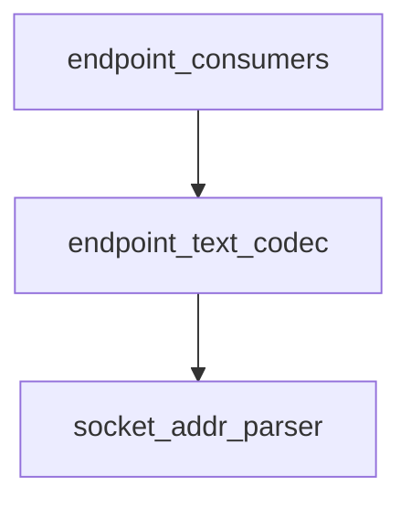

# Pipeline Plan

## Trigger
- Proposal: docs/versions/v0.1/modules/p2p-frame/004-endpoint-from-str-invalid-input/proposal.md
- User launch confirmed: yes
- User launch statement: 批准该 proposal，并启动 auto-pipeline 自动完成后续 design、implementation、testing 和 acceptance。
- Per-stage user confirmation: skipped by explicit user auto-pipeline authorization
- Auto-confirm completed document stages: no design/testing Markdown documents generated; repository-local document extensions only
- Auto-pipeline document policy: no design/testing markdown docs; testplan.yaml required
- Version: v0.1
- Packet module: p2p-frame
- Task name: 004-endpoint-from-str-invalid-input
- Target module(s): p2p-frame
- change_id values: endpoint_from_str_invalid_input_no_panic

## Acceptance Baseline
- Final acceptance is judged against:
  - `proposal.md`

## Stage Graph
| Task ID | Stage | Responsibility | Scope | Parent Task | Depends On | Output | Done Condition |
|---------|-------|----------------|-------|-------------|------------|--------|----------------|
| D-1 | design | map the endpoint text grammar, invalid-input boundary, compatibility contract, and file scope | task-local pipeline design mappings | root | none | validated pipeline plan and scope binding | pipeline-plan-check passes without design/testing Markdown documents |
| I-1 | implementation | make endpoint text parsing total for arbitrary Rust strings | admitted endpoint parser production path | root | D-1 | minimal production implementation | file child completes and implementation scope check passes |
| T-1 | testing | derive post-implementation parser-domain cases and generate runnable regression coverage | dedicated endpoint parser tests and task testplan | root | I-1 | tests, testplan.yaml, task-run evidence, state coverage | coverage checker and task-scoped all entry pass with machine evidence |
| A-1 | acceptance | audit proposal-plan-code-tests-evidence consistency and parser correctness | bound task packet and delivered paths | root | T-1 | acceptance-report.md | acceptance report check passes with accepted conclusion |

## Submodule Tasks
| Task ID | Stage | Responsibility | Submodule | Parent Task | Depends On | Output | Done Condition |
|---------|-------|----------------|-----------|-------------|------------|--------|----------------|
| I-EP-1 | implementation | replace panic-capable fixed string slicing with checked prefix decoding while preserving the endpoint grammar | endpoint text parser | I-1 | D-1 | total `Endpoint::from_str` implementation | every fixed prefix component is checked before use and all failures return `InvalidInput` |

## Dependency Graphs

| Level | Parent | Node | Depends On |
|-------|--------|------|------------|
| module | p2p-frame | endpoint_consumers | endpoint_text_codec |
| module | p2p-frame | endpoint_text_codec | socket_addr_parser |
| module | p2p-frame | socket_addr_parser | none |

## Exported Interfaces
| Interface | Owner | Consumer | Compatibility | Affected Callers | Migration Path |
|-----------|-------|----------|---------------|------------------|----------------|
| public `Endpoint` implementation of Rust `FromStr`, returning either `Endpoint` or `P2pError` | endpoint text codec in `p2p-frame/src/endpoint.rs` | existing Rust `FromStr` callers and `endpoint_from_str_invalid_input_no_panic` | backward-compatible | current downstream callers parsing valid endpoint strings | no caller migration; malformed input now returns the already-declared `InvalidInput` error instead of unwinding |

## API and Build Surface Impact
- Public API impact: backward-compatible
- Crate-root export change: no
- Build-surface change: no
- Documentation examples affected: no

## Consumer Migration Closure
| Old Symbol | New Path | change_id | Consumer Path | Consumer Kind | Migration Status |
|------------|----------|-----------|---------------|---------------|------------------|
| not-applicable | not-applicable | endpoint_from_str_invalid_input_no_panic | not-applicable | not-applicable | verified-none |

## State Ownership
| State | Owner | Access Interface | Lifecycle | Failure Transitions |
|-------|-------|------------------|-----------|---------------------|
| parser-local input/components | one `Endpoint::from_str` invocation | checked byte/prefix extraction followed by existing `SocketAddr::from_str` | borrowed input -> validated fixed prefix -> parsed socket address -> constructed `Endpoint` | any missing, non-ASCII, unsupported, mismatched, or malformed component returns `P2pErrorCode::InvalidInput`; no shared or persistent state exists |

## Failure Flows
| Flow | Boundary | Failure | Handling |
|------|----------|---------|----------|
| endpoint text prefix decoding | caller-provided `&str` -> endpoint text codec | input is empty, shorter than the complete fixed prefix, or contains non-ASCII bytes in the fixed prefix | reject with `InvalidInput` before any fixed-range string indexing; never unwind |
| protocol decoding | fixed protocol bytes -> `Protocol` | protocol token is unknown or extension number is malformed/out of range | preserve current `InvalidInput` classification and extension range semantics |
| socket address decoding | remaining text -> `SocketAddr::from_str` | address is malformed or the address-family marker does not match | preserve current `InvalidInput` classification and version matching |
| valid endpoint decoding | checked fixed prefix and socket address -> `Endpoint` | no failure | preserve the same area, protocol, IPv4/IPv6 address, legacy `udp`, and extension protocol results |

## Rejected Alternatives
| Decision Type | Selected | Rejected | Reason |
|---------------|----------|----------|--------|
| boundary | change only `Endpoint::from_str` inside the endpoint text codec | add validation in each downstream caller | the public parser owns the fallible contract and must be safe for every caller |
| technical | decode the fixed grammar through checked byte access and pass the remaining checked tail to existing parsers | length-only guard followed by fixed UTF-8 slicing, or `catch_unwind` | length-only slicing can still split UTF-8; unwind catching hides rather than removes the invalid indexing |
| collaboration | one serial file-level implementation task | split the single parser edit across parallel tasks or crates | one function and one invariant have a single ownership boundary and no safe independent production edits |

## Implementation Scope Bindings
| change_id | target_module | proposal_id | design_coverage | scope_paths | design_rules_applied |
|-----------|---------------|-------------|-----------------|-------------|----------------------|
| endpoint_from_str_invalid_input_no_panic | p2p-frame | P-EFSI-1 | the endpoint text codec checks the complete ASCII fixed prefix without unchecked UTF-8 string slicing, maps every malformed component to `InvalidInput`, then reuses existing protocol/address validation so valid grammar and decoded values remain unchanged | `p2p-frame/src/endpoint.rs` | module boundary, public compatibility, parser-local ownership, failure classification, rejected alternatives, one-file dependency order |

## File-Level Implementation Sequence
| Sequence | Task ID | File-Level Module | Action | Depends On | change_id | target_module | Scope Paths | Context Sources |
|----------|---------|-------------------|--------|------------|-----------|---------------|-------------|-----------------|
| 1 | I-EP-1 | `p2p-frame/src/endpoint.rs` | replace unchecked fixed string slices in `Endpoint::from_str` with checked prefix decoding and unchanged semantic validation | none | endpoint_from_str_invalid_input_no_panic | p2p-frame | `p2p-frame/src/endpoint.rs` | proposal P-EFSI-1, exported interface, failure flows, current parser only |

## Return Rules
- If acceptance finds proposal ambiguity:
  - stop the pipeline and ask the user to decide; do not infer the requirement or create an automatic proposal return task
- If acceptance finds design mismatch:
  - return to design when the parser algorithm, interface contract, failure classification, or compatibility strategy is absent or wrong
- If acceptance finds implementation defect:
  - return to implementation when adequate design exists but delivered code is defective
- If acceptance finds testing implementation gap:
  - return to testing task
- For non-requirement findings:
  - repeat design -> implementation -> testing, then rerun acceptance
- If the same unresolved issue remains after more than 5 unsuccessful iterations:
  - stop and report the issue to the user

Execution status, testing evidence, return records, and final acceptance are stored in sibling `state.json`. They are deliberately excluded from this admission-bound plan.
