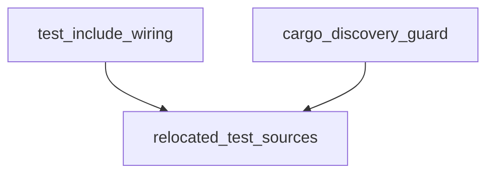

# Pipeline Plan

## Trigger
- Proposal: docs/versions/v0.1/modules/p2p-frame/005-move-net-manager-post-accept-tests/proposal.md
- User launch confirmed: yes
- User launch statement: 批准该 proposal，并启动 auto-pipeline 自动完成后续步骤
- Per-stage user confirmation: skipped by explicit user auto-pipeline authorization
- Auto-confirm completed document stages: no design/testing Markdown documents generated; repository-local document extensions only
- Auto-pipeline document policy: no design/testing markdown docs; testplan.yaml required
- Version: v0.1
- Packet module: p2p-frame
- Task name: 005-move-net-manager-post-accept-tests
- Target module(s): p2p-frame
- change_id values: relocate_net_manager_post_accept_tests

## Acceptance Baseline
- Final acceptance is judged against:
  - `proposal.md`

## Stage Graph
| Task ID | Stage | Responsibility | Scope | Parent Task | Depends On | Output | Done Condition |
|---------|-------|----------------|-------|-------------|------------|--------|----------------|
| D-1 | design | map the nested test layout, private include context, Cargo discovery boundary, and exact relocation paths | task-local pipeline design mappings | root | none | validated pipeline plan and scope binding | pipeline-plan-check passes without design/testing Markdown documents |
| I-1 | implementation | confirm that the correction requires no production implementation and freeze the existing cfg(test) boundary | admitted net_manager production file boundary | root | D-1 | no production-code change plus admission evidence | no-op child completes, admission passes, and implementation scope contains evidence/state only |
| T-1 | testing | move both test sources, update only existing test include wiring, generate task metadata, and run focused cases | test-only relocation paths and existing cfg(test) item | root | I-1 | relocated tests, include wiring, testplan, task-run artifact, state coverage | old files absent, new nested files present, focused commands execute non-empty successful tests, testing scope passes |
| A-1 | acceptance | audit location, byte-identical test bodies, cfg(test)-only source edit, Cargo discovery, and runnable evidence | bound task packet and relocation paths | root | T-1 | acceptance-report.md | acceptance report check passes with accepted conclusion |

## Submodule Tasks
| Task ID | Stage | Responsibility | Submodule | Parent Task | Depends On | Output | Done Condition |
|---------|-------|----------------|-----------|-------------|------------|--------|----------------|
| I-NOOP-1 | implementation | inspect and preserve the production/test boundary without editing production behavior | net_manager source boundary | I-1 | D-1 | recorded no-op implementation result | only the pre-existing exact cfg(test) item is handed to testing; production lines remain untouched |

## Dependency Graphs

| Level | Parent | Node | Depends On |
|-------|--------|------|------------|
| submodule | net_manager_tests | relocated_test_sources | none |
| submodule | net_manager_tests | test_include_wiring | relocated_test_sources |
| submodule | net_manager_tests | cargo_discovery_guard | relocated_test_sources |

## Exported Interfaces
| Interface | Owner | Consumer | Compatibility | Affected Callers | Migration Path |
|-----------|-------|----------|---------------|------------------|----------------|
| test-only `post_accept_tests` and x509-gated `tcp_post_accept_registry_tests` include modules | existing `net_manager::tests` cfg(test) module | focused task test commands and `relocate_net_manager_post_accept_tests` | backward-compatible | existing test filters under `networks::net_manager::tests` | update relative include paths only; module and case names remain unchanged |

## API and Build Surface Impact
- Public API impact: none
- Crate-root export change: no
- Build-surface change: no
- Documentation examples affected: no

## Consumer Migration Closure
| Old Symbol | New Path | change_id | Consumer Path | Consumer Kind | Migration Status |
|------------|----------|-----------|---------------|---------------|------------------|
| not-applicable | not-applicable | relocate_net_manager_post_accept_tests | not-applicable | not-applicable | verified-none |

## State Ownership
| State | Owner | Access Interface | Lifecycle | Failure Transitions |
|-------|-------|------------------|-----------|---------------------|
| physical test-source location and include binding | `net_manager::tests` test-only module | nested files under `p2p-frame/tests/net_manager/` reached by explicit relative `include!` | old source paths active -> nested test paths active with same module names -> old paths removed | missing/incorrect include fails compilation; top-level placement would create an unintended Cargo target; duplicate copies fail location audit |

## Failure Flows
| Flow | Boundary | Failure | Handling |
|------|----------|---------|----------|
| include resolution | `p2p-frame/src/networks/net_manager.rs` cfg(test) item -> nested test file | relative path is wrong or file is absent | focused unit compilation fails; correct path relative to the including file before acceptance |
| Cargo test discovery | crate `tests/` tree -> Cargo target enumeration | relocated file is placed directly under `tests/` and becomes an independent integration crate | keep source files one directory deeper under `tests/net_manager/` with no nested `main.rs` |
| private test context | included test module -> `net_manager::tests` fixtures and crate-private APIs | relocation changes compilation into an external crate | preserve `include!` inside the existing module and do not export private symbols |
| focused evidence | unchanged test filter -> relocated module | path/module rename causes zero matching tests | preserve module/test names and require non-empty successful task-run steps with observed cases |

## Rejected Alternatives
| Decision Type | Selected | Rejected | Reason |
|---------------|----------|----------|--------|
| boundary | nested `p2p-frame/tests/net_manager/` files included by the existing private test module | top-level standalone integration-test files or leaving test bodies under `src/networks/` | top-level files lose private access; source-tree files violate the approved correction |
| technical | move files byte-for-byte and change only two cfg(test) include paths | expose internals, rewrite tests, add Cargo targets, or leave forwarding shims at old paths | relocation needs no API/build expansion or behavior change, and old paths must disappear |
| collaboration | one testing-stage relocation task after a no-op implementation gate | parallel edits to include wiring and moved files | the moves and include paths are atomic and must be validated together to avoid a transient missing/duplicate source |

## Implementation Scope Bindings
| change_id | target_module | proposal_id | design_coverage | scope_paths | design_rules_applied |
|-----------|---------------|-------------|-----------------|-------------|----------------------|
| relocate_net_manager_post_accept_tests | p2p-frame | P-MNMPAT-1 | no production implementation is required; testing moves both byte-identical sources to a nested Cargo-safe tests directory and changes only the two include paths inside the existing cfg(test) module while preserving private context and filters | `p2p-frame/src/networks/net_manager.rs`, `p2p-frame/src/networks/net_manager_post_accept_tests.rs`, `p2p-frame/src/networks/net_manager_tcp_post_accept_tests.rs`, `p2p-frame/tests/net_manager/net_manager_post_accept_tests.rs`, `p2p-frame/tests/net_manager/net_manager_tcp_post_accept_tests.rs` | test/production boundary, dependency ordering, internal compatibility, Cargo discovery failure handling, exact move/delete paths, rejected alternatives |

## File-Level Implementation Sequence
| Sequence | Task ID | File-Level Module | Action | Depends On | change_id | target_module | Scope Paths | Context Sources |
|----------|---------|-------------------|--------|------------|-----------|---------------|-------------|-----------------|
| 1 | I-NOOP-1 | `p2p-frame/src/networks/net_manager.rs` | no production modification; verify the existing exact cfg(test) item is the sole later include-wiring boundary | none | relocate_net_manager_post_accept_tests | p2p-frame | `p2p-frame/src/networks/net_manager.rs` | proposal P-MNMPAT-1, test-only interface, failure flows, current cfg(test) block only |

## Return Rules
- If acceptance finds proposal ambiguity:
  - stop the pipeline and ask the user to decide; do not infer the requirement or create an automatic proposal return task
- If acceptance finds design mismatch:
  - return to design when the location, Cargo discovery, private compilation boundary, or no-production-change strategy is absent or wrong
- If acceptance finds implementation defect:
  - return to implementation only if the production no-op boundary was violated
- If acceptance finds testing implementation gap:
  - return to testing for incorrect paths, duplicate/stale files, changed test bodies, zero-test filters, or missing runnable evidence
- For non-requirement findings:
  - repeat design -> implementation -> testing, then rerun acceptance
- If the same unresolved issue remains after more than 5 unsuccessful iterations:
  - stop and report the issue to the user

Execution status, testing evidence, return records, and final acceptance are stored in sibling `state.json`. They are deliberately excluded from this admission-bound plan.
