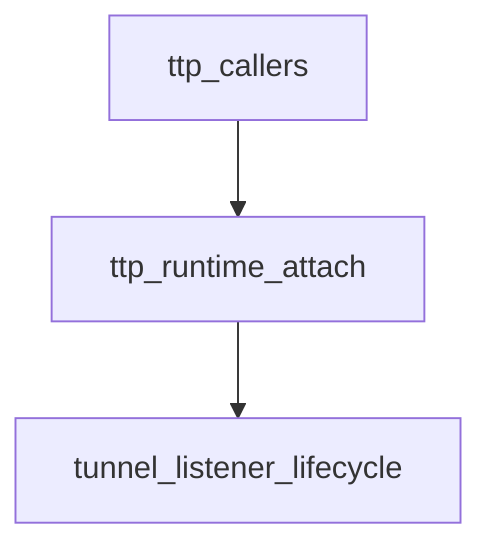

# Pipeline Plan

## Trigger
- Proposal: docs/versions/v0.1/modules/p2p-frame/006-ttp-attach-failure-close/proposal.md
- User launch confirmed: yes
- User launch statement: 批准该 proposal，并启动 auto-pipeline 自动完成后续 design、implementation、testing 和 acceptance。
- Per-stage user confirmation: skipped by explicit user auto-pipeline authorization
- Auto-confirm completed document stages: no design/testing Markdown documents generated; repository-local document extensions only
- Auto-pipeline document policy: no design/testing markdown docs; testplan.yaml required
- Version: v0.1
- Packet module: p2p-frame
- Task name: 006-ttp-attach-failure-close
- Target module(s): p2p-frame
- change_id values: ttp_attach_failure_closes_tunnel

## Acceptance Baseline
- Final acceptance is judged against:
  - `proposal.md`

## Stage Graph
| Task ID | Stage | Responsibility | Scope | Parent Task | Depends On | Output | Done Condition |
|---------|-------|----------------|-------|-------------|------------|--------|----------------|
| D-1 | design | map TTP attach ownership, failure compensation, error precedence, compatibility, and concrete file scope | task-local pipeline design mappings | root | none | validated pipeline plan and scope binding | pipeline-plan-check passes without design/testing Markdown documents |
| I-1 | implementation | make listener-registration failures close the affected tunnel before propagation | admitted TTP runtime production path | root | D-1 | minimal production implementation | file child completes and implementation scope check passes |
| T-1 | testing | derive post-implementation branch and lifecycle cases and generate runnable regression coverage | dedicated TTP runtime tests and task testplan | root | I-1 | tests, testplan.yaml, task-run evidence, and state coverage | coverage checker and task-scoped all entry pass with machine evidence |
| A-1 | acceptance | audit proposal-plan-code-tests-evidence consistency and fail-closed lifecycle correctness | bound task packet and delivered paths | root | T-1 | acceptance-report.md | acceptance report check passes with accepted conclusion |

## Submodule Tasks
| Task ID | Stage | Responsibility | Submodule | Parent Task | Depends On | Output | Done Condition |
|---------|-------|----------------|-----------|-------------|------------|--------|----------------|
| I-TTP-1 | implementation | add fail-closed compensation to the single TTP tunnel attachment coordinator | TTP runtime attach lifecycle | I-1 | D-1 | updated runtime attachment control flow | every non-`NotSupport` listener-registration error closes the tunnel once and returns the original error; success and `NotSupport` do not close |

The production change is intentionally merged into one file-level child task because `TtpRuntime::attach_tunnel(...)` is the sole coordinator for all three registrations and splitting its sequential error handling would create overlapping edits with no independent ownership boundary.

## Dependency Graphs

| Level | Parent | Node | Depends On |
|-------|--------|------|------------|
| module | p2p-frame | ttp_callers | ttp_runtime_attach |
| module | p2p-frame | ttp_runtime_attach | tunnel_listener_lifecycle |
| module | p2p-frame | tunnel_listener_lifecycle | none |

## Exported Interfaces
| Interface | Owner | Consumer | Compatibility | Affected Callers | Migration Path |
|-----------|-------|----------|---------------|------------------|----------------|
| crate-private `TtpRuntime::attach_tunnel` lifecycle and error behavior | TTP runtime attach lifecycle in `p2p-frame/src/ttp/runtime.rs` | `TtpClient`, `TtpNode`, and `TtpServer` attachment paths plus `ttp_attach_failure_closes_tunnel` | backward-compatible | `p2p-frame/src/ttp/client.rs`, `p2p-frame/src/ttp/node.rs`, `p2p-frame/src/ttp/server.rs` | no signature or caller migration; callers keep receiving the original registration error and no longer need to own failed-attach cleanup |
| existing `Tunnel::listen_stream`, `listen_control_stream`, `listen_datagram`, and `close` methods | concrete TCP, QUIC, PN, and test tunnel implementations | `TtpRuntime::attach_tunnel` | backward-compatible | existing `Tunnel` implementers | no trait or implementation migration; the runtime composes existing listener and close contracts |

## API and Build Surface Impact
- Public API impact: none
- Crate-root export change: no
- Build-surface change: no
- Documentation examples affected: no

## Consumer Migration Closure
| Old Symbol | New Path | change_id | Consumer Path | Consumer Kind | Migration Status |
|------------|----------|-----------|---------------|---------------|------------------|
| not-applicable | not-applicable | ttp_attach_failure_closes_tunnel | not-applicable | not-applicable | verified-none |

## State Ownership
| State | Owner | Access Interface | Lifecycle | Failure Transitions |
|-------|-------|------------------|-----------|---------------------|
| runtime-local weak set of attached tunnel identities | `TtpRuntime` | `try_mark_attached(&TunnelRef)` | unseen tunnel -> marked before registrations -> retained for the live tunnel instance; dead weak entries are pruned on later attach attempts | a registration error does not make the same instance reusable; the runtime closes that terminal instance and a retry creates a different `Arc` identity |
| listener filters/callback slots and underlying receive/control resources | each concrete `Tunnel` implementation | `listen_*` installs channel callbacks; `close()` owns whole-tunnel cleanup | open with zero/partial/all supported listeners -> closed terminal state on real registration failure | non-`NotSupport` registration failure invokes `close()` once; close failure is logged while the original registration error remains the attach result |

## Failure Flows
| Flow | Boundary | Failure | Handling |
|------|----------|---------|----------|
| first stream-listener registration | `TtpRuntime` -> `Tunnel::listen_stream` | non-`NotSupport` error before any supported listener is ready | invoke `Tunnel::close()` once, log cleanup failure with tunnel context, and return the original stream registration error |
| control-stream registration after stream handling | `TtpRuntime` -> `Tunnel::listen_control_stream` | non-`NotSupport` error after stream registration succeeded or was unsupported | close the partially attached tunnel once and return the original control registration error |
| datagram registration after prior handling | `TtpRuntime` -> `Tunnel::listen_datagram` | non-`NotSupport` error after earlier registrations succeeded or were unsupported | close the partially attached tunnel once and return the original datagram registration error |
| optional channel capability detection | listener registration -> TTP attach coordinator | listener returns `P2pErrorCode::NotSupport` | log capability absence and continue; do not close the tunnel |
| whole-tunnel cleanup | `TtpRuntime` -> `Tunnel::close` | cleanup itself returns an error | emit diagnostic log without replacing the causative listener-registration error; do not retry or reattach the failed instance |

## Rejected Alternatives
| Decision Type | Selected | Rejected | Reason |
|---------------|----------|----------|--------|
| boundary | centralize failed-attach cleanup inside `TtpRuntime::attach_tunnel` | require `TtpClient`, `TtpNode`, and `TtpServer` callers to close independently | the runtime owns the sequential partial-registration boundary and is the only location that can guarantee every error branch receives identical compensation |
| technical | treat the tunnel as terminal and call its existing whole-tunnel `close()` contract | add `unlisten_*` rollback APIs, remove the attached marker, or retry listener registration on the same tunnel | the trait has no listener rollback contract; supported transports already own callback/resource cleanup through close, and retries can create a new tunnel instance |
| collaboration | one serial file-level implementation child for `runtime.rs` | split three adjacent match branches across parallel tasks | all branches mutate one coordinator function and share one error-precedence invariant, so separate edits would overlap without separable ownership |

## Implementation Scope Bindings
| change_id | target_module | proposal_id | design_coverage | scope_paths | design_rules_applied |
|-----------|---------------|-------------|-----------------|-------------|----------------------|
| ttp_attach_failure_closes_tunnel | p2p-frame | P-TAFC-1 | the TTP runtime remains the single attachment coordinator; each non-`NotSupport` listener-registration error performs best-effort whole-tunnel close exactly once before returning the original error, while success/unsupported capability behavior and pointer-identity deduplication remain unchanged | `p2p-frame/src/ttp/runtime.rs` | module decomposition, acyclic dependencies, crate-private interface compatibility, single-owner state, lifecycle/failure compensation, error precedence, rejected alternatives, one-file dependency order |

## File-Level Implementation Sequence
| Sequence | Task ID | File-Level Module | Action | Depends On | change_id | target_module | Scope Paths | Context Sources |
|----------|---------|-------------------|--------|------------|-----------|---------------|-------------|-----------------|
| 1 | I-TTP-1 | `p2p-frame/src/ttp/runtime.rs` | add one fail-closed error-return path and route all three real listener-registration failures through it without changing `NotSupport` handling | none | ttp_attach_failure_closes_tunnel | p2p-frame | `p2p-frame/src/ttp/runtime.rs` | proposal P-TAFC-1, exported interfaces, state ownership, failure flows, current runtime source only |

## Return Rules
- If acceptance finds proposal ambiguity:
  - stop the pipeline and ask the user to decide; do not infer the requirement or create an automatic proposal return task
- If acceptance finds design mismatch:
  - return to design when the attach lifecycle, cleanup ownership, error precedence, or compatibility strategy is absent or wrong
- If acceptance finds implementation defect:
  - return to implementation when adequate design exists but delivered code is defective
- If acceptance finds testing implementation gap:
  - return to testing task
- For non-requirement findings:
  - repeat design -> implementation -> testing, then rerun acceptance
- If the same unresolved issue remains after more than 5 unsuccessful iterations:
  - stop and report the issue to the user

Execution status, testing evidence, return records, and final acceptance are stored in sibling `state.json`. They are deliberately excluded from this admission-bound plan.
