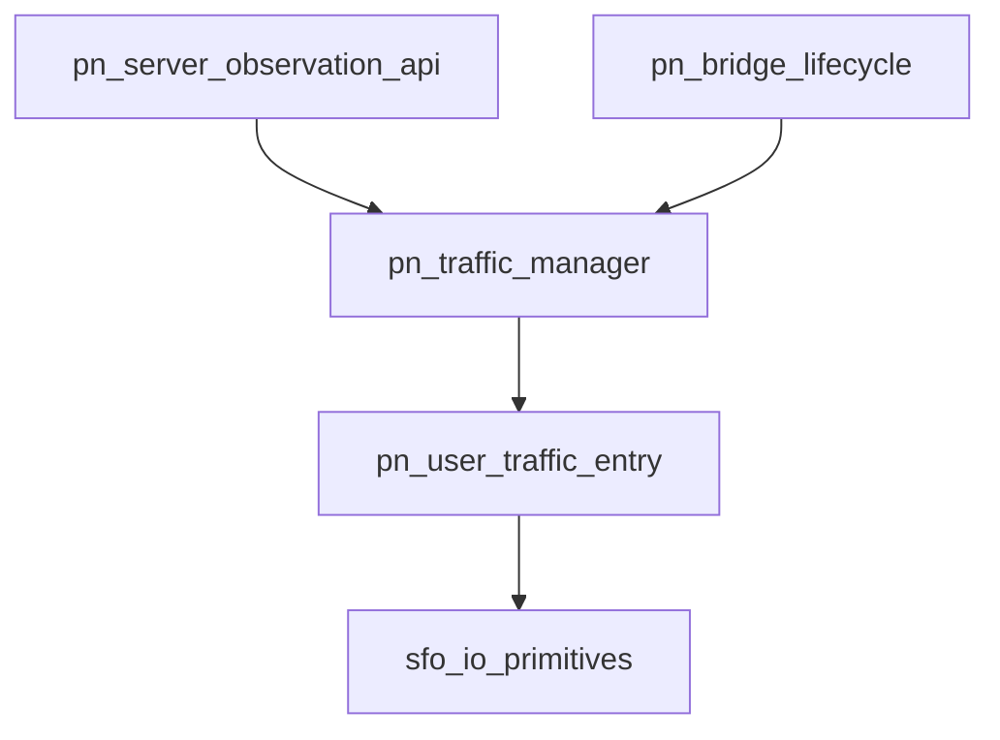

# Pipeline Plan

## Trigger
- Proposal: docs/versions/v0.1/modules/p2p-frame/007-pn-traffic-snapshot-traversal/proposal.md
- User launch confirmed: yes
- User launch statement: 确认，自动处理后续步骤
- Per-stage user confirmation: skipped by explicit user auto-pipeline authorization
- Auto-confirm completed document stages: no design/testing Markdown documents generated; repository-local document extensions only
- Auto-pipeline document policy: no design/testing markdown docs; testplan.yaml required
- Version: v0.1
- Packet module: p2p-frame
- Task name: 007-pn-traffic-snapshot-traversal
- Target module(s): p2p-frame
- change_id values: pn_traffic_snapshot_incremental_traversal, pn_traffic_snapshot_interval_delta, pn_traffic_disconnected_user_release

## Acceptance Baseline
- Final acceptance is judged against:
  - `proposal.md`

## Stage Graph
| Task ID | Stage | Responsibility | Scope | Parent Task | Depends On | Output | Done Condition |
|---------|-------|----------------|-------|-------------|------------|--------|----------------|
| D-1 | design | map PN traffic observation interfaces, ordered traversal, interval baseline, session ownership, cleanup, compatibility, failure flows, and concrete file scope | task-local pipeline design mappings | root | none | validated pipeline plan and scope bindings | pipeline-plan-check passes without design/testing Markdown documents |
| I-1 | implementation | deliver bounded snapshot traversal, consuming interval deltas, and identity-safe final-session cleanup | admitted PN service production path | root | D-1 | minimal production implementation | file child completes and implementation scope check passes |
| T-1 | testing | derive post-implementation coverage from proposal, plan, and delivered code, then generate runnable task evidence | dedicated PN traffic tests and task testplan | root | I-1 | tests, testplan.yaml, task-run evidence, and state coverage | coverage checker and task-scoped all entry pass with machine evidence |
| A-1 | acceptance | audit proposal-plan-code-tests-evidence consistency and PN traffic observation/lifecycle correctness | bound task packet and delivered paths | root | T-1 | acceptance-report.md | acceptance report check passes with accepted conclusion |

## Submodule Tasks
| Task ID | Stage | Responsibility | Submodule | Parent Task | Depends On | Output | Done Condition |
|---------|-------|----------------|-----------|-------------|------------|--------|----------------|
| I-PN-TRAVERSAL | implementation | add ordered active-user state and the bounded public snapshot iterator | PN traffic traversal | I-1 | D-1 | traversal portion of `pn_server.rs` | incremental traversal contract is implemented without an all-user aggregate or caller-held manager lock |
| I-PN-DELTA | implementation | add consuming interval baselines and non-consuming diagnostic snapshots | PN traffic snapshot acquisition | I-1 | I-PN-TRAVERSAL | delta portion of `pn_server.rs` | first/subsequent shared-baseline semantics are implemented without changing cumulative/speed meanings |
| I-PN-CLEANUP | implementation | add retained limit policy and identity-safe RAII session cleanup across both bridge paths | PN traffic live-entry lifecycle | I-1 | I-PN-DELTA | lifecycle portion of `pn_server.rs` | every successful bridge owns one distinct-user participation guard and final release removes only the matching live generation |

The production work uses three serial logical children over one file because the checker requires one `change_id` per file-sequence row, while `PnTrafficManager`, `PnTrafficSession`, both bridge acquisition sites, both bridge completion sites, and `PnServer` traffic APIs are colocated in `pn_server.rs`. These children share one owner and execute strictly in dependency order; they are not parallel editing boundaries.

## Dependency Graphs

| Level | Parent | Node | Depends On |
|-------|--------|------|------------|
| file-module | pn_server.rs | pn_server_observation_api | pn_traffic_manager |
| file-module | pn_server.rs | pn_bridge_lifecycle | pn_traffic_manager |
| file-module | pn_server.rs | pn_traffic_manager | pn_user_traffic_entry |
| file-module | pn_server.rs | pn_user_traffic_entry | sfo_io_primitives |
| file-module | pn_server.rs | sfo_io_primitives | none |

## Exported Interfaces
| Interface | Owner | Consumer | Compatibility | Affected Callers | Migration Path |
|-----------|-------|----------|---------------|------------------|----------------|
| `PnUserTrafficSnapshot::{tx_delta_bytes, rx_delta_bytes}` | PN service traffic entry snapshot contract | existing `PnServer::get_user_traffic_snapshot`, new iterator, and external snapshot consumers | migration-required | repository struct literals in `p2p-frame/src/pn/service/pn_server.rs`; external exhaustive struct literals may also be affected | update struct literals to supply the two fields or construct through `Default`; cumulative and speed field meanings remain unchanged |
| `PnUserTrafficSnapshotIter` and `PnServer::iter_user_traffic_snapshots()` | PN service traffic manager | local operators and library consumers that must discover active `(P2pId, PnUserTrafficSnapshot)` items | new | none in repository | callers create an iterator and pull one item at a time; no all-user collection API is introduced |
| `PnServer::get_user_traffic_snapshot(&P2pId)` consuming interval-baseline semantics | PN service traffic manager | existing point-lookup callers | migration-required | existing repository bridge-stop logging and tests; external point-lookup callers | bridge diagnostics move to a non-consuming internal peek; callers that require interval deltas consume the shared baseline, while callers requiring independent baselines need a future proposal |
| `PnServer::set_user_traffic_limit(P2pId, PnTrafficLimitConfig)` retained-policy semantics | PN service traffic manager | deployment configuration callers and future sessions | backward-compatible | no repository caller depends on setter-created snapshots | retain policy independently; update a live entry if present, and apply retained policy when a later session creates a fresh entry |

## API and Build Surface Impact
- Public API impact: migration-required
- Crate-root export change: no
- Build-surface change: no
- Documentation examples affected: no
- API surface note: `pn::service` already re-exports `pn_server::*`, and no repository documentation example currently constructs or traverses PN traffic snapshots.

## Consumer Migration Closure
| Old Symbol | New Path | change_id | Consumer Path | Consumer Kind | Migration Status |
|------------|----------|-----------|---------------|---------------|------------------|
| `PnUserTrafficSnapshot` four-field struct literals | same type with `tx_delta_bytes` and `rx_delta_bytes` | pn_traffic_snapshot_interval_delta | `p2p-frame/src/pn/service/pn_server.rs` | internal test consumer | migrated |
| bridge-stop call to consuming `PnTrafficManager::snapshot` | private non-consuming `peek_snapshot` path | pn_traffic_snapshot_interval_delta | `p2p-frame/src/pn/service/pn_server.rs` | internal production consumer | migrated |
| no all-user observation API | `PnServer::iter_user_traffic_snapshots()` | pn_traffic_snapshot_incremental_traversal | none-found | public API consumer | verified-none |

## State Ownership
| State | Owner | Access Interface | Lifecycle | Failure Transitions |
|-------|-------|------------------|-----------|---------------------|
| ordered active-user table containing one live entry and active-session participation count per `P2pId` | `PnTrafficManager` under its single manager-state mutex | begin session, point snapshot, iterator step, and session-guard release | absent -> created/incremented under manager lock -> decremented under manager lock -> removed exactly when count reaches zero and entry identity still matches | cancellation/error drops the guard and follows the same decrement; stale guards that do not match the map entry cannot remove a newer generation |
| retained explicit limit policy by `P2pId` | `PnTrafficManager` under the same manager-state mutex | `set_user_limit` and fresh-entry construction | absent/default -> explicitly configured -> reused across zero or more disconnect/reconnect cycles -> dropped with manager | live-entry update and entry creation are serialized with policy mutation; process termination discards policy by design |
| cumulative counters and current speed tracker | `PnUserTrafficEntry` through `SfoSpeedStat` | `StatStream` updates and consuming/non-consuming snapshot reads | zero at entry creation -> monotonically accumulated during active bridges -> discarded at final-session removal | bridge failure preserves successfully forwarded counts until guard cleanup removes the offline entry; reconnect creates zeroed counters |
| last externally acquired cumulative tx/rx baseline | `PnUserTrafficEntry` under a per-entry baseline mutex | consuming point/iterator snapshot only | `(0,0)` at entry creation -> replaced by each consuming acquisition's sampled totals -> discarded with the live entry | concurrent consumers serialize; internal peek never mutates; non-monotonic defensive reads use saturating subtraction rather than underflow |
| traversal progress cursor | each `PnUserTrafficSnapshotIter` | `Iterator::next` | before-first -> last returned `P2pId` advances monotonically -> exhausted when no greater active key exists | concurrent removal may still yield an already selected Arc and insertion at or below the cursor is omitted from that pass; no map guard or full key copy survives a step |

## Failure Flows
| Flow | Boundary | Failure | Handling |
|------|----------|---------|----------|
| public iterator step | iterator -> manager ordered active-user table | current key is removed immediately after selection or users churn during traversal | clone only the selected entry under the manager lock, release the lock before consuming its snapshot, advance the key cursor monotonically, and document weak consistency; do not retry or build a key list |
| public point/iterator interval acquisition | manager/iterator -> per-entry baseline and `SfoSpeedStat` | concurrent acquisition or counter update overlaps the read | serialize acquisition on the entry baseline mutex, sample totals, compute saturating deltas, advance baseline once, and return a self-contained copied snapshot |
| bridge diagnostic logging | bridge completion -> traffic entry | logging needs totals after transfer but must not consume caller deltas | use a private non-consuming peek that reads totals/speeds without advancing the baseline |
| data/control bridge completion, error, or cancellation | async bridge scope -> traffic session guard | bridge future exits through any path | RAII guard release decrements each distinct participant once under manager lock and removes only the same entry generation at zero |
| same user is both source and target | session creation -> active-user table | naive acquisition/release double-counts one participant | deduplicate lifecycle participation by `P2pId` while retaining the existing source and target tracker wiring/accounting behavior |
| disconnect races with reconnect | old session guard -> active-user table | stale release observes a key reused by a newer entry | compare the stored `Arc` identity with the current map value before decrement/removal; a mismatch is a no-op for the new generation |
| limit update races with fresh session | public setter/session creation -> manager state | new live entry could miss a concurrent policy update | serialize policy lookup/update and active-entry creation under the same manager-state mutex; apply updates to the current entry before releasing the lock |
| traffic manager is dropped before a session guard | session guard -> manager | weak owner upgrade fails | drop the entry Arcs with the guard and perform no map cleanup because the whole manager state is already gone |

## Rejected Alternatives
| Decision Type | Selected | Rejected | Reason |
|---------------|----------|----------|--------|
| boundary | keep traversal, delta baselines, limit policy, and live-entry lifetime in `PnTrafficManager`, exposing only value snapshots and an iterator through `PnServer` | make callers maintain manager keys, previous totals, or disconnect cleanup | the manager is the only owner that can coordinate concurrent sessions, entry generations, and the shared acquisition baseline without leaking internal trackers |
| technical | ordered active-user table plus a monotonic key cursor that selects one entry per iterator step | clone all keys/snapshots, hold a `HashMap` iterator/mutex guard across caller iteration, or repeatedly scan a `HashMap` | ordered lookup provides bounded state and forward progress while releasing the manager lock before caller-visible work; the rejected forms are unbounded or block runtime mutation |
| technical | per-entry mutex for shared delta baseline with separate consuming and non-consuming snapshot paths | derive deltas in callers, use unsynchronized atomics that can double-report, or let logs call the consuming path | one serialized acquisition defines a clear shared-baseline contract; a private peek preserves diagnostics without changing public intervals |
| technical | RAII session guard with active-count and `Arc::ptr_eq` generation checks | remove on every bridge close, rely only on `Arc::strong_count`, or run a periodic cleanup task | the guard covers cancellation and all exits, explicit counts distinguish manager/stream/iterator references from live sessions, and identity checks prevent ABA deletion without background work |
| technical | retain explicit limit configs separately from live entries | retain every statistics entry forever or discard configured limits at final disconnect | separate ownership releases counters/trackers while preserving operator policy for reconnect |
| collaboration | three serial change-bound logical children with one `pn_server.rs` owner | split public API, manager state, and bridge guard into parallel edits | all changes modify adjacent private types and invariants in one source file, so the required per-change rows execute serially and never create parallel ownership |

## Implementation Scope Bindings
| change_id | target_module | proposal_id | design_coverage | scope_paths | design_rules_applied |
|-----------|---------------|-------------|-----------------|-------------|----------------------|
| pn_traffic_snapshot_incremental_traversal | p2p-frame | P-PN-TRAFFIC-TRAVERSE-1 | `PnTrafficManager` owns an ordered active-user table; public `PnUserTrafficSnapshotIter` keeps only a last-key cursor and each `next()` clones one selected entry under the map lock, releases that lock, then consumes and returns one `(P2pId, snapshot)` with documented weak consistency | `p2p-frame/src/pn/service/pn_server.rs` | module decomposition, acyclic dependencies, public consumer mapping, bounded state/lock lifecycle, concurrent churn handling, rejected traversal alternatives |
| pn_traffic_snapshot_interval_delta | p2p-frame | P-PN-TRAFFIC-DELTA-1 | `PnUserTrafficSnapshot` gains tx/rx delta fields; each entry owns a serialized shared baseline advanced only by point/iterator acquisition, first acquisition uses zero baseline, diagnostics use non-consuming peek, and cleanup/reconnect discards/restarts the baseline | `p2p-frame/src/pn/service/pn_server.rs` | public compatibility/migration, single-owner baseline, consuming/non-consuming interface boundary, concurrency/error behavior, rejected delta alternatives |
| pn_traffic_disconnected_user_release | p2p-frame | P-PN-TRAFFIC-CLEANUP-1 | manager state separates retained limit policy from live entry/count; an RAII guard records distinct source/target participants for successful data/control bridges and decrements/removes matching entry generations on every exit, while reconnect constructs zeroed statistics and reapplies retained limits | `p2p-frame/src/pn/service/pn_server.rs` | lifecycle/state ownership, failure/cancellation transitions, same-user deduplication, ABA-safe cleanup, policy compatibility, rejected cleanup alternatives |

## File-Level Implementation Sequence
| Sequence | Task ID | File-Level Module | Action | Depends On | change_id | target_module | Scope Paths | Context Sources |
|----------|---------|-------------------|--------|------------|-----------|---------------|-------------|-----------------|
| 1 | I-PN-TRAVERSAL | `p2p-frame/src/pn/service/pn_server.rs` | introduce ordered active-user lookup, monotonic-key iterator state, and the public one-item-at-a-time traversal API | none | pn_traffic_snapshot_incremental_traversal | p2p-frame | `p2p-frame/src/pn/service/pn_server.rs` | proposal P-PN-TRAFFIC-TRAVERSE-1, iterator exported interface, traversal state/failure flow, current PN traffic manager source only |
| 2 | I-PN-DELTA | `p2p-frame/src/pn/service/pn_server.rs` | extend the snapshot value and add serialized consuming-baseline plus private non-consuming acquisition paths | I-PN-TRAVERSAL | pn_traffic_snapshot_interval_delta | p2p-frame | `p2p-frame/src/pn/service/pn_server.rs` | proposal P-PN-TRAFFIC-DELTA-1, snapshot exported interface, baseline state/failure flow, current PN traffic entry source only |
| 3 | I-PN-CLEANUP | `p2p-frame/src/pn/service/pn_server.rs` | separate retained policy from live entries and add distinct-participant RAII acquisition/release to both bridge paths | I-PN-DELTA | pn_traffic_disconnected_user_release | p2p-frame | `p2p-frame/src/pn/service/pn_server.rs` | proposal P-PN-TRAFFIC-CLEANUP-1, lifecycle state/failure flows, current data/control bridge source only |

## Return Rules
- If acceptance finds proposal ambiguity:
  - stop the pipeline and ask the user to decide; do not infer the requirement or create an automatic proposal return task
- If acceptance finds design mismatch:
  - return to design when traversal progress/locking, interval acquisition semantics, session ownership, cleanup generation safety, retained-policy behavior, or compatibility strategy is absent or wrong
- If acceptance finds implementation defect:
  - return to implementation when adequate design exists but delivered code is defective
- If acceptance finds testing implementation gap:
  - return to testing task
- For non-requirement findings:
  - repeat design -> implementation -> testing, then rerun acceptance
- If the same unresolved issue remains after more than 5 unsuccessful iterations:
  - stop and report the issue to the user

Execution status, testing evidence, return records, and final acceptance are stored in sibling `state.json`. They are deliberately excluded from this admission-bound plan.
