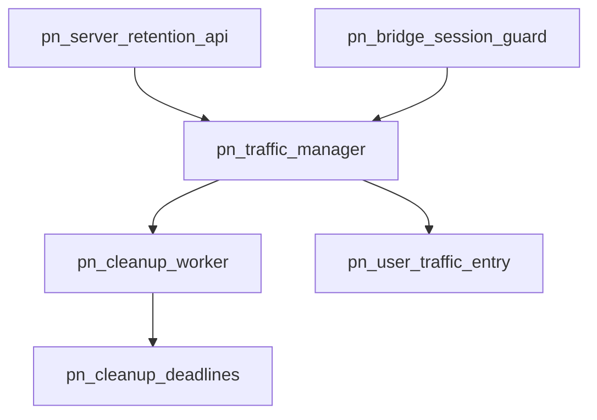

# Pipeline Plan

## Trigger
- Proposal: docs/versions/v0.1/modules/p2p-frame/008-pn-traffic-disconnect-retention/proposal.md
- User launch confirmed: yes
- User launch statement: 确认，启动自动流水线
- Per-stage user confirmation: skipped by explicit user auto-pipeline authorization
- Auto-confirm completed document stages: no design/testing Markdown documents generated; repository-local document extensions only
- Auto-pipeline document policy: no design/testing markdown docs; testplan.yaml required
- Version: v0.1
- Packet module: p2p-frame
- Task name: 008-pn-traffic-disconnect-retention
- Target module(s): p2p-frame
- change_id values: pn_traffic_disconnect_retention

## Acceptance Baseline
- Final acceptance is judged against:
  - `proposal.md`

## Stage Graph
| Task ID | Stage | Responsibility | Scope | Parent Task | Depends On | Output | Done Condition |
|---------|-------|----------------|-------|-------------|------------|--------|----------------|
| D-1 | design | map the retention API, active/idle state machine, bounded cleanup ownership, shutdown, compatibility, failure flows, and concrete file scope | task-local pipeline design mappings | root | none | validated pipeline plan and scope binding | pipeline-plan-check and design stage-scope check pass without design/testing Markdown documents |
| I-1 | implementation | coordinate and verify the admitted PN traffic-retention production change | admitted PN service production path | root | D-1 | minimal production implementation and implementation evidence | file child completes and implementation scope check passes |
| T-1 | testing | derive post-implementation coverage from proposal, plan, and delivered code, then generate runnable task evidence | dedicated PN traffic tests and task testplan | root | I-1, I-PN-RETENTION | tests, testplan.yaml, task-run evidence, and state coverage | coverage checker and task-scoped all entry pass with machine evidence |
| A-1 | acceptance | audit proposal-plan-code-tests-evidence consistency and retention lifecycle correctness | bound task packet and delivered paths | root | T-1 | acceptance-report.md | acceptance report check passes with accepted conclusion |

## Submodule Tasks
| Task ID | Stage | Responsibility | Submodule | Parent Task | Depends On | Output | Done Condition |
|---------|-------|----------------|-----------|-------------|------------|--------|----------------|
| I-PN-RETENTION | implementation | add external retention configuration and an identity-safe, bounded automatic expiry lifecycle | PN disconnected traffic retention | I-1 | D-1 | retention portion of `pn_server.rs` | zero/non-zero release, reconnect reuse, bounded expiry, and shutdown behavior conform to the mapped state model |

The production behavior is one file-level child because the public `PnServer` setter, private manager state, session release/reconnect transition, cleanup worker, and shutdown ownership share one mutex-protected invariant in `pn_server.rs`. Splitting edits would create overlapping write scopes and make the deadline/generation invariant harder to preserve.

## Parallel Scheduling
- Strategy: dependency-ready-set
- Concurrency: use all runtime-available child-agent slots
- Shared artifact owner: parent-orchestrator
- Lock directory: `.harness/locks/`
- Dispatch rule: launch the maximum dependency-ready set with disjoint exclusive write scopes before waiting; immediately backfill free slots
- Serialization reasons: explicit dependency, overlapping write scope, or exhausted concurrency capacity only
- Evidence: record launched task ids and serialization reasons in sibling `pipeline/state.json` scheduler waves

## Dependency Graphs

| Level | Parent | Node | Depends On |
|-------|--------|------|------------|
| file-module | pn_server.rs | pn_server_retention_api | pn_traffic_manager |
| file-module | pn_server.rs | pn_bridge_session_guard | pn_traffic_manager |
| file-module | pn_server.rs | pn_traffic_manager | pn_cleanup_worker, pn_user_traffic_entry |
| file-module | pn_server.rs | pn_cleanup_worker | pn_cleanup_deadlines |
| file-module | pn_server.rs | pn_cleanup_deadlines | none |
| file-module | pn_server.rs | pn_user_traffic_entry | none |

## Exported Interfaces
| Interface | Owner | Consumer | Compatibility | Affected Callers | Migration Path |
|-----------|-------|----------|---------------|------------------|----------------|
| `PnServer::set_user_traffic_retention(Duration)` | PN service traffic manager | external server configuration callers | new | none in repository | callers that need post-disconnect visibility set a non-zero duration; callers that do nothing retain zero-duration immediate release |
| retained-disconnected semantics of `PnServer::get_user_traffic_snapshot` and `PnServer::iter_user_traffic_snapshots` | PN service traffic manager | existing local observation callers | backward-compatible | external observers that assumed immediate disappearance after final disconnect | zero remains the default; configured deployments treat idle users as tracked until their captured deadline |

## API and Build Surface Impact
- Public API impact: backward-compatible
- Crate-root export change: no
- Build-surface change: no
- Documentation examples affected: no
- API surface note: `pn::service` already re-exports `pn_server::*`; `Duration` is supplied by the caller and no new dependency or deployment configuration format is introduced.

## Consumer Migration Closure
| Old Symbol | New Path | change_id | Consumer Path | Consumer Kind | Migration Status |
|------------|----------|-----------|---------------|---------------|------------------|
| no retention setter | `PnServer::set_user_traffic_retention(Duration)` | pn_traffic_disconnect_retention | none-found | public API consumer | verified-none |
| final-session immediate removal | captured zero/non-zero retention transition inside `PnTrafficManager` | pn_traffic_disconnect_retention | `p2p-frame/src/pn/service/pn_server.rs` | internal production consumer | migrated |

## State Ownership
| State | Owner | Access Interface | Lifecycle | Failure Transitions |
|-------|-------|------------------|-----------|---------------------|
| configured disconnect-retention duration | `PnTrafficManager` inner state under its single mutex | public server setter and final-session release | zero at construction -> replaced by setter -> sampled only when active count reaches zero -> converted to a monotonic deadline, saturating to the furthest platform-representable future instant when necessary -> discarded with manager | poisoned mutex follows existing fail-fast behavior; updating it never mutates already-captured idle deadlines, and extreme values do not panic during session-guard drop |
| one live user entry with active count and optional idle generation/deadline | `PnTrafficManager` inner state | begin session, session-guard release, lookup, iterator step, and cleanup worker | absent -> active -> idle with captured deadline -> active again on reconnect or absent on validated expiry; zero duration transitions active -> absent | stale guard identity mismatch is ignored; reconnect removes the exact scheduled deadline before becoming active; stale expiry must match active count zero plus generation/deadline before removal |
| ordered cleanup deadline set containing at most one item per idle user | `PnTrafficManager` inner state | final-session release, reconnect, and the cleanup worker | empty -> insert exact idle deadline -> remove on reconnect or pop on expiry -> clear on shutdown | duplicate/stale items are prevented by exact removal and validated on pop; notification wakes the single worker when the earliest deadline may change |
| cleanup worker lifecycle and wake condition | `PnTrafficManager` | manager construction/drop and condition-variable notifications | one worker per manager -> wait for first deadline/configured work -> clean due entries -> stop flag -> joined on manager drop | no async runtime is required; shutdown sets the stop flag, clears live/deadline state, notifies, and joins so no worker or strong manager reference survives |
| cumulative counters, speeds, limiter state, and shared external snapshot baseline | retained `PnUserTrafficEntry` | task 007 snapshot/tracker/limiter interfaces | created on first session -> retained through idle/reconnect before expiry -> discarded on validated expiry -> fresh after later reconnect | external snapshots during idle still consume the same shared baseline; explicit limit policy remains separately retained after live-entry expiry |

## Failure Flows
| Flow | Boundary | Failure | Handling |
|------|----------|---------|----------|
| final session guard release | bridge/session guard -> manager state and deadline set | active count reaches zero while retention is zero, ordinarily representable, or larger than the platform `Instant` range | under one manager lock, remove immediately for zero or attach a fresh generation/deadline and insert exactly one scheduled item for non-zero; derive the deadline with checked monotonic arithmetic and saturate an unrepresentable duration to the furthest representable future instant instead of panicking; notify after changing the schedule |
| reconnect before deadline | session acquisition -> idle user/deadline set | an old cleanup wake races with a new bridge | under one manager lock, remove the exact idle deadline, clear idle state, increment active count, and reuse the same entry; cleanup can remove only a still-idle matching generation |
| automatic expiry | cleanup worker -> manager state | deadline wakes late, early, or after a newer lifecycle transition | wait against monotonic `Instant`, pop only due work, and remove the user only when key, zero active count, generation, and deadline still match; otherwise discard the stale event |
| retention configuration update | public setter -> manager state | duration changes while users are already idle | replace only the configured value under the manager lock; existing captured deadlines remain unchanged and future active-to-idle transitions sample the new duration |
| snapshot lookup/iterator during expiry | observation -> retained entry | manager removes the map entry after an observer selects its `Arc` | preserve task 007 value-handle semantics: the selected snapshot operation may finish on its cloned entry while subsequent lookup/traversal no longer discovers it |
| manager/server destruction | final manager owner -> cleanup worker | worker is waiting or a deadline is outstanding | set shutdown, clear live users/deadlines/configuration state, notify the condition variable, and join the sole worker without retaining a strong traffic-manager reference in that worker |
| explicit limit update during idle/expiry | setter -> retained policy and optional live entry | cleanup and policy update overlap | serialize under the manager mutex; retain policy independently, update a still-live entry when present, and let later fresh creation reapply policy after expiry |

## Rejected Alternatives
| Decision Type | Selected | Rejected | Reason |
|---------------|----------|----------|--------|
| boundary | keep configuration, idle transitions, deadlines, cleanup, snapshot visibility, and retained-policy coordination inside `PnTrafficManager`, exposing one server setter | make `PnServer`, bridge callers, or external observers schedule removals | only the manager owns entry generations, active counts, traversal membership, and policy/live-state synchronization needed for safe expiry |
| technical | one manager-owned worker plus an ordered set with at most one deadline per idle user | one detached async task/timer per disconnect or per user | the selected model has bounded worker resources, does not require a running async runtime at configuration time, and bounds schedule entries by currently idle users |
| technical | monotonic `Instant` deadline plus generation/deadline validation under the manager mutex | wall-clock timestamps, key-only deletion, or lazy cleanup on later access | monotonic time avoids clock jumps; full validation prevents reconnect/ABA deletion; automatic progress releases inactive entries even when the server receives no further calls |
| technical | checked deadline conversion that saturates only values outside the platform monotonic-clock range | panic from `Instant` addition, silently wrap, or reject an otherwise valid `Duration` through a new fallible setter contract | the setter remains backward-compatible and accepts the full `Duration` domain; saturation is observable only beyond the process clock's representable future and preserves bounded, non-panicking retention semantics |
| technical | sample the current duration at active-to-idle transition | retroactively reschedule all idle users when configuration changes | stable captured deadlines avoid global mutation cost and surprising extension/shortening of already-started retention periods |
| collaboration | one serial implementation child owns the sole production file and invariant | parallel children for API, state, worker, and session guard | every part mutates adjacent definitions and the same mutex-protected lifecycle, so disjoint write scopes do not exist |

## Implementation Scope Bindings
| change_id | target_module | proposal_id | design_coverage | scope_paths | design_rules_applied |
|-----------|---------------|-------------|-----------------|-------------|----------------------|
| pn_traffic_disconnect_retention | p2p-frame | P-PN-TRAFFIC-RETENTION-1 | `PnTrafficManager` owns a zero-default configurable duration, checked/saturating conversion across the full `Duration` input domain, active/idle generation state, an ordered one-deadline-per-idle-user set, and one joinable cleanup worker; final release captures the duration without panicking, reconnect cancels the exact deadline and reuses the entry, expiry validates key/generation/deadline, observation includes idle entries, and shutdown clears state and joins the worker | `p2p-frame/src/pn/service/pn_server.rs` | module decomposition, acyclic dependencies, public consumer mapping, complete parameter-domain behavior, bounded state and worker lifecycle, reconnect/expiry failure handling, compatibility, rejected scheduling alternatives |

## File-Level Implementation Sequence
| Sequence | Task ID | File-Level Module | Action | Depends On | change_id | target_module | Scope Paths | Context Sources |
|----------|---------|-------------------|--------|------------|-----------|---------------|-------------|-----------------|
| 1 | I-PN-RETENTION | `p2p-frame/src/pn/service/pn_server.rs` | add the retention setter, full-domain checked/saturating deadline conversion, manager inner state, active/idle deadline transitions, bounded cleanup worker, and deterministic shutdown | none | pn_traffic_disconnect_retention | p2p-frame | `p2p-frame/src/pn/service/pn_server.rs` | proposal P-PN-TRAFFIC-RETENTION-1, exported interfaces, state ownership, failure flows, current task 007 traffic-manager/session implementation only |

## Return Rules
- If acceptance finds proposal ambiguity:
  - stop the pipeline and ask the user to decide; do not infer the requirement or create an automatic proposal return task
- If acceptance finds design mismatch:
  - return to design when retention API/default/update semantics, active/idle transitions, bounded scheduling, generation/deadline validation, shutdown, or task 007 compatibility is absent or wrong
- If acceptance finds implementation defect:
  - return to implementation when adequate design exists but delivered code is defective
- If acceptance finds testing implementation gap:
  - return to testing task
- For non-requirement findings:
  - repeat design -> implementation -> testing, then rerun acceptance
- If the same unresolved issue remains after more than 5 unsuccessful iterations:
  - stop and report the issue to the user

Execution status, testing evidence, return records, and final acceptance are stored in sibling `state.json`. They are deliberately excluded from this admission-bound plan.
