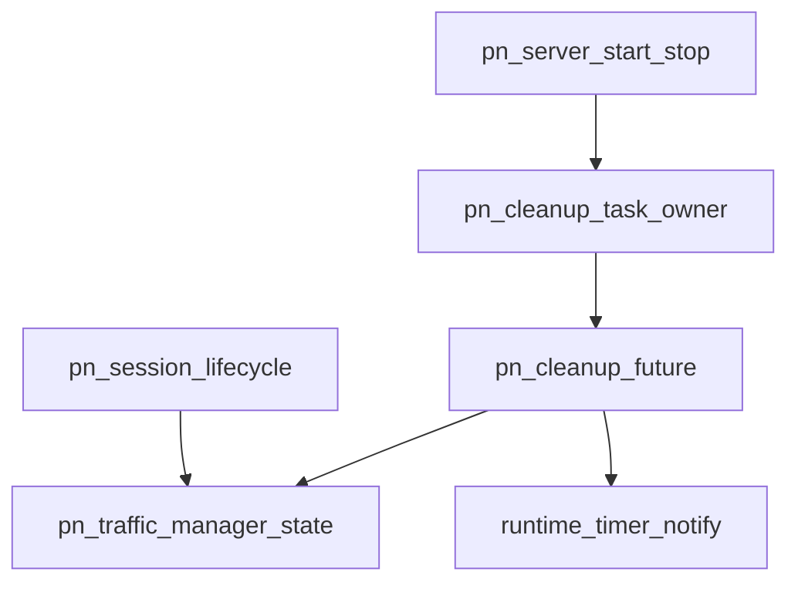

# Pipeline Plan

## Trigger
- Proposal: docs/versions/v0.1/modules/p2p-frame/009-pn-traffic-async-cleanup-task/proposal.md
- User launch confirmed: yes
- User launch statement: 确认，启动自动流水线
- Per-stage user confirmation: skipped by explicit user auto-pipeline authorization
- Auto-confirm completed document stages: no design/testing Markdown documents generated; repository-local document extensions only
- Auto-pipeline document policy: no design/testing markdown docs; testplan.yaml required
- Version: v0.1
- Packet module: p2p-frame
- Task name: 009-pn-traffic-async-cleanup-task
- Target module(s): p2p-frame
- change_id values: pn_traffic_async_cleanup_task

## Acceptance Baseline
- Final acceptance is judged against:
  - `proposal.md`

## Stage Graph
| Task ID | Stage | Responsibility | Scope | Parent Task | Depends On | Output | Done Condition |
|---------|-------|----------------|-------|-------------|------------|--------|----------------|
| D-1 | design | map async task startup, notification/timer selection, bounded cleanup fairness, lock/await boundaries, handle ownership, shutdown, runtime compatibility, and exact file scope | task-local pipeline design mappings | root | none | validated pipeline plan and scope binding | pipeline-plan-check and design stage-scope check pass without design/testing Markdown documents |
| I-1 | implementation | coordinate and verify the admitted PN async cleanup production correction | admitted PN service production path | root | D-1 | minimal production implementation and implementation evidence | file child completes and implementation scope check passes |
| T-1 | testing | derive post-implementation async scheduling/lifecycle coverage and generate runnable task evidence | dedicated PN traffic tests and task testplan | root | I-1, I-PN-ASYNC-CLEANUP | tests, testplan.yaml, task-run evidence, and state coverage | coverage checker and task-scoped all entry pass with machine evidence |
| A-1 | acceptance | audit proposal-plan-code-tests-evidence consistency and async cleanup correctness | bound task packet and delivered paths | root | T-1 | acceptance-report.md | acceptance report check passes with accepted conclusion |

## Submodule Tasks
| Task ID | Stage | Responsibility | Submodule | Parent Task | Depends On | Output | Done Condition |
|---------|-------|----------------|-----------|-------------|------------|--------|----------------|
| I-PN-ASYNC-CLEANUP | implementation | replace the cleanup thread/Condvar with one runtime task while preserving task 008 lifecycle semantics | PN traffic asynchronous cleanup executor | I-1 | D-1 | async cleanup portion of `pn_server.rs` | no dedicated cleanup thread/blocking wait remains and runtime task startup, fairness, wakeup, expiry, and shutdown conform to the mapped model |

The production correction uses one file-level child because manager state, task handle, notification, cleanup selection loop, session wake sites, and server start/stop/drop integration share one lifecycle invariant in `pn_server.rs`. Separate editing tasks would overlap the same types and lock ordering.

## Parallel Scheduling
- Strategy: dependency-ready-set
- Concurrency: use all runtime-available child-agent slots
- Shared artifact owner: parent-orchestrator
- Lock directory: `.harness/locks/`
- Dispatch rule: launch the maximum dependency-ready set with disjoint exclusive write scopes before waiting; immediately backfill free slots
- Serialization reasons: explicit dependency, overlapping write scope, or exhausted concurrency capacity only
- Evidence: record launched task ids and serialization reasons in sibling `pipeline/state.json` scheduler waves

## Dependency Graphs

| Level | Parent | Node | Depends On |
|-------|--------|------|------------|
| file-module | pn_server.rs | pn_server_start_stop | pn_cleanup_task_owner |
| file-module | pn_server.rs | pn_session_lifecycle | pn_traffic_manager_state |
| file-module | pn_server.rs | pn_cleanup_task_owner | pn_cleanup_future |
| file-module | pn_server.rs | pn_cleanup_future | pn_traffic_manager_state, runtime_timer_notify |
| file-module | pn_server.rs | pn_traffic_manager_state | none |
| file-module | pn_server.rs | runtime_timer_notify | none |

## Exported Interfaces
| Interface | Owner | Consumer | Compatibility | Affected Callers | Migration Path |
|-----------|-------|----------|---------------|------------------|----------------|
| private `PnTrafficManager::start_cleanup_task()` | PN traffic cleanup task owner | `PnServer::start()` | new | `PnServer::start()` in `p2p-frame/src/pn/service/pn_server.rs` | after successful start-state acquisition, ensure the single cleanup task is spawned through `Executor::spawn_with_handle`; repeated starts remain idempotent |
| existing synchronous `PnTrafficManager::shutdown()` task cancellation semantics | PN traffic cleanup task owner | `PnServer::stop()`, `PnServer::drop()`, and manager drop | backward-compatible | internal stop/drop paths in `p2p-frame/src/pn/service/pn_server.rs` | mark shutdown and clear state under the manager lock, issue a retained async wake permit, and drop the stored handle without synchronously awaiting the same executor |

## API and Build Surface Impact
- Public API impact: none
- Crate-root export change: no
- Build-surface change: no
- Documentation examples affected: no
- API surface note: public retention configuration, snapshot lookup/traversal, stop signature, PN codecs, Cargo features, and dependencies do not change; the task consumes the already enabled Tokio runtime facilities and existing executor abstraction.

## Consumer Migration Closure
| Old Symbol | New Path | change_id | Consumer Path | Consumer Kind | Migration Status |
|------------|----------|-----------|---------------|---------------|------------------|
| manager-construction `std::thread` cleanup startup | private `PnTrafficManager::start_cleanup_task()` from async server start | pn_traffic_async_cleanup_task | `p2p-frame/src/pn/service/pn_server.rs` | internal production consumer | migrated |
| `Condvar` deadline/shutdown wake | async `Notify` permit plus timer selection | pn_traffic_async_cleanup_task | `p2p-frame/src/pn/service/pn_server.rs` | internal production consumer | migrated |

## State Ownership
| State | Owner | Access Interface | Lifecycle | Failure Transitions |
|-------|-------|------------------|-----------|---------------------|
| users, retained limit policy, configured duration, idle generations, deadlines, and shutdown flag | `PnTrafficManagerShared` under its existing synchronous mutex | sessions, setters, observation, cleanup step, and shutdown | unchanged task 008 active/idle/expired/shutdown transitions | no synchronous guard survives any await; stale cleanup still requires key, zero active count, generation, and deadline match |
| one async wake permit/coalesced notification stream | `PnTrafficManagerShared` async notifier | release, reconnect cancellation, cleanup task, and shutdown | no pending permit -> `notify_one` stores or wakes -> cleanup loop rechecks authoritative state -> permits may coalesce safely | every notification is a hint; constructing the notified future before state inspection and rechecking after each wake prevents an earlier deadline or shutdown from being lost |
| cleanup task handle | `PnTrafficManager` handle mutex | `start_cleanup_task` and `shutdown` only | absent at synchronous construction -> spawned once during async server start -> stored -> taken/dropped during shutdown -> absent | start and shutdown use one handle-before-state lock order; shutdown races cannot publish a live handle after state is marked stopped; spawn failure returns through `PnServer::start` and restores start state |
| cleanup future execution | project executor, owning only shared state plus notifier through that state | timer/notification select loop | spawned -> inspect/process -> async wait/yield -> shutdown observed -> exit | the future holds no strong manager reference; handle drop plus retained notify permit accelerates exit, while shutdown validation prevents post-stop mutation even if physical completion is later |
| bounded cleanup batch progress | cleanup future | one locked cleanup step followed by async yield/timer/notification | remove and validate at most a fixed batch of due deadlines -> yield if more due -> otherwise wait for next deadline or notification | prevents large simultaneous expiry sets from monopolizing one runtime worker; authoritative ordered set preserves eventual progress |

## Failure Flows
| Flow | Boundary | Failure | Handling |
|------|----------|---------|----------|
| server startup | `PnServer::start` -> executor | cleanup task spawn fails or start races with shutdown | serialize handle creation, recheck shutdown under the defined lock order, propagate spawn error and reset `started`; never fall back to an OS thread |
| empty deadline set | cleanup future -> async notifier | task could wait forever and retain manager | future owns shared state but not the manager, awaits a retained `notify_one` permit, and exits after shutdown flag becomes visible |
| future deadline wait | cleanup future -> runtime timer/notifier | a newly inserted earlier deadline, reconnect cancellation, or shutdown occurs while sleeping | select bounded runtime sleep against notified future, then discard the wake reason and re-read state; no absolute decision is made from the stale prior deadline |
| simultaneous expiries | cleanup future -> ordered deadline set | processing all due users without await can starve executor work | process a fixed maximum batch under one short manager lock, release it, then `yield_now` before another due batch |
| expiry/reconnect race | cleanup future -> manager state | old due work overlaps active reconnect or newer idle generation | retain task 008 full identity/active/generation/deadline validation under one mutex; stale work is removed from schedule but cannot remove current user state |
| synchronous stop/drop | server/manager -> cleanup future | blocking join deadlocks the runtime or detached future mutates after stop | take task handle using the common lock order, set shutdown and clear state, store/wake one async permit, and drop the handle without sync join; every future mutation begins by checking shutdown under the same state mutex |
| construction outside a runtime | public `PnServer::new` -> cleanup ownership | spawning in synchronous construction can panic because no Tokio runtime exists | construction creates only state/notifier/empty handle; actual spawn occurs from async `PnServer::start()` where the project runtime is active |
| extreme retained deadline | cleanup future -> runtime sleep | timer API receives an unrepresentable or operationally excessive duration | preserve task 008 absolute checked/saturated deadline and cap each async sleep to the existing one-hour interval before rechecking |

## Rejected Alternatives
| Decision Type | Selected | Rejected | Reason |
|---------------|----------|----------|--------|
| boundary | keep all traffic cleanup state and async task ownership inside `PnTrafficManager`, with `PnServer::start/stop/drop` as lifecycle consumers | move scheduling into bridge futures, external callers, or a process-global cleanup service | the manager alone owns user generations, deadline membership, reconnect cancellation, and shutdown state; a global service expands scope and ownership |
| technical | one runtime task using async `Notify`, bounded runtime sleep, select/recheck, fixed due-work batches, and executor yield | keep the dedicated thread, call blocking Condvar waits inside async code, or spawn one timer/task per idle user | the selected loop uses existing runtime capacity without blocking it and bounds both task count and per-poll work |
| technical | spawn from async `PnServer::start()` and keep synchronous construction runtime-independent | spawn from `PnTrafficManager::new()` or the synchronous retention setter | synchronous public construction/configuration may occur before a Tokio context exists; start is the existing async runtime boundary |
| technical | shutdown flag plus retained notify permit and handle drop, with no synchronous async join | block_on/join the task from synchronous stop/drop or rely only on dropping a detached handle | blocking can deadlock the same runtime; handle drop behavior varies, while shared shutdown validation and notification are backend-safe correctness mechanisms |
| collaboration | one serial file child owns the full execution-model correction | split startup, task loop, wake sites, and shutdown into parallel edits | these changes share one source file and mutually dependent lifecycle/lock-order invariants, so no disjoint production scopes exist |

## Implementation Scope Bindings
| change_id | target_module | proposal_id | design_coverage | scope_paths | design_rules_applied |
|-----------|---------------|-------------|-----------------|-------------|----------------------|
| pn_traffic_async_cleanup_task | p2p-frame | P-PN-TRAFFIC-ASYNC-CLEANUP-1 | `PnTrafficManager` synchronously constructs shared state/notifier with an empty task handle; async `PnServer::start()` spawns exactly one weak-manager-independent cleanup future through the existing executor; the future constructs a retained notification wait before inspecting state, processes a fixed due batch without holding a lock across await, selects bounded runtime sleep against notification, yields between due batches, and exits after synchronous shutdown clears state, sets the flag, notifies, and drops the handle; all task 008 deadline/generation/observation/policy semantics remain unchanged | `p2p-frame/src/pn/service/pn_server.rs` | module decomposition, acyclic dependencies, internal consumer mapping, runtime-independent construction, single-owner state/task lifecycle, lost-wakeup and cancellation handling, bounded executor fairness, compatibility, rejected blocking/per-user alternatives |

## File-Level Implementation Sequence
| Sequence | Task ID | File-Level Module | Action | Depends On | change_id | target_module | Scope Paths | Context Sources |
|----------|---------|-------------------|--------|------------|-----------|---------------|-------------|-----------------|
| 1 | I-PN-ASYNC-CLEANUP | `p2p-frame/src/pn/service/pn_server.rs` | replace thread/Condvar startup and blocking loop with start-bound single async task, async notifier/timer selection, bounded cleanup batches/yield, and non-blocking synchronous shutdown | none | pn_traffic_async_cleanup_task | p2p-frame | `p2p-frame/src/pn/service/pn_server.rs` | proposal P-PN-TRAFFIC-ASYNC-CLEANUP-1, exported interfaces, task/state ownership, failure flows, current task 008 cleanup implementation only |

## Return Rules
- If acceptance finds proposal ambiguity:
  - stop the pipeline and ask the user to decide; do not infer the requirement or create an automatic proposal return task
- If acceptance finds design mismatch:
  - return to design when async startup, runtime compatibility, lost-wakeup handling, lock/await boundary, fairness, handle ownership, cancellation, or task 008 compatibility is absent or wrong
- If acceptance finds implementation defect:
  - return to implementation when adequate design exists but delivered code is defective
- If acceptance finds testing implementation gap:
  - return to testing task
- For non-requirement findings:
  - repeat design -> implementation -> testing, then rerun acceptance
- If the same unresolved issue remains after more than 5 unsuccessful iterations:
  - stop and report the issue to the user

Execution status, testing evidence, return records, and final acceptance are stored in sibling `state.json`. They are deliberately excluded from this admission-bound plan.
