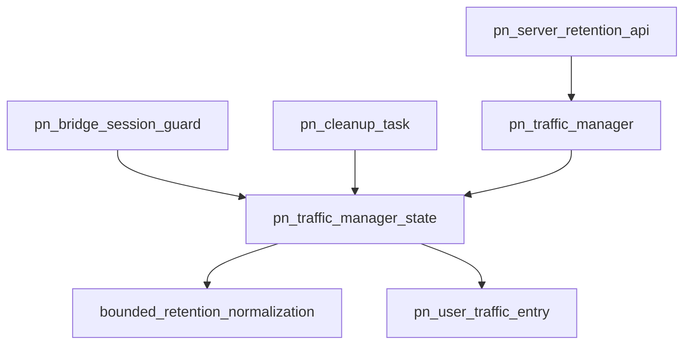

# Pipeline Plan

## Trigger
- Proposal: docs/versions/v0.1/modules/p2p-frame/010-pn-traffic-release-simplification/proposal.md
- User launch confirmed: yes
- User launch statement: 批准，自动完成后续任务
- Per-stage user confirmation: skipped by explicit user auto-pipeline authorization
- Auto-confirm completed document stages: no design/testing Markdown documents generated; repository-local document extensions only
- Auto-pipeline document policy: no design/testing markdown docs; testplan.yaml required
- Version: v0.1
- Packet module: p2p-frame
- Task name: 010-pn-traffic-release-simplification
- Target module(s): p2p-frame
- change_id values: pn_traffic_release_state_simplification, pn_traffic_retention_finite_bound

## Acceptance Baseline
- Final acceptance is judged against:
  - `proposal.md`

## Stage Graph
| Task ID | Stage | Responsibility | Scope | Parent Task | Depends On | Output | Done Condition |
|---------|-------|----------------|-------|-------------|------------|--------|----------------|
| D-1 | design | map the reduced release state, bounded retention normalization, reachable concurrency invariants, compatibility, failure flows, and exact file scope | task-local pipeline design mappings | root | none | validated pipeline plan and scope bindings | pipeline-plan-check and design stage-scope check pass without design/testing Markdown documents |
| I-1 | implementation | coordinate and verify the admitted PN traffic release simplification | admitted PN service production path | root | D-1 | minimal production implementation and implementation evidence | both serial file children complete and implementation scope check passes |
| T-1 | testing | derive post-implementation release/boundary coverage and generate runnable task evidence | dedicated PN traffic tests and task testplan | root | I-1, I-PN-RELEASE-STATE, I-PN-RETENTION-BOUND | tests, testplan.yaml, task-run evidence, and state testing evidence | coverage checker and task-scoped all entry pass with machine evidence |
| A-1 | acceptance | audit proposal-plan-code-tests-evidence consistency and simplified lifecycle correctness | bound task packet and delivered paths | root | T-1 | acceptance-report.md | acceptance report check passes with accepted conclusion |

## Submodule Tasks
| Task ID | Stage | Responsibility | Submodule | Parent Task | Depends On | Output | Done Condition |
|---------|-------|----------------|-----------|-------------|------------|--------|----------------|
| I-PN-RELEASE-STATE | implementation | remove idle generations and artificial stale-state tolerance while preserving reachable session/reconnect/expiry/shutdown safety | PN traffic release state | I-1 | D-1 | release-state portion of `pn_server.rs` | production lifecycle uses entry identity, active count, and exact idle deadline without generation state |
| I-PN-RETENTION-BOUND | implementation | replace full-Duration platform-edge search with finite retention normalization | PN traffic retention bound | I-1 | I-PN-RELEASE-STATE | retention-normalization portion of `pn_server.rs` | retention is clamped to 30 days and deadline creation has no platform-limit search |

Both implementation children modify the same production file and adjacent manager invariants. They are logical admission units serialized in file order, not parallel editing scopes.

## Parallel Scheduling
- Strategy: dependency-ready-set
- Concurrency: use all runtime-available child-agent slots
- Shared artifact owner: parent-orchestrator
- Lock directory: `.harness/locks/`
- Dispatch rule: launch the maximum dependency-ready set with disjoint exclusive write scopes before waiting; immediately backfill free slots
- Serialization reasons: explicit dependency, overlapping write scope, or exhausted concurrency capacity only
- Concrete serialization: the two implementation children overlap `pn_server.rs` and the bound-normalization child depends on the reduced state shape; later stages depend on delivered code/evidence
- Evidence: record launched task ids and serialization reasons in sibling `pipeline/state.json` scheduler waves

## Dependency Graphs

| Level | Parent | Node | Depends On |
|-------|--------|------|------------|
| file-module | pn_server.rs | pn_server_retention_api | pn_traffic_manager |
| file-module | pn_server.rs | pn_bridge_session_guard | pn_traffic_manager_state |
| file-module | pn_server.rs | pn_cleanup_task | pn_traffic_manager_state |
| file-module | pn_server.rs | pn_traffic_manager | pn_traffic_manager_state |
| file-module | pn_server.rs | pn_traffic_manager_state | bounded_retention_normalization, pn_user_traffic_entry |
| file-module | pn_server.rs | bounded_retention_normalization | none |
| file-module | pn_server.rs | pn_user_traffic_entry | none |

## Exported Interfaces
| Interface | Owner | Consumer | Compatibility | Affected Callers | Migration Path |
|-----------|-------|----------|---------------|------------------|----------------|
| `PnServer::set_user_traffic_retention(Duration)` | PN service traffic manager | external server configuration callers | migration-required | no repository production caller; external callers requesting more than 30 days | retain the same infallible setter; callers must request at most 30 days or explicitly accept clamping, while zero and ordinary durations are unchanged |
| retained-disconnected semantics of `PnServer::get_user_traffic_snapshot` and `PnServer::iter_user_traffic_snapshots` | PN service traffic manager | existing local observation callers | backward-compatible | external observers of ordinary retention periods | no migration; active, idle-visible, reconnect-reused, expired, and shutdown-hidden transitions remain unchanged |

## API and Build Surface Impact
- Public API impact: migration-required
- Crate-root export change: no
- Build-surface change: no
- Documentation examples affected: no
- API surface note: migration applies only to callers requesting more than 30 days; the Rust signature remains source-compatible, the setter remains infallible, and no dependency, feature, wire, or deployment configuration changes.

## Consumer Migration Closure
| Old Symbol | New Path | change_id | Consumer Path | Consumer Kind | Migration Status |
|------------|----------|-----------|---------------|---------------|------------------|
| idle `generation + deadline` validation | exact idle `deadline` validation under the same manager mutex | pn_traffic_release_state_simplification | `p2p-frame/src/pn/service/pn_server.rs` | internal production consumer | migrated |
| furthest-representable-`Instant` search for arbitrary `Duration` | 30-day normalization in `PnTrafficManager::set_retention` plus checked bounded deadline creation | pn_traffic_retention_finite_bound | `p2p-frame/src/pn/service/pn_server.rs` | internal production consumer | migrated |
| public `PnServer::set_user_traffic_retention(Duration)` signature | unchanged public path with values above 30 days clamped | pn_traffic_retention_finite_bound | none-found | public API consumer | verified-none |

## State Ownership
| State | Owner | Access Interface | Lifecycle | Failure Transitions |
|-------|-------|------------------|-----------|---------------------|
| tracked PN user lifecycle record with entry identity, active count, and optional monotonic idle deadline | `PnTrafficManagerShared::state` under its single mutex | session acquire/release, lookup/traversal, and cleanup action | absent -> active(count >= 1, no idle deadline) -> idle(count 0, one deadline) -> active on reconnect or absent on expiry; zero retention transitions final active directly to absent | session guard release first validates acquired entry identity; reconnect removes the exact deadline before incrementing; expiry selects, validates, and removes under the same mutex so no authoritative stale record crosses an await/unlocked boundary |
| ordered cleanup deadline set containing at most one `(deadline, user)` per idle user | `PnTrafficManagerShared::state` under the same mutex | final-session release, reconnect, cleanup action, and shutdown | empty -> exact insert on final release -> exact removal on reconnect or due pop -> clear on shutdown | set membership and matching user idle deadline are one invariant; duplicate insertion remains a debug assertion and internal state corruption is not a supported recovery case |
| configured disconnect-retention duration | `PnTrafficManagerShared::state` under the same mutex | `PnServer` setter forwarding to manager setter and final-session release | zero at construction -> normalized to `min(requested, 30 days)` on setter -> sampled only by future active-to-idle transitions -> cleared on shutdown | checked addition of the normalized bound succeeds on supported Windows/MSVC and Linux targets; an unexpected future-target failure removes the just-idle entry immediately rather than panicking in RAII drop or searching the platform edge |
| cleanup task/notifier/handle lifecycle | existing `PnTrafficManagerShared` notifier and `PnTrafficManager` handle mutex | server start, release/reconnect hints, cleanup loop, and shutdown | unchanged task 009 single-task start -> wait/recheck/bounded batch -> shutdown/notify -> exit | no synchronous state lock crosses await; notifications remain hints; shutdown clears state before waking/dropping the handle |
| counters, delta baseline, limiters, and retained explicit limit policy | existing user entry plus manager policy map | bridge trackers, snapshot APIs, and limit setter | unchanged across ordinary active/idle/reconnect/expiry transitions | expiry discards only the live entry; later creation reapplies retained policy; shutdown clears both live entries and policies |

## Failure Flows
| Flow | Boundary | Failure | Handling |
|------|----------|---------|----------|
| final session guard release | bridge/session guard -> manager state/deadline set | concurrent sessions remain or the guard no longer identifies the acquired entry | serialize under the manager mutex, ignore mismatched identity, decrement a positive count, and transition only the final participant to immediate removal or one idle deadline |
| reconnect before deadline | session acquisition -> idle user/deadline set | cleanup task is sleeping for the old deadline | remove the exact `(deadline, user)` record and clear idle state under the manager mutex before incrementing; notify the task to re-read authoritative state and reuse the same entry |
| automatic expiry | cleanup task -> manager state | timer wakes early/late or reconnect overlaps expiry | under one mutex pop only due work and remove only a user still at zero active sessions with the same exact idle deadline; reconnect and expiry serialize, so no generation namespace is needed |
| retention configuration update | public setter -> manager state | requested value exceeds 30 days or changes while users are already idle | clamp the stored configured value to 30 days; keep already-captured idle deadlines unchanged and apply the new normalized duration only to future final-session transitions |
| bounded deadline construction | final-session release -> monotonic clock | normalized duration unexpectedly cannot be added on a future target | treat the transition as immediate removal and return without scheduling; do not panic in session-guard drop, binary-search a platform maximum, or silently wrap |
| observation during expiry | snapshot lookup/iterator -> retained entry | cleanup removes map membership after an observer clones the entry | preserve Arc value-lifetime behavior: the selected read may finish, while later lookup/traversal no longer discovers the user |
| manager/server shutdown | stop/drop -> state/task/session guards | outstanding idle deadlines or late active-session guard drops | mark shutdown, clear users/policy/deadlines/retention, notify cleanup, and make later session releases no-ops through missing identity/state; do not recreate tracked state |

## Rejected Alternatives
| Decision Type | Selected | Rejected | Reason |
|---------------|----------|----------|--------|
| boundary | keep simplification within `PnTrafficManager` and its existing `PnServer` forwarding surface | move cleanup or normalization into bridge callers, neighboring crates, or a global scheduler | the manager remains the sole owner of active counts, map visibility, deadline membership, retention configuration, and shutdown synchronization |
| technical | exact deadline plus active count and acquired-entry identity under one mutex | retain generation counters and tests that directly inject stale private records | cleanup never carries an authoritative removal decision across unlock/await, and reconnect removes the exact old record; a second identity namespace protects no reachable production interleaving |
| technical | clamp configured retention to 30 days before deadline creation and fail closed to immediate removal if checked addition unexpectedly fails | binary-search the platform's furthest `Instant`, preserve exact `Duration::MAX`, make the setter fallible, panic in RAII drop, or silently wrap | 30 days is sufficient for disconnected-statistics grace retention, safely below supported target clock limits, preserves the setter signature, and avoids platform-edge machinery |
| technical | preserve the one ordered deadline set and notification-driven async task | periodic full-map sweep or one timer/task per user | the existing owner bounds task count, preserves prompt expiry, and already separates locks from awaits; changing it would expand scope rather than simplify the requested defenses |
| collaboration | two serial logical implementation children over one file | parallel children editing state definitions and retention calculation independently | both changes touch adjacent types/functions and the same invariants in `pn_server.rs`; serial execution avoids overlapping writes while retaining per-change admission traceability |

## Implementation Scope Bindings
| change_id | target_module | proposal_id | design_coverage | scope_paths | design_rules_applied |
|-----------|---------------|-------------|-----------------|-------------|----------------------|
| pn_traffic_release_state_simplification | p2p-frame | P-PN-TRAFFIC-RELEASE-SIMPLE-1 | `PnTrafficManagerShared::state` keeps one exact idle deadline per zero-session user and one matching ordered `(deadline, user)` record; session guard identity and active counts protect reachable release races; reconnect removes the exact record before reuse; cleanup validates due time, zero count, and exact deadline while holding the same mutex; generation fields/counter and private-state-injection tolerance are removed without changing observation, limit, async-task, or shutdown behavior | `p2p-frame/src/pn/service/pn_server.rs` | module decomposition, acyclic dependencies, public/internal consumer mapping, single-owner state lifecycle, reachable concurrency/failure handling, compatibility, rejected generation/artificial-state alternatives |
| pn_traffic_retention_finite_bound | p2p-frame | P-PN-TRAFFIC-RETENTION-BOUND-1 | `PnTrafficManager::set_retention` stores `min(requested, 30 days)`; future final-session transitions use one checked monotonic addition and immediately remove the just-idle entry if that bounded addition unexpectedly fails; already-idle deadlines, zero default/immediate removal, the public setter signature, cleanup maximum sleep, and task lifecycle remain unchanged; the platform-edge binary search and exact `Duration::MAX` semantics are removed | `p2p-frame/src/pn/service/pn_server.rs` | module decomposition, dependency and consumer mapping, bounded configuration ownership, supported-target non-panicking failure contract, source compatibility, rejected platform-edge/fallible-setter alternatives |

## File-Level Implementation Sequence
| Sequence | Task ID | File-Level Module | Action | Depends On | change_id | target_module | Scope Paths | Context Sources |
|----------|---------|-------------------|--------|------------|-----------|---------------|-------------|-----------------|
| 1 | I-PN-RELEASE-STATE | `p2p-frame/src/pn/service/pn_server.rs` | remove idle/deadline generation fields and manager counter; reduce acquire/release/cleanup matching to entry identity, active count, and exact deadline under the existing mutex | none | pn_traffic_release_state_simplification | p2p-frame | `p2p-frame/src/pn/service/pn_server.rs` | proposal P-PN-TRAFFIC-RELEASE-SIMPLE-1, reduced state ownership, reconnect/expiry failure flows, current task 009 implementation only |
| 2 | I-PN-RETENTION-BOUND | `p2p-frame/src/pn/service/pn_server.rs` | add a 30-day internal bound, normalize in the setter, replace platform-edge binary search with checked bounded deadline addition, and document public clamp semantics | I-PN-RELEASE-STATE | pn_traffic_retention_finite_bound | p2p-frame | `p2p-frame/src/pn/service/pn_server.rs` | proposal P-PN-TRAFFIC-RETENTION-BOUND-1, exported setter compatibility, bounded-duration state/failure mapping, sequence-1 reduced state |

## Return Rules
- If acceptance finds proposal ambiguity:
  - stop the pipeline and ask the user to decide; do not infer the requirement or create an automatic proposal return task
- If acceptance finds design mismatch:
  - return to design when the reduced state permits a reachable stale deletion, the finite bound is not safely representable/documented, or ordinary retention/session/task/shutdown semantics are incomplete
- If acceptance finds implementation defect:
  - return to implementation when adequate design exists but delivered code is defective
- If acceptance finds testing implementation gap:
  - return to testing task
- For non-requirement findings:
  - repeat design -> implementation -> testing, then rerun acceptance
- If the same unresolved issue remains after more than 5 unsuccessful iterations:
  - stop and report the issue to the user

Execution status, testing evidence, return records, and final acceptance are stored in sibling `state.json`. They are deliberately excluded from this admission-bound plan.
