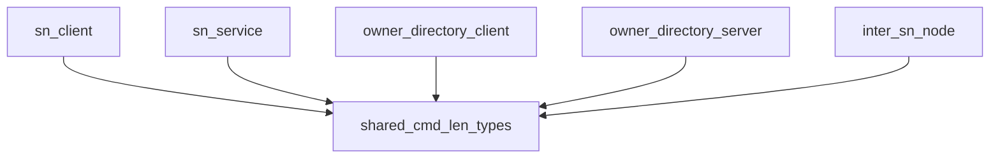

# Pipeline Plan

## Trigger
- Proposal: docs/versions/v0.1/modules/p2p-frame/011-sfo-cmd-pkg-len-compatibility/proposal.md
- User launch confirmed: yes
- User launch statement: 批准该 proposal，并启动 auto-pipeline 自动完成后续 design、implementation、testing 和 acceptance。
- Per-stage user confirmation: skipped by explicit user auto-pipeline authorization
- Auto-confirm completed document stages: no design/testing Markdown documents generated; repository-local document extensions only
- Auto-pipeline document policy: no design/testing markdown docs; testplan.yaml required
- Version: v0.1
- Packet module: p2p-frame
- Task name: 011-sfo-cmd-pkg-len-compatibility
- Target module(s): p2p-frame
- change_id values: sfo_cmd_pkg_len_v04_compatibility

## Acceptance Baseline
- Final acceptance is judged against:
  - `proposal.md`

## Stage Graph
| Task ID | Stage | Responsibility | Scope | Parent Task | Depends On | Output | Done Condition |
|---------|-------|----------------|-------|-------------|------------|--------|----------------|
| D-1 | design | map the 0.4 fixed-width type boundary, consumers, compatibility, failure behavior, and exact file scope | task-local pipeline design mappings | root | none | validated pipeline plan and scope bindings | pipeline-plan-check and design stage-scope check pass without design/testing Markdown documents |
| I-1 | implementation | coordinate and verify the admitted command-length compatibility migration | six admitted SN production files | root | D-1 | minimal production implementation and implementation evidence | all file children complete, focused compile succeeds, and implementation scope check passes |
| T-1 | testing | derive post-implementation framing, limit, migration, and compile-closure coverage | dedicated task test, task-local testplan, and task-run evidence | root | I-1, I-TYPES, I-SN-CLIENT, I-SN-SERVICE, I-DIRECTORY-CLIENT, I-DIRECTORY-SERVER, I-INTER-SN | test code, testplan.yaml, task-run evidence, and state testing evidence | coverage checker and task-scoped all entry pass with machine evidence |
| A-1 | acceptance | audit proposal-plan-code-tests-evidence consistency and command-framing correctness | bound task packet and delivered paths | root | T-1 | acceptance-report.md | acceptance report check passes with accepted conclusion |

## Submodule Tasks
| Task ID | Stage | Responsibility | Submodule | Parent Task | Depends On | Output | Done Condition |
|---------|-------|----------------|-----------|-------------|------------|--------|----------------|
| I-TYPES | implementation | centralize the fixed-width aliases and the ordinary SN header type | shared SN command types | I-1 | D-1 | `p2p-frame/src/sn/types.rs` | aliases express `U16` and 10 MiB `U24` once and `SnCmdHeader` uses the ordinary alias |
| I-SN-CLIENT | implementation | consume the ordinary SN length alias in the classified client | SN command client | I-1 | I-TYPES | `p2p-frame/src/sn/client/sn_service.rs` | client generic uses `SnCmdPkgLen` without a direct wrapper or primitive |
| I-SN-SERVICE | implementation | consume the ordinary SN length alias in the command service | SN command service | I-1 | I-TYPES | `p2p-frame/src/sn/service/service.rs` | server generic and existing handler header resolve to the same alias |
| I-DIRECTORY-CLIENT | implementation | consume the owner length alias in the serving-directory client | owner-serving directory client | I-1 | I-TYPES | `p2p-frame/src/sn/directory/client.rs` | owner client generic uses only `OwnerCmdPkgLen` |
| I-DIRECTORY-SERVER | implementation | consume the owner length alias in the serving-directory server and handlers | owner-serving directory server | I-1 | I-TYPES | `p2p-frame/src/sn/directory/server.rs` | server generic and both handler signatures use the same owner alias |
| I-INTER-SN | implementation | consume the owner length alias in the inter-SN node and handlers | inter-SN command node | I-1 | I-TYPES | `p2p-frame/src/sn/inter_sn/mod.rs` | node generic and both handler signatures use the same owner alias with no bare `U24` |

## Parallel Scheduling
- Strategy: dependency-ready-set
- Concurrency: use all runtime-available child-agent slots
- Shared artifact owner: parent-orchestrator
- Lock directory: `.harness/locks/`
- Dispatch rule: launch the maximum dependency-ready set with disjoint exclusive write scopes before waiting; immediately backfill free slots
- Serialization reasons: explicit dependency, overlapping write scope, or exhausted concurrency capacity only
- Concrete scheduling: `I-TYPES` runs first because every consumer depends on the aliases; the five disjoint consumer files then run in dependency-ready waves limited only by the available three child-agent slots
- Evidence: record launched task ids and serialization reasons in sibling `pipeline/state.json` scheduler waves

## Dependency Graphs

| Level | Parent | Node | Depends On |
|-------|--------|------|------------|
| file-module | p2p-frame SN command framing | shared_cmd_len_types | none |
| file-module | p2p-frame SN command framing | sn_client | shared_cmd_len_types |
| file-module | p2p-frame SN command framing | sn_service | shared_cmd_len_types |
| file-module | p2p-frame SN command framing | owner_directory_client | shared_cmd_len_types |
| file-module | p2p-frame SN command framing | owner_directory_server | shared_cmd_len_types |
| file-module | p2p-frame SN command framing | inter_sn_node | shared_cmd_len_types |

## Exported Interfaces
| Interface | Owner | Consumer | Compatibility | Affected Callers | Migration Path |
|-----------|-------|----------|---------------|------------------|----------------|
| `SnCmdPkgLen = sfo_cmd_server::U16` | `p2p-frame/src/sn/types.rs` | SN classified client and SN command service | new | `p2p-frame/src/sn/client/sn_service.rs`, `p2p-frame/src/sn/service/service.rs` | replace primitive/direct-wrapper generics with the shared alias while preserving two-byte encoding |
| `OwnerCmdPkgLen` fixed to the 10 MiB `U24` instantiation | `p2p-frame/src/sn/types.rs` | owner-serving client/server and inter-SN command node | migration-required | `p2p-frame/src/sn/directory/client.rs`, `p2p-frame/src/sn/directory/server.rs`, `p2p-frame/src/sn/inter_sn/mod.rs` | migrate each endpoint and handler together to the same alias; deploy former-`u32` peers as one 0.4-compatible set |
| existing `SnCmdHeader` alias parameterized by `SnCmdPkgLen` | `p2p-frame/src/sn/types.rs` | SN client and service handler signatures | migration-required | `p2p-frame/src/sn/client/sn_service.rs`, `p2p-frame/src/sn/service/service.rs` | keep the public alias path and two-byte framing; callers that named the primitive header generic migrate to `SnCmdHeader` or `SnCmdPkgLen` |

## API and Build Surface Impact
- Public API impact: migration-required
- Crate-root export change: no
- Build-surface change: yes
- Documentation examples affected: no
- API/build note: the public `SnCmdHeader` concrete generic and new aliases expose 0.4 wrapper types; the workspace already selects `sfo-cmd-server` 0.4.0 in `p2p-frame/Cargo.toml` and `Cargo.lock`, which are inspected inputs but not implementation write paths for this task.

## Consumer Migration Closure
| Old Symbol | New Path | change_id | Consumer Path | Consumer Kind | Migration Status |
|------------|----------|-----------|---------------|---------------|------------------|
| primitive-`u16` command header and length generic | `crate::sn::types::{SnCmdHeader, SnCmdPkgLen}` | sfo_cmd_pkg_len_v04_compatibility | `p2p-frame/src/sn/client/sn_service.rs` | internal client and public alias consumer | migrated |
| primitive `u16` server length | `crate::sn::types::SnCmdPkgLen` | sfo_cmd_pkg_len_v04_compatibility | `p2p-frame/src/sn/service/service.rs` | internal server consumer | migrated |
| repeated owner-client 10 MiB `U24` instantiation | `crate::sn::types::OwnerCmdPkgLen` | sfo_cmd_pkg_len_v04_compatibility | `p2p-frame/src/sn/directory/client.rs` | internal owner client consumer | migrated |
| primitive `u32` owner server/header length | `crate::sn::types::OwnerCmdPkgLen` | sfo_cmd_pkg_len_v04_compatibility | `p2p-frame/src/sn/directory/server.rs` | internal owner server and handler consumer | migrated |
| repeated/bare inter-SN `U24` length | `crate::sn::types::OwnerCmdPkgLen` | sfo_cmd_pkg_len_v04_compatibility | `p2p-frame/src/sn/inter_sn/mod.rs` | internal node and handler consumer | migrated |
| `sfo-cmd-server` 0.3 primitive `CmdPkgLen` API | `sfo-cmd-server` 0.4 fixed-width wrappers consumed through local aliases | sfo_cmd_pkg_len_v04_compatibility | `p2p-frame/Cargo.toml` | dependency consumer | migrated |

## State Ownership
| State | Owner | Access Interface | Lifecycle | Failure Transitions |
|-------|-------|------------------|-----------|---------------------|
| compile-time ordinary SN package-length selection | `p2p-frame/src/sn/types.rs` | `SnCmdPkgLen` and `SnCmdHeader` aliases | fixed at compile time as `U16`; no runtime state, lock, cache, or persistence is added | a mismatched client/server/header concrete type fails compilation; runtime error or fallback state is not introduced |
| compile-time owner/inter-SN package-length selection and 10 MiB cap | `p2p-frame/src/sn/types.rs` | `OwnerCmdPkgLen` alias | fixed at compile time as one 10 MiB `U24` identity shared by all producers, consumers, and handlers | oversized lengths are rejected by the dependency boundary; differing const instances fail generic handler compatibility instead of entering business dispatch |

## Failure Flows
| Flow | Boundary | Failure | Handling |
|------|----------|---------|----------|
| ordinary SN command encode/decode | SN client -> SN service | body length exceeds `U16` representable limit or dependency decode fails | preserve existing `CmdError` propagation and two-byte framing; do not widen, retry, or fall back |
| owner-serving command encode/decode | owner directory client -> owner directory server | body length exceeds 10 MiB or a malformed three-byte length is received | dependency validates `OwnerCmdPkgLen::MAX_PKG_LEN` and returns its existing command error before business dispatch |
| inter-SN command encode/decode | inter-SN peer -> registered node handler | length exceeds 10 MiB or node/header concrete types differ | dependency rejects the oversized frame; concrete type drift is prevented at compile-time registration |
| mixed dependency versions | 0.3.x former-`u32` peer -> 0.4 `U24` peer | four-byte and three-byte length framing disagree | no runtime negotiation is added; coordinate deployment or roll back all former-`u32` endpoints together with the dependency |
| build migration | p2p-frame -> sfo-cmd-server 0.4 API | any active primitive `CmdPkgLen` consumer remains | focused crate compilation fails closed and identifies the unmigrated consumer; implementation must not add a local trait shim |

## Rejected Alternatives
| Decision Type | Selected | Rejected | Reason |
|---------------|----------|----------|--------|
| boundary | central aliases in `p2p-frame/src/sn/types.rs` consumed by all SN command families | duplicate fixed-width types in each client/server/node file or modify neighboring crates | SN types already own shared command header/tunnel types, and one alias prevents const-generic drift without widening crate boundaries |
| technical | `SnCmdPkgLen = U16` plus `OwnerCmdPkgLen` as the 10 MiB `U24` instantiation | bare default `U24`, all channels on `U24`, primitive trait shims, dependency downgrade, or runtime version negotiation | alternatives respectively impose the wrong 1 MiB cap, widen unrelated framing, conflict with the 0.4 API/orphan boundary, undo the requested upgrade, or expand the protocol beyond this fix |
| collaboration | one alias child followed by dependency-ready per-file consumer children | parallel edits before the shared alias is fixed or one broad child rewriting all SN code | explicit dependency preserves one type identity; disjoint consumer files can then be reviewed and scheduled independently without overlapping writes |

## Implementation Scope Bindings
| change_id | target_module | proposal_id | design_coverage | scope_paths | design_rules_applied |
|-----------|---------------|-------------|-----------------|-------------|----------------------|
| sfo_cmd_pkg_len_v04_compatibility | p2p-frame | P-CMD-PKG-LEN-1 | define `SnCmdPkgLen = U16` and `OwnerCmdPkgLen` as the 10 MiB `U24` instantiation once in shared SN types; preserve `SnCmdHeader` path and ordinary two-byte framing; migrate the classified client, command service, owner-serving client/server, inter-SN node, and every registered handler header to the corresponding exact alias; preserve bodies, codes, tunnels, timeout/dispatch behavior, and dependency error propagation; record former-`u32` mixed-version incompatibility | `p2p-frame/src/sn/types.rs`, `p2p-frame/src/sn/client/sn_service.rs`, `p2p-frame/src/sn/service/service.rs`, `p2p-frame/src/sn/directory/client.rs`, `p2p-frame/src/sn/directory/server.rs`, `p2p-frame/src/sn/inter_sn/mod.rs` | top-down module/file decomposition, acyclic alias dependency, concrete producer/consumer closure, compile-time state ownership, wire/build compatibility, boundary failure handling, rejected protocol/dependency alternatives |

## File-Level Implementation Sequence
| Sequence | Task ID | File-Level Module | Action | Depends On | change_id | target_module | Scope Paths | Context Sources |
|----------|---------|-------------------|--------|------------|-----------|---------------|-------------|-----------------|
| 1 | I-TYPES | `p2p-frame/src/sn/types.rs` | define both shared length aliases and parameterize `SnCmdHeader` with the ordinary alias | none | sfo_cmd_pkg_len_v04_compatibility | p2p-frame | `p2p-frame/src/sn/types.rs` | proposal item P-CMD-PKG-LEN-1, exported alias contracts, compile-time state ownership, sfo-cmd-server 0.4 public types |
| 2 | I-SN-CLIENT | `p2p-frame/src/sn/client/sn_service.rs` | replace the direct wrapper in `SnCmdClient` with the ordinary shared alias | I-TYPES | sfo_cmd_pkg_len_v04_compatibility | p2p-frame | `p2p-frame/src/sn/client/sn_service.rs` | ordinary SN client/service closure and preserved two-byte compatibility |
| 3 | I-SN-SERVICE | `p2p-frame/src/sn/service/service.rs` | replace primitive `u16` in `SnCmdService` with the ordinary shared alias | I-TYPES | sfo_cmd_pkg_len_v04_compatibility | p2p-frame | `p2p-frame/src/sn/service/service.rs` | ordinary SN client/service closure, handler `SnCmdHeader`, existing error behavior |
| 4 | I-DIRECTORY-CLIENT | `p2p-frame/src/sn/directory/client.rs` | replace repeated 10 MiB `U24` with the owner shared alias | I-TYPES | sfo_cmd_pkg_len_v04_compatibility | p2p-frame | `p2p-frame/src/sn/directory/client.rs` | owner-serving producer/consumer closure and 10 MiB cap |
| 5 | I-DIRECTORY-SERVER | `p2p-frame/src/sn/directory/server.rs` | replace primitive `u32` in the server and both handler headers with the owner shared alias | I-TYPES | sfo_cmd_pkg_len_v04_compatibility | p2p-frame | `p2p-frame/src/sn/directory/server.rs` | owner-serving producer/consumer closure, mixed-version boundary, dependency errors |
| 6 | I-INTER-SN | `p2p-frame/src/sn/inter_sn/mod.rs` | replace repeated and bare `U24` uses in the node and both handler headers with the owner shared alias | I-TYPES | sfo_cmd_pkg_len_v04_compatibility | p2p-frame | `p2p-frame/src/sn/inter_sn/mod.rs` | inter-SN node/handler closure, exact const identity, 10 MiB cap |

## Return Rules
- If acceptance finds proposal ambiguity:
  - stop the pipeline and ask the user to decide; do not infer the requirement or create an automatic proposal return task
- If acceptance finds design mismatch:
  - return to design when fixed-width alias ownership, producer/consumer closure, wire compatibility, capacity boundary, or failure behavior is absent or wrong
- If acceptance finds implementation defect:
  - return to implementation when adequate design exists but delivered code is defective
- If acceptance finds testing implementation gap:
  - return to testing task
- For non-requirement findings:
  - repeat design -> implementation -> testing, then rerun acceptance
- If the same unresolved issue remains after more than 5 unsuccessful iterations:
  - stop and report the issue to the user

Execution status, testing evidence, return records, and final acceptance are stored in sibling `state.json`. They are deliberately excluded from this admission-bound plan.
