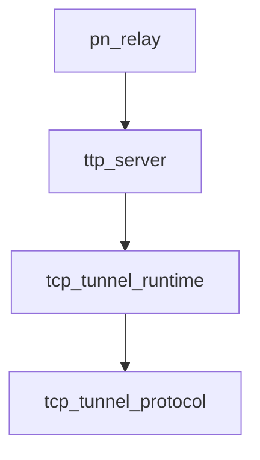

# Pipeline Plan

## Trigger
- Proposal: docs/versions/v0.1/modules/p2p-frame/012-tcp-reverse-data-first-claim/proposal.md
- User launch confirmed: yes
- User launch statement: “确认，自动完成”
- Per-stage user confirmation: skipped by explicit user auto-pipeline authorization
- Auto-confirm completed document stages: no design/testing Markdown documents generated; repository-local document extensions only
- Auto-pipeline document policy: no design/testing markdown docs; testplan.yaml required
- Version: v0.1
- Packet module: p2p-frame
- Task name: 012-tcp-reverse-data-first-claim
- Target module(s): p2p-frame
- change_id values: tcp_reverse_data_first_claim_handoff

## Acceptance Baseline
- Final acceptance is judged against:
  - `proposal.md`

## Stage Graph
| Task ID | Stage | Responsibility | Scope | Parent Task | Depends On | Output | Done Condition |
|---------|-------|----------------|-------|-------------|------------|--------|----------------|
| D-1 | design | map reverse registration ordering, first-claim ownership, cancellation ownership, compatibility, failures, exact production scope, and authoritative documentation impact | task-local pipeline design mappings plus the p2p-frame module boundary | root | none | validated pipeline plan, synchronized module boundary, and scope binding | pipeline-plan-check and design scope check pass without design/testing Markdown documents |
| I-1 | implementation | deliver the authoritative TCP protocol update, internal response, and cancellation-safe tunnel state-machine repair | admitted TCP protocol design, wire protocol, and tunnel runtime files | root | D-1 | minimal implementation plus admission/scope evidence | all three file children complete and implementation scope check passes |
| T-1 | testing | derive cases after implementation and generate runnable state, compatibility, and composed PN reverse-fallback coverage | dedicated TCP/PN tests, testplan, task state, and unified task entry | root | I-1 | tests, testplan.yaml, run artifact, and state coverage | deterministic transition, mixed-version, and A-to-PN-to-B evidence plus testing coverage/scope checks and task-scoped all entry pass |
| A-1 | acceptance | independently audit proposal-plan-code-tests-evidence consistency and runtime correctness | bound task packet and delivered task paths | root | T-1 | acceptance-report.md | acceptance report check passes with accepted conclusion |

## Submodule Tasks
| Task ID | Stage | Responsibility | Submodule | Parent Task | Depends On | Output | Done Condition |
|---------|-------|----------------|-----------|-------------|------------|--------|----------------|
| I-TCP-DOC-1 | implementation | synchronize the authoritative TCP tunnel protocol with the approved response correlation, requester first claim, late rejection, cancellation, and rolling-upgrade behavior | TCP tunnel reference design | I-1 | D-1 | current protocol reference | reference design and module boundary agree with the wire/runtime contract and no longer authorize the old late-pool behavior |
| I-TCP-PROTO-1 | implementation | add the reverse data registration response and bounded wire result contract | TCP tunnel wire protocol | I-1 | I-TCP-DOC-1 | protocol.rs response types and control-command codec wiring | new response round-trips on the control codec and unknown/malformed messages still fail closed |
| I-TCP-TUNNEL-1 | implementation | correlate reverse arrivals, establish registration happens-before, transfer first-claim authority, make request cleanup cancellation-safe, expose deterministic production state transitions, and preserve terminal errors | TCP tunnel runtime state | I-1 | I-TCP-PROTO-1 | tunnel.rs state-machine repair | reverse requester becomes claimable only after creator registration response; cancel/failure/late paths atomically retire; state transitions are deterministically testable |

## Parallel Scheduling
- Strategy: dependency-ready-set
- Concurrency: use all runtime-available child-agent slots
- Shared artifact owner: parent-orchestrator
- Lock directory: `.harness/locks/`
- Dispatch rule: launch the maximum dependency-ready set with disjoint exclusive write scopes before waiting; immediately backfill free slots
- Serialization policy: explicit dependency, overlapping write scope, or exhausted concurrency capacity only
- Serialization reasons: the authoritative protocol update precedes the wire type; `I-TCP-TUNNEL-1` depends on the response contract from `I-TCP-PROTO-1`; testing depends on the complete production state machine; acceptance depends on runnable testing evidence
- Evidence: sibling `pipeline/state.json` records each launched task and its dependency-based serialization reason

## Dependency Graphs

| Level | Parent | Node | Depends On |
|-------|--------|------|------------|
| module | p2p-frame | pn_relay | ttp_server |
| module | p2p-frame | ttp_server | tcp_tunnel_runtime |
| module | p2p-frame | tcp_tunnel_runtime | tcp_tunnel_protocol |
| module | p2p-frame | tcp_tunnel_protocol | none |

## Exported Interfaces
| Interface | Owner | Consumer | Compatibility | Affected Callers | Migration Path |
|-----------|-------|----------|---------------|------------------|----------------|
| internal `OpenDataConnReq` / `OpenDataConnResp` control exchange carrying `request_id`, `conn_id`, and bounded result | `p2p-frame/src/networks/tcp/protocol.rs` | `p2p-frame/src/networks/tcp/tunnel.rs` reverse connection requester and creator | migration-required | TCP peers using reverse data fallback | deploy the updated TCP tunnel implementation on both peers; an old requester closes on the unknown response command, while a new requester times out and retires when an old creator never responds, so neither path exposes handshake bytes as business data |
| existing public `Tunnel::open_stream` and `Tunnel::open_datagram` behavior over TCP | TCP tunnel runtime | `p2p-frame/src/ttp/server.rs` and `p2p-frame/src/pn/service/pn_server.rs` | backward-compatible | TTP and PN callers opening channels on an existing incoming TCP tunnel | no source migration; reverse fallback changes from deterministic failure to the existing success/result contract |
| existing `TcpConnectionHello.open_request_id` request correlation field | TCP tunnel wire protocol | TCP listener and `TcpTunnel::on_incoming_data_connection` | backward-compatible | current TCP data connection handshake | retain the field and use it to associate exactly one incoming reverse connection with its pending request before accepting the new response |

## API and Build Surface Impact
- Public API impact: none
- Crate-root export change: no
- Build-surface change: no
- Documentation examples affected: no
- Authoritative protocol documentation affected: yes; `p2p-frame/docs/tcp_tunnel_protocol_design.md` and `docs/modules/p2p-frame.md` must describe the coordinated internal wire migration and its fail-closed boundary

## Consumer Migration Closure
| Old Symbol | New Path | change_id | Consumer Path | Consumer Kind | Migration Status |
|------------|----------|-----------|---------------|---------------|------------------|
| `OpenDataConnReq` without a completion response | `OpenDataConnReq` followed by `OpenDataConnResp` after creator registration | tcp_reverse_data_first_claim_handoff | p2p-frame/src/networks/tcp/tunnel.rs | internal TCP wire consumer | migrated |

## State Ownership
| State | Owner | Access Interface | Lifecycle | Failure Transitions |
|-------|-------|------------------|-----------|---------------------|
| pending reverse-open request and optional associated `conn_id` | `TcpTunnelState.pending_open_requests`, with a caller-future cancellation guard as the request owner | request insertion, incoming-hello association, response completion, timeout/close removal, owner drop | absent -> waiting without connection -> waiting with locally registered reverse connection -> completed and removed | send failure, response failure, timeout, tunnel close, or owner drop atomically removes the waiter and retires any associated entry; duplicate or unknown response cannot change another request |
| reverse-open correlation transition | request-scoped correlation state used by `pending_open_requests` | arrival and response transition methods returning explicit ready/wait/complete/protocol-error outcomes | no arrival/no response -> either side may arrive first -> matching pair completes once; terminal removal is irreversible | duplicate identical response is idempotent before completion; duplicate arrival, conflicting response, mismatched `conn_id`, or transition after retirement is rejected without leaking the staged entry |
| first-claim authority for lease 1 | `DataConnEntry` | entry construction plus claim/request validation | direct connection: physical creator owns first claim; request-associated reverse connection: requester owns first claim; after successful lease/drain the entry becomes symmetric `Idle` | unauthorized first claim is `ProtocolError`; failed authorized claim returns to `FirstClaimPending`; timeout or inconsistent ownership retires the entry |
| reverse creator registration completion | creating `TcpTunnel` | `create_data_connection(Some(request_id))` followed by `OpenDataConnResp` on the control connection | TCP/TLS connected -> hello sent -> `DataConnReady` consumed -> entry registered with remote first-claim authority -> success response sent -> peer claim awaited | connect/ready/registration failure sends a bounded failure response when control remains available and closes the physical connection; response-send failure retires the entry and normal tunnel I/O failure propagation applies |

## Failure Flows
| Flow | Boundary | Failure | Handling |
|------|----------|---------|----------|
| local channel open fallback | `open_channel` -> direct data dial -> `request_remote_data_connection` | direct dial fails | retain the direct failure as context, request one reverse connection, and return the reverse setup error if handoff cannot complete; do not classify local setup failure as peer claim conflict |
| reverse connection creation | control `OpenDataConnReq` -> peer data connector | TCP/TLS/hello/ready fails | peer sends `OpenDataConnResp` failure when possible; requester removes pending state and returns a setup/connect/protocol error; no entry becomes claimable |
| incoming reverse association | data hello `open_request_id` -> pending request | request is unknown, timed out, duplicated, or already associated with another `conn_id` | reply with failed `DataConnReady`, close/retire the arriving connection, and leave unrelated pending requests/entries unchanged |
| registration barrier | receiver `DataConnReady` -> creator registration -> control response | response arrives before a matching local entry, has a mismatched `conn_id`, or carries malformed result | fail the matching request with protocol error, retire any associated entry, and never start claim |
| first claim | requester `claim_entry` -> creator `process_claim_req` | wrong side claims lease 1 or entry state changed concurrently | preserve `ProtocolError`/`ErrorState` distinction; retry only a newly selected recoverable entry, and return the last real retryable error instead of unconditional `Conflict` |
| request timeout or tunnel close | pending request/associated entry -> lifecycle cleanup | response is absent, late, or control tunnel closes | atomically remove the waiter, retire the associated unbound data entry, drop its stream, and make later response/arrival harmless |
| caller cancellation | owner future/drop guard -> pending request/associated entry | `open_stream` or reverse-open future is dropped before internal completion | owner drop uses the same atomic removal/retirement operation as timeout; later response/arrival is rejected and repeated cancellation cannot accumulate request-owned entries |
| mixed-version pairing | new/old TCP control peers | old requester does not recognize `OpenDataConnResp`, or old creator never sends it | old requester fails the control command explicitly; new requester times out and retires without sending business bytes or first claim; coordinated deployment is required for reverse fallback |

## Verification Topology
- State-machine unit coverage drives the same request correlation transition used by production and deterministically covers response-before-arrival, arrival-before-response, duplicate-identical response, duplicate arrival, mismatched `conn_id`, failure result, timeout/cancel retirement, close retirement, late input, wrong first-claim side, and a genuine simultaneous-claim decision.
- Mixed-version coverage uses bounded protocol peers in both directions: old requester/new creator rejects command 12 before business bytes, and new requester/old creator reaches the request timeout and retires all request-owned state.
- The composed DV/integration topology is a single signed x509 A-to-PN-to-B flow: A opens the PN proxy service; PN selects B's accepted TCP tunnel; the test closes B's directly dialable data listener while keeping PN's reverse listener alive; PN's direct data dial fails, B creates the request-correlated reverse data connection, and the proxied stream transfers bytes both ways.
- Test-only observability may expose counters/snapshots of the production correlation state within crate visibility, but must not add a public API or a second state implementation.

## Rejected Alternatives
| Decision Type | Selected | Rejected | Reason |
|---------------|----------|----------|--------|
| boundary | repair the shared TCP tunnel reverse-registration protocol and state owner | add a PN-specific retry or bypass in `pn_server.rs`/TTP | every TCP consumer can hit the impossible first-claim path, and PN cannot safely infer transport registration state |
| technical | send a control-plane completion response only after the physical creator consumes `DataConnReady` and registers the entry, then transfer first-claim authority to the requester | fixed sleep, larger retry count, unconditional remote-created first claim, or a second ready frame on the business data connection | timing workarounds do not establish ordering; unconditional relaxation violates first-claim ownership; a data-side extra frame can be consumed as business bytes by an old peer |
| technical | reject unmatched late reverse arrivals and retire any request-associated entry on timeout | retain late reverse arrivals in the ordinary first-claim pool | the physical creator has no channel intent and the requester no longer owns a live request, so the entry has no safe first claimant |
| collaboration | two serial production file tasks followed by one post-implementation testing task | parallel protocol/runtime edits or implementation-stage tests | tunnel.rs depends on the finalized wire type, and Harness assigns test design/implementation to the later testing stage |

## Implementation Scope Bindings
| change_id | target_module | proposal_id | design_coverage | scope_paths | design_rules_applied |
|-----------|---------------|-------------|-----------------|-------------|----------------------|
| tcp_reverse_data_first_claim_handoff | p2p-frame | P-TRDFCH-1 | synchronize the authoritative TCP protocol; add a control-plane reverse-registration completion response; correlate it with one pending request and incoming `conn_id`; assign lease-1 authority to the reverse requester only after creator registration; use drop-safe ownership to retire cancel/late/failure/timeout state; preserve actual setup and claim error classes; require coordinated deployment without business-byte ambiguity | `p2p-frame/docs/tcp_tunnel_protocol_design.md`, `p2p-frame/src/networks/tcp/protocol.rs`, `p2p-frame/src/networks/tcp/tunnel.rs` | top-down module dependency, authoritative protocol closure, internal wire compatibility, concrete consumers, single-owner pending/entry state, ordering and cleanup failures, deterministic state seam, composed PN topology, rejected unsafe alternatives, serial file ownership |

## File-Level Implementation Sequence
| Sequence | Task ID | File-Level Module | Action | Depends On | change_id | target_module | Scope Paths | Context Sources |
|----------|---------|-------------------|--------|------------|-----------|---------------|-------------|-----------------|
| 1 | I-TCP-DOC-1 | `p2p-frame/docs/tcp_tunnel_protocol_design.md` | replace the obsolete no-response/creator-first-claim/late-pool rules with the approved response barrier, requester claim, late rejection, cancellation cleanup, and mixed-version contract | none | tcp_reverse_data_first_claim_handoff | p2p-frame | `p2p-frame/docs/tcp_tunnel_protocol_design.md` | proposal P-TRDFCH-1, p2p-frame module boundary, acceptance F-TRDFCH-004 |
| 2 | I-TCP-PROTO-1 | `p2p-frame/src/networks/tcp/protocol.rs` | add the bounded reverse registration response/result command and wire encode/decode dispatch while preserving existing command IDs and handshake framing | I-TCP-DOC-1 | tcp_reverse_data_first_claim_handoff | p2p-frame | `p2p-frame/src/networks/tcp/protocol.rs` | proposal P-TRDFCH-1, exported internal wire interface, compatibility and mixed-version failure flow |
| 3 | I-TCP-TUNNEL-1 | `p2p-frame/src/networks/tcp/tunnel.rs` | implement pending request-to-connection correlation, creator registration response, request-side first-claim ownership, cancellation guard, deterministic transition seam, late/timeout cleanup, and terminal error fidelity | I-TCP-PROTO-1 | tcp_reverse_data_first_claim_handoff | p2p-frame | `p2p-frame/src/networks/tcp/tunnel.rs` | proposal P-TRDFCH-1, state ownership, registration/claim/cancellation failure flows, protocol response interface, acceptance F-TRDFCH-003 |

## Return Rules
- If acceptance finds proposal ambiguity:
  - stop the pipeline and ask the user to decide; do not infer the requirement or create an automatic proposal return task
- If acceptance finds design mismatch:
  - return to design when registration ordering, first-claim ownership, compatibility, state cleanup, error strategy, or file scope is absent or wrong
- If acceptance finds implementation defect:
  - return to implementation when this design is adequate but protocol/runtime code violates it
- If acceptance finds testing implementation gap:
  - return to testing for missing reverse-fallback, ordering, negative, compatibility, lifecycle, or PN/TTP evidence
- For non-requirement findings:
  - repeat design -> implementation -> testing, then rerun acceptance
- If the same unresolved issue remains after more than 5 unsuccessful iterations:
  - stop and report the issue to the user

Execution status, testing evidence, return records, and final acceptance are stored in sibling `state.json`. They are deliberately excluded from this admission-bound plan.
