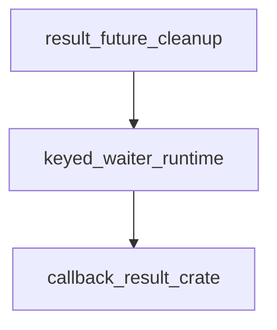

# Pipeline Plan

## Trigger
- Proposal: docs/versions/v0.1/modules/p2p-frame/013-callback-result-replacement-waiter-cleanup/proposal.md
- User launch confirmed: yes
- User launch statement: 确认，启动自动流水线
- Per-stage user confirmation: skipped by explicit user auto-pipeline authorization
- Auto-confirm completed document stages: no design/testing Markdown documents generated; repository-local document extensions only
- Auto-pipeline document policy: no design/testing markdown docs; testplan.yaml required
- Version: v0.1
- Packet module: p2p-frame
- Task name: 013-callback-result-replacement-waiter-cleanup
- Target module(s): p2p-frame
- change_id values: callback_result_replacement_waiter_cleanup

## Acceptance Baseline
- Final acceptance is judged against:
  - `proposal.md`

## Stage Graph
| Task ID | Stage | Responsibility | Scope | Parent Task | Depends On | Output | Done Condition |
|---------|-------|----------------|-------|-------------|------------|--------|----------------|
| D-1 | design | map keyed waiter registration identity, conditional cleanup, compatibility, failures, implementation scope and order | task-local pipeline design mappings | root | none | validated pipeline plan and design scope evidence | pipeline-plan-check and design scope check pass without design/testing Markdown documents |
| I-1 | implementation | deliver the smallest dependency-internal ownership repair | admitted callback-result production path | root | D-1 | production code plus admission and implementation scope evidence | implementation child completes and implementation scope check passes |
| T-1 | testing | derive post-implementation cases and produce runnable regression evidence | task-owned callback-result tests, testplan, runner registration and task state | root | I-1 | test code, testplan.yaml, run artifact and testing scope evidence | testing coverage/scope checks and task-scoped all entry pass |
| A-1 | acceptance | independently audit proposal-plan-code-tests-evidence consistency and correctness | bound task packet and delivered task paths | root | T-1 | acceptance-report.md | acceptance report check passes with accepted conclusion |

## Submodule Tasks
| Task ID | Stage | Responsibility | Submodule | Parent Task | Depends On | Output | Done Condition |
|---------|-------|----------------|-----------|-------------|------------|--------|----------------|
| I-CB-1 | implementation | make keyed waiter cleanup conditional on the exact registration identity while preserving the public API | callback-result keyed waiter runtime | I-1 | D-1 | `third-party/callback-result/src/lib.rs` | old cleanup cannot remove a replacement registration and existing completion/error behavior remains source-compatible |

## Parallel Scheduling
- Strategy: dependency-ready-set
- Concurrency: use all runtime-available child-agent slots
- Shared artifact owner: parent-orchestrator
- Lock directory: `.harness/locks/`
- Dispatch rule: launch the maximum dependency-ready set with disjoint exclusive write scopes before waiting; immediately backfill free slots
- Serialization reasons: explicit dependency, overlapping write scope, or exhausted concurrency capacity only; D-1, I-CB-1, T-1 and A-1 form one strict dependency chain, so no two child tasks are simultaneously ready
- Evidence: sibling `pipeline/state.json` records each launched task and its dependency reason

## Dependency Graphs

| Level | Parent | Node | Depends On |
|-------|--------|------|------------|
| submodule | p2p-frame | callback_result_crate | none |
| submodule | p2p-frame | keyed_waiter_runtime | callback_result_crate |
| submodule | p2p-frame | result_future_cleanup | keyed_waiter_runtime |

## Exported Interfaces
| Interface | Owner | Consumer | Compatibility | Affected Callers | Migration Path |
|-----------|-------|----------|---------------|------------------|----------------|
| `CallbackWaiter::{create_result_future, create_timeout_result_future, set_result, set_result_with_cache}` | callback-result keyed waiter runtime | `sfo-cmd-server` QA runtime consumed by `p2p-frame` | backward-compatible | workspace consumers resolved through the existing root crates.io patch | none; public signatures, result types and normal semantics remain unchanged |
| `ResultFuture` Future implementation | callback-result result future cleanup | callback-result callers including command QA | backward-compatible | no caller code changes | none; internal ownership repair only |

## API and Build Surface Impact
- Public API impact: none
- Crate-root export change: no
- Build-surface change: no
- Documentation examples affected: no
- Compatibility note: no public type, method, trait, error variant or generic bound changes are planned; the existing root `[patch.crates-io]` continues to resolve `callback-result 0.2.4` to the same vendored path.

## Consumer Migration Closure
| Old Symbol | New Path | change_id | Consumer Path | Consumer Kind | Migration Status |
|------------|----------|-----------|---------------|---------------|------------------|
| not-applicable | not-applicable | callback_result_replacement_waiter_cleanup | not-applicable | not-applicable | verified-none |

## State Ownership
| State | Owner | Access Interface | Lifecycle | Failure Transitions |
|-------|-------|------------------|-----------|---------------------|
| keyed waiter registration `(callback_id, private registration identity, notifier state)` | `CallbackWaiterState.result_notifies` under its existing mutex | private register, conditional cleanup and result-delivery helpers | absent -> registered(identity, live notifier) -> delivered(identity, notifier consumed) -> conditionally removed; a replacement creates a distinct identity that the prior future cannot remove | cancellation, timeout or ready cleanup removes only when the current map identity matches; mismatch means a replacement owns the key and cleanup is a no-op |
| cleanup capability carried by one `ResultFuture` | the future instance that created the registration | private drop-cleanup closure bound to callback ID plus registration identity | armed after insertion -> disarmed only after that registration's ready cleanup -> consumed once by drop otherwise | drop before first poll, drop after delivery, timeout and normal completion converge on identity-checked removal without touching a replacement |

## Failure Flows
| Flow | Boundary | Failure | Handling |
|------|----------|---------|----------|
| old result delivered then same-ID replacement registered | `set_result` -> map slot -> new future creation | old future later completes or drops and attempts cleanup | compare the old registration identity under the waiter-state mutex; do not remove when the map contains the replacement identity |
| future canceled before first poll | caller -> `ResultFuture::drop` -> waiter state | notifier would otherwise leave a canceled tombstone | identity-checked cleanup removes the still-owned registration synchronously |
| timeout races result delivery or replacement | timeout future -> notifier -> waiter state | both terminal paths may attempt cleanup | cleanup is idempotent for its own identity and cannot remove a different identity; result remains exactly one of delivered value or `Timeout` under existing semantics |
| consumer rebuild | vendored callback-result -> sfo-cmd-server -> p2p-frame | internal representation changes | preserve package version and public API; compile the vendored crate and the task-relevant workspace consumer closure after implementation |

## Rejected Alternatives
| Decision Type | Selected | Rejected | Reason |
|---------------|----------|----------|--------|
| boundary | repair ownership inside vendored keyed `CallbackWaiter` | add an SN- or p2p-frame-side workaround | consumers do not own callback IDs or the dependency map, and duplicating QA waiter state would reintroduce correlation risk |
| technical | private per-registration identity plus mutex-atomic conditional removal | unconditional key removal, fixed delay, prohibiting same-ID replacement, or background tombstone scanning | key-only removal causes the defect; timing and scanning do not establish ownership; rejecting replacement changes the existing API behavior |
| collaboration | one serial implementation file task followed by post-implementation testing | parallel edits to production and tests | testing design must be derived from delivered code and the production change has only one file owner |

## Implementation Scope Bindings
| change_id | target_module | proposal_id | design_coverage | scope_paths | design_rules_applied |
|-----------|---------------|-------------|-----------------|-------------|----------------------|
| callback_result_replacement_waiter_cleanup | p2p-frame | P-CRRWC-1 | bind every keyed waiter registration to a private identity; perform ready/timeout/drop removal conditionally under the existing state mutex; preserve public APIs, cache behavior and consumer build surface | `third-party/callback-result/src/lib.rs` | module and responsibility decomposition, acyclic dependencies, concrete consumers, source compatibility, single-owner shared state, lifecycle/failure transitions, rejected alternatives and narrow file scope |

## File-Level Implementation Sequence
| Sequence | Task ID | File-Level Module | Action | Depends On | change_id | target_module | Scope Paths | Context Sources |
|----------|---------|-------------------|--------|------------|-----------|---------------|-------------|-----------------|
| 1 | I-CB-1 | `third-party/callback-result/src/lib.rs` | replace key-only cleanup with exact-registration conditional cleanup without public API changes | none | callback_result_replacement_waiter_cleanup | p2p-frame | `third-party/callback-result/src/lib.rs` | proposal P-CRRWC-1, State Ownership, Failure Flows and existing callback-result implementation |

## Return Rules
- If acceptance finds proposal ambiguity:
  - stop the pipeline and ask the user to decide; do not infer the requirement or create an automatic proposal return task
- If acceptance finds design mismatch:
  - return to D-1 when registration identity, cleanup atomicity, compatibility, failure handling or Scope Paths are absent or wrong
- If acceptance finds implementation defect:
  - return to I-1 and I-CB-1 when this design is adequate but code violates it
- If acceptance finds testing implementation gap:
  - return to T-1 for missing replacement, ready/drop/timeout, compatibility or consumer evidence
- For non-requirement findings:
  - repeat design -> implementation -> testing, then rerun acceptance
- If the same unresolved issue remains after more than 5 unsuccessful iterations:
  - stop and report the issue to the user

Execution status, testing evidence, return records, and final acceptance are stored in sibling `state.json`. They are deliberately excluded from this admission-bound plan.
