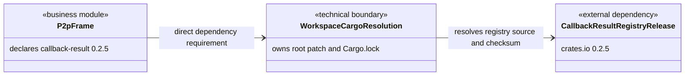

# Callback Result Published Release Migration Design

## Design Scope

### Goals

- Replace the workspace-local `callback-result 0.2.4` path override with the crates.io `callback-result 0.2.5` release.
- Keep the dependency migration atomic across the direct version requirement, workspace patch, lockfile source, and vendored directory.
- Preserve the keyed `CallbackWaiter` public API and the drop/replacement ownership behavior already consumed by p2p-frame and `sfo-cmd-server`.

### Non-goals

- No Rust production source changes, new abstractions, feature changes, or runtime protocol changes.
- No vendoring, Git dependency, compatibility shim, or change to historical task evidence.
- No unrelated dependency updates while refreshing `Cargo.lock`.

## Useful Context

- Root `Cargo.toml` currently overrides crates.io with `callback-result = { path = "third-party/callback-result" }`.
- `p2p-frame/Cargo.toml` currently declares `callback-result = "0.2.3"`, while `Cargo.lock` resolves the patched local package as 0.2.4 without registry source/checksum.
- crates.io 0.2.5 contains the local keyed `CallbackWaiter` registration identity and conditional cleanup logic. Its package also contains replacement regression coverage.
- 0.2.5 additionally applies the same ownership cleanup to `SingleCallbackWaiter`; repository source and `sfo-cmd-server 0.4.0` consumer inspection found no use of that type.

## Overall Approach

Treat the change as one dependency-resolution migration. Raise the direct p2p-frame requirement to 0.2.5, remove the workspace path patch, delete the now-unreferenced vendor tree, then let Cargo refresh only the `callback-result` lock entry to the registry release. Review the final dependency tree and lock entry so a successful build cannot accidentally be supplied by the old path or an older compatible release.

No compatibility adapter is introduced because the selected release preserves the keyed public API used by current consumers. Failure is fail-closed at build/resolve time: an unavailable registry or inconsistent manifest/lock state must produce a Cargo error rather than silently falling back to local source.

## Layered Design Document Index

| level | parent_document | unit | design_document | responsibility |
|-------|-----------------|------|-----------------|----------------|
| root | `design.md` | p2p-frame dependency-source migration | `design.md` | Owns the complete manifest, lockfile, and vendor-removal design; no child submodule is introduced because no Rust module structure changes |

## Module Relationship UML



The deleted `third-party/callback-result` is intentionally absent from the resulting acyclic dependency graph.

## File-Level Interfaces

- not-applicable: this task changes Cargo dependency metadata and removes copied dependency files; it does not create or modify a Rust source-level interface.

## API and Build Surface Impact

- Public API impact: none
- Crate-root export change: no
- Build-surface change: yes
- Documentation examples affected: no

## Consumer Migration Closure

| Old Symbol | New Path | change_id | Consumer Path | Consumer Kind | Migration Status |
|------------|----------|-----------|---------------|---------------|------------------|
| root `[patch.crates-io] callback-result` path override | crates.io resolver with no callback-result patch | callback_result_registry_release_migration | `Cargo.toml` | workspace dependency resolver | migrated |
| `callback-result = "0.2.3"` | `callback-result = "0.2.5"` | callback_result_registry_release_migration | `p2p-frame/Cargo.toml` | direct Rust package consumer | migrated |
| local `callback-result 0.2.4` lock entry | registry `callback-result 0.2.5` source/checksum entry | callback_result_registry_release_migration | `Cargo.lock` | reproducible dependency resolution | migrated |

## Key Flows

```mermaid
sequenceDiagram
  participant Manifest as p2p-frame/Cargo.toml
  participant Root as root Cargo.toml
  participant Cargo as Cargo resolver
  participant Registry as crates.io callback-result 0.2.5
  Manifest->>Cargo: require callback-result 0.2.5
  Root->>Cargo: no local callback-result patch
  Cargo->>Registry: resolve exact compatible release
  alt registry release and checksum available
    Registry-->>Cargo: callback-result 0.2.5 package
    Cargo-->>Root: lock registry source/checksum
  else resolution or checksum failure
    Cargo-->>Root: fail build; no path fallback
  end
```

There is no runtime retry or partial state transition. The only partial-completion risk is an inconsistent working tree during editing; the implementation sequence ends by regenerating and reviewing the lockfile after every manifest/path change is complete.

## State and Ownership

- not-applicable: no persistent application datum or shared runtime state changes; `Cargo.lock` is deterministic build metadata owned by the workspace resolver and is covered by the file sequence below.

## Directly Mapped Change Items

| change_id | target_module | proposal_id | Design Coverage | Scope Paths | Interface / Boundary Impact | Notes |
|-----------|---------------|-------------|-----------------|-------------|-----------------------------|-------|
| callback_result_registry_release_migration | p2p-frame | P-CRPRM-1 | Overall Approach, Module Relationship UML, API and Build Surface Impact, Consumer Migration Closure, Key Flows, Implementation Order, Risks and Rollback | `Cargo.toml`, `p2p-frame/Cargo.toml`, `Cargo.lock`, `third-party/callback-result/**` | Build dependency source and minimum version migrate from local 0.2.4 patch to crates.io 0.2.5; keyed Rust API remains compatible | Scope deliberately excludes all p2p-frame Rust source and unrelated lockfile upgrades |

## Implementation Order

| Phase | Goal | Depends On | Output |
|-------|------|------------|--------|
| 1 | Remove every manifest reference that permits or requires the local path and require release 0.2.5 | approved proposal/design and passing admission | Root patch removed; direct requirement is 0.2.5 |
| 2 | Remove the unreferenced local dependency source | phase 1 | `third-party/callback-result/**` absent |
| 3 | Resolve and review the published package without unrelated upgrades | phases 1-2 | `Cargo.lock` uniquely records registry 0.2.5 source/checksum |

## File-Level Implementation Sequence

| sequence | file_level_module | action | depends_on | change_id | scope_path | implementation_task |
|----------|-------------------|--------|------------|-----------|------------|---------------------|
| 1 | `p2p-frame/Cargo.toml` | modify the direct minimum version to 0.2.5 | none | callback_result_registry_release_migration | `p2p-frame/Cargo.toml` | I-CRPRM-1 |
| 2 | `Cargo.toml` | remove the callback-result path patch and its empty table | none | callback_result_registry_release_migration | `Cargo.toml` | I-CRPRM-2 |
| 3 | `third-party/callback-result/**` | delete the complete no-longer-referenced local package | sequences 1-2 | callback_result_registry_release_migration | `third-party/callback-result/**` | I-CRPRM-3 |
| 4 | `Cargo.lock` | update only callback-result to registry 0.2.5 and record source/checksum | sequences 1-3 | callback_result_registry_release_migration | `Cargo.lock` | I-CRPRM-4 |

## Design Notes

- The task remains a single technical dependency migration inside the p2p-frame packet. Splitting Cargo metadata into new project submodules would add architecture that does not exist at runtime and would not improve ownership.
- Raising the direct requirement to 0.2.5 is required; merely deleting the patch while retaining `0.2.3` would leave the required fix implicit in the current lockfile rather than in the package contract.
- The serious rejected alternative is keeping the vendor as a fallback. Cargo patch resolution does not provide an availability fallback, and retaining duplicate source would preserve the ownership/drift problem this task removes.
- The lockfile refresh must be package-focused. Broad `cargo update` output that changes unrelated packages is outside admitted scope and must be reverted or regenerated with a precise callback-result update.
- Testing-stage details are intentionally omitted; post-implementation testing owns concrete coverage and commands.

## Risks and Rollback

- If manifests are edited but the vendor is deleted before the root patch is removed, intermediate Cargo commands fail. Do not treat intermediate resolution as evidence; only the final atomic set is valid.
- The upstream 0.2.5 `SingleCallbackWaiter` cleanup differs from the local 0.2.4 copy. Current consumer inspection found no usage, but dependency review must keep this as a known upstream semantic delta.
- A registry outage can prevent a clean fetch. The design accepts this standard external dependency because the goal explicitly removes local source ownership; failure remains visible and does not fall back silently.
- Rollback is one grouped operation: restore `third-party/callback-result/**`, restore the root path patch, restore the p2p-frame dependency requirement and restore the matching local 0.2.4 lock entry. Partial rollback is invalid.

## Trigger Matrix

| Trigger Category | Applies? | Evidence | Required Checks | Completed Checks | Deferred Checks and Reason | Residual Risk |
|------------------|----------|----------|-----------------|------------------|----------------------------|---------------|
| contract/protocol | yes | `p2p-frame/Cargo.toml` and `sfo-cmd-server 0.4.0/src/client/mod.rs` consume the keyed `CallbackWaiter`; dependency source/minimum version changes while the API contract is preserved | Confirm registry 0.2.5 keyed signatures/semantics and real consumer closure after implementation | Design maps current consumers and compatibility as unchanged | owner: testing; reason: final resolved package exists only after implementation; acceptance impact: missing compatibility evidence blocks acceptance | Feature-gated or future consumers could observe upstream SingleCallbackWaiter changes |
| data/schema | no | Scope Paths contain only Cargo metadata and deletion of dependency source; no persisted application data or serialization changes | Final scope review | Design contains no data owner or migration | owner: none; reason: not applicable; acceptance impact: none | none |
| security/privacy/permission | no | Selected package has the same repository, dependency set and public purpose; no auth, identity, secret, permission, TLS or input boundary is changed | Registry checksum/source review | Design requires lock source/checksum | owner: none; reason: not applicable; acceptance impact: none | Standard registry supply-chain risk remains visible through checksum |
| runtime/integration | yes | Registry 0.2.5 preserves keyed waiter drop/ready/timeout/replacement lifecycle and additionally changes unused SingleCallbackWaiter cleanup | Confirm final consumer uses 0.2.5 and preserves required keyed behavior | Design records lifecycle equivalence and extra upstream delta | owner: testing; reason: runnable evidence follows delivered implementation; acceptance impact: unresolved keyed lifecycle mismatch blocks acceptance | Dependency-internal behavior is no longer locally owned |
| build/dependency/config/deployment | yes | `Cargo.toml`, `p2p-frame/Cargo.toml`, `Cargo.lock` and `third-party/callback-result/**` are the complete dependency-source surface | Check unique registry 0.2.5 resolution, source/checksum, no path references, reproducible consumer build and grouped rollback | Design fixes exact Scope Paths, order and rollback | owner: implementation/testing; reason: final metadata and build result do not exist yet; acceptance impact: any local source residue or unrelated upgrade blocks acceptance | Clean fetch requires crates.io availability |
| ui/datamodel/workflow | no | No UI files, presentation contracts, localization, accessibility or frontend workflow enter Scope Paths | Final scope review | Design contains no UI unit | owner: none; reason: not applicable; acceptance impact: none | none |
| harness/process | no | Existing Harness documents/checkers are consumed without changes; no `harness/**`, template, CI or schema path is admitted | Run normal stage-owned checkers only | Design uses current packet and scope evidence | owner: downstream stages; reason: normal gate execution follows stage ownership; acceptance impact: missing gate evidence blocks completion | none |

## Approval Record

- approver: user
- approval_date: 2026-08-26
- user_statement: "确认，自动完成任务"
