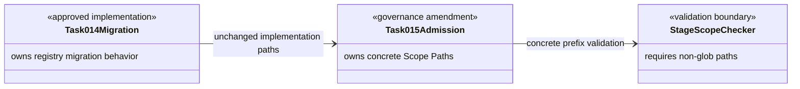
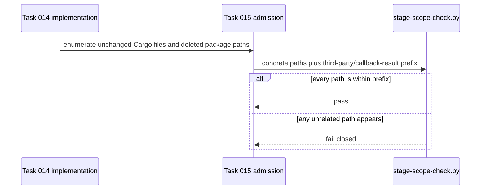

# Callback Result Scope Path Amendment Design

## Design Scope

### Goals

- Provide concrete, checker-compatible Scope Paths for the already-approved task 014 registry migration.
- Preserve the exact implementation and deletion boundary already delivered under task 014 admission.

### Non-goals

- No production/build diff beyond task 014, no checker modification, and no mutation of task 014 documents.

## Useful Context

- Task 014 admitted `Cargo.toml`, `p2p-frame/Cargo.toml`, `Cargo.lock`, and `third-party/callback-result/**`.
- `stage-scope-check.py` rejects glob Scope Paths before evaluating changed paths.
- Its prefix matcher accepts a concrete directory entry and descendants, so `third-party/callback-result` expresses the original boundary without a glob.

## Overall Approach

Rebind the unchanged task 014 implementation to the same three Cargo files and the concrete `third-party/callback-result` directory prefix. No implementation file is added and no delivered line changes; the amendment changes only the admission source used by the remaining scope, testing, and acceptance evidence.

## Layered Design Document Index

| level | parent_document | unit | design_document | responsibility |
|-------|-----------------|------|-----------------|----------------|
| root | `design.md` | task 015 scope amendment | `design.md` | Owns the single concrete-path correction; no child design exists because no code or module structure changes |

## Module Relationship UML

## File-Level Interfaces

- not-applicable: this amendment changes only task documentation/admission metadata and introduces no source-language interface.

## API and Build Surface Impact

- Public API impact: none
- Crate-root export change: no
- Build-surface change: no
- Documentation examples affected: no

## Key Flows

## State and Ownership

- not-applicable: no persistent or shared runtime state changes; task 015 owns only immutable admission mapping evidence.

## Directly Mapped Change Items

| change_id | target_module | proposal_id | Design Coverage | Scope Paths | Interface / Boundary Impact | Notes |
|-----------|---------------|-------------|-----------------|-------------|-----------------------------|-------|
| callback_result_scope_path_amendment | p2p-frame | P-CRSPA-1 | Overall Approach, Module Relationship UML, Key Flows, Implementation Order, Risks and Rollback | `Cargo.toml`, `p2p-frame/Cargo.toml`, `Cargo.lock`, `third-party/callback-result` | No API/runtime change; replaces task 014's rejected glob with the exact directory prefix accepted by stage scope validation | The prefix admits only the directory itself and descendants, not sibling third-party paths |

## Implementation Order

| Phase | Goal | Depends On | Output |
|-------|------|------------|--------|
| 1 | Bind the existing migration to task 015 approved documents and evidence | approved amendment proposal/design | task 015 admission stamp with four concrete Scope Paths |
| 2 | Re-run implementation scope validation over the unchanged task 014 paths | phase 1 | passing concrete-path implementation scope result |

## File-Level Implementation Sequence

| sequence | file_level_module | action | depends_on | change_id | scope_path | implementation_task |
|----------|-------------------|--------|------------|-----------|------------|---------------------|
| 1 | `Cargo.toml` | retain task 014 root patch removal under corrected admission | none | callback_result_scope_path_amendment | `Cargo.toml` | I-CRSPA-1 |
| 2 | `p2p-frame/Cargo.toml` | retain task 014 version requirement under corrected admission | none | callback_result_scope_path_amendment | `p2p-frame/Cargo.toml` | I-CRSPA-2 |
| 3 | `third-party/callback-result` | retain task 014 directory deletion under concrete prefix admission | sequences 1-2 | callback_result_scope_path_amendment | `third-party/callback-result` | I-CRSPA-3 |
| 4 | `Cargo.lock` | retain task 014 registry source/checksum entry under corrected admission | sequences 1-3 | callback_result_scope_path_amendment | `Cargo.lock` | I-CRSPA-4 |

## Design Notes

- This packet is an amendment, not a second implementation. Its file sequence identifies the already-delivered paths that must be admitted and audited.
- The rejected alternative is editing frozen task 014 or changing the checker. Both would exceed the narrow correction authorized by the user.
- `third-party/callback-result` is deliberately a directory prefix without `/**`; the checker treats descendants as in scope.
- Testing-stage details are intentionally omitted; later evidence validates the unchanged migration against both task 014 and this amendment.

## Risks and Rollback

- A broader prefix such as `third-party` would admit unrelated local packages and is forbidden.
- A narrower list that omits deleted descendants would fail to evidence the requested cleanup.
- If task 014 implementation changes after this approval, this amendment is stale and admission must fail; it is not authority for further changes.
- Rollback of this amendment means stopping completion and returning to a new design correction; it does not independently change Cargo files.

## Trigger Matrix

| Trigger Category | Applies? | Evidence | Required Checks | Completed Checks | Deferred Checks and Reason | Residual Risk |
|------------------|----------|----------|-----------------|------------------|----------------------------|---------------|
| contract/protocol | no | Design introduces no interface and retains task 014 contract unchanged | Diff/scope review | File interfaces are not applicable | owner: none; reason: task 014 owns contract evidence; acceptance impact: task 014 mismatch still blocks | none |
| data/schema | no | No persisted-data path enters Scope Paths | Scope review | Four build/resource prefixes only | owner: none; reason: not applicable; acceptance impact: none | none |
| security/privacy/permission | no | No trust or permission boundary enters Scope Paths | Scope review | No security paths admitted | owner: none; reason: not applicable; acceptance impact: none | none |
| runtime/integration | no | No Rust source or runtime state changes | Final diff review | Existing implementation remains Cargo-only | owner: acceptance; reason: task 014 owns runtime evidence; acceptance impact: unexpected runtime diff blocks | none |
| build/dependency/config/deployment | yes | Concrete paths bind the existing dependency-source migration | Admission and implementation scope validation, followed by task 014 dependency verification | Exact prefixes and order recorded | owner: implementation/testing; reason: runnable results follow admission; acceptance impact: any failure blocks | Incorrect prefix could hide an unadmitted path |
| ui/datamodel/workflow | no | No UI path or model enters Scope Paths | Scope review | No UI units modeled | owner: none; reason: not applicable; acceptance impact: none | none |
| harness/process | yes | `stage-scope-check.py` rejects the frozen task 014 glob and accepts concrete prefixes | Run current schema/admission/stage checkers without modifying them | Design uses concrete non-glob entries | owner: implementation/acceptance; reason: results follow approval; acceptance impact: checker failure blocks | Rule prose inconsistency may need a separate future Harness maintenance task |

## Approval Record

- approver: user
- approval_date: 2026-08-26
- user_statement: "确认"
