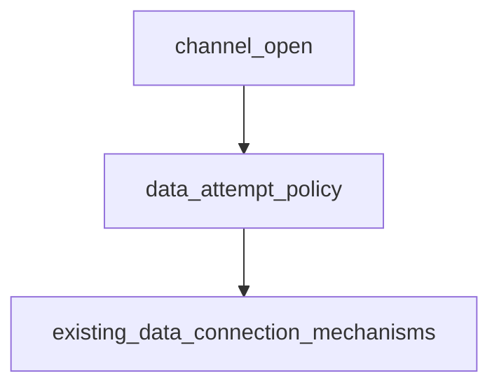

# Pipeline Plan

## Trigger
- Proposal: docs/versions/v0.1/modules/p2p-frame/016-tcp-data-control-direction-priority/proposal.md
- User launch confirmed: yes
- User launch statement: “确认，自动完成任务”
- Per-stage user confirmation: skipped by explicit user auto-pipeline authorization
- Auto-confirm completed document stages: no design/testing Markdown documents generated; repository-local document extensions only
- Auto-pipeline document policy: no design/testing markdown docs; testplan.yaml required
- Version: v0.1
- Packet module: p2p-frame
- Task name: 016-tcp-data-control-direction-priority
- Target module(s): p2p-frame
- change_id values: tcp_data_control_direction_priority

## Acceptance Baseline
- Final acceptance is judged against:
  - `proposal.md`

## Stage Graph
| Task ID | Stage | Responsibility | Scope | Parent Task | Depends On | Output | Done Condition |
|---------|-------|----------------|-------|-------------|------------|--------|----------------|
| D-1 | design | map control ownership to ordered local/peer data connection attempts, fallback semantics, failures, compatibility, and exact production scope | task-local pipeline design mappings and p2p-frame TCP boundary | root | none | validated pipeline plan and scope binding | pipeline-plan-check and design scope check pass without design/testing Markdown documents |
| I-1 | implementation | deliver the minimal direction-aware TCP data connection attempt selection | admitted TCP tunnel runtime file | root | D-1 | production code plus admission and scope evidence | file child completes and implementation scope check passes |
| T-1 | testing | derive cases after implementation and generate runnable direction-order, fallback, reuse, and error coverage | dedicated TCP tests, testplan, task state, and unified task entry | root | I-1 | tests, testplan.yaml, run artifact, and state coverage | task-scoped tests plus testing coverage and scope checks pass |
| A-1 | acceptance | independently audit proposal-plan-code-tests-evidence consistency and runtime correctness | bound task packet and delivered task paths | root | T-1 | acceptance-report.md | acceptance report check passes with accepted conclusion |

## Submodule Tasks
| Task ID | Stage | Responsibility | Submodule | Parent Task | Depends On | Output | Done Condition |
|---------|-------|----------------|-----------|-------------|------------|--------|----------------|
| I-TCP-TUNNEL-1 | implementation | make new data connection attempts follow the established TCP control direction before opposite-direction fallback | TCP tunnel channel-open runtime | I-1 | D-1 | `tunnel.rs` direction-aware selection and diagnostics | Active and Passive select the required first direction, reuse remains first, and existing claim/handoff paths remain unchanged |

## Parallel Scheduling
- Strategy: dependency-ready-set
- Concurrency: use all runtime-available child-agent slots when delegation is authorized
- Shared artifact owner: parent-orchestrator
- Lock directory: `.harness/locks/`
- Dispatch rule: launch the maximum dependency-ready set with disjoint exclusive write scopes before waiting; immediately backfill free slots
- Serialization policy: explicit dependency, overlapping write scope, or exhausted concurrency capacity only
- Execution-policy constraint: the active higher-priority developer policy does not authorize sub-agent delegation without an explicit user request, so the root executor performs the otherwise dependency-ordered tasks serially
- Serialization reasons: the single production child owns one file; post-implementation testing depends on the completed runtime behavior; acceptance depends on runnable testing evidence; the active developer policy requires the root executor to run stages serially because the user did not explicitly request sub-agents
- Evidence: sibling `pipeline/state.json` records each executed task and its dependency or execution-policy serialization reason

## Dependency Graphs

| Level | Parent | Node | Depends On |
|-------|--------|------|------------|
| submodule | tcp_tunnel_runtime | channel_open | data_attempt_policy |
| submodule | tcp_tunnel_runtime | data_attempt_policy | existing_data_connection_mechanisms |
| submodule | tcp_tunnel_runtime | existing_data_connection_mechanisms | none |

## Exported Interfaces
| Interface | Owner | Consumer | Compatibility | Affected Callers | Migration Path |
|-----------|-------|----------|---------------|------------------|----------------|
| existing internal `TcpTunnel::open_channel` new-connection selection behavior | `p2p-frame/src/networks/tcp/tunnel.rs` channel-open runtime | existing `TcpTunnel::open_stream` and `TcpTunnel::open_datagram` implementations in the same file | backward-compatible | TCP stream/datagram callers requiring a new physical data connection | no source or wire migration; Passive changes attempt order while Active and existing reuse semantics remain stable |
| existing internal `create_data_connection` and `request_remote_data_connection` mechanisms | `p2p-frame/src/networks/tcp/tunnel.rs` data connection runtime | direction-aware attempt policy in `TcpTunnel::open_channel` | backward-compatible | current TCP data connection and reverse-request flows | no migration; call order changes but each mechanism, frame, registration barrier, and claim contract remains intact |

## API and Build Surface Impact
- Public API impact: none
- Crate-root export change: no
- Build-surface change: no
- Documentation examples affected: no
- TCP wire-format impact: none; current `OpenDataConnReq`/`OpenDataConnResp`, hello, ready, and claim encodings are reused unchanged

## Consumer Migration Closure
| Old Symbol | New Path | change_id | Consumer Path | Consumer Kind | Migration Status |
|------------|----------|-----------|---------------|---------------|------------------|
| not-applicable | not-applicable | tcp_data_control_direction_priority | p2p-frame/src/networks/tcp/tunnel.rs | internal behavior-only consumer | verified-none |

## State Ownership
| State | Owner | Access Interface | Lifecycle | Failure Transitions |
|-------|-------|------------------|-----------|---------------------|
| tunnel control direction and connection pool used for attempt selection | `TcpTunnel`, with `form` immutable after construction and `TcpTunnelState` owning data entries and pending requests | `find_claimable_entry`, `create_data_connection`, `request_remote_data_connection`, and `claim_entry` | connected tunnel -> reuse claimable entry when present -> otherwise choose preferred creator from `form` -> on fallback-eligible failure choose the opposite creator -> claim or return the actual terminal failure | tunnel close or terminal protocol/state failure stops the open; preferred connect/setup failure may enter the existing opposite-direction mechanism; pending peer requests retain current timeout/cancel/late cleanup |

## Failure Flows
| Flow | Boundary | Failure | Handling |
|------|----------|---------|----------|
| Active new data connection | `open_channel` -> local `create_data_connection` -> peer `request_remote_data_connection` | local preferred creation fails | preserve the local-created cause, then use the existing peer-created request path; on a second failure return a direction-labelled combined error |
| Passive new data connection | `open_channel` -> peer `request_remote_data_connection` -> local `create_data_connection` | peer preferred creation fails | preserve the peer-created cause, then use the existing local-created path; on a second failure return a direction-labelled combined error |
| preferred success | attempt policy -> preferred creation mechanism | preferred direction succeeds | do not start the fallback; pass the returned registered entry into the unchanged first-claim path |
| existing connection reuse | `find_claimable_entry` -> attempt policy | a reusable/claimable entry exists | claim the entry without consulting direction or creating another physical connection |
| tunnel lifecycle or reverse request terminal state | preferred mechanism -> tunnel/request owner | close, cancellation, timeout, protocol rejection, or registration failure | preserve existing cleanup and error category; design does not add state or relax reverse registration/first-claim validation |

## Rejected Alternatives
| Decision Type | Selected | Rejected | Reason |
|---------------|----------|----------|--------|
| boundary | keep direction selection inside the existing TCP channel-open runtime | move policy into TunnelManager, PN/TTP, or protocol codecs | only `TcpTunnel::open_channel` owns the decision to create a physical TCP data connection, and upper layers must not duplicate transport semantics |
| technical | sequential order derived from existing `Active`/`Passive` control ownership with opposite-direction fallback | always local-first, hard same-direction-only behavior, endpoint-address inference, or racing both directions | local-first ignores proven control reachability; hard restriction removes connectivity; endpoint inference is ambiguous; racing changes resource and claim concurrency beyond the request |
| collaboration | one serial production-file task followed by post-implementation testing | split overlapping edits to `tunnel.rs` across parallel workers or design tests during implementation | the behavior has one file/state owner, testing is post-implementation, and the active higher-priority execution policy does not authorize sub-agent delegation without an explicit user request |

## Implementation Scope Bindings
| change_id | target_module | proposal_id | design_coverage | scope_paths | design_rules_applied |
|-----------|---------------|-------------|-----------------|-------------|----------------------|
| tcp_data_control_direction_priority | p2p-frame | P-TDCDP-1 | derive ordered local/peer data creation from existing Active/Passive control ownership; keep pool reuse first; keep the opposite direction as sequential fallback; retain existing reverse registration and first-claim state; preserve both direction-labelled errors without wire or public API changes | `p2p-frame/src/networks/tcp/tunnel.rs` | top-down runtime dependency, concrete internal consumers, backward compatibility, single state owner, ordered failure flows, exact file scope, rejected broader alternatives |

## File-Level Implementation Sequence
| Sequence | Task ID | File-Level Module | Action | Depends On | change_id | target_module | Scope Paths | Context Sources |
|----------|---------|-------------------|--------|------------|-----------|---------------|-------------|-----------------|
| 1 | I-TCP-TUNNEL-1 | `p2p-frame/src/networks/tcp/tunnel.rs` | implement form-derived preferred/fallback data connection creation order and direction-aware dual-failure diagnostics without changing reuse, registration, or claim mechanisms | none | tcp_data_control_direction_priority | p2p-frame | `p2p-frame/src/networks/tcp/tunnel.rs` | proposal P-TDCDP-1, Active/Passive constructors, existing `open_channel`, reverse registration handoff and first-claim invariants |

## Return Rules
- If acceptance finds proposal ambiguity:
  - stop the pipeline and ask the user to decide; do not infer the requirement or create an automatic proposal return task
- If acceptance finds design mismatch:
  - return to design when control ownership, attempt order, fallback eligibility, compatibility, state cleanup, diagnostics, or file scope is absent or wrong
- If acceptance finds implementation defect:
  - return to implementation when this design is adequate but runtime code violates it
- If acceptance finds testing implementation gap:
  - return to testing for missing Active/Passive order, reuse, fallback, dual-failure, or reverse-handoff evidence
- For non-requirement findings:
  - repeat design -> implementation -> testing, then rerun acceptance
- If the same unresolved issue remains after more than 5 unsuccessful iterations:
  - stop and report the issue to the user

Execution status, testing evidence, return records, and final acceptance are stored in sibling `state.json`. They are deliberately excluded from this admission-bound plan.
