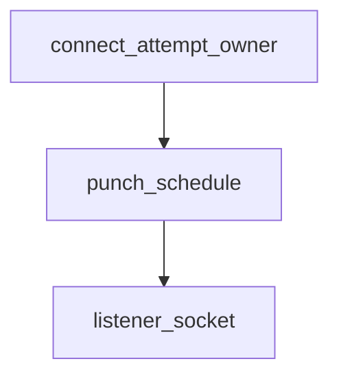

# Pipeline Plan

## Trigger
- Proposal: docs/versions/v0.1/modules/p2p-frame/017-quic-nat-traversal-improvement/proposal.md
- User launch confirmed: yes
- User launch statement: “确认，自动完成”
- Per-stage user confirmation: skipped by explicit user auto-pipeline authorization
- Auto-confirm completed document stages: no design/testing Markdown documents generated; repository-local document extensions only
- Auto-pipeline document policy: no design/testing markdown docs; testplan.yaml required
- Version: v0.1
- Packet module: p2p-frame
- Task name: 017-quic-nat-traversal-improvement
- Target module(s): p2p-frame
- change_id values: quic_nat_punch_connect_lifetime, quic_nat_punch_owner_cancellation

## Acceptance Baseline
- Final acceptance is judged against:
  - `proposal.md`

## Stage Graph
| Task ID | Stage | Responsibility | Scope | Parent Task | Depends On | Output | Done Condition |
|---------|-------|----------------|-------|-------------|------------|--------|----------------|
| D-1 | design | map the existing listener punch schedule and the single Quinn connect attempt into one deadline-bounded ownership model | task-local pipeline design mappings and p2p-frame QUIC boundary | root | none | validated pipeline plan and scope binding | pipeline-plan-check and design scope check pass without design/testing Markdown documents |
| I-1 | implementation | deliver full-connect-deadline punch scheduling and attempt-owned cancellation without changing Quinn retry behavior | admitted QUIC listener and network runtime files | root | D-1 | production code plus admission and scope evidence | file children complete and implementation scope check passes |
| T-1 | testing | derive cases after implementation and generate runnable schedule, ownership, cancellation, close, and compatibility coverage | QUIC tests, testplan, task state, and unified task entry | root | I-1 | tests, testplan.yaml, run artifact, and state coverage | task-scoped tests plus testing coverage and scope checks pass |
| A-1 | acceptance | independently audit proposal-plan-code-tests-evidence consistency and runtime correctness | bound task packet and delivered task paths | root | T-1 | acceptance-report.md | acceptance report check passes with accepted conclusion |

## Submodule Tasks
| Task ID | Stage | Responsibility | Submodule | Parent Task | Depends On | Output | Done Condition |
|---------|-------|----------------|-----------|-------------|------------|--------|----------------|
| I-QUIC-PUNCH-1 | implementation | replace the detached fixed-window punch burst with an awaitable full-deadline listener punch future | QUIC listener punch runtime | I-1 | D-1 | `listener.rs` owned punch scheduling | schedule uses the existing offsets and cadence through the supplied connect deadline and observes listener close |
| I-QUIC-CONNECT-1 | implementation | make the existing connect attempt own and race the punch future with its single Quinn connect flow | QUIC network connect runtime | I-1 | I-QUIC-PUNCH-1 | `network.rs` attempt ownership composition | every connect terminal path or future drop cancels punch while the existing outer early-error retry remains unchanged |

## Parallel Scheduling
- Strategy: dependency-ready-set
- Concurrency: use all runtime-available child-agent slots when delegation is authorized
- Shared artifact owner: parent-orchestrator
- Lock directory: `.harness/locks/`
- Dispatch rule: launch the maximum dependency-ready set with disjoint exclusive write scopes before waiting; immediately backfill free slots
- Serialization policy: explicit dependency, overlapping write scope, or exhausted concurrency capacity only
- Execution-policy constraint: the active higher-priority developer policy does not authorize sub-agent delegation without an explicit user request, so the root executor performs the dependency-ordered tasks serially
- Serialization reasons: the connect owner consumes the listener punch future and therefore follows it; post-implementation testing depends on the completed runtime behavior; acceptance depends on runnable testing evidence; the active developer policy requires the root executor to run stages serially because the user did not explicitly request sub-agents
- Evidence: sibling `pipeline/state.json` records each executed task and its dependency or execution-policy serialization reason

## Dependency Graphs

| Level | Parent | Node | Depends On |
|-------|--------|------|------------|
| submodule | quic_connect_runtime | connect_attempt_owner | punch_schedule |
| submodule | quic_connect_runtime | punch_schedule | listener_socket |
| submodule | quic_connect_runtime | listener_socket | none |

## Exported Interfaces
| Interface | Owner | Consumer | Compatibility | Affected Callers | Migration Path |
|-----------|-------|----------|---------------|------------------|----------------|
| internal awaitable listener punch operation | `p2p-frame/src/networks/quic/listener.rs` | `QuicTunnelNetwork::open_or_connect` in `network.rs` | backward-compatible | existing punch-enabled active and reverse QUIC candidate attempts | no public or wire migration; the call changes from detached scheduling to an attempt-owned future |
| existing internal `QuicTunnelNetwork::open_or_connect` connect behavior | `p2p-frame/src/networks/quic/network.rs` | existing QUIC tunnel active/reverse candidate paths | backward-compatible | current QUIC candidate callers | no signature migration; preserve one pending Quinn `Connecting`, current timeout calculation, and outer early-error retry rules |

## API and Build Surface Impact
- Public API impact: none
- Crate-root export change: no
- Build-surface change: no
- Documentation examples affected: no
- QUIC/SN wire-format impact: none; the existing private punch payload, QUIC/TLS handshake, candidate policy, and source listener socket are reused unchanged

## Consumer Migration Closure
| Old Symbol | New Path | change_id | Consumer Path | Consumer Kind | Migration Status |
|------------|----------|-----------|---------------|---------------|------------------|
| detached listener punch scheduling behavior | attempt-owned listener punch future | quic_nat_punch_connect_lifetime | p2p-frame/src/networks/quic/network.rs | crate-private behavior consumer | verified-none |
| detached listener punch task lifetime | `open_or_connect` future ownership | quic_nat_punch_owner_cancellation | p2p-frame/src/networks/quic/network.rs | crate-private lifecycle consumer | verified-none |

## State Ownership
| State | Owner | Access Interface | Lifecycle | Failure Transitions |
|-------|-------|------------------|-----------|---------------------|
| per-candidate punch schedule and payload | the `open_or_connect` invocation that also owns the corresponding connect flow | awaitable listener punch operation raced with the existing connect future | candidate policy accepted -> initial active/reverse offset -> 50ms best-effort sends while connect is pending -> connect result, deadline, listener close, or owner drop | send errors are logged and ignored; connect completion drops the punch future; listener close wakes and terminates it; caller cancellation drops both connect and punch futures |
| single Quinn connect state | existing `connect_with_owner_runtime`/Quinn `Connecting` path inside `open_or_connect` | unchanged connect loop and timeout | one `Connecting` remains pending while Quinn PTO/loss recovery proceeds; an existing early terminal error may follow the current outer retry rule | success/error/timeout is returned unchanged; punch cadence never creates a new Quinn connection; drop preserves Quinn cancellation behavior |
| listener close state and source socket | `QuicTunnelListener` | `closed`, `close_notify`, and the registered listener `punch_socket` | listener open -> close flag/notification -> sockets and endpoints close | close notification terminates an in-flight punch wait and the closed check prevents later sends |

## Failure Flows
| Flow | Boundary | Failure | Handling |
|------|----------|---------|----------|
| punch-enabled connect | `open_or_connect` -> listener punch future plus existing connect future | Quinn connect succeeds or returns its final error before deadline | return the existing connect result and drop the punch future immediately; do not create a replacement Quinn connection from the 50ms ticker |
| connect deadline | existing timeout calculation -> connect and punch ownership | deadline expires while connect remains pending | existing Quinn timeout resolves the connect flow; punch is bounded by the same duration and is dropped with the owner |
| caller cancellation | caller -> `open_or_connect` future | candidate race loses or caller drops/cancels the future | Rust future ownership drops both the connect flow and punch operation; no detached punch task remains |
| listener shutdown | listener `close` -> punch wait/send loop | listener closes before the next scheduled send | close notification and closed-state check terminate punch before another send; existing endpoint close determines the connect error |
| UDP send | punch operation -> listener source socket | one best-effort punch send fails | log the failure without terminating, retrying, or replacing the Quinn connect state; continue only while owner and deadline remain valid |
| non-punch candidate | candidate policy -> `open_or_connect` | candidate is not eligible IPv4 ServerReflexive QUIC or listener socket is unavailable | run only the unchanged connect flow, with no punch future or extra retry behavior |

## Rejected Alternatives
| Decision Type | Selected | Rejected | Reason |
|---------------|----------|----------|--------|
| boundary | keep scheduling in the QUIC listener and ownership in the existing per-candidate `open_or_connect` call | move lifetime policy into SN, TunnelManager, candidate selection, or Quinn internals | the listener owns the source socket while `open_or_connect` owns the exact candidate deadline and connect lifecycle; neighboring modules need no contract change |
| technical | await one punch future alongside the existing single connect flow and let structured future drop provide cancellation | only enlarge the detached task deadline, add a permanent task handle registry, or recreate Quinn connections every 50ms | a larger detached task leaks beyond success/cancel; a registry adds unnecessary shared state; periodic Quinn creation violates the approved single-Connecting/PTO invariant |
| collaboration | two dependency-ordered production-file tasks followed by post-implementation testing | parallel overlapping lifecycle edits or pre-implementation test generation | the connect owner depends on the listener future contract, testing must reflect delivered behavior, and active policy keeps execution with the root agent |

## Implementation Scope Bindings
| change_id | target_module | proposal_id | design_coverage | scope_paths | design_rules_applied |
|-----------|---------------|-------------|-----------------|-------------|----------------------|
| quic_nat_punch_connect_lifetime | p2p-frame | P-QNPL-1 | remove the listener's fixed one-second punch cap; retain active 250ms, reverse 0ms, and 50ms cadence; accept the already computed candidate connect timeout; keep the existing one-second minimum/connect early-error retry semantics separate and unchanged | `p2p-frame/src/networks/quic/listener.rs`, `p2p-frame/src/networks/quic/network.rs` | concrete owner/consumer boundary, backward compatibility, single-Connecting invariant, exact timeout and scheduling flow, exact file scope |
| quic_nat_punch_owner_cancellation | p2p-frame | P-QNPL-2 | expose punch as an awaitable listener operation and compose it inside `open_or_connect`; connect success/error/timeout, future drop, and listener close all terminate future sends; UDP send failure remains best-effort | `p2p-frame/src/networks/quic/listener.rs`, `p2p-frame/src/networks/quic/network.rs` | explicit state owner, cancellation-by-drop, listener close transition, failure propagation, no detached runtime state, exact file scope |

## File-Level Implementation Sequence
| Sequence | Task ID | File-Level Module | Action | Depends On | change_id | target_module | Scope Paths | Context Sources |
|----------|---------|-------------------|--------|------------|-----------|---------------|-------------|-----------------|
| 1 | I-QUIC-PUNCH-1 | `p2p-frame/src/networks/quic/listener.rs` | replace fixed-deadline detached spawning with an awaitable, listener-close-aware, best-effort punch schedule that uses the supplied connect timeout and existing source socket/policy | none | quic_nat_punch_connect_lifetime | p2p-frame | `p2p-frame/src/networks/quic/listener.rs` | proposal P-QNPL-1/P-QNPL-2, current punch payload/policy helpers, listener close state and socket registration |
| 2 | I-QUIC-CONNECT-1 | `p2p-frame/src/networks/quic/network.rs` | make the existing per-candidate connect call own the punch future, race it against the unchanged connect loop, and preserve the current outer early-error retry window without any ticker-driven Quinn recreation | I-QUIC-PUNCH-1 | quic_nat_punch_owner_cancellation | p2p-frame | `p2p-frame/src/networks/quic/network.rs` | proposal P-QNPL-1/P-QNPL-2, existing timeout calculation, `connect_with_owner_runtime`, and early-error retry helpers |

## Return Rules
- If acceptance finds proposal ambiguity:
  - stop the pipeline and ask the user to decide; do not infer the requirement or create an automatic proposal return task
- If acceptance finds design mismatch:
  - return to design when the owner, single-Connecting rule, punch schedule/deadline, cancellation/close transitions, compatibility, or file scope is absent or wrong
- If acceptance finds implementation defect:
  - return to implementation when this design is adequate but runtime code violates it
- If acceptance finds testing implementation gap:
  - return to testing for missing beyond-one-second scheduling, deadline, success/error, cancellation, listener-close, source socket, single-Connecting, or non-punch compatibility evidence
- For non-requirement findings:
  - repeat design -> implementation -> testing, then rerun acceptance
- If the same unresolved issue remains after more than 5 unsuccessful iterations:
  - stop and report the issue to the user

Execution status, testing evidence, return records, and final acceptance are stored in sibling `state.json`. They are deliberately excluded from this admission-bound plan.
