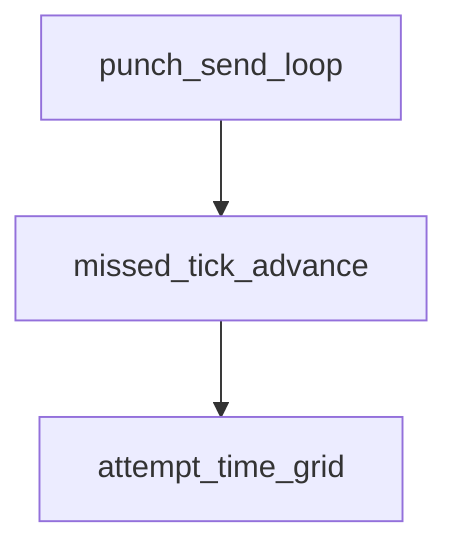

# Pipeline Plan

## Trigger
- Proposal: docs/versions/v0.1/modules/p2p-frame/018-quic-punch-skip-missed-ticks/proposal.md
- User launch confirmed: yes
- User launch statement: “确认，自动完成”
- Per-stage user confirmation: skipped by explicit user auto-pipeline authorization
- Auto-confirm completed document stages: no design/testing Markdown documents generated; repository-local document extensions only
- Auto-pipeline document policy: no design/testing markdown docs; testplan.yaml required
- Version: v0.1
- Packet module: p2p-frame
- Task name: 018-quic-punch-skip-missed-ticks
- Target module(s): p2p-frame
- change_id values: quic_punch_skip_missed_ticks

## Acceptance Baseline
- Final acceptance is judged against:
  - `proposal.md`

## Stage Graph
| Task ID | Stage | Responsibility | Scope | Parent Task | Depends On | Output | Done Condition |
|---------|-------|----------------|-------|-------------|------------|--------|----------------|
| D-1 | design | map missed-tick skipping into the existing listener-owned punch schedule without changing its protocol or owner boundary | task-local pipeline design mappings and p2p-frame QUIC listener boundary | root | none | validated pipeline plan and scope binding | pipeline-plan-check and design scope check pass without design/testing Markdown documents |
| I-1 | implementation | deliver overflow-safe missed-tick advancement in the existing punch loop | admitted QUIC listener runtime file | root | D-1 | production code plus admission and scope evidence | file child completes and implementation scope check passes |
| T-1 | testing | derive post-implementation cases for normal cadence, delayed recovery, deadline, intent offsets, and overflow | dedicated QUIC listener tests, testplan, task state, and unified task entry | root | I-1 | tests, testplan.yaml, run artifact, and state coverage | task-scoped tests plus testing coverage and scope checks pass |
| A-1 | acceptance | independently falsify proposal-plan-code-tests-evidence consistency and UDP burst prevention | bound task packet and delivered task paths | root | T-1 | acceptance-report.md | acceptance report check passes with accepted conclusion |

## Submodule Tasks
| Task ID | Stage | Responsibility | Submodule | Parent Task | Depends On | Output | Done Condition |
|---------|-------|----------------|-----------|-------------|------------|--------|----------------|
| I-QUIC-TICK-1 | implementation | advance the existing per-candidate punch schedule past missed ticks in one calculation | QUIC listener punch scheduler | I-1 | D-1 | `listener.rs` missed-tick scheduling | normal ticks remain unchanged; overdue ticks are skipped without catch-up sends; deadline and overflow stop safely |

## Parallel Scheduling
- Strategy: dependency-ready-set
- Concurrency: use all runtime-available child-agent slots when delegation is authorized
- Shared artifact owner: parent-orchestrator
- Lock directory: `.harness/locks/`
- Dispatch rule: launch the maximum dependency-ready set with disjoint exclusive write scopes before waiting; immediately backfill free slots
- Serialization policy: explicit dependency, overlapping write scope, or exhausted concurrency capacity only
- Execution-policy constraint: the active higher-priority developer policy does not authorize sub-agent delegation without an explicit user request, so the root executor performs the dependency-ordered tasks serially
- Serialization reasons: the single implementation child owns the only production file; testing follows delivered code; acceptance follows runnable testing; active policy keeps all stages with the root executor because the user did not request sub-agent delegation
- Evidence: sibling `pipeline/state.json` records each executed task and its dependency or execution-policy serialization reason

## Dependency Graphs

| Level | Parent | Node | Depends On |
|-------|--------|------|------------|
| submodule | quic_listener_schedule | punch_send_loop | missed_tick_advance |
| submodule | quic_listener_schedule | missed_tick_advance | attempt_time_grid |
| submodule | quic_listener_schedule | attempt_time_grid | none |

## Exported Interfaces
| Interface | Owner | Consumer | Compatibility | Affected Callers | Migration Path |
|-----------|-------|----------|---------------|------------------|----------------|
| crate-private punch next-offset calculation | `p2p-frame/src/networks/quic/listener.rs` | `QuicTunnelListener::run_udp_punch_burst` | backward-compatible | existing active and reverse punch-enabled QUIC attempts | no public, wire, or caller migration; only overdue internal tick advancement changes |

## API and Build Surface Impact
- Public API impact: none
- Crate-root export change: no
- Build-surface change: no
- Documentation examples affected: no
- QUIC/SN wire-format impact: none; payload, candidate policy, listener source socket, QUIC/TLS handshake, and owner lifecycle are unchanged

## Consumer Migration Closure
| Old Symbol | New Path | change_id | Consumer Path | Consumer Kind | Migration Status |
|------------|----------|-----------|---------------|---------------|------------------|
| not-applicable | not-applicable | quic_punch_skip_missed_ticks | p2p-frame/src/networks/quic/listener.rs | crate-private behavior consumer | verified-none |

## State Ownership
| State | Owner | Access Interface | Lifecycle | Failure Transitions |
|-------|-------|------------------|-----------|---------------------|
| per-candidate `next_offset` on the attempt-relative punch grid | the active `run_udp_punch_burst` future | local next-offset helper consumed only by the punch send loop | active/reverse start offset -> wait/send current tick -> regular next tick when still future, otherwise skip overdue ticks to the first grid point not earlier than one interval after the observed elapsed time -> deadline or owner termination | duration overflow or next offset beyond deadline terminates punch safely; send error remains best-effort; listener close and owner drop retain existing behavior |

## Failure Flows
| Flow | Boundary | Failure | Handling |
|------|----------|---------|----------|
| delayed punch schedule | runtime wake/send completion -> next-offset advancement | one or many historical offsets are already due | keep at most the current send, calculate one future eligible grid offset, and never iterate historical sends with zero wait |
| normal punch schedule | current tick -> next regular tick | timer or send has only normal sub-interval jitter | retain the next original 50ms grid tick without resetting active/reverse phase |
| connect deadline | next-offset calculation -> punch loop | next eligible tick exceeds the supplied connect deadline | stop punch before another send and do not extend or compensate the deadline |
| duration arithmetic | elapsed/current offset -> interval skip calculation | addition, multiplication, or interval-count conversion overflows | return no next offset and stop punch without panic or wraparound |
| listener/owner/send | existing close, cancellation, and UDP send boundaries | listener closes, owner drops, or one UDP send fails | preserve 017 behavior: close/cancel stops; send failure is logged and punch continues only when a valid next tick exists |

## Rejected Alternatives
| Decision Type | Selected | Rejected | Reason |
|---------------|----------|----------|--------|
| boundary | keep missed-tick policy inside the listener-owned per-candidate punch scheduler | move cadence policy into SN, TunnelManager, candidate selection, or connect ownership | only the listener loop owns the tick offsets and UDP sends; neighboring owners and contracts need no change |
| technical | preserve the attempt-relative active/reverse grid and jump arithmetically over overdue ticks | keep `saturating_sub` with one-interval increments, replay every missed tick, unconditionally drop every slightly late timer wake, or create a permanently drifting independent timeline | the selected approach prevents catch-up bursts, preserves normal jitter behavior and phase, and avoids changing the connect/deadline ownership model |
| collaboration | one production-file implementation task followed by post-implementation testing and acceptance | overlapping changes to listener, network owner, candidate policy, or pre-implementation test generation | the defect is isolated to one scheduling loop and tests must be derived from the delivered algorithm under the repository's post-implementation model |

## Implementation Scope Bindings
| change_id | target_module | proposal_id | design_coverage | scope_paths | design_rules_applied |
|-----------|---------------|-------------|-----------------|-------------|----------------------|
| quic_punch_skip_missed_ticks | p2p-frame | P-QPSM-1 | add one overflow-safe next-offset calculation used after each best-effort send; preserve the next regular grid tick under normal timing; when it is already due, skip directly to the first attempt-relative grid tick at or after observed elapsed plus one interval; return none beyond arithmetic or deadline bounds; leave owner, close, payload, source socket, retry, connect, and candidate behavior unchanged | `p2p-frame/src/networks/quic/listener.rs` | single state owner, exact normal/delayed/deadline transitions, backward-compatible internal consumer, no wire or build impact, rejected catch-up/reset alternatives, exact file scope |

## File-Level Implementation Sequence
| Sequence | Task ID | File-Level Module | Action | Depends On | change_id | target_module | Scope Paths | Context Sources |
|----------|---------|-------------------|--------|------------|-----------|---------------|-------------|-----------------|
| 1 | I-QUIC-TICK-1 | `p2p-frame/src/networks/quic/listener.rs` | add an overflow-safe attempt-grid next-offset helper and use it after each punch send so overdue ticks are skipped in one advancement while deadline/close/send behavior remains unchanged | none | quic_punch_skip_missed_ticks | p2p-frame | `p2p-frame/src/networks/quic/listener.rs` | proposal P-QPSM-1, current `run_udp_punch_burst`, active/reverse offset helpers, connect deadline and 017 ownership boundaries |

## Return Rules
- If acceptance finds proposal ambiguity:
  - stop the pipeline and ask the user to decide; do not infer the requirement or create an automatic proposal return task
- If acceptance finds design mismatch:
  - return to design when grid phase, delayed recovery, minimum recovery wait, deadline/overflow handling, or unchanged owner/protocol boundaries are absent or wrong
- If acceptance finds implementation defect:
  - return to implementation when this design is adequate but the runtime code still catches up, skips normal ticks, overflows, or changes an excluded boundary
- If acceptance finds testing implementation gap:
  - return to testing for missing normal, lightly delayed, multi-interval, five-second, deadline, overflow, or active/reverse evidence
- For non-requirement findings:
  - repeat design -> implementation -> testing, then rerun acceptance
- If the same unresolved issue remains after more than 5 unsuccessful iterations:
  - stop and report the issue to the user

Execution status, testing evidence, return records, and final acceptance are stored in sibling `state.json`. They are deliberately excluded from this admission-bound plan.
