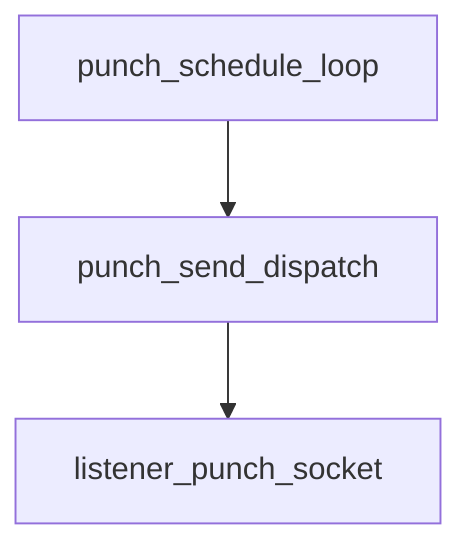

# Pipeline Plan

## Trigger
- Proposal: docs/versions/v0.1/modules/p2p-frame/019-quic-punch-runtime-cadence-test/proposal.md
- User launch confirmed: yes
- User launch statement: “确认，自动完成019任务”
- Per-stage user confirmation: skipped by explicit user auto-pipeline authorization
- Auto-confirm completed document stages: no design/testing Markdown documents generated; repository-local document extensions only
- Auto-pipeline document policy: no design/testing markdown docs; testplan.yaml required
- Version: v0.1
- Packet module: p2p-frame
- Task name: 019-quic-punch-runtime-cadence-test
- Target module(s): p2p-frame
- change_id values: quic_punch_runtime_cadence_direct_test, quic_punch_owner_test_claim_accuracy

## Acceptance Baseline
- Final acceptance is judged against:
  - `proposal.md`

## Stage Graph
| Task ID | Stage | Responsibility | Scope | Parent Task | Depends On | Output | Done Condition |
|---------|-------|----------------|-------|-------------|------------|--------|----------------|
| D-1 | design | map the launch-confirmed test-only observation boundary and ownership-claim correction into exact internal and file scopes | task-local pipeline design mappings for p2p-frame QUIC punch verification | root | none | validated plan/state design mapping | pipeline-plan-check and design scope check pass without design/testing Markdown documents |
| I-1 | implementation | aggregate the test-build-only listener send-dispatch delivery and implementation evidence | admitted listener runtime file with release behavior unchanged | root | I-QUIC-OBS-1 | confirmed internal observation boundary plus admission and scope evidence | implementation child, admission, compile check, and implementation scope check pass |
| T-1 | testing | aggregate direct runtime-loop cadence coverage and corrected owner-lifecycle claims | dedicated listener/owner test files, testplan, runner artifact, and testing evidence | root | T-QUIC-CADENCE-1, T-OWNER-CLAIM-1 | testplan.yaml, successful task-scoped run, and state coverage | testing coverage, task-scoped run, and testing scope check pass |
| A-1 | acceptance | independently audit proposal-plan-code-tests-evidence consistency and release/API invariants | complete 019 packet and bound delivered paths | root | T-1 | acceptance-report.md | acceptance report checker passes with an accepted conclusion |

## Submodule Tasks
| Task ID | Stage | Responsibility | Submodule | Parent Task | Depends On | Output | Done Condition |
|---------|-------|----------------|-----------|-------------|------------|--------|----------------|
| I-QUIC-OBS-1 | implementation | add one listener-instance-owned test-build send observation dispatch at the existing actual UDP send branch | QUIC listener punch send boundary | I-1 | D-1 | `listener.rs` internal dispatch | observer storage/setter/branch are test-build-only, fallback remains the existing send call, and no public/release behavior changes |
| T-QUIC-CADENCE-1 | testing | directly exercise `run_udp_punch_burst` through its candidate, deadline, send, and next-offset control flow | dedicated QUIC listener cadence tests | T-1 | I-1 | `listener/tests.rs` direct runtime regression | active/reverse delayed runs traverse the actual loop and distinguish bounded recovery from historical catch-up |
| T-OWNER-CLAIM-1 | testing | remove simulated cadence claims while preserving single-connect-future and owned-punch-drop proof | QUIC connect owner tests | T-1 | I-1 | `network/punch_owner_tests.rs` corrected lifecycle test | no artificial active/reverse counters remain and the name/assertions match only owner lifecycle behavior |

## Parallel Scheduling
- Strategy: dependency-ready-set
- Concurrency: use all runtime-available child-agent slots
- Shared artifact owner: parent-orchestrator
- Lock directory: `.harness/locks/`
- Dispatch rule: launch the maximum dependency-ready set with disjoint exclusive write scopes before waiting; immediately backfill free slots
- Serialization reasons: explicit dependency, overlapping write scope, or exhausted concurrency capacity only
- Evidence: record launched task ids and serialization reasons in sibling `pipeline/state.json` scheduler waves

## Dependency Graphs

| Level | Parent | Node | Depends On |
|-------|--------|------|------------|
| submodule | quic_listener_punch | punch_schedule_loop | punch_send_dispatch |
| submodule | quic_listener_punch | punch_send_dispatch | listener_punch_socket |
| submodule | quic_listener_punch | listener_punch_socket | none |

## Exported Interfaces
| Interface | Owner | Consumer | Compatibility | Affected Callers | Migration Path |
|-----------|-------|----------|---------------|------------------|----------------|
| listener-private UDP punch send dispatch | `p2p-frame/src/networks/quic/listener.rs` | `QuicTunnelListener::run_udp_punch_burst` | backward-compatible | the existing actual punch send branch | no public or caller migration; release dispatch delegates to the existing send function |
| `connect_with_owned_udp_punch` ownership contract | `p2p-frame/src/networks/quic/network.rs` | `QuicTunnelNetwork::open_or_connect` and its dedicated owner test | backward-compatible | existing connect owner path | no implementation migration; only the test claim is narrowed |

## API and Build Surface Impact
- Public API impact: none
- Crate-root export change: no
- Build-surface change: no
- Documentation examples affected: no
- Wire/protocol impact: none; payload, endpoint policy, listener source socket, cadence arithmetic, connect owner, and send-error semantics are unchanged

## Consumer Migration Closure
| Old Symbol | New Path | change_id | Consumer Path | Consumer Kind | Migration Status |
|------------|----------|-----------|---------------|---------------|------------------|
| not-applicable | not-applicable | quic_punch_runtime_cadence_direct_test | p2p-frame/src/networks/quic/listener.rs | crate-private behavior consumer | verified-none |
| not-applicable | not-applicable | quic_punch_owner_test_claim_accuracy | p2p-frame/src/networks/quic/network/punch_owner_tests.rs | dedicated test consumer | verified-none |

## State Ownership
| State | Owner | Access Interface | Lifecycle | Failure Transitions |
|-------|-------|------------------|-----------|---------------------|
| optional listener-instance test-build send observer | each `QuicTunnelListener` instance | private test-build setter and private send dispatch | absent at construction -> installed for one fixture -> replaced/cleared or listener dropped | observer absent falls through to the existing sender; observer failure is confined to the test build; no process-global contamination |
| observed send-attempt count | dedicated cadence test fixture | observer-owned atomic counter | create -> increment once per actual send branch -> assert -> drop | counter is never shared between listener instances or unrelated tests |
| connect poll and punch-drop evidence | dedicated owner test fixture | existing `connect_with_owned_udp_punch` future ownership | construct -> one connect future -> completion after more than one second -> owned punch future drop | success, final error, and cancellation retain existing behavior; this task changes only the test claim |

## Failure Flows
| Flow | Boundary | Failure | Handling |
|------|----------|---------|----------|
| normal release send | private dispatch -> existing async UDP sender | observer is absent because the build is not a test build | call the existing sender with the same socket, address, payload, result type, and best-effort handling |
| test observation | actual punch send branch -> listener-instance observer | the fixture installs an observer | record exactly one attempted traversal and complete the test-only send without external receive/routing dependence |
| observer execution | private dispatch -> test callback | observer panics | fail only the current test; do not translate it into production retry or error behavior |
| UDP send error | existing sender -> punch loop | the OS send returns an error when no observer is installed | retain existing trace logging and next-offset best-effort progression |
| loop termination | deadline/listener close -> send branch | deadline expires or listener closes before/while dispatching | retain the existing early-return and select branches without new observer-owned tasks or resources |
| connect ownership | connect future -> owned punch future | connect succeeds, finally errors, or owner is cancelled | preserve existing drop/cancellation behavior; only the misleading simulated-cadence test fixture is removed |

## Rejected Alternatives
| Decision Type | Selected | Rejected | Reason |
|---------------|----------|----------|--------|
| boundary | listener-instance test-build observation state | process-global observer or cross-test static counter | global mutable state would contaminate parallel tests and violate the approved instance-isolation boundary |
| technical | observe the same actual send branch with the existing production sender as fallback | external documentation-address UDP receiver, pure-helper-only evidence, or another copied fake cadence loop | external routing is nondeterministic and copied/helper-only tests cannot prove production-loop wiring |
| collaboration | one admitted listener-file child followed by two disjoint testing children | mix cadence production changes or 018 packet edits into 019, or serialize the independent test-file edits | 019 must not alter cadence behavior and the two dedicated test paths have independent ownership |

## Implementation Scope Bindings
| change_id | target_module | proposal_id | design_coverage | scope_paths | design_rules_applied |
|-----------|---------------|-------------|-----------------|-------------|----------------------|
| quic_punch_runtime_cadence_direct_test | p2p-frame | P-QPRCT-1 | add listener-instance test-build observer storage/setter and a private send dispatch at the existing `run_udp_punch_burst` send branch; post-implementation testing directly consumes it; release fallback preserves all current scheduling, send, error, and close behavior | `p2p-frame/src/networks/quic/listener.rs`, `p2p-frame/src/networks/quic/listener/tests.rs` | single instance owner, no global state, actual send-branch binding, backward-compatible internal consumer, no public/wire/build impact |
| quic_punch_owner_test_claim_accuracy | p2p-frame | P-QPRCT-2 | no production implementation; post-implementation owner testing removes fake active/reverse cadence loops and retains only late connect completion, single poll, and owned-punch-drop assertions | `p2p-frame/src/networks/quic/network/punch_owner_tests.rs` | existing owner contract unchanged, exact dedicated test-file scope, no interface migration |

## File-Level Implementation Sequence
| Sequence | Task ID | File-Level Module | Action | Depends On | change_id | target_module | Scope Paths | Context Sources |
|----------|---------|-------------------|--------|------------|-----------|---------------|-------------|-----------------|
| 1 | I-QUIC-OBS-1 | `p2p-frame/src/networks/quic/listener.rs` | add a test-build-only listener observer and route the existing send branch through a private dispatch whose release fallback is the current sender | none | quic_punch_runtime_cadence_direct_test | p2p-frame | `p2p-frame/src/networks/quic/listener.rs` | proposal P-QPRCT-1, current listener struct/constructor/run loop/send helper, 018 next-offset behavior |

## Return Rules
- If acceptance finds proposal ambiguity:
  - stop the pipeline and ask the user to decide; do not infer the requirement or create an automatic proposal return task
- If acceptance finds design mismatch:
  - return to design when observer isolation, the actual send-branch binding, the release fallback, or the no-production-change owner boundary is absent or wrong
- If acceptance finds implementation defect:
  - return to implementation when the design is adequate but the observer leaks into public/release behavior, holds a lock across async work, or bypasses the existing fallback semantics
- If acceptance finds testing implementation gap:
  - return to testing for missing active/reverse delayed runtime-loop evidence, a regression that cannot distinguish catch-up, misleading owner claims, or missing task-scoped runnable evidence
- For non-requirement findings:
  - repeat design -> implementation -> testing, then rerun acceptance
- If the same unresolved issue remains after more than 5 unsuccessful iterations:
  - stop and report the issue to the user

Execution status, testing evidence, return records, and final acceptance are stored in sibling `state.json`. They are deliberately excluded from this admission-bound plan.
