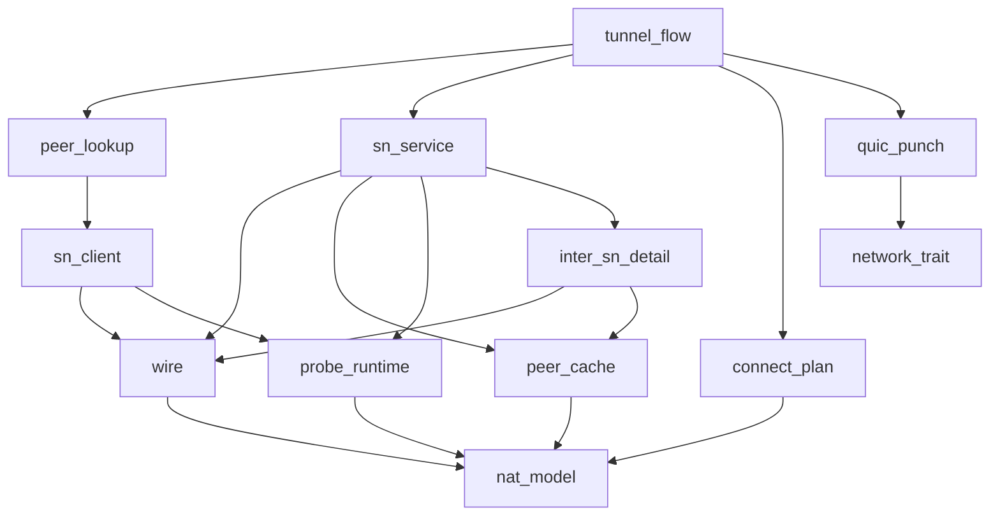

# Pipeline Plan

## Trigger
- Proposal: docs/versions/v0.1/modules/p2p-frame/020-nat-type-aware-traversal/proposal.md
- User launch confirmed: yes
- User launch statement: “确认，自动完成任务”
- User requirement clarification: “应该是SnQueryResp返回net_profile”
- Per-stage user confirmation: skipped by explicit user auto-pipeline authorization
- Auto-confirm completed document stages: no design/testing Markdown documents generated; repository-local document extensions only
- Auto-pipeline document policy: no design/testing markdown docs; testplan.yaml required
- Version: v0.1
- Packet module: p2p-frame
- Task name: 020-nat-type-aware-traversal
- Target module(s): p2p-frame
- change_id values: sn_nat_probe_ports, nat_type_peer_cache_and_exchange, nat_type_aware_strategy_selection, symmetric_port_prediction, nat_aware_connect_flow

## Acceptance Baseline
- Final acceptance is judged against:
  - `proposal.md`
- The reverted 020 implementation and all former downstream evidence are excluded from the evidence chain.

## Stage Graph
| Task ID | Stage | Responsibility | Scope | Parent Task | Depends On | Output | Done Condition |
|---------|-------|----------------|-------|-------------|------------|--------|----------------|
| D-1 | design | map the observation boundary, additive wire exchange, ordered two-peer plan, punch-only ownership, and fallback into concrete owners and file scope | task-local pipeline design mappings and p2p-frame/SN runtime boundaries | root | none | validated pipeline plan and scope binding | pipeline-plan-check and design scope check pass without design/testing Markdown documents |
| I-1 | implementation | deliver the admitted NAT observation, exchange, planning, prediction, and connect-flow runtime | p2p-frame and sn-miner production paths bound below | root | D-1 | production code plus admission and implementation scope evidence | all implementation children complete and implementation scope check passes |
| T-1 | testing | derive post-implementation observation, codec, matrix, lifecycle, first-attempt, compatibility, and fallback cases | dedicated tests, testplan, task state, and unified task entry | root | I-1 | tests, testplan.yaml, run artifact, and state coverage | task-scoped tests plus testing coverage and scope checks pass |
| A-1 | acceptance | independently falsify proposal-plan-code-tests-evidence consistency and runtime safety | bound 020 packet and delivered task paths | root | T-1 | acceptance-report.md | acceptance report check passes with accepted conclusion |

## Submodule Tasks
| Task ID | Stage | Responsibility | Submodule | Parent Task | Depends On | Output | Done Condition |
|---------|-------|----------------|-----------|-------------|------------|--------|----------------|
| I-NAT-TYPE-1 | implementation | define actual observations, profile freshness, versioned traversal snapshots, and bounded prediction hints | NAT profile model | I-1 | D-1 | `nat_type.rs` model | only Unknown/NonSymmetricLike/SymmetricLike are represented and invalid hints fail closed |
| I-LIB-EXPORT-1 | implementation | expose the additive profile model without exposing TunnelManager actions | crate-root export | I-1 | I-NAT-TYPE-1 | `lib.rs` export | public surface contains profile data only and existing exports remain compatible |
| I-SN-WIRE-1 | implementation | implement explicit optional tail envelopes for report/query/detail/call traversal context | SN common protocol | I-1 | I-NAT-TYPE-1 | tolerant `sn.rs` wire codecs | new decoders accept absent tails as Unknown and old clone decoders ignore new trailing bytes |
| I-SN-V0-WIRE-1 | implementation | add the same versioned traversal context to called messages while leaving SnCallResp unchanged | SN v0 call protocol | I-1 | I-SN-WIRE-1 | tolerant `v0.rs` codec | SnCalled carries the exact caller-selected snapshot and SnCallResp has no profile field |
| I-PEER-CACHE-1 | implementation | make CachedPeerInfo the sole SN profile owner with freshness access | SN peer manager | I-1 | I-NAT-TYPE-1 | peer cache fields/update/read | report replaces one peer profile and expiry returns Unknown without persistence |
| I-INTER-SN-1 | implementation | carry net_profile through SnDetailResp/ServingPeerDetail and relay traversal context unchanged | Inter-SN detail and call relay | I-1 | I-SN-WIRE-1, I-PEER-CACHE-1 | distributed query/call closure | remote detail query matches local query semantics without copying profile into cross-SN state |
| I-NAT-PROBE-1 | implementation | implement bounded token reflector/client sampling and real complete-endpoint classification | SN NAT probe runtime | I-1 | I-NAT-TYPE-1 | `nat_probe.rs` | same socket, same IP, 0/1/2/3+ rules, timeout/token validation, and no four-class claim hold |
| I-SN-MOD-1 | implementation | register the probe module | SN module export | I-1 | I-NAT-PROBE-1 | `sn/mod.rs` wiring | probe types are reachable without changing unrelated SN modules |
| I-SN-SERVICE-1 | implementation | derive one advertised IPv4 from identity, own configured-port reflector sockets/tasks, advertise endpoints, persist reported peer profiles, and return local/distributed query snapshots | SN service | I-1 | I-SN-V0-WIRE-1, I-PEER-CACHE-1, I-INTER-SN-1, I-NAT-PROBE-1 | service/config lifecycle | invalid port/IP evidence fails startup, stop/drop ends reflectors, and queries/called use exact snapshots |
| I-SN-CLIENT-1 | implementation | probe/report and retain local profiles per sn_peer_id while returning remote query profile only by value | SN client | I-1 | I-SN-WIRE-1, I-SN-V0-WIRE-1, I-NAT-PROBE-1 | per-ActiveSN local profile state | no remote profile map exists and missing probe/query tails remain compatible |
| I-DEVICE-FINDER-1 | implementation | return a one-shot peer snapshot containing cert/endpoints/net_profile with a cert-only default adapter | tunnel peer lookup | I-1 | I-SN-CLIENT-1 | `get_peer_info` interface | DefaultDeviceFinder preserves current query metadata without adding profile to cert cache; old finders yield Unknown |
| I-SN-MINER-1 | implementation | parse and pass disabled/invalid/valid probe port configuration | sn-miner assembly | I-1 | I-SN-SERVICE-1, I-SN-MOD-1 | explicit config wiring | zero is unchanged default, one rejects, and two or more ports use the service-derived unique advertised IPv4 |
| I-TUNNEL-PLAN-1 | implementation | select ordered N/N, N/S, S/N, S/S/Public/Unknown actions from the exact traversal snapshot | tunnel plan selector | I-1 | I-NAT-TYPE-1 | pure ConnectPlan | one connector, deterministic caller/callee order, independent static-WAN Public evidence, and invalid profile fallback hold |
| I-TUNNEL-MOD-1 | implementation | register the private plan selector | tunnel module wiring | I-1 | I-TUNNEL-PLAN-1 | `tunnel/mod.rs` wiring | no new public Tunnel API is exported |
| I-NETWORK-TRAIT-1 | implementation | add a backward-compatible default punch-only network operation | TunnelNetwork interface | I-1 | D-1 | default NotSupport punch method | non-QUIC implementations and external implementors continue to compile unchanged |
| I-QUIC-LISTENER-1 | implementation | expose a same-source-socket awaitable punch-only future | QUIC listener runtime | I-1 | I-NETWORK-TRAIT-1 | listener operation | existing payload/cadence plus deadline/drop/close termination are preserved without Quinn connect |
| I-QUIC-NETWORK-1 | implementation | select the matching listener and dispatch punch-only through TunnelNetwork | QUIC network runtime | I-1 | I-QUIC-LISTENER-1 | QUIC trait implementation | no detached task or success publication is introduced |
| I-TUNNEL-PREDICTION-1 | implementation | turn bounded plan modes into base/predicted endpoint candidates | TunnelManager candidate generation | I-1 | I-TUNNEL-MOD-1 | prediction consumption | caps, dedup, IPv4 QUIC scope, parity and arithmetic failure rules hold |
| I-TUNNEL-FLOW-1 | implementation | consume one-shot query context, register direction-aware incoming ownership, and concurrently execute rendezvous/connector/punch/wait/fallback | TunnelManager orchestration | I-1 | I-DEVICE-FINDER-1, I-SN-SERVICE-1, I-QUIC-NETWORK-1, I-TUNNEL-PREDICTION-1 | first-attempt two-sided plan execution | active/reverse incoming success cancels owner; missing query profile immediately starts unchanged legacy flow; SnCallResp is not a plan gate |

## Parallel Scheduling
- Strategy: dependency-ready-set
- Concurrency: use all runtime-available child-agent slots when delegation is authorized
- Shared artifact owner: parent-orchestrator
- Lock directory: `.harness/locks/`
- Dispatch rule: launch the maximum dependency-ready set with disjoint exclusive write scopes before waiting; immediately backfill free slots
- Serialization policy: explicit dependency, overlapping write scope, or exhausted concurrency capacity only
- Current execution: D-1 is an independent read-only child review; the parent-orchestrator alone writes plan/state/testplan and shared runner artifacts
- Wave policy: after I-NAT-TYPE-1, disjoint wire/cache/probe/plan/network files are dependency-ready; service/client/finder, QUIC dispatch, and final TunnelManager flow follow their explicit contracts; overlapping files are serialized; testing and acceptance remain downstream
- Evidence: sibling `pipeline/state.json` records every launched task, dependency wave, and any serialization reason

## Dependency Graphs

| Level | Parent | Node | Depends On |
|-------|--------|------|------------|
| submodule | nat_aware_tunnel | nat_model | none |
| submodule | nat_aware_tunnel | wire | nat_model |
| submodule | nat_aware_tunnel | peer_cache | nat_model |
| submodule | nat_aware_tunnel | probe_runtime | nat_model |
| submodule | nat_aware_tunnel | inter_sn_detail | wire, peer_cache |
| submodule | nat_aware_tunnel | sn_service | wire, peer_cache, probe_runtime, inter_sn_detail |
| submodule | nat_aware_tunnel | sn_client | wire, probe_runtime |
| submodule | nat_aware_tunnel | peer_lookup | sn_client |
| submodule | nat_aware_tunnel | connect_plan | nat_model |
| submodule | nat_aware_tunnel | network_trait | none |
| submodule | nat_aware_tunnel | quic_punch | network_trait |
| submodule | nat_aware_tunnel | tunnel_flow | peer_lookup, sn_service, connect_plan, quic_punch |

## Exported Interfaces
| Interface | Owner | Consumer | Compatibility | Affected Callers | Migration Path |
|-----------|-------|----------|---------------|------------------|----------------|
| versioned `NatProfile`, `ReportSnResp.nat_probe_endpoints`, `SnQueryResp.net_profile`, detail profile, and SnCall/SnCalled traversal-context tails | `p2p-frame/src/nat_type.rs` and SN protocol packages | SN client/service/tests, DeviceFinder, Inter-SN detail/relay, and TunnelManager | migration-required | public Rust struct literals and every report/query/detail/call/called consumer | use a magic/version/length extension envelope; hand-written new decoders parse the legacy base then treat an absent/unknown/invalid tail as None/Unknown; existing `RawFrom::clone_from_slice` ignores returned trailing bytes so old decoders accept new bodies; migrate workspace literals |
| `SnServiceConfig` NAT probe-port option | `p2p-frame/src/sn/service/service.rs` | `sn-miner-rust/src/main.rs` and embedded SN builders | backward-compatible | existing builders use the unchanged disabled default | opt in with zero or at least two same-IP UDP ports; one port returns configuration error |
| one-shot `DeviceFinder::get_peer_info` result | `p2p-frame/src/tunnel/device_finder.rs` | TunnelManager open-by-id path | backward-compatible | existing finder implementors use a default cert-only/Unknown adapter; DefaultDeviceFinder overrides with current `SnQueryResp` data | pass cert, endpoints, and transient net_profile together without storing profile in the identity-cert cache |
| internal ordered ConnectPlan selector | `p2p-frame/src/tunnel/nat_connect_plan.rs` | caller and callee paths in `tunnel_manager.rs` | new | current tunnel manager action sites only | both roles invoke the same pure function with caller/callee ordering |
| defaulted public `TunnelNetwork::punch_only` operation and QUIC implementation | `p2p-frame/src/networks/network.rs` and `p2p-frame/src/networks/quic` | TunnelManager peer action and existing network implementors | backward-compatible | all TunnelNetwork implementors inherit NotSupport; NAT-aware QUIC plans call the override | preserve source-listener selection and use an awaitable logical-owner future; no non-QUIC migration required |

## API and Build Surface Impact
- Public API impact: migration-required
- Crate-root export change: yes
- Build-surface change: no
- Documentation examples affected: no
- Wire-format impact: additive and fail-safe; old, missing, stale, or unrecognized profile data maps to Unknown and uses the unchanged legacy timeline

## Consumer Migration Closure
| Old Symbol | New Path | change_id | Consumer Path | Consumer Kind | Migration Status |
|------------|----------|-----------|---------------|---------------|------------------|
| public SN package literals without `net_profile` tails | versioned optional `net_profile` fields with legacy decoders | nat_type_peer_cache_and_exchange | `p2p-frame/src/sn/tests.rs` | workspace protocol test consumer | migrated |
| derived SN protocol structs without tolerant tails | explicit legacy-base plus extension-envelope codecs | nat_type_peer_cache_and_exchange | `p2p-frame/src/sn/service/service.rs` | SN service consumer | migrated |
| report/query/call decoders without traversal fields | tolerant fields and per-SN local profile state | nat_type_peer_cache_and_exchange | `p2p-frame/src/sn/client/sn_service.rs` | SN client consumer | migrated |
| detail/relay response without profile/context | ServingPeerDetail and relay traversal closure | nat_type_peer_cache_and_exchange | `p2p-frame/src/sn/inter_sn/mod.rs` | distributed SN consumer | migrated |
| `SnServiceConfig::new` without probe ports | optional NAT probe configuration with disabled default | sn_nat_probe_ports | `sn-miner-rust/src/main.rs` | workspace binary configuration consumer | migrated |
| cert-only DefaultDeviceFinder query result | one-shot peer-info result retaining `SnQueryResp.net_profile` | nat_type_peer_cache_and_exchange | `p2p-frame/src/tunnel/device_finder.rs` | crate-internal lookup consumer | migrated |
| unconditional called-side reverse open and reverse-only waiter | ordered action execution plus direction-aware incoming-plan waiter | nat_aware_connect_flow | `p2p-frame/src/tunnel/tunnel_manager.rs` | crate-internal consumer | migrated |

## State Ownership
| State | Owner | Access Interface | Lifecycle | Failure Transitions |
|-------|-------|------------------|-----------|---------------------|
| local probe attempt and samples | SN client probe invocation | one same-bound UDP socket, random token, configured target ports, and bounded receive deadline | disabled or start -> per-port request/sample -> classify complete stable/changed or Unknown -> publish local profile | invalid port count, token mismatch, loss, endpoint inconsistency, or timeout yields Unknown and never fabricates a stronger type |
| latest peer NatProfile at SN | `PeerManager::CachedPeerInfo` | report update, query lookup, called construction, and Inter-SN call payload | peer report -> replace profile/timestamp -> fresh query/called use -> TTL expiry/peer eviction | missing/old/incompatible profile is returned as absent/Unknown; no disk, desc, identity cache, cross-SN state replication, or SN-client remote map copy |
| SN-client local NatProfile | each `ActiveSN` entry keyed by `sn_peer_id` | ReportSnResp probe endpoints, same-SN probe/report state, query result composition, and outgoing traversal context | per-SN Unknown -> successful same-SN probe update -> report/query/call snapshot -> later replace/expire/remove with active SN | failure affects only that SN profile; SnCall selects caller profile by active `sn_peer_id`, SnCalled validates its context belongs to `sn_peer_id`, and remote query profile is passed directly and never stored |
| one-shot remote peer snapshot | current `DeviceFinder::get_peer_info` call and current TunnelManager open invocation | `SnQueryResp` cert/endpoints/`net_profile` result passed by value without profile cache insertion | query -> validate/decode -> pass to one open -> drop after plan ownership ends | query error may use an existing cert with Unknown profile; missing/stale/incompatible profile starts legacy immediately and never waits for `SnCallResp` |
| immutable NatTraversalContext | caller logical-tunnel owner | exact per-SN caller local profile plus current `SnQueryResp.net_profile`, carried in SnCall and forwarded unchanged in SnCalled | query snapshot -> validate ordered ids/profiles -> encode context -> both sides select from identical snapshot -> owner ends | missing/version-invalid/role-mismatched context becomes Unknown; SN does not silently replace it with a fresher cache value between query and call |
| logical ConnectPlan | current TunnelManager open/on-called invocation | pure ordered selector receiving the immutable traversal context plus independent identity-cert static-WAN evidence | snapshot arrives -> validate freshness/hints -> matrix or legacy plan -> execute once -> first success/deadline/PN fallback | both sides use the same caller/callee snapshot; Public never comes from observed endpoint area; invalid inputs choose legacy before candidates are frozen |
| direction-aware incoming-plan waiter | TunnelManager logical-tunnel state | `(remote_id, tunnel_id, expected direction)` registration guard and incoming publication notification | register before SnCall/connector -> wait/punch/connect race -> active or reverse match -> first success/deadline/drop -> guard removal | wrong direction cannot claim the waiter; every terminal path removes it and stops punch-only work |
| prediction window | current plan owner | bounded candidate generator using base endpoint and fresh delta/parity hint | validate IP/delta/parity -> deduplicate capped ports -> punch/connect attempts -> owner termination | IP change, arithmetic overflow, missing hint, cap breach, or expiry disables prediction; failure flows to bounded fallback/PN |
| punch-only send lifecycle | current logical tunnel owner and selected QUIC listener | awaitable listener operation with deadline and cancellation | plan starts -> scheduled best-effort sends -> incoming tunnel, owner drop, deadline, or listener close -> stop | send error is logged/best-effort; no detached task, acknowledgement, success publication, or Quinn connection is created |

## Failure Flows
| Flow | Boundary | Failure | Handling |
|------|----------|---------|----------|
| probe configuration | sn-miner port config -> SnServiceConfig plus identity | exactly one/duplicate port, no unique static-WAN IPv4, or bind failure | reject explicit invalid configuration; zero ports remain disabled and existing SN startup remains unchanged |
| probe discovery | ReportSnResp -> per-SN client probe | old response, empty/malformed endpoints, or endpoints not sharing one IP | treat probing as disabled/Unknown for that SN; never guess from the ordinary SN service endpoint |
| probe packet | client socket -> public reflector | malformed length/token, spoofed response, loss, reordering, or inconsistent endpoint samples | fixed small format and token validation; bounded wait; classify Unknown rather than infer mapping/filtering |
| report/profile exchange | SN client -> SN CachedPeerInfo -> query/called result | missing, stale, unknown version/value, mixed-version tail, or Inter-SN relay without a profile | fail safe to Unknown; keep remote profile only in the current `SnQueryResp`/`SnCalled` object; run baseline tunnel behavior immediately |
| query/call snapshot | caller query -> NatTraversalContext -> callee called | peer profile refreshes between query and call or context ids/version are inconsistent | carry the caller-used ordered snapshots unchanged; callee validates identities and either selects the same plan or falls back to Unknown, never substitutes refreshed state |
| plan generation | ordered caller/callee profiles -> candidate actions | SymmetricLike lacks usable hint, endpoint IP changes, or Public evidence is absent | do not enter predictive matrix; select Public connector if independently available, otherwise bounded best effort and existing PN convergence |
| caller peer lookup and rendezvous timing | `SnQueryResp.net_profile` -> plan -> concurrent SnCall/action | query lacks a usable profile, `SnCallResp` is late/errors, or another tunnel succeeds | choose Unknown baseline immediately when lookup profile is absent; otherwise freeze the current plan before call, poll rendezvous concurrently with its action, and let first tunnel success cancel remaining owned work; never wait for `SnCallResp` to choose/start the plan |
| punch-only lifecycle | direction-aware incoming-plan waiter -> defaulted TunnelNetwork operation -> QUIC listener socket | non-QUIC NotSupport, send error, listener close, active/reverse incoming success, deadline, or owner cancellation | select only QUIC candidates; best-effort send errors do not mean success; guard/future drop and listener close terminate with no residual sender |
| connector execution | plan -> direct/reverse QUIC -> tunnel publication | candidate miss, duplicate incoming/outgoing success, TLS error, or timeout | first valid tunnel wins existing publication rules; losers and punch stop; existing PN fallback remains the final convergence path |

## Rejected Alternatives
| Decision Type | Selected | Rejected | Reason |
|---------------|----------|----------|--------|
| boundary | SN stores only peer-local profile while `SnQueryResp.net_profile` and `SnCall`/`SnCalled.nat_context` carry the exact ordered snapshot into one tunnel context | `remote_nat_profiles` in SN client, identity-cert cache fields, a separate SnCalled profile that can diverge from context, `SnCallResp` as the only profile source, persistence, database, or cross-SN state replication | a response-only, duplicate-field, refreshed-state, or remote-cache design recreates cold-first-attempt, split-plan, or stale ownership defects |
| technical | two-port same-IP stable/changed observation plus bounded hints and an ordered two-sided matrix | traditional four-class NAT labels, port-only comparison, one-sided prediction flag, unconditional reverse, or both sides always connecting | those alternatives claim evidence the probe cannot produce or recreate needless QUIC mappings and races |
| collaboration | parent owns shared artifacts; independent design and acceptance reviewers inspect bounded stages; production contracts are dependency ordered | overlapping agents editing protocol/TunnelManager or testing before implementation | wire, lifecycle, and shared task evidence require one coherent owner while independent review remains useful and non-overlapping |

## Implementation Scope Bindings
| change_id | target_module | proposal_id | design_coverage | scope_paths | design_rules_applied |
|-----------|---------------|-------------|-----------------|-------------|----------------------|
| sn_nat_probe_ports | p2p-frame | P-NTAT-1 | bounded token reflector; disabled/invalid/minimum/extra-port semantics; same-socket complete-endpoint classification; sn-miner opt-in configuration and owned server shutdown | `p2p-frame/src/sn/nat_probe.rs`, `p2p-frame/src/sn/mod.rs`, `p2p-frame/src/sn/protocol/sn.rs`, `p2p-frame/src/sn/client/sn_service.rs`, `p2p-frame/src/sn/service/service.rs`, `sn-miner-rust/src/main.rs` | observation truth boundary, configuration compatibility, security/capacity limits, state owner, startup/shutdown failure flow |
| nat_type_peer_cache_and_exchange | p2p-frame | P-NTAT-2 | versioned per-SN local profile in report, `SnQueryResp.net_profile` for caller, exact ordered traversal context in SnCall/SnCalled, and SnDetailResp/ServingPeerDetail distributed-query closure; SN CachedPeerInfo owns TTL; one-shot DeviceFinder passes the remote value directly; `SnCallResp` is unchanged and never a source | `p2p-frame/src/nat_type.rs`, `p2p-frame/src/sn/protocol/sn.rs`, `p2p-frame/src/sn/protocol/v0.rs`, `p2p-frame/src/sn/inter_sn/mod.rs`, `p2p-frame/src/sn/service/peer_manager.rs`, `p2p-frame/src/sn/service/service.rs`, `p2p-frame/src/sn/client/sn_service.rs`, `p2p-frame/src/tunnel/device_finder.rs`, `p2p-frame/src/tunnel/tunnel_manager.rs` | explicit legacy-base/tail codec, no remote cache, per-SN local ownership, immutable query/call snapshot, distributed query closure, first-attempt ordering |
| nat_type_aware_strategy_selection | p2p-frame | P-NTAT-3 | one pure caller/callee selector covers N/N, N/S, S/N, S/S, Public, Unknown, stale and unusable prediction without exposing a new Tunnel API | `p2p-frame/src/lib.rs`, `p2p-frame/src/nat_type.rs`, `p2p-frame/src/tunnel/mod.rs`, `p2p-frame/src/tunnel/nat_connect_plan.rs`, `p2p-frame/src/tunnel/tunnel_manager.rs` | deterministic role ordering, connector invariant, explicit fallback, public evidence separation, public API compatibility |
| symmetric_port_prediction | p2p-frame | P-NTAT-4 | fresh same-IP delta/parity hints generate deduplicated bounded IPv4 QUIC windows; invalid IP/delta/overflow/expiry disables prediction and preserves PN convergence | `p2p-frame/src/nat_type.rs`, `p2p-frame/src/tunnel/nat_connect_plan.rs`, `p2p-frame/src/tunnel/tunnel_manager.rs` | bounded resource budget, arithmetic/error flow, ServerReflexive scope, best-effort semantics, no prediction guarantee |
| nat_aware_connect_flow | p2p-frame | P-NTAT-5 | current query profile precedes final candidates, while `SnCall` rendezvous runs concurrently with each plan; one connector plus optional owned PunchOnly/WaitIncoming executes; N/S alone reverses; missing query profile invokes unchanged baseline without waiting for `SnCallResp` | `p2p-frame/src/networks/network.rs`, `p2p-frame/src/networks/quic/listener.rs`, `p2p-frame/src/networks/quic/network.rs`, `p2p-frame/src/tunnel/device_finder.rs`, `p2p-frame/src/tunnel/nat_connect_plan.rs`, `p2p-frame/src/tunnel/tunnel_manager.rs` | structured ownership, current-query timing, cancellation/close/deadline, first-success cleanup, baseline compatibility, exact role actions and PN fallback |

## File-Level Implementation Sequence
| Sequence | Task ID | File-Level Module | Action | Depends On | change_id | target_module | Scope Paths | Context Sources |
|----------|---------|-------------------|--------|------------|-----------|---------------|-------------|-----------------|
| 1 | I-NAT-TYPE-1 | `p2p-frame/src/nat_type.rs` | implement observation/profile/freshness/traversal-context data and bounded prediction hints | none | nat_type_aware_strategy_selection | p2p-frame | `p2p-frame/src/nat_type.rs` | proposal P-NTAT-1 through P-NTAT-4 and Endpoint/Timestamp codec semantics |
| 2 | I-LIB-EXPORT-1 | `p2p-frame/src/lib.rs` | export the additive NatProfile model | I-NAT-TYPE-1 | nat_type_aware_strategy_selection | p2p-frame | `p2p-frame/src/lib.rs` | crate-root public surface and consumer closure |
| 3 | I-SN-WIRE-1 | `p2p-frame/src/sn/protocol/sn.rs` | replace affected derives with legacy-base plus magic/version/length optional tail codecs for report response endpoints, query/detail profile, and SnCall traversal context | I-NAT-TYPE-1 | nat_type_peer_cache_and_exchange | p2p-frame | `p2p-frame/src/sn/protocol/sn.rs` | RawDecode returns remainder; RawFrom clone ignores remainder; current report/query/detail/call field order |
| 4 | I-SN-V0-WIRE-1 | `p2p-frame/src/sn/protocol/v0.rs` | add tolerant optional traversal-context tail to SnCalled and keep SnCallResp byte layout unchanged | I-SN-WIRE-1 | nat_type_peer_cache_and_exchange | p2p-frame | `p2p-frame/src/sn/protocol/v0.rs` | current v0 called consumers and mixed-version fallback |
| 5 | I-PEER-CACHE-1 | `p2p-frame/src/sn/service/peer_manager.rs` | store/replace one fresh peer profile and expose expired-as-Unknown reads | I-NAT-TYPE-1 | nat_type_peer_cache_and_exchange | p2p-frame | `p2p-frame/src/sn/service/peer_manager.rs` | CachedPeerInfo ownership and eviction lifecycle |
| 6 | I-INTER-SN-1 | `p2p-frame/src/sn/inter_sn/mod.rs` | add net_profile to ServingPeerDetail/local detail translation and forward SnCall traversal context unchanged | I-SN-WIRE-1, I-PEER-CACHE-1 | nat_type_peer_cache_and_exchange | p2p-frame | `p2p-frame/src/sn/inter_sn/mod.rs` | SnDetailResp, QueryDetail and RelayCall consumers |
| 7 | I-NAT-PROBE-1 | `p2p-frame/src/sn/nat_probe.rs` | implement fixed-size token reflector/client probe with same-socket sampling and bounded classification | I-NAT-TYPE-1 | sn_nat_probe_ports | p2p-frame | `p2p-frame/src/sn/nat_probe.rs` | Executor/runtime UDP, endpoint codec, token and packet budget |
| 8 | I-SN-MOD-1 | `p2p-frame/src/sn/mod.rs` | register the NAT probe module | I-NAT-PROBE-1 | sn_nat_probe_ports | p2p-frame | `p2p-frame/src/sn/mod.rs` | current SN module exports |
| 9 | I-SN-SERVICE-1 | `p2p-frame/src/sn/service/service.rs` | validate configured ports, derive one identity static-WAN IPv4, bind/own reflectors, advertise endpoints in ReportSnResp, update CachedPeerInfo, return local/distributed query profile, and forward exact call context | I-SN-V0-WIRE-1, I-PEER-CACHE-1, I-INTER-SN-1, I-NAT-PROBE-1 | sn_nat_probe_ports | p2p-frame | `p2p-frame/src/sn/service/service.rs` | SnServer identity/start/stop/drop, report/query/call/detail flows and SnServiceConfig |
| 10 | I-SN-CLIENT-1 | `p2p-frame/src/sn/client/sn_service.rs` | keep local profile in each ActiveSN, run advertised probe endpoints, report the result, return query profile by value, and build exact SnCall context without remote storage | I-SN-WIRE-1, I-SN-V0-WIRE-1, I-NAT-PROBE-1 | nat_type_peer_cache_and_exchange | p2p-frame | `p2p-frame/src/sn/client/sn_service.rs` | ActiveSN/report/query/call lifecycle and no remote map rule |
| 11 | I-DEVICE-FINDER-1 | `p2p-frame/src/tunnel/device_finder.rs` | add one-shot peer-info lookup with a cert-only default and DefaultDeviceFinder query override that never caches net_profile | I-SN-CLIENT-1 | nat_type_peer_cache_and_exchange | p2p-frame | `p2p-frame/src/tunnel/device_finder.rs` | current cert cache/query fallback and trait implementors |
| 12 | I-SN-MINER-1 | `sn-miner-rust/src/main.rs` | parse explicit probe ports and pass them into SnServiceConfig | I-SN-SERVICE-1, I-SN-MOD-1 | sn_nat_probe_ports | p2p-frame | `sn-miner-rust/src/main.rs` | current CLI/YAML configuration assembly |
| 13 | I-TUNNEL-PLAN-1 | `p2p-frame/src/tunnel/nat_connect_plan.rs` | implement the pure ordered matrix, static-WAN Public evidence, candidate modes and legacy decision | I-NAT-TYPE-1 | nat_type_aware_strategy_selection | p2p-frame | `p2p-frame/src/tunnel/nat_connect_plan.rs` | proposal matrix, immutable NatTraversalContext and role ordering |
| 14 | I-TUNNEL-MOD-1 | `p2p-frame/src/tunnel/mod.rs` | register the private plan selector | I-TUNNEL-PLAN-1 | nat_type_aware_strategy_selection | p2p-frame | `p2p-frame/src/tunnel/mod.rs` | current crate-private tunnel boundary |
| 15 | I-NETWORK-TRAIT-1 | `p2p-frame/src/networks/network.rs` | add a default NotSupport punch-only method and its bounded intent/deadline input | none | nat_aware_connect_flow | p2p-frame | `p2p-frame/src/networks/network.rs` | public TunnelNetwork implementor compatibility |
| 16 | I-QUIC-LISTENER-1 | `p2p-frame/src/networks/quic/listener.rs` | expose the existing same-source payload/cadence loop as an awaitable punch-only operation | I-NETWORK-TRAIT-1 | nat_aware_connect_flow | p2p-frame | `p2p-frame/src/networks/quic/listener.rs` | tasks 017-019 punch ownership/cadence evidence and listener close state |
| 17 | I-QUIC-NETWORK-1 | `p2p-frame/src/networks/quic/network.rs` | select the listener and implement the punch-only trait override without creating Quinn Connecting | I-QUIC-LISTENER-1 | nat_aware_connect_flow | p2p-frame | `p2p-frame/src/networks/quic/network.rs` | current listener selection and connect-owned punch path |
| 18 | I-TUNNEL-PREDICTION-1 | `p2p-frame/src/tunnel/tunnel_manager.rs` | materialize capped/deduplicated base or predicted IPv4 QUIC endpoint candidates from the immutable plan | I-TUNNEL-MOD-1 | symmetric_port_prediction | p2p-frame | `p2p-frame/src/tunnel/tunnel_manager.rs` | preferred endpoint ranking, ServerReflexive intent and PN fallback |
| 19 | I-TUNNEL-FLOW-1 | `p2p-frame/src/tunnel/tunnel_manager.rs` | replace reverse-only waiter with direction-aware guarded ownership and execute one-shot query plan plus concurrent SnCall/connector/punch/wait, with immediate legacy fallback | I-DEVICE-FINDER-1, I-SN-SERVICE-1, I-QUIC-NETWORK-1, I-TUNNEL-PREDICTION-1 | nat_aware_connect_flow | p2p-frame | `p2p-frame/src/tunnel/tunnel_manager.rs` | current open-by-id, direct/reverse hedge, incoming publication, on_sn_called and proxy fallback |

## Return Rules
- If acceptance finds ambiguity in what same-IP multi-port evidence may claim, Public evidence, or ordered connector direction, stop and ask the user; do not infer a stronger NAT model.
- Return to design when wire compatibility, ownership, action matrix, bounds, fallback, or concrete Scope Paths are absent or internally inconsistent.
- Return to implementation when the design is adequate but code caches remote profiles, drops `SnQueryResp.net_profile`, waits for `SnCallResp` before starting, substitutes refreshed profiles for the immutable traversal context, creates extra Quinn connectors, leaks punch sends, or changes Unknown/PN compatibility.
- Return to testing for missing real two-port observations, codec compatibility, ordered matrix, first-attempt timing, lifecycle, prediction miss, mixed-version, duplicate-tunnel, or PN fallback evidence.
- For a non-requirement finding, repeat the owning stage and downstream testing before rerunning independent acceptance.
- If the same unresolved issue remains after more than 5 unsuccessful iterations, stop and report it to the user.

Execution status, test evidence, return records, and acceptance outcome live only in sibling `state.json`; they are not part of the admission-bound design mapping.
