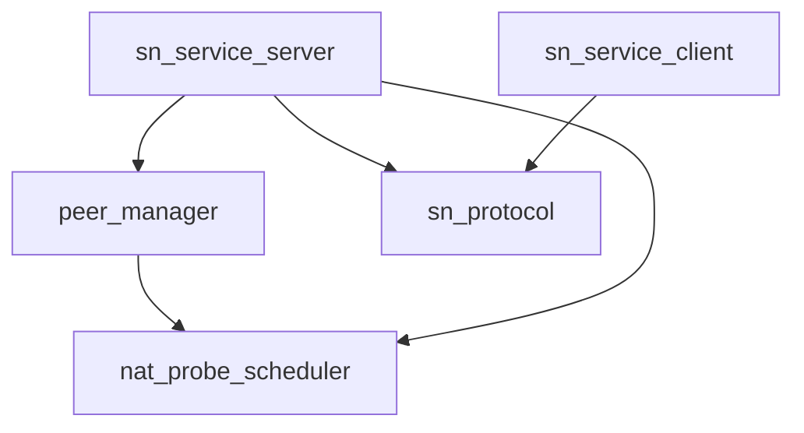

# Pipeline Plan

## Trigger
- Proposal: docs/versions/v0.1/modules/p2p-frame/022-on-demand-nat-probing/proposal.md
- User launch confirmed: yes
- User launch statement: “确认，自动完成”
- Per-stage user confirmation: skipped by explicit user auto-pipeline authorization
- Auto-confirm completed document stages: no design/testing Markdown documents generated; repository-local document extensions only
- Auto-pipeline document policy: no design/testing markdown docs; testplan.yaml required
- Version: v0.1
- Packet module: p2p-frame
- Task name: 022-on-demand-nat-probing
- Target module(s): p2p-frame
- change_id values: sn_nat_probe_trigger_policy, sn_nat_probe_directive_protocol, nat_profile_server_owned_validity, sn_nat_probe_quic_eligibility, sn_nat_probe_two_hour_schedule

## Acceptance Baseline
- Final acceptance is judged against:
  - `proposal.md`

## Stage Graph
| Task ID | Stage | Responsibility | Scope | Parent Task | Depends On | Output | Done Condition |
|---------|-------|----------------|-------|-------------|------------|--------|----------------|
| D-1 | design | map the confirmed SN-owned probe policy to wire, state, lifecycle, and file boundaries | bound task packet | root | none | pipeline plan design mappings and scope bindings | plan checker passes and independent design review has no unresolved requirement ambiguity |
| I-1 | implementation | deliver the admitted scheduling, protocol, server, cache, and client changes | bound task packet | root | D-1 | production code | all file tasks compile and implementation scope passes |
| T-1 | testing | derive post-implementation cases and provide task-scoped unit, DV, integration, compatibility, and runner evidence | bound task packet | root | I-1 | tests, testplan.yaml, unified runner artifact, and state evidence | coverage checker and task all runner pass |
| A-1 | acceptance | independently falsify the proposal, design mapping, implementation, and test evidence | bound task packet | root | T-1 | acceptance report | report checker passes with no blocking finding |

## Submodule Tasks
| Task ID | Stage | Responsibility | Submodule | Parent Task | Depends On | Output | Done Condition |
|---------|-------|----------------|-----------|-------------|------------|--------|----------------|
| I-SCHEDULER-1 | implementation | implement the SN probe scheduling state machine with per-peer ownership and bounded global capacity | `p2p-frame/src/sn/service/nat_probe_scheduler.rs` | I-1 | D-1 | scheduler source | deterministic transitions cover capability, registration, observation, config, demand, capacity, deadline, timeout, and disconnect |
| I-WIRE-1 | implementation | add backward-compatible capability, directive, and correlated result tails | `p2p-frame/src/sn/protocol/sn.rs` | I-1 | D-1 | protocol source | old base layouts remain decodable, old clients receive no directive, and new fields fail closed |
| I-SERVICE-MOD-1 | implementation | register the private scheduler module | `p2p-frame/src/sn/service/mod.rs` | I-1 | I-SCHEDULER-1 | module wiring | scheduler is private to SN service |
| I-PEER-CACHE-1 | implementation | separate peer registration refresh from explicit NAT profile replace and invalidation | `p2p-frame/src/sn/service/peer_manager.rs` | I-1 | I-SCHEDULER-1 | peer cache source | reports cannot implicitly overwrite an authoritative profile |
| I-SERVICE-1 | implementation | bind authenticated report/control traffic to exact tunnels and own trigger, publication, demand, capacity, and disconnect flows | `p2p-frame/src/sn/service/service.rs` | I-1 | I-SCHEDULER-1, I-WIRE-1, I-PEER-CACHE-1, I-SERVICE-MOD-1 | SN service source | only capable authoritative QUIC registrations receive directives and publish matching profiles |
| I-CLIENT-1 | implementation | remove TTL-owned probing, publish online before probe work, and execute only validated SN directives single-flight | `p2p-frame/src/sn/client/sn_service.rs` | I-1 | I-WIRE-1 | SN client source | client reports correlated results without making probe/result delivery an online gate and never autonomously probes |

## Parallel Scheduling
- Strategy: dependency-ready-set
- Concurrency: use all runtime-available child-agent slots
- Shared artifact owner: parent-orchestrator
- Lock directory: `.harness/locks/`
- Dispatch rule: launch the maximum dependency-ready set with disjoint exclusive write scopes before waiting; immediately backfill free slots
- Serialization reasons: explicit dependency, overlapping write scope, or exhausted concurrency capacity only
- Evidence: record launched task ids and serialization reasons in sibling `pipeline/state.json` scheduler waves

## Dependency Graphs

| Level | Parent | Node | Depends On |
|-------|--------|------|------------|
| submodule | p2p-frame | nat_probe_scheduler | none |
| submodule | p2p-frame | sn_protocol | none |
| submodule | p2p-frame | peer_manager | nat_probe_scheduler |
| submodule | p2p-frame | sn_service_server | nat_probe_scheduler, sn_protocol, peer_manager |
| submodule | p2p-frame | sn_service_client | sn_protocol |

## Exported Interfaces
| Interface | Owner | Consumer | Compatibility | Affected Callers | Migration Path |
|-----------|-------|----------|---------------|------------------|----------------|
| `NatProbeDirective` additive `ReportSnResp` tail | SN protocol | SN service and SN client | backward-compatible | report response construction and decoding | old peers ignore trailing bytes; absent or malformed tail becomes no directive |
| optional NAT probe control capability plus `NatProbeResult` additive `ReportSn` tail | SN protocol | SN client and SN service | migration-required | report construction and decoding | wire decoding remains additive; old clients omit capability and receive no directive; capable clients advertise version and new SN accepts only exact correlation |
| private `NatProbeScheduler` transition API | SN service scheduler | SN service | new | none outside `sn::service` | no public migration |
| explicit peer NAT profile replace/invalidate methods | peer manager | SN service | backward-compatible | report and query/call handlers | registration refresh preserves profile unless scheduler explicitly changes it |

## API and Build Surface Impact
- Public API impact: migration-required
- Crate-root export change: no
- Build-surface change: no
- Documentation examples affected: no

## Consumer Migration Closure
| Old Symbol | New Path | change_id | Consumer Path | Consumer Kind | Migration Status |
|------------|----------|-----------|---------------|---------------|------------------|
| `probe_active_sn` | directive-only execution | sn_nat_probe_two_hour_schedule | `docs/versions/v0.1/modules/p2p-frame/022-on-demand-nat-probing/pipeline/plan.md` | governance compatibility record | allowed-compatibility-shim |
| not-applicable | scheduler-correlated replace/invalidate | nat_profile_server_owned_validity | `p2p-frame/src/sn/service/service.rs` | internal runtime | migrated |
| not-applicable | unchanged base plus optional tails | sn_nat_probe_directive_protocol | `p2p-frame/src/sn/protocol/sn.rs` | wire consumer | allowed-compatibility-shim |
| not-applicable | add explicit directive/result and client authority fields | sn_nat_probe_directive_protocol | `p2p-frame/src/sn/tests.rs` | source consumer | migrated |

## State Ownership
| State | Owner | Access Interface | Lifecycle | Failure Transitions |
|-------|-------|------------------|-----------|---------------------|
| per-peer registration generation and authoritative QUIC tunnel id | `NatProbeScheduler` | exact-tunnel report/control observation plus bounded server maintenance | absent to active on eligible traffic; generation advances on tunnel or remote endpoint change; removed within the maintenance bound or synchronously before publication when authority disappears | TCP or missing tunnel invalidates generation and published profile |
| client NAT probe control capability | client `ReportSn` extension and SN scheduler | optional version declaration on every capable report | absent for legacy clients; retained only for the current registration | absent/unknown capability prevents directive issuance and therefore prevents old-client retry loops |
| probe configuration generation | `NatProbeScheduler` | normalized configured endpoint snapshot supplied by SN service | advances only when effective configured endpoints change | empty/invalid configuration cancels outstanding work and publication |
| directive request, deadline, and global capacity | `NatProbeScheduler` | `on_report`, `mark_demand`, and time-driven transition methods | idle to in-flight once per generation only while the global in-flight ceiling has capacity; matching completion returns to idle with next deadline at completion plus two hours | timeout completes as Unknown, rejects late result, releases capacity, applies bounded backoff, and retains next two-hour deadline |
| authoritative NAT profile lease | SN scheduler plus peer manager publication cache | matching result transition and explicit cache replace/invalidate | valid only for current peer, SN, registration, observation, and config generation | disconnect, generation change, Unknown, or invalid result immediately removes publication |
| client directive single-flight | active SN client entry | validated report response and correlated follow-up report | idle to running for current SN/peer/generation/request; returns idle after report attempt | duplicate, stale, wrong identity, invalid endpoints, reset, or late completion is ignored and cannot refresh profile |

## Failure Flows
| Flow | Boundary | Failure | Handling |
|------|----------|---------|----------|
| authenticated report tunnel lookup | command server to SN service | tunnel id absent, peer mismatch, or transport not QUIC | no directive; invalidate only the affected authoritative registration when evidence proves it is gone; return normal report response |
| directive delivery | SN service to client | old client omits capability or response is lost | old clients receive no directive; capable current registration remains usable without profile; in-flight expires boundedly and next two-hour deadline remains available |
| UDP observation | client to configured probes | timeout, malformed reply, or insufficient observations | report correlated Unknown; SN clears old profile and schedules from completion time |
| result acceptance | client report to scheduler | identity, registration generation, request id, config generation, or deadline mismatch | reject fail closed without changing current profile or deadline |
| endpoint or configuration change | SN observation to scheduler | old probe completes after generation advance | profile was invalidated at change; late result is rejected; one new directive is issued when eligible |
| query/call demand | authorized request to target scheduler | target profile missing or Unknown | mark one pending retry subject to backoff; current request continues existing legacy/PN fallback and never waits |
| command tunnel disconnect | command server event and bounded authority maintenance to SN service | final peer tunnel or authoritative QUIC tunnel among mixed transports disappears | remove schedule and invalidate published profile before any query/call/detail publication and within the maintenance bound; a later QUIC report creates a new generation |

## Rejected Alternatives
| Decision Type | Selected | Rejected | Reason |
|---------------|----------|----------|--------|
| boundary | SN owns trigger, deadline, correlation, and publication | client TTL, reset, or local endpoint owns probing | SN has authenticated tunnel protocol and remote endpoint evidence |
| technical | additive optional capability/result request tail and optional directive response tail | blind directive delivery to legacy clients, replace legacy fields, or require a new mandatory command | preserves old-wire decoding, prevents legacy retry loops, and keeps current query/call and online publication non-blocking |
| technical | directive returned on the next authenticated QUIC `ReportSnResp` | TCP fallback or synchronous query/call wait | the report already binds peer and tunnel; TCP is explicitly ineligible |
| technical | per-peer completion-based two-hour deadline with bounded timeout/backoff | global interval tick or immediate retry loop | avoids synchronized bursts, duplicate event/periodic issuance, and permanent in-flight stalls |
| collaboration | file-scoped implementation tasks with parent-owned shared artifacts | concurrent edits to plan, state, testplan, or runner | prevents shared-artifact conflicts while retaining independent review |

## Implementation Scope Bindings
| change_id | target_module | proposal_id | design_coverage | scope_paths | design_rules_applied |
|-----------|---------------|-------------|-----------------|-------------|----------------------|
| sn_nat_probe_trigger_policy | p2p-frame | P-ODNP-1 | exact authenticated report/control tunnel observation, normalized endpoint/config change, pending demand, timeout/backoff, bounded authority maintenance, global issuance capacity, and no synchronous online wait | `p2p-frame/src/sn/service/nat_probe_scheduler.rs`, `p2p-frame/src/sn/service/mod.rs`, `p2p-frame/src/sn/service/service.rs` | state ownership, dependency mapping, failure flow, least privilege, bounded capacity |
| sn_nat_probe_directive_protocol | p2p-frame | P-ODNP-2 | versioned optional capability/result request tail and directive response tail bind support, identities and correlation fields while preserving legacy base bytes | `p2p-frame/src/sn/protocol/sn.rs`, `p2p-frame/src/sn/client/sn_service.rs`, `p2p-frame/src/sn/service/service.rs` | interface compatibility, consumer closure, malformed-input failure, mixed-version lifecycle |
| nat_profile_server_owned_validity | p2p-frame | P-ODNP-3 | scheduler generation owns publication and peer registration refresh cannot renew observation or overwrite profile | `p2p-frame/src/sn/service/nat_probe_scheduler.rs`, `p2p-frame/src/sn/service/peer_manager.rs`, `p2p-frame/src/sn/service/service.rs`, `p2p-frame/src/sn/client/sn_service.rs` | single owner, lifecycle, cache invalidation, compatibility |
| sn_nat_probe_quic_eligibility | p2p-frame | P-ODNP-4 | exact tunnel id, authenticated peer, remote protocol, registration generation, disconnect, and stale result checks fail closed | `p2p-frame/src/sn/service/nat_probe_scheduler.rs`, `p2p-frame/src/sn/service/service.rs`, `p2p-frame/src/sn/client/sn_service.rs` | trust boundary, state transitions, race handling |
| sn_nat_probe_two_hour_schedule | p2p-frame | P-ODNP-5 | one SN-owned completion-based two-hour deadline, no client timer, no in-flight reentry, bounded timeout and retry | `p2p-frame/src/sn/service/nat_probe_scheduler.rs`, `p2p-frame/src/sn/client/sn_service.rs`, `p2p-frame/src/sn/service/service.rs` | time model, concurrency, resource bounds, failure recovery |

## File-Level Implementation Sequence
| Sequence | Task ID | File-Level Module | Action | Depends On | change_id | target_module | Scope Paths | Context Sources |
|----------|---------|-------------------|--------|------------|-----------|---------------|-------------|-----------------|
| 1 | I-SCHEDULER-1 | `p2p-frame/src/sn/service/nat_probe_scheduler.rs` | create pure server-owned scheduler, negotiated capability, bounded global issuance and transition results | none | sn_nat_probe_trigger_policy | p2p-frame | `p2p-frame/src/sn/service/nat_probe_scheduler.rs` | proposal P-ODNP-1, P-ODNP-3 through P-ODNP-5; current peer/tunnel lifecycle and capacity risk |
| 2 | I-WIRE-1 | `p2p-frame/src/sn/protocol/sn.rs` | add tolerant capability/result request and directive response tails | none | sn_nat_probe_directive_protocol | p2p-frame | `p2p-frame/src/sn/protocol/sn.rs` | proposal P-ODNP-2; existing additive codec envelopes and old-client lifecycle |
| 3 | I-SERVICE-MOD-1 | `p2p-frame/src/sn/service/mod.rs` | register private scheduler module | I-SCHEDULER-1 | sn_nat_probe_trigger_policy | p2p-frame | `p2p-frame/src/sn/service/mod.rs` | custom facade-only module rule |
| 4 | I-PEER-CACHE-1 | `p2p-frame/src/sn/service/peer_manager.rs` | split registration update from explicit profile publication | I-SCHEDULER-1 | nat_profile_server_owned_validity | p2p-frame | `p2p-frame/src/sn/service/peer_manager.rs` | current CachedPeerInfo update and eviction behavior |
| 5 | I-SERVICE-1 | `p2p-frame/src/sn/service/service.rs` | integrate exact tunnel lookup, report/control observation, scheduler, config, demand, result, query/call publication, and bounded mixed-tunnel disconnect invalidation | I-SCHEDULER-1, I-WIRE-1, I-SERVICE-MOD-1, I-PEER-CACHE-1 | sn_nat_probe_quic_eligibility | p2p-frame | `p2p-frame/src/sn/service/service.rs` | current ReportSn, QuerySn, SnCall, SnCalledResp, command server, and config flows |
| 6 | I-CLIENT-1 | `p2p-frame/src/sn/client/sn_service.rs` | remove TTL probe decision, advertise capability, publish online before UDP work, and implement directive validation, single-flight execution, and correlated report | I-WIRE-1 | sn_nat_probe_two_hour_schedule | p2p-frame | `p2p-frame/src/sn/client/sn_service.rs` | current ActiveSN report/reset/query/call flow and NAT probe runtime |

## Return Rules
- If acceptance finds genuine proposal ambiguity, stop the pipeline and ask the user; the explicit final instruction that periodic probing remains at two hours governs any earlier wording conflict.
- Return to design when wire compatibility, exact-tunnel authority, state ownership, deadlines, backoff, or publication invalidation is absent or internally inconsistent.
- Return to implementation when the design is adequate but code probes on TCP, probes from a client timer, overwrites a profile without correlation, accepts stale results, blocks query/call, or leaks an old profile.
- Return to testing for missing codec, fake-time, state-machine, QUIC/TCP, mixed-version, lifecycle, real UDP, report/query/call/context, or unified-runner evidence.
- For a non-requirement finding, repeat the owning stage and downstream testing before rerunning independent acceptance.
- If the same unresolved issue remains after more than 5 unsuccessful iterations, stop and report it to the user.

Execution status, testing evidence, return records, and final acceptance are stored in sibling `state.json`. They are deliberately excluded from this admission-bound plan.
