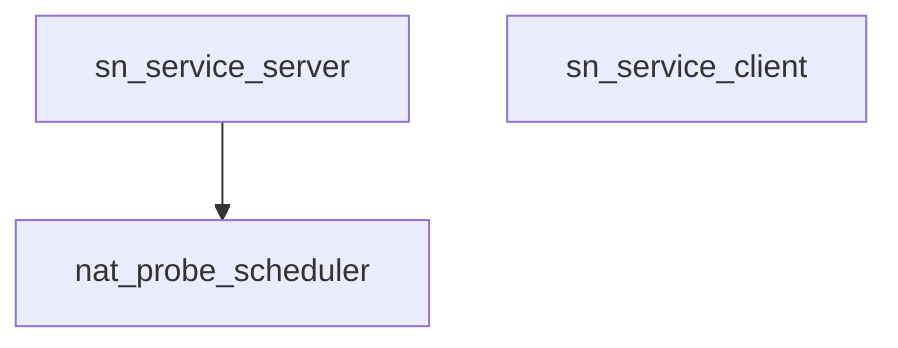

# Pipeline Plan

## Trigger
- Proposal: docs/versions/v0.1/modules/p2p-frame/023-nat-probe-lifecycle-logging/proposal.md
- User launch confirmed: yes
- User launch statement: “确认，自动完成”
- Per-stage user confirmation: skipped by explicit user auto-pipeline authorization
- Auto-confirm completed document stages: no design/testing Markdown documents generated; repository-local document extensions only
- Auto-pipeline document policy: no design/testing markdown docs; testplan.yaml required
- Version: v0.1
- Packet module: p2p-frame
- Task name: 023-nat-probe-lifecycle-logging
- Target module(s): p2p-frame
- change_id values: sn_nat_probe_server_lifecycle_logging, sn_nat_probe_client_lifecycle_logging, sn_nat_probe_log_safety_and_noise_control

## Acceptance Baseline
- Final acceptance is judged against:
  - `proposal.md`

## Stage Graph
| Task ID | Stage | Responsibility | Scope | Parent Task | Depends On | Output | Done Condition |
|---------|-------|----------------|-------|-------------|------------|--------|----------------|
| D-1 | design | map the confirmed observability contract to state-owned reasons, logging boundaries, levels, privacy and file ownership | bound task packet | root | none | pipeline plan design mappings and scope bindings | plan checker and design scope pass without design/testing Markdown |
| I-1 | implementation | deliver admitted server and client lifecycle logging without behavior or contract changes | bound task packet | root | D-1 | production code | file tasks compile and implementation scope passes |
| T-1 | testing | derive post-implementation logging, safety, noise and behavior-regression cases and wire them into the task runner | bound task packet | root | I-1 | tests, testplan.yaml, task runner artifact and state evidence | coverage, testing scope and task all runner pass |
| A-1 | acceptance | independently falsify log completeness, truthfulness, safety, noise and unchanged NAT behavior | bound task packet | root | T-1 | acceptance report | report checker passes with no blocking finding |

## Submodule Tasks
| Task ID | Stage | Responsibility | Submodule | Parent Task | Depends On | Output | Done Condition |
|---------|-------|----------------|-----------|-------------|------------|--------|----------------|
| I-SCHEDULER-LOG-1 | implementation | preserve exact trigger/rejection/suppression reasons at the scheduler state transition that owns them and emit server lifecycle events | `p2p-frame/src/sn/service/nat_probe_scheduler.rs` | I-1 | D-1 | scheduler source | every material transition has one truthful level/event/reason without changing scheduling outcomes |
| I-SERVICE-LOG-1 | implementation | add authenticated tunnel, cache, configuration and result-report context around scheduler-owned events | `p2p-frame/src/sn/service/service.rs` | I-1 | I-SCHEDULER-LOG-1 | SN service source | server lifecycle events are correlated and maintenance/stable traffic stays quiet |
| I-CLIENT-LOG-1 | implementation | classify directive validation failures and log client UDP execution plus result-report terminals | `p2p-frame/src/sn/client/sn_service.rs` | I-1 | D-1 | SN client source | client logs exact rejection/start/terminal/report outcomes without changing online or probe behavior |

## Parallel Scheduling
- Strategy: dependency-ready-set
- Concurrency: use all runtime-available child-agent slots
- Shared artifact owner: parent-orchestrator
- Lock directory: `.harness/locks/`
- Dispatch rule: launch the maximum dependency-ready set with disjoint exclusive write scopes before waiting; immediately backfill free slots
- Serialization reasons: explicit dependency, overlapping write scope, or exhausted concurrency capacity only
- Evidence: record launched task ids and serialization reasons in sibling `pipeline/state.json` scheduler waves

## Dependency Graphs

| Level | Parent | Node | Depends On |
|-------|--------|------|------------|
| submodule | p2p-frame | nat_probe_scheduler | none |
| submodule | p2p-frame | sn_service_server | nat_probe_scheduler |
| submodule | p2p-frame | sn_service_client | none |

## Exported Interfaces
| Interface | Owner | Consumer | Compatibility | Affected Callers | Migration Path |
|-----------|-------|----------|---------------|------------------|----------------|
| crate-private scheduler trigger, suppression and result-rejection reason values | SN probe scheduler | SN service logging boundary and sn_nat_probe_server_lifecycle_logging | new | no caller outside `sn::service` | no public migration; reason values remain internal and do not enter wire data |
| private client directive rejection reason | SN client | SN client execution logger and sn_nat_probe_client_lifecycle_logging | new | no external caller | no migration; existing boolean validity outcome is preserved |
| `nat_probe_*` operational event names and reason strings | SN service and client | operators and sn_nat_probe_log_safety_and_noise_control | backward-compatible | existing logging consumers see additive events | existing unrelated log messages remain valid; no machine schema or wire version is introduced |

## API and Build Surface Impact
- Public API impact: none
- Crate-root export change: no
- Build-surface change: no
- Documentation examples affected: no

## Consumer Migration Closure
| Old Symbol | New Path | change_id | Consumer Path | Consumer Kind | Migration Status |
|------------|----------|-----------|---------------|---------------|------------------|
| not-applicable | crate-private scheduler reason values | sn_nat_probe_server_lifecycle_logging | `p2p-frame/src/sn/service/service.rs` | internal runtime | migrated in task scope |
| not-applicable | private client rejection reason | sn_nat_probe_client_lifecycle_logging | `p2p-frame/src/sn/client/sn_service.rs` | internal runtime | verified-none |
| existing free-text NAT probe warnings | additive `nat_probe_*` event/reason format | sn_nat_probe_log_safety_and_noise_control | `p2p-frame/src/sn/service/service.rs`, `p2p-frame/src/sn/client/sn_service.rs` | internal operational logs | migrated only where the current probe lifecycle is touched |

## State Ownership
| State | Owner | Access Interface | Lifecycle | Failure Transitions |
|-------|-------|------------------|-----------|---------------------|
| pending probe trigger reason | `NatProbeScheduler::PeerProbeState` | report/control/config/demand observation and issuance | absent to one of online/external_address/config/demand; consumed exactly when a directive is issued or a terminal transition clears it | timeout/result/authority loss clears or replaces the reason consistently with existing pending work semantics |
| scheduler rejection/suppression reason | scheduler branch currently deciding the outcome | crate-private enum/value returned or emitted at the decision point | ephemeral per attempted result or pending issuance; never becomes a scheduling input | unknown branches fail closed and log only at debug without changing state |
| client directive rejection reason | `SNClientService` validation function | `SNClientService::validate_probe_directive` returns a Rust result whose error is `NatProbeDirectiveRejectReason` | created only for one received directive and discarded after the debug event | rejected directive still performs no UDP or result report work |
| operational log emission | existing `log` facade | level-gated `log::{debug,info,warn}!` calls | emitted after or at the owning state transition; no durable log state | disabled logger or filtered level has no control-flow effect |

## Failure Flows
| Flow | Boundary | Failure | Handling |
|------|----------|---------|----------|
| scheduler trigger to directive | scheduler state to ReportSn response | no capability/endpoints, in-flight request, backoff or global capacity | retain existing pending semantics; emit only debug suppression with exact reason when real work is pending |
| result report to profile publication | client ReportSn to scheduler/service cache | version, identity, generation, request, freshness or deadline mismatch | preserve current profile/state, emit one debug rejection reason, and never log raw result/profile bytes |
| client directive validation | ReportSnResp to UDP probe runtime | protocol, identity, replay, deadline or endpoint validation fails | execute no UDP, emit one debug reason and return existing `None` outcome |
| client UDP observation | client directive to probe endpoints | timeout, malformed response or insufficient observation | keep existing Unknown result semantics and emit one warn terminal event without endpoint list/token/payload |
| result report delivery | client result to SN command tunnel | response send/read/decode fails | retain active SN and existing recovery behavior; emit warn with request correlation and sanitized error |
| authority/config lifecycle | command tunnel/config to scheduler/cache | authority disappears or endpoint configuration becomes invalid | preserve existing invalidation, emit one info or warn transition, and keep 250ms maintenance ticks silent |

## Rejected Alternatives
| Decision Type | Selected | Rejected | Reason |
|---------------|----------|----------|--------|
| boundary | scheduler produces reasons and service/client log their owned runtime context | infer reasons later from final profile/directive values | inferred logs can disagree with the branch that actually changed state |
| technical | existing `log` facade with stable event/reason tokens | new tracing, metrics, sink, config or persistence subsystem | the request needs process visibility, not a new observability platform or build surface |
| technical | info for low-frequency transitions, warn for actionable failures, debug for compatibility/suppression/details | log every report, decision or maintenance tick at info/warn | avoids attacker- or traffic-amplified logging and protects endpoint details by default |
| technical | private reason values with unchanged wire/public API | add reason fields to ReportSn, directives or public structs | no remote consumer needs the reasons and a wire change would create needless compatibility risk |
| collaboration | file-scoped implementation with parent-owned plan/state/testplan | concurrent edits to shared pipeline artifacts | keeps reason ownership separable while preventing shared-artifact conflicts |

## Implementation Scope Bindings
| change_id | target_module | proposal_id | design_coverage | scope_paths | design_rules_applied |
|-----------|---------------|-------------|-----------------|-------------|----------------------|
| sn_nat_probe_server_lifecycle_logging | p2p-frame | P-NPLL-1 | scheduler-owned trigger/result/suppression reasons plus service-owned authenticated tunnel, configuration and profile cache context | `p2p-frame/src/sn/service/nat_probe_scheduler.rs`, `p2p-frame/src/sn/service/service.rs` | state ownership, failure flow, truthful observability, bounded noise |
| sn_nat_probe_client_lifecycle_logging | p2p-frame | P-NPLL-2 | private precise directive validation result and correlated client start/terminal/result-report logging | `p2p-frame/src/sn/client/sn_service.rs` | private interface, failure flow, online-path preservation |
| sn_nat_probe_log_safety_and_noise_control | p2p-frame | P-NPLL-3 | level boundaries, debug-only endpoint detail, forbidden raw/certificate/token/payload values and transition-only high-level emission | `p2p-frame/src/sn/service/nat_probe_scheduler.rs`, `p2p-frame/src/sn/service/service.rs`, `p2p-frame/src/sn/client/sn_service.rs` | least data, capacity safety, compatibility, no new dependencies |

## File-Level Implementation Sequence
| Sequence | Task ID | File-Level Module | Action | Depends On | change_id | target_module | Scope Paths | Context Sources |
|----------|---------|-------------------|--------|------------|-----------|---------------|-------------|-----------------|
| 1 | I-SCHEDULER-LOG-1 | `p2p-frame/src/sn/service/nat_probe_scheduler.rs` | add private reason values, preserve the exact pending trigger and emit transition-owned server events | none | sn_nat_probe_server_lifecycle_logging | p2p-frame | `p2p-frame/src/sn/service/nat_probe_scheduler.rs` | proposal P-NPLL-1/P-NPLL-3; current scheduler state transitions |
| 2 | I-CLIENT-LOG-1 | `p2p-frame/src/sn/client/sn_service.rs` | return precise private directive rejection reasons and add correlated execution/report events | none | sn_nat_probe_client_lifecycle_logging | p2p-frame | `p2p-frame/src/sn/client/sn_service.rs` | proposal P-NPLL-2/P-NPLL-3; current directive/report paths |
| 3 | I-SERVICE-LOG-1 | `p2p-frame/src/sn/service/service.rs` | add authenticated context, configuration/authority/invalidation events and sanitized result/report lifecycle logging | I-SCHEDULER-LOG-1 | sn_nat_probe_log_safety_and_noise_control | p2p-frame | `p2p-frame/src/sn/service/service.rs` | proposal P-NPLL-1/P-NPLL-3; scheduler reason interface and service lifecycle |

## Return Rules
- If acceptance finds ambiguity over which endpoint or identity fields may be logged, stop and ask the user; never broaden beyond the proposal's debug-only endpoint and all-level secret/token/raw-payload prohibition.
- Return to design when reason ownership, event/level boundaries, noise controls or privacy handling are absent or internally inconsistent.
- Return to implementation when adequate design exists but logs are missing, misleading, duplicated, expose prohibited data, or alter 022 behavior.
- Return to testing when normal, rejection, failure, lifecycle, safety, noise or unchanged-behavior evidence is missing or cannot observe the intended events.
- For a non-requirement finding, repeat the owning stage and downstream testing before rerunning acceptance.
- If the same unresolved issue remains after more than 5 unsuccessful iterations, stop and report it to the user.

Execution status, testing evidence, return records, and final acceptance are stored in sibling `state.json`. They are deliberately excluded from this admission-bound plan.
