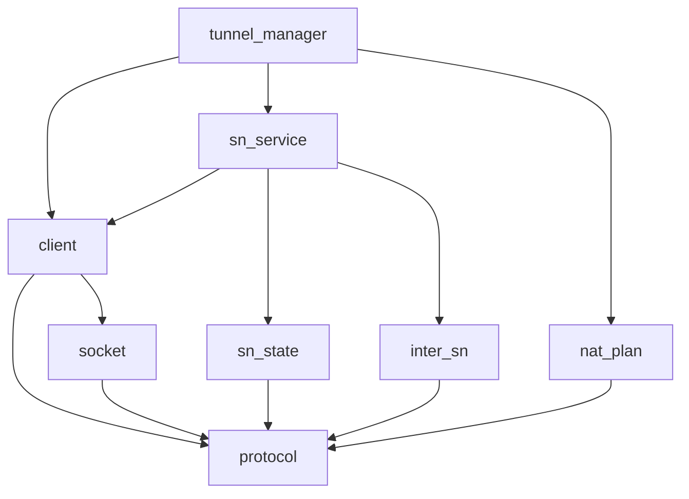

# Pipeline Plan

## Trigger
- Proposal: docs/versions/v0.1/modules/p2p-frame/024-tunnel-rendezvous-protocol/proposal.md
- User launch confirmed: yes
- User launch statement: “确认，自动完成”
- Per-stage user confirmation: skipped by explicit user auto-pipeline authorization
- Auto-confirm completed document stages: no design/testing Markdown documents generated; repository-local document extensions only
- Auto-pipeline document policy: no design/testing markdown docs; testplan.yaml required
- Version: v0.1
- Packet module: p2p-frame
- Task name: 024-tunnel-rendezvous-protocol
- Target module(s): p2p-frame
- change_id values: sn_tunnel_rendezvous_wire_contract, sn_tunnel_rendezvous_action_modes, sn_tunnel_rendezvous_endpoint_ownership, quic_rendezvous_socket_binding, sn_tunnel_rendezvous_lifecycle, sn_tunnel_rendezvous_security, tunnel_manager_rendezvous_integration

## Acceptance Baseline
- Final acceptance is judged against:
  - `proposal.md`

## Stage Graph
| Task ID | Stage | Responsibility | Scope | Parent Task | Depends On | Output | Done Condition |
|---------|-------|----------------|-------|-------------|------------|--------|----------------|
| D-1 | design | freeze the independent wire family, socket ownership, relay, state, security, fallback and consumer mappings | bound task packet | root | none | this pipeline plan and sibling state | `pipeline-plan-check.py` passes and all seven change ids have concrete scope bindings |
| I-1 | implementation | deliver the minimum production implementation in dependency order | bound task packet | root | D-1 | protocol, socket, client, SN relay and TunnelManager source | admission passes and implementation scope check passes |
| T-1 | testing | derive post-implementation cases, create dedicated test files, wire the unified entry and capture results | bound task packet | root | I-1 | tests, `testplan.yaml`, runner wiring and state evidence | coverage checker and `test-run.py p2p-frame/024-tunnel-rendezvous-protocol all` pass or record explicit environment-only gaps |
| A-1 | acceptance | independently attempt to falsify requirement, protocol, lifecycle, security and test adequacy | bound task packet | root | T-1 | acceptance report | report checker passes and conclusion is accepted; otherwise route to the owning automatic stage |

## Submodule Tasks
| Task ID | Stage | Responsibility | Submodule | Parent Task | Depends On | Output | Done Condition |
|---------|-------|----------------|-----------|-------------|------------|--------|----------------|
| I-PROTOCOL-1 | implementation | add the independent command ids, envelopes, operations, exact business bodies, typed results and terminal messages | `sn/protocol` | I-1 | D-1 | `common.rs`, `sn.rs` | raw codecs reject unsupported/malformed/oversize values and preserve exact request/response body shape |
| I-SOCKET-1 | implementation | route PNAT responses out of the QUIC receive loop and predict through the listener-owned traversal socket and generation | `sn/nat_probe`, `networks/quic` | I-1 | I-PROTOCOL-1 | socket-bound prediction interface and QUIC implementation | observation, prediction, punch and connect share the listener binding; close/rebuild invalidates generation |
| I-CLIENT-1 | implementation | implement initiator request/terminal APIs and target notify/terminal handlers | `sn/client` | I-1 | I-PROTOCOL-1, I-SOCKET-1 | `sn_service.rs` | target callback completes prediction/action arm before success and response invariants are revalidated by initiator |
| I-SN-STATE-1 | implementation | own bounded in-memory idempotency, TTL, digest and rate/concurrency decisions | `sn/service/rendezvous_state.rs` | I-1 | I-PROTOCOL-1 | rendezvous state module | duplicate same-digest requests are idempotent; conflict/replay/capacity/deadline fail closed and terminal removes state |
| I-INTER-SN-1 | implementation | relay rendezvous QA and terminal messages across authenticated SN tunnels | `sn/inter_sn` | I-1 | I-PROTOCOL-1 | inter-SN request/response variants and validator context | every relay hop preserves authenticated initiator/target and typed response; unsupported hop fails closed |
| I-SN-SERVICE-1 | implementation | authenticate A, validate endpoint ownership, enter bounded state, deliver to local/remote B, cache response and relay terminal cleanup | `sn/service` | I-1 | I-CLIENT-1, I-SN-STATE-1, I-INTER-SN-1 | SN handlers and relay implementation | same-SN/cross-SN paths return B response without SN predicting endpoints or treating action arm as Connected |
| I-PLAN-1 | implementation | translate the existing NAT-aware connector plan into one of four target operations and two request-body inputs | `tunnel/nat_connect_plan.rs` | I-1 | I-PROTOCOL-1 | deterministic rendezvous request plan | all plan outputs have one connector and legal endpoint/prediction combinations without NAT data on wire |
| I-TUNNEL-1 | implementation | own A/B attempt tasks, waiter ordering, socket prediction, response consumption, collision, cancel/complete and serial fallback | `tunnel/tunnel_manager.rs` | I-1 | I-CLIENT-1, I-SN-SERVICE-1, I-PLAN-1 | end-to-end runtime integration | waiter-before-request and action-before-response hold; only registered transport tunnel wins and cancels sibling work |

## Parallel Scheduling
- Strategy: dependency-ready-set
- Concurrency: use all runtime-available child-agent slots; the current higher-priority delegation boundary leaves one parent slot because the user did not explicitly request sub-agents
- Shared artifact owner: parent-orchestrator
- Lock directory: `.harness/locks/`
- Dispatch rule: launch the maximum dependency-ready set with disjoint exclusive write scopes before waiting and immediately backfill free slots; under the current one-parent boundary, execute that set in file-level order while preserving the dirty worktree and existing task 020/022/023 changes
- Serialization reasons: explicit dependency, overlapping write scope, or exhausted concurrency capacity only; protocol types are consumed by every later layer, socket ownership precedes client callbacks, and SN relay/state precedes TunnelManager integration
- Evidence: record each completed task and any return in sibling `pipeline/state.json`

## Dependency Graphs

| Level | Parent | Node | Depends On |
|-------|--------|------|------------|
| submodule | p2p-frame | protocol | none |
| submodule | p2p-frame | socket | protocol |
| submodule | p2p-frame | client | protocol, socket |
| submodule | p2p-frame | sn_state | protocol |
| submodule | p2p-frame | inter_sn | protocol |
| submodule | p2p-frame | sn_service | client, sn_state, inter_sn |
| submodule | p2p-frame | nat_plan | protocol |
| submodule | p2p-frame | tunnel_manager | client, sn_service, nat_plan |

## Exported Interfaces
| Interface | Owner | Consumer | Compatibility | Affected Callers | Migration Path |
|-----------|-------|----------|---------------|------------------|----------------|
| `SnTunnelRendezvousRequestBody { endpoints, need_predict_endpoint }` and `SnTunnelRendezvousResponseBody { predicted_endpoints }` | `sn/protocol` | SN client, SN service, inter-SN relay, TunnelManager, protocol tests | new | no legacy caller | additive command ids `0x28..=0x2b`; legacy `SnCall` bytes and handlers stay unchanged |
| `SnTunnelRendezvousOperation` with `PunchOnly`, `PunchAndReverseConnect`, `ReverseConnectOnly`, `WaitIncoming` | `sn/protocol` | `nat_connect_plan`, client validation, target TunnelManager | new | NAT-aware internal call path | strategy maps to enum before encoding; no NAT type/profile fields are encoded |
| versioned rendezvous envelope/result/terminal types | `sn/protocol` | client/SN/inter-SN/TunnelManager | new | authenticated SN command consumers | unknown version/action/result is typed unsupported/invalid and may fall back only after cancellation |
| independent one-method `SNRendezvousEvent` callback carrying request/terminal event variants | `sn/client` | TunnelManager | new | no existing `SNEvent` implementor | register a second optional listener; the legacy one-method `SNEvent` and its closure adapter remain byte/source unchanged |
| defaulted traversal prediction method returning endpoints, binding generation and validity | `networks::TunnelNetwork` | SN client/TunnelManager | backward-compatible | QUIC network implements; TCP/custom networks retain unsupported default | only QUIC listener-backed networks participate in endpoint prediction |
| inter-SN rendezvous QA/terminal variants and `SnInterClient`/`InterSnPeer` methods | `sn/inter_sn`, `sn/service` | owner/member SN runtime and test doubles | new | current test doubles use default unsupported methods or receive new required mock methods | mixed version reports unsupported and initiator serially uses legacy/PN fallback |
| deterministic `RendezvousPlan` derived from `ConnectPlan` | `tunnel/nat_connect_plan` | TunnelManager | new | current NAT-aware path only | legacy plan remains available and is selected after cancelled unsupported/failed rendezvous |

## API and Build Surface Impact
- Public API impact: backward-compatible
- Crate-root export change: no
- Build-surface change: no
- Documentation examples affected: no

## Consumer Migration Closure
| Old Symbol | New Path | change_id | Consumer Path | Consumer Kind | Migration Status |
|------------|----------|-----------|---------------|---------------|------------------|
| `PackageCmdCode` ending at `SnQueryResp` | additive `SnTunnelRendezvous*` ids after `0x27` | sn_tunnel_rendezvous_wire_contract | `p2p-frame/src/sn/client/sn_service.rs`, `p2p-frame/src/sn/service/service.rs` | internal wire consumers | task scope migration; old ids unchanged |
| `InterSnCommandCode::RelayCall` as last variant | additive rendezvous relay command | sn_tunnel_rendezvous_wire_contract | `p2p-frame/src/sn/inter_sn/mod.rs`, `p2p-frame/src/sn/service/service.rs` | internal SN consumer | task scope migration; relay-call behavior unchanged |
| `SNEvent::on_called` only | separate `SNRendezvousEvent` listener | sn_tunnel_rendezvous_lifecycle | `p2p-frame/src/tunnel/tunnel_manager.rs` | public callback consumer | old listener remains unchanged; TunnelManager explicitly registers the new event callback |
| `TunnelNetwork` without socket prediction | defaulted prediction API | quic_rendezvous_socket_binding | `p2p-frame/src/networks/quic/network.rs`, other network/test implementations | public trait consumer | default unsupported preserves source compatibility; QUIC opts in |
| NAT-aware `SnCall.nat_context` execution | independent rendezvous first, then cancelled legacy/PN fallback | tunnel_manager_rendezvous_integration | `p2p-frame/src/tunnel/tunnel_manager.rs` | internal runtime | new-new attempts use one new path; old/missing capability uses one legacy path |

## State Ownership
| State | Owner | Access Interface | Lifecycle | Failure Transitions |
|-------|-------|------------------|-----------|---------------------|
| immutable wire request/response business data | protocol value object | raw codec plus `validate()` | created once; request body remains exactly two fields and response body one field | unsupported version, illegal action/body relation, oversize, duplicate, invalid transport or response-list mismatch becomes typed failure before action |
| QUIC socket binding generation and pending PNAT token waiters | `QuicTunnelListener` | traversal prediction method and receive dispatcher | random/nonzero generation created with listener; tokens registered before send and removed on response/timeout/drop; close invalidates all | close wakes/fails waiters; rebuild has a new generation; stale generation is rejected before punch/connect |
| SN rendezvous attempt entry | `RendezvousState` inside serving SN | begin/cache-response/terminal/expire | `Received -> Relaying -> Responded -> terminal`; bounded by 8 attempts per initiator-target pair, 256 total, 30-second maximum deadline and TTL | conflicting digest, replay after terminal, deadline or capacity returns typed failure; disconnect/terminal/TTL removes state |
| target B action owner | TunnelManager attempt map | rendezvous callback and terminal callback | `Received -> Predicting(optional) -> Armed/Acting -> Connected/Failed/Expired/Cancelled` | validation/prediction failure returns before insert; cancel/deadline/first Connected aborts task and removes waiter |
| initiator A attempt owner | TunnelManager call future plus attempt map | request API, local action and terminal sender | waiter and owner installed before request; `Requesting -> Responded -> Acting -> Connected/Failed` | request/action timeout or typed failure sends Cancel, waits for local cleanup, then starts exactly one legacy/PN fallback |
| logical tunnel publication | TunnelManager existing tunnel registry | register/publish path | only successful transport handshake enters registry; first available tunnel wins | duplicate/late tunnel is closed; success sends best-effort Complete and cancels sibling attempt work |

## Key Call Flows
| Flow | Ordered calls and side effects | Success boundary |
|------|--------------------------------|------------------|
| caller-connect / target-punch | A derives request plan -> predicts A endpoints on A listener if required -> sends request -> SN authenticates/records/relays -> B validates and optionally predicts B endpoints -> B installs active-incoming waiter and arms punch -> B response -> A validates response and connects to existing/predicted B endpoints | A transport handshake is registered/published; then Complete cleans B/SN state |
| target reverse-connect | A installs reverse-incoming waiter -> sends request endpoints -> B validates/predicts if requested -> B arms reverse connect, optionally with punch, before response -> A consumes response only for its requested punch behavior and waits | B transport handshake arrives at A waiter and is registered/published |
| both symmetric | A predicts A endpoints from A traversal socket -> request has those endpoints and `need_predict_endpoint=true` -> B predicts B endpoints from B traversal socket, arms PunchOnly, returns B endpoints -> A connects to B endpoints while B punches A endpoints | real QUIC/TLS handshake only; either prediction failure is typed and cancels before fallback |
| cross-SN | serving SN A authenticates A -> owner directory chooses serving SN B -> authenticated inter-SN QA carries unchanged envelope/body -> SN B validates relay identity and delivers notify -> response returns on same QA chain | same response invariant as same-SN; any unsupported relay hop is `SnRelayFailure` and no second new attempt is started |

## Failure Flows
| Flow | Boundary | Failure | Handling |
|------|----------|---------|----------|
| request decode/validation | client/SN/target trust boundary | malformed, unknown version/action, wrong target, empty/nonempty mismatch, duplicate/over-eight endpoint or bad transport | reject before state/action with stable typed reason; do not reinterpret as legacy bytes |
| endpoint ownership | authenticated A to SN and SN to B | endpoint IP differs from A observed/reported public IP, third-party/loopback/private target, zero port or stale generation | reject invalid endpoint; no UDP/connect side effect; log counts/reason without full list |
| prediction | listener socket to reflector | no reflector set, timeout, conflicting observations, unusable hint, close or generation change | `PredictionUnavailable`, `PredictionTimeout` or `StaleGeneration`; true flag never succeeds with empty list |
| target arm | B callback to TunnelManager resources | waiter/task cannot be installed, deadline already passed or operation not supported | abort partial owner, remove waiter and return typed action failure; SN caches same failure for duplicate digest |
| response | SN QA to A | response ids/digest/result/list invariant mismatch or arrives after deadline/cancel | discard, send best-effort Cancel, cleanup A owner, then serial fallback if logical tunnel is not Connected |
| duplicate/conflict | SN/B attempt maps | same key same digest or same key changed fields | replay cached response / no duplicate action for same digest; reject changed digest as `RequestConflict` |
| simultaneous initiation | two TunnelManagers | both peers create competing attempts | stable peer-id ordering keeps the lower-id initiator; loser cancels its outbound owner and accepts the winner, while first real Connected still closes any late sibling |
| terminal/disconnect | either peer/SN control tunnel | Complete/Cancel lost, owner drop, peer disconnect or deadline | terminal relay is best effort; each local owner independently aborts and TTL cleanup bounds SN memory |
| mixed version/relay | command or inter-SN hop | unsupported command/version or relay unavailable | cancel any created state, ensure no target action remains, invoke existing legacy `SnCall` once or PN fallback once |

## Security and Capacity Model
- Authentication: SN derives initiator from the authenticated command tunnel and overwrites no identity from message data; target accepts only a notify whose target is local and whose initiator certificate matches the envelope.
- Endpoint policy: at most 8 unique concrete IPv4 QUIC server-reflexive endpoints; punch modes require QUIC; SN requires endpoint IP to match an authenticated observed/reported IP for the initiator.
- Time: absolute caller deadline is capped to 30 seconds and never renewed by relay, prediction or retry; expired requests cannot arm actions.
- State/work: at most 256 live SN entries, 8 live attempts per peer pair, 8 endpoint sends/connect candidates per attempt and one target action task; a fixed per-initiator rolling budget rejects bursts before relay.
- Anti-replay: random 64-bit attempt id plus tunnel/peer/version/deadline/request digest key; same digest is idempotent, changed digest conflicts, terminal ids remain tombstoned until deadline/TTL.
- Logging: stable event/action/count/generation/reason fields only at normal levels; no certificate, token, payload or full endpoint list.

## Rejected Alternatives
| Decision Type | Selected | Rejected | Reason |
|---------------|----------|----------|--------|
| boundary | NAT-aware TunnelManager selects operation/body; protocol only validates and transports it | encode NAT type/profile/hints and let B or SN select strategy | violates the confirmed input contract and lets another node predict an endpoint it does not own |
| boundary | B performs B prediction and returns concrete endpoints before success | A replays B delta/parity locally or SN predicts B ports | prediction ownership and actual socket generation would be false |
| technical | independent `0x28..=0x2b` QA/terminal family with explicit bodies | add optional fields to `SnCall`/`SnCalled` or reuse `SnCalledResp` | old decoders and old lifecycle cannot express typed prediction/action-armed response safely |
| technical | listener receive dispatcher plus listener-owned send socket | keep `probe_nat_mapping` ephemeral `0.0.0.0:0` socket | a different local socket can have a different symmetric NAT mapping and invalidates prediction |
| technical | command runtime QA for A-SN, SN-B and inter-SN correlation | SN-owned ad hoc response sequence maps | existing QA already owns timeout/correlation and reduces state/race surface |
| technical | bounded in-memory attempt state and best-effort terminal relay | persistence, infinite retry or terminal-delivery acknowledgement protocol | attempts are short-lived and local cleanup must not depend on remote availability |
| technical | additive default trait methods | breaking replacement traits/signatures | preserves repository/external implementors while enabling the new path |
| collaboration | one parent executes file sequence and owns shared plan/state | concurrent agents editing the already dirty high-coupling files | the current user launch did not authorize delegation and the touched files overlap earlier uncommitted NAT work |

## Implementation Scope Bindings
| change_id | target_module | proposal_id | design_coverage | scope_paths | design_rules_applied |
|-----------|---------------|-------------|-----------------|-------------|----------------------|
| sn_tunnel_rendezvous_wire_contract | p2p-frame | P-STRP-1 | independent ids `0x28..=0x2b`, versioned envelope, operation outside exact two-field request body, exact one-field response body, typed result and terminal types; QA correlation and strict full-slice decode | `p2p-frame/src/sn/protocol/common.rs`, `p2p-frame/src/sn/protocol/sn.rs`, `p2p-frame/src/sn/client/sn_service.rs`, `p2p-frame/src/sn/service/service.rs`, `p2p-frame/src/sn/inter_sn/mod.rs` | interface contract, compatibility, decoder boundary, consumer closure |
| sn_tunnel_rendezvous_action_modes | p2p-frame | P-STRP-2 | four-value operation enum, per-operation endpoint/transport validation and deterministic ConnectPlan-to-request mapping with one connector | `p2p-frame/src/sn/protocol/sn.rs`, `p2p-frame/src/tunnel/nat_connect_plan.rs`, `p2p-frame/src/tunnel/tunnel_manager.rs` | parameter domains, invariants, state/action ownership |
| sn_tunnel_rendezvous_endpoint_ownership | p2p-frame | P-STRP-3 | owner creates concrete endpoints from its actual socket; request/response strict flag/list rules, generation/deadline, dedup and max-eight validation at every trust boundary | `p2p-frame/src/sn/protocol/sn.rs`, `p2p-frame/src/sn/nat_probe.rs`, `p2p-frame/src/networks/network.rs`, `p2p-frame/src/networks/quic/listener.rs`, `p2p-frame/src/networks/quic/network.rs`, `p2p-frame/src/sn/client/sn_service.rs`, `p2p-frame/src/sn/service/service.rs`, `p2p-frame/src/tunnel/tunnel_manager.rs` | ownership, validation order, least authority, bounded input |
| quic_rendezvous_socket_binding | p2p-frame | P-STRP-4 | listener-owned PNAT token dispatcher, same Sfo UDP socket for probe/punch/QUIC, nonzero binding generation and close invalidation exposed through defaulted network interface | `p2p-frame/src/sn/nat_probe.rs`, `p2p-frame/src/networks/network.rs`, `p2p-frame/src/networks/quic/listener.rs`, `p2p-frame/src/networks/quic/network.rs` | resource ownership, concurrency, cancellation, interface compatibility |
| sn_tunnel_rendezvous_lifecycle | p2p-frame | P-STRP-5 | A owner/waiter before request, B predict/waiter/action before response, bounded SN state, digest idempotency, stable collision rule, Complete/Cancel and owner cleanup | `p2p-frame/src/sn/protocol/sn.rs`, `p2p-frame/src/sn/client/sn_service.rs`, `p2p-frame/src/sn/service/rendezvous_state.rs`, `p2p-frame/src/sn/service/mod.rs`, `p2p-frame/src/sn/service/service.rs`, `p2p-frame/src/sn/inter_sn/mod.rs`, `p2p-frame/src/tunnel/tunnel_manager.rs` | lifecycle, state transitions, ordering, failure recovery |
| sn_tunnel_rendezvous_security | p2p-frame | P-STRP-6 | authenticated identity binding, target/endpoint validation, anti-replay digest/tombstone, fixed time/count/concurrency/rate budgets and sanitized event fields | `p2p-frame/src/sn/protocol/sn.rs`, `p2p-frame/src/sn/client/sn_service.rs`, `p2p-frame/src/sn/service/rendezvous_state.rs`, `p2p-frame/src/sn/service/service.rs`, `p2p-frame/src/sn/inter_sn/mod.rs` | trust boundary, abuse resistance, capacity, privacy |
| tunnel_manager_rendezvous_integration | p2p-frame | P-STRP-7 | first try independent rendezvous for supported NAT plan, consume B results only after matching response, register/publish only real tunnel, cancel before one legacy/PN fallback | `p2p-frame/src/tunnel/nat_connect_plan.rs`, `p2p-frame/src/tunnel/tunnel_manager.rs`, `p2p-frame/src/sn/client/sn_service.rs` | call flow, compatibility, rollback, success invariant |

## File-Level Implementation Sequence
| Sequence | Task ID | File-Level Module | Action | Depends On | change_id | target_module | Scope Paths | Context Sources |
|----------|---------|-------------------|--------|------------|-----------|---------------|-------------|-----------------|
| 1 | I-PROTOCOL-1 | `p2p-frame/src/sn/protocol/common.rs` | add independent wire ids/types/validation/digest across the two protocol files | none | sn_tunnel_rendezvous_wire_contract | p2p-frame | `p2p-frame/src/sn/protocol/common.rs`, `p2p-frame/src/sn/protocol/sn.rs` | proposal P-STRP-1..3/P-STRP-6; existing raw codec and QA conventions |
| 2 | I-SOCKET-1 | `p2p-frame/src/sn/nat_probe.rs` | add listener-bound response dispatch/prediction/generation interface across the socket files | I-PROTOCOL-1 | quic_rendezvous_socket_binding | p2p-frame | `p2p-frame/src/sn/nat_probe.rs`, `p2p-frame/src/networks/network.rs`, `p2p-frame/src/networks/quic/listener.rs`, `p2p-frame/src/networks/quic/network.rs` | proposal P-STRP-3/P-STRP-4; existing punch socket and PNAT codec |
| 3 | I-CLIENT-1 | `p2p-frame/src/sn/client/sn_service.rs` | register an independent rendezvous event listener, target handlers and initiator/terminal APIs with invariant checks | I-PROTOCOL-1, I-SOCKET-1 | sn_tunnel_rendezvous_lifecycle | p2p-frame | `p2p-frame/src/sn/client/sn_service.rs` | proposal P-STRP-1/P-STRP-5/P-STRP-6; command QA, unchanged SNEvent and separate SNRendezvousEvent |
| 4 | I-SN-STATE-1 | `p2p-frame/src/sn/service/rendezvous_state.rs` | create bounded state owner; module wiring is covered by the lifecycle binding | I-PROTOCOL-1 | sn_tunnel_rendezvous_security | p2p-frame | `p2p-frame/src/sn/service/rendezvous_state.rs` | proposal P-STRP-5/P-STRP-6; state/capacity model above |
| 5 | I-INTER-SN-1 | `p2p-frame/src/sn/inter_sn/mod.rs` | add authenticated rendezvous QA and terminal relay | I-PROTOCOL-1 | sn_tunnel_rendezvous_wire_contract | p2p-frame | `p2p-frame/src/sn/inter_sn/mod.rs` | proposal P-STRP-1/P-STRP-5/P-STRP-6; current RelayCall pattern |
| 6 | I-SN-SERVICE-1 | `p2p-frame/src/sn/service/service.rs` | authenticate, validate, state, local/cross-SN deliver and terminal cleanup | I-CLIENT-1, I-SN-STATE-1, I-INTER-SN-1 | sn_tunnel_rendezvous_endpoint_ownership | p2p-frame | `p2p-frame/src/sn/service/service.rs` | proposal P-STRP-1/P-STRP-3/P-STRP-5/P-STRP-6; current call/query relay |
| 7 | I-PLAN-1 | `p2p-frame/src/tunnel/nat_connect_plan.rs` | derive four-mode request plan from existing connector/candidate plan | I-PROTOCOL-1 | sn_tunnel_rendezvous_action_modes | p2p-frame | `p2p-frame/src/tunnel/nat_connect_plan.rs` | proposal P-STRP-2/P-STRP-7; existing ConnectPlan matrix |
| 8 | I-TUNNEL-1 | `p2p-frame/src/tunnel/tunnel_manager.rs` | integrate A/B lifecycle, actual prediction, actions, collision and fallback | I-CLIENT-1, I-SN-SERVICE-1, I-PLAN-1 | tunnel_manager_rendezvous_integration | p2p-frame | `p2p-frame/src/tunnel/tunnel_manager.rs` | proposal P-STRP-3..5/P-STRP-7; existing waiters, action executor and publish path |

## Return Rules
- If acceptance finds ambiguity in the confirmed two-field request body, one-field response body, endpoint direction, or whether B must act before response, stop and ask the user; do not infer a changed requirement.
- Return to design by correcting this plan when binary layout, socket ownership, state/collision, authentication, capacity, fallback or consumer mapping is absent or wrong; re-hash and re-run plan/admission checks before code resumes.
- Return to implementation when the design is adequate but code violates a protocol invariant, action ordering, actual-socket binding, cleanup, security limit, compatibility or real-handshake success boundary.
- Return to testing when implementation is adequate but branch, lifecycle, negative, compatibility, concurrency, source-port or unified-entry evidence is missing or assertion-weak.
- For a non-requirement finding, repeat its owning stage and every dependent downstream stage before acceptance reruns.
- A real two-public-symmetric-NAT run is environment evidence. If unavailable, record it as an explicit residual gap; do not claim local simulation proves carrier NAT success.
- If the same unresolved issue remains after more than 5 unsuccessful iterations, stop and report it to the user.

Execution status, testing evidence, return records, and final acceptance are stored in sibling `state.json`. They are deliberately excluded from this admission-bound plan.
