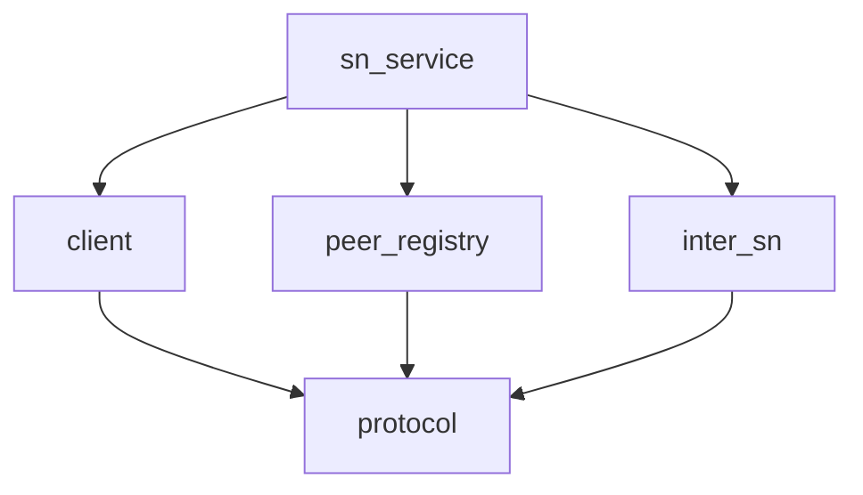

# Pipeline Plan

## Trigger
- Proposal: docs/versions/v0.1/modules/p2p-frame/025-sn-query-target-protocol-version/proposal.md
- User launch confirmed: yes
- User launch statement: “确认，自动完成”
- Per-stage user confirmation: skipped by explicit user auto-pipeline authorization
- Auto-confirm completed document stages: no design/testing Markdown documents generated; repository-local document extensions only
- Auto-pipeline document policy: no design/testing markdown docs; testplan.yaml required
- Version: v0.1
- Packet module: p2p-frame
- Task name: 025-sn-query-target-protocol-version
- Target module(s): p2p-frame
- change_id values: sn_protocol_version_registration, sn_query_target_protocol_version

## Acceptance Baseline
- Final acceptance is judged against:
  - `proposal.md`

## Stage Graph
| Task ID | Stage | Responsibility | Scope | Parent Task | Depends On | Output | Done Condition |
|---------|-------|----------------|-------|-------------|------------|--------|----------------|
| D-1 | design | integrate wire, authenticated registration and distributed query mappings into the admission-bound plan | bound task packet | root | D-WIRE, D-REGISTRATION, D-QUERY | this pipeline plan and sibling state | `pipeline-plan-check.py` passes with both change ids, exact interfaces, lifecycle and file scope |
| I-1 | implementation | close the minimum production implementation after every file task | bound task packet | root | I-SERVICE | production code and implementation scope evidence | admission and implementation stage-scope checks pass after all file tasks complete |
| T-1 | testing | derive post-implementation cases from proposal, plan and delivered code, migrate test consumers and create task-local runnable evidence | bound task packet | root | I-1 | dedicated tests, migrated existing test literals, `testplan.yaml`, run artifact and state evidence | testing coverage and `test-run.py p2p-frame/025-sn-query-target-protocol-version all` pass |
| A-1 | acceptance | independently falsify requirement, identity binding, compatibility, lifecycle, distributed consensus and test adequacy | bound task packet | root | T-1 | acceptance report | report checker passes with accepted conclusion or work returns to the owning automatic stage |

## Submodule Tasks
| Task ID | Stage | Responsibility | Submodule | Parent Task | Depends On | Output | Done Condition |
|---------|-------|----------------|-----------|-------------|------------|--------|----------------|
| D-WIRE | design | define the authoritative version and additive query/detail wire extension contract | `sn/protocol` | D-1 | none | wire/interface mapping returned to parent | version allocation, extension order, remainder and mixed-version decisions are concrete |
| D-REGISTRATION | design | define authenticated report binding and peer-registration state lifecycle | `sn/client`, `sn/service/peer_manager` | D-1 | none | producer/state mapping returned to parent | one state owner, validation-before-write and disconnect deletion are concrete |
| D-QUERY | design | define local precedence and fail-closed distributed query aggregation | `sn/service`, `sn/inter_sn` | D-1 | none | query/relay mapping returned to parent | every serving-SN participant and failure outcome has deterministic semantics |
| I-PROTOCOL | implementation | add the shared protocol baseline and independent response/detail extensions | `p2p-frame/src/sn/protocol/sn.rs` | I-1 | D-1 | protocol source | known zero and unknown remain distinct while legacy and NAT-profile bytes stay compatible |
| I-CLIENT | implementation | replace three client hardcoded protocol versions with the authoritative baseline | `p2p-frame/src/sn/client/sn_service.rs` | I-1 | I-PROTOCOL | client source | ReportSn, SnCall and SnQuery use one version constant without changing stack/cmd versions |
| I-PEER | implementation | store report-authenticated version in the existing peer registration owner | `p2p-frame/src/sn/service/peer_manager.rs` | I-1 | I-PROTOCOL | peer manager source | report update is atomic, non-report insertion remains unknown and removal drops the version |
| I-INTER-SN | implementation | propagate optional target version through serving-peer detail mappings | `p2p-frame/src/sn/inter_sn/mod.rs` | I-1 | I-PROTOCOL | inter-SN source | old detail responses decode unknown and new producer/consumer mappings preserve known zero |
| I-SERVICE | implementation | validate report identity before mutation and assemble local/distributed query results | `p2p-frame/src/sn/service/service.rs` | I-1 | I-CLIENT, I-PEER, I-INTER-SN | SN service source | local registration wins; every remote participant must return one identical known version or result is unknown |

## Parallel Scheduling
- Strategy: dependency-ready-set
- Concurrency: use all runtime-available child-agent slots
- Shared artifact owner: parent-orchestrator
- Lock directory: `.harness/locks/`
- Dispatch rule: launch the maximum dependency-ready set with disjoint exclusive write scopes before waiting and immediately backfill free slots
- Wait rule: serialize work for explicit dependency, overlapping write scope, or exhausted concurrency capacity only
- Serialization reasons: `sn.rs` owns both the shared constant and both wire extensions, while `service.rs` consumes every preceding file and is therefore last; testing stays merged because one task plan and one compile closure cover tightly coupled public struct-literal migrations
- Evidence: record launched task ids and serialization reasons in sibling `pipeline/state.json` scheduler waves

## Dependency Graphs

| Level | Parent | Node | Depends On |
|-------|--------|------|------------|
| submodule | p2p-frame | protocol | none |
| submodule | p2p-frame | client | protocol |
| submodule | p2p-frame | peer_registry | protocol |
| submodule | p2p-frame | inter_sn | protocol |
| submodule | p2p-frame | sn_service | client, peer_registry, inter_sn |

## Exported Interfaces
| Interface | Owner | Consumer | Compatibility | Affected Callers | Migration Path |
|-----------|-------|----------|---------------|------------------|----------------|
| `SN_PROTOCOL_VERSION: u8 = 1` | `sn/protocol` | SN client ReportSn, SnCall and SnQuery producers | backward-compatible | existing hardcoded producer sites | import one shared constant; retain `0` as legal legacy and keep feature-specific versions independent |
| `CachedPeerInfo.protocol_version` optional byte and authenticated report registration update | `sn/service/peer_manager` | SN report handler, local detail and query assembly | migration-required | peer-manager constructor/update callers and internal struct consumers | initialize non-report entries to `None`; authenticated reports set `Some(value)` without numeric monotonicity assumptions |
| `SnQueryResp.target_protocol_version` optional byte | `sn/protocol` | `SNClientService::query`, `query_with_context`, service constructors and query consumers | migration-required | every exhaustive `SnQueryResp` struct literal | add `None` or the authoritative cached value; public reads distinguish `Some(0)` from `None` |
| `SnDetailResp.target_protocol_version` and `ServingPeerDetail.target_protocol_version` optional bytes | `sn/protocol`, `sn/inter_sn` | serving SN producer, querying SN consumer and service aggregation | migration-required | every exhaustive detail struct literal and inter-SN mapping | append independent optional wire extension and explicitly migrate all repository constructors |

## API and Build Surface Impact
- Public API impact: migration-required
- Crate-root export change: no
- Build-surface change: no
- Documentation examples affected: no

## Consumer Migration Closure
| Old Symbol | New Path | change_id | Consumer Path | Consumer Kind | Migration Status |
|------------|----------|-----------|---------------|---------------|------------------|
| `SnQueryResp` without target version | `SnQueryResp.target_protocol_version` | sn_query_target_protocol_version | `p2p-frame/src/sn/service/service.rs` | production constructor | migrated |
| `SnQueryResp` without target version | `SnQueryResp.target_protocol_version` | sn_query_target_protocol_version | `p2p-frame/src/sn/tests.rs` | in-crate test constructor | migrated |
| `SnQueryResp` without target version | `SnQueryResp.target_protocol_version` | sn_query_target_protocol_version | `p2p-frame/tests/unit/sn_tests/protocol/common/nat_type_wire_tests.rs` | protocol test constructor | migrated |
| `SnDetailResp` without target version | `SnDetailResp.target_protocol_version` | sn_query_target_protocol_version | `p2p-frame/src/sn/inter_sn/mod.rs` | production relay constructor | migrated |
| `SnDetailResp` without target version | `SnDetailResp.target_protocol_version` | sn_query_target_protocol_version | `p2p-frame/tests/unit/sn_tests/protocol/common/nat_type_wire_tests.rs` | protocol test constructor | migrated |
| `ServingPeerDetail` without target version | `ServingPeerDetail.target_protocol_version` | sn_query_target_protocol_version | `p2p-frame/src/sn/service/service.rs` | production local-detail constructor | migrated |
| `ServingPeerDetail` without target version | `ServingPeerDetail.target_protocol_version` | sn_query_target_protocol_version | `p2p-frame/src/sn/inter_sn/mod.rs` | production relay consumer | migrated |
| `ServingPeerDetail` without target version | `ServingPeerDetail.target_protocol_version` | sn_query_target_protocol_version | `p2p-frame/tests/unit/sn_tests/inter_sn_profile_tests.rs` | inter-SN test constructor | migrated |
| peer report update without version | authenticated report update with `protocol_version` | sn_protocol_version_registration | `p2p-frame/src/sn/service/service.rs` | production caller | migrated |
| peer report update without version | authenticated report update with `protocol_version` | sn_protocol_version_registration | `p2p-frame/src/sn/service/peer_manager.rs` | in-file unit consumer | migrated |

## State Ownership
| State | Owner | Access Interface | Lifecycle | Failure Transitions |
|-------|-------|------------------|-----------|---------------------|
| target self-reported SN protocol version | `PeerManager::device_conn_map` entry | authenticated report registration, `find_peer`, local detail and peer removal | non-report entry starts `None`; valid report atomically sets/replaces `Some(u8)` including zero; last control-peer disconnect removes the whole entry; no independent TTL is invented | missing/mismatched identity or validator rejection leaves prior entry unchanged; non-report updates preserve current value; distributed missing/error/conflict changes only the response to `None` and never mutates peer state |

## Key Call Flows
| Flow | Ordered calls and side effects | Success boundary |
|------|--------------------------------|------------------|
| authenticated registration | client builds ReportSn with `SN_PROTOCOL_VERSION` -> SN validates certificate/tunnel identity -> checks optional claimed id before mutation -> peer manager atomically updates registration fields and `Some(protocol_version)` | a later local query reads the same peer-entry snapshot; disconnect removal makes it unknown |
| local query | service snapshots local `CachedPeerInfo` -> assembles existing cert/endpoints/profile -> copies optional protocol version | local snapshot is authoritative even when its version is `None`; remote data never overwrites it |
| distributed query | owner leases enumerate participants -> each remote detail returns cert/endpoints/profile/version -> successful details retain existing best-effort data -> version accumulator requires every participant to succeed with one equal `Some(u8)` | remote-only response returns consensus `Some(v)`; missing/error/old response/conflict returns `None` without discarding existing successful endpoint data |

## Failure Flows
| Flow | Boundary | Failure | Handling |
|------|----------|---------|----------|
| report authentication | client payload to authenticated SN tunnel | missing/invalid certificate, validator rejection or claimed `from_peer_id` mismatch | return permission failure before peer, NAT or other report-owned state mutation; never use payload id as cache key |
| response extension decode | old/new client or inter-SN wire | extension absent, envelope version unsupported, truncated header/payload, malformed payload or unknown tail | preserve decoded legacy and NAT-profile fields; target version is `None`; consume only a recognized envelope according to declared length and return unknown tail remainder |
| local lookup | peer manager to query service | local entry exists but did not originate from a trusted report | return target version `None`; do not promote SnCall/SnQuery versions or remote snapshots into trusted state |
| remote participant | owner-directory/inter-SN boundary | local stale lease, missing transport, NotFound, decode/validation/transport error or version missing | permanently mark this query's version aggregate unknown while preserving successful detail data for existing best-effort fields |
| remote conflict | multiple serving SN details | two known protocol versions disagree | return `None` independent of lease/result ordering; do not select first or maximum and do not mutate remote caches |
| peer disconnect | command server to peer manager | final peer control connection disappears | remove complete existing registration so later queries cannot return a stale protocol version |

## Security and Capacity Model
- Identity: protocol version is self-reported but is stored only under the authenticated tunnel/certificate peer id; a present conflicting payload id is rejected before mutation.
- Input: every `u8`, including future values and legacy zero, is opaque data; SN does not allocate work, authorize behavior or claim implementation truth from the value.
- State: one byte plus optional discriminant is added to each existing bounded-by-connectivity peer entry; no side map, database, task, timer or unbounded collection is created.
- Privacy/logging: query reveals only the coarse protocol version already self-reported to SN; no stack/build/commit/platform value or identity material is added to logs.

## Rejected Alternatives
| Decision Type | Selected | Rejected | Reason |
|---------------|----------|----------|--------|
| boundary | cache only authenticated ReportSn version in the existing peer registration and query it through SnQuery | infer target version from SnCall, SnQuery, command header, successful decoding or SN software version | those values describe another sender or transport layer and cannot establish the target's declared baseline |
| technical | append independent SQPV/SDPV optional envelopes after existing NAT-profile extensions | encode unknown as zero, change legacy structs or widen the existing SQRP/SDRP payload | zero is already valid and changing existing payloads would make old decoders lose current fields or break wire layout |
| collaboration | one parent integrates shared plan/state; disjoint file children run after protocol and the service consumer runs last | let children concurrently edit plan/state or split `service.rs` across registration and query tasks | shared artifact writes and overlapping service changes would create merge ambiguity in an already dirty SN worktree |

## Implementation Scope Bindings
| change_id | target_module | proposal_id | design_coverage | scope_paths | design_rules_applied |
|-----------|---------------|-------------|-----------------|-------------|----------------------|
| sn_protocol_version_registration | p2p-frame | P-SQPV-1 | define baseline 1, update all three existing producers, validate authenticated report identity before mutation, atomically store `Some(u8)` in the existing peer entry and remove with that entry | `p2p-frame/src/sn/protocol/sn.rs`, `p2p-frame/src/sn/client/sn_service.rs`, `p2p-frame/src/sn/service/peer_manager.rs`, `p2p-frame/src/sn/service/service.rs` | producer/consumer closure, trust boundary, single-owner state, lifecycle, failure-before-write, compatibility |
| sn_query_target_protocol_version | p2p-frame | P-SQPV-2 | add optional query/detail wire fields after current extensions, propagate serving detail, prefer local registration and require fail-closed all-participant remote consensus | `p2p-frame/src/sn/protocol/sn.rs`, `p2p-frame/src/sn/service/peer_manager.rs`, `p2p-frame/src/sn/inter_sn/mod.rs`, `p2p-frame/src/sn/service/service.rs` | public interface migration, wire compatibility, decoder remainder, distributed failure flow, deterministic aggregation |

## File-Level Implementation Sequence
| Sequence | Task ID | File-Level Module | Action | Depends On | change_id | target_module | Scope Paths | Context Sources |
|----------|---------|-------------------|--------|------------|-----------|---------------|-------------|-----------------|
| 1 | I-PROTOCOL | `p2p-frame/src/sn/protocol/sn.rs` | add baseline constant, response/detail fields and two ordered optional extensions | none | sn_query_target_protocol_version | p2p-frame | `p2p-frame/src/sn/protocol/sn.rs` | proposal P-SQPV-1/P-SQPV-2, Exported Interfaces, Failure Flows |
| 2 | I-CLIENT | `p2p-frame/src/sn/client/sn_service.rs` | replace three hardcoded protocol versions with the shared constant | I-PROTOCOL | sn_protocol_version_registration | p2p-frame | `p2p-frame/src/sn/client/sn_service.rs` | proposal P-SQPV-1, authoritative producer interface |
| 3 | I-PEER | `p2p-frame/src/sn/service/peer_manager.rs` | add optional version state and authenticated report update semantics | I-PROTOCOL | sn_protocol_version_registration | p2p-frame | `p2p-frame/src/sn/service/peer_manager.rs` | proposal P-SQPV-1, State Ownership |
| 4 | I-INTER-SN | `p2p-frame/src/sn/inter_sn/mod.rs` | migrate detail value and both producer/consumer mappings | I-PROTOCOL | sn_query_target_protocol_version | p2p-frame | `p2p-frame/src/sn/inter_sn/mod.rs` | proposal P-SQPV-2, distributed query flow |
| 5 | I-SERVICE | `p2p-frame/src/sn/service/service.rs` | enforce validation-before-write, use authenticated id and implement local/remote result assembly | I-CLIENT, I-PEER, I-INTER-SN | sn_query_target_protocol_version | p2p-frame | `p2p-frame/src/sn/service/service.rs` | both proposal items, State Ownership, Key Call Flows, Failure Flows |

## Return Rules
- If acceptance finds proposal ambiguity:
  - stop the pipeline and ask the user to decide; do not infer the requirement or create an automatic proposal return task
- If acceptance finds design mismatch:
  - return to design when the version meaning, authentication boundary, interface/codec contract, state ownership or distributed consensus is absent or wrong
- If acceptance finds implementation defect:
  - return to implementation when adequate design exists but delivered code is defective
- If acceptance finds testing implementation gap:
  - return to testing task
- For non-requirement findings:
  - repeat design -> implementation -> testing, then rerun acceptance
- If the same unresolved issue remains after more than 5 unsuccessful iterations:
  - stop and report the issue to the user

Execution status, testing evidence, return records, and final acceptance are stored in sibling `state.json`. They are deliberately excluded from this admission-bound plan.
