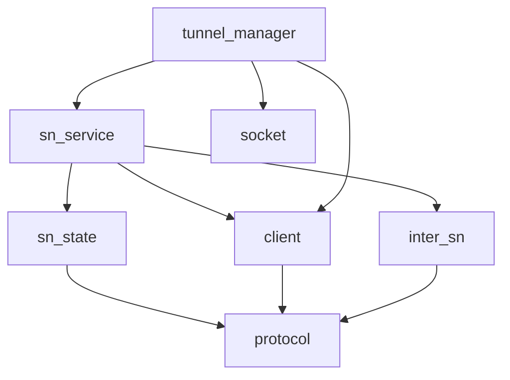

# Pipeline Plan

## Trigger
- Proposal: docs/versions/v0.1/modules/p2p-frame/026-simplify-sn-rendezvous-protocol/proposal.md
- User launch confirmed: yes
- User launch statement: “确认，自动完成”
- Per-stage user confirmation: skipped by explicit user auto-pipeline authorization
- Auto-confirm completed document stages: no design/testing Markdown documents generated; repository-local document extensions only
- Auto-pipeline document policy: no design/testing markdown docs; testplan.yaml required
- Version: v0.1
- Packet module: p2p-frame
- Task name: 026-simplify-sn-rendezvous-protocol
- Target module(s): p2p-frame
- change_id values: simplify_sn_rendezvous_wire_contract

## Acceptance Baseline
- Final acceptance is judged against:
  - `proposal.md`

## Stage Graph
| Task ID | Stage | Responsibility | Scope | Parent Task | Depends On | Output | Done Condition |
|---------|-------|----------------|-------|-------------|------------|--------|----------------|
| D-1 | design | freeze the flat wire types, authenticated routing, bounded local lifecycle, compatibility and consumer migration | bound task packet | root | none | this pipeline plan and sibling state | `pipeline-plan-check.py` passes with a concrete binding for `simplify_sn_rendezvous_wire_contract` |
| I-1 | implementation | migrate the complete production producer/consumer closure to the minimum protocol | bound task packet | root | D-1 | protocol, client, SN relay/state/service and TunnelManager source | admission and implementation scope checks pass after all file tasks complete |
| T-1 | testing | derive post-implementation cases, migrate/add dedicated tests, generate `testplan.yaml` and task-run evidence | bound task packet | root | I-1 | test code, `testplan.yaml`, runner wiring and state evidence | coverage checker and `test-run.py p2p-frame/026-simplify-sn-rendezvous-protocol all` pass |
| A-1 | acceptance | independently falsify field minimality, trust boundaries, lifecycle, compatibility and test adequacy | bound task packet | root | T-1 | acceptance report | report checker passes with an accepted conclusion or routes defects to the owning automatic stage |

## Submodule Tasks
| Task ID | Stage | Responsibility | Submodule | Parent Task | Depends On | Output | Done Condition |
|---------|-------|----------------|-----------|-------------|------------|--------|----------------|
| I-PROTOCOL-1 | implementation | replace the envelope/body/digest/result/terminal family with flat request, notify and response types, isolated command ids and strict decode | `sn/protocol` | I-1 | D-1 | `common.rs`, `sn.rs` | exact proposal field sets encode/decode, headers use the dedicated version, full bodies are consumed, and obsolete wire types/codes are absent |
| I-SOCKET-1 | implementation | keep prediction generation/validity local and expose immediate validation on the owning network/listener | `networks/quic` | I-1 | D-1 | network and QUIC listener implementation | prediction is accepted only while the same listener generation is current, open and unexpired |
| I-SN-STATE-1 | implementation | key bounded SN request state by authenticated identities plus sequence/tunnel and internal request equality without caching prediction vectors | `sn/service/rendezvous_state.rs` | I-1 | I-PROTOCOL-1 | simplified rendezvous state | in-flight exact duplicates share the live response; completed prediction requests cache only generic failure, completed no-prediction requests may cache their empty response, conflicts fail generically, and local expiry bounds state |
| I-CLIENT-1 | implementation | migrate initiator request QA and target notify QA to flat messages and local prediction output | `sn/client` | I-1 | I-PROTOCOL-1 | `sn_service.rs` | authenticated serving-SN context and verified notify certificate drive the callback; no terminal handler/API remains |
| I-INTER-SN-1 | implementation | relay a verified notify plus explicit inter-SN routing target and return the flat response | `sn/inter_sn` | I-1 | I-PROTOCOL-1 | inter-SN request/response variants | remote SN can route the target without adding fields to the target notify and terminal relay is absent |
| I-SN-SERVICE-1 | implementation | authenticate client request, build verified notify, validate endpoint ownership, coordinate bounded state and deliver same/cross-SN QA | `sn/service` | I-1 | I-SN-STATE-1, I-CLIENT-1, I-INTER-SN-1 | `service.rs` | payload identities never override tunnel identity; response correlation and cleanup are local and bounded |
| I-TUNNEL-1 | implementation | replace attempt/digest/deadline/terminal ownership with sequence/tunnel, cancellation-safe guards and fixed owner-bound local timeout | `tunnel` | I-1 | I-SOCKET-1, I-CLIENT-1, I-SN-SERVICE-1 | `tunnel_manager.rs` | waiter/action ordering, prediction validation, direction-aware collision, loser-to-winner result handoff, cleanup, registered-tunnel success and serial fallback remain intact |

## Parallel Scheduling
- Strategy: dependency-ready-set
- Concurrency: use all runtime-available child-agent slots for read-only design review and disjoint implementation files
- Shared artifact owner: parent-orchestrator
- Lock directory: `.harness/locks/`
- Dispatch rule: launch the maximum dependency-ready set with disjoint exclusive write scopes before waiting; immediately backfill free slots
- Serialization reasons: explicit dependency, overlapping write scope, or exhausted concurrency capacity only; the parent merges the single admission-bound design artifact, protocol types precede every production consumer, `service.rs` follows client/state/inter-SN interfaces, and TunnelManager follows the complete SN flow
- Design merged-task reason: protocol shape and lifecycle were reviewed independently, but their outputs share one immutable `pipeline/plan.md`, so the parent owns the single D-1 write and validation
- Evidence: launched tasks, status and concrete serialization reasons are recorded in sibling `pipeline/state.json`

## Dependency Graphs


| Level | Parent | Node | Depends On |
|-------|--------|------|------------|
| submodule | p2p-frame | protocol | none |
| submodule | p2p-frame | socket | none |
| submodule | p2p-frame | sn_state | protocol |
| submodule | p2p-frame | client | protocol |
| submodule | p2p-frame | inter_sn | protocol |
| submodule | p2p-frame | sn_service | sn_state, client, inter_sn |
| submodule | p2p-frame | tunnel_manager | socket, client, sn_service |

## Exported Interfaces
| Interface | Owner | Consumer | Compatibility | Affected Callers | Migration Path |
|-----------|-------|----------|---------------|------------------|----------------|
| command ids `0x2c` request / `0x2d` notify with command header version `1` and strict full-body decode | `sn/protocol` | SN client and service command registries | new | current task-024 `0x28..=0x2b` handlers | remove old registrations; unsupported ids/version fail closed and legacy `SnCall` remains the rolling-upgrade fallback |
| `SnTunnelRendezvous { seq, tunnel_id, to_peer_id, operation, end_point_array, need_predict_endpoint }` | `sn/protocol` | SN client, SN service, TunnelManager, protocol tests | breaking | all current `SnTunnelRendezvousRequest` constructors/consumers | migrate in one repository change; legacy `SnCall` is unchanged and remains rolling-upgrade fallback |
| `SnTunnelRendezvousNotify { seq, tunnel_id, peer_info, operation, end_point_array, need_predict_endpoint }` | `sn/protocol` | SN service, SN client target handler, inter-SN relay | breaking | current SN delivery and inter-SN relay consumers | serving SN derives verified `peer_info`; inter-SN adds routing target only in its own enum variant |
| `SnTunnelRendezvousResp { seq, result, predicted_endpoint_array }` | `sn/protocol` | target client, serving SN, inter-SN relay, initiator client/TunnelManager | breaking | all current `SnTunnelRendezvousResponse` consumers | `result=0` means accepted; any nonzero result becomes a generic local `P2pError` and serial fallback |
| `SnTunnelRendezvousOperation` | `sn/protocol` | request/notify validation, NAT plan and TunnelManager action selection | backward-compatible | current action producers/consumers | preserve all four variants and their endpoint/action invariants |
| request-only `SNRendezvousEvent` callback returning predicted endpoints | `sn/client` | TunnelManager | migration-required | `p2p-frame/src/tunnel/tunnel_manager.rs` | remove terminal event/outcome variants and generation/validity response data; retain the optional dedicated listener |
| `TunnelNetwork::validate_traversal_prediction` with default unsupported behavior | `networks` | TunnelManager and QUIC network/listener | backward-compatible | QUIC implementation opts in; TCP/custom implementations use default | validate local generation/open/expiry immediately before publishing concrete predicted endpoints |

## File-Level Interfaces
```rust
// p2p-frame/src/sn/protocol/sn.rs
pub struct SnTunnelRendezvous {
    pub seq: Sequence,
    pub tunnel_id: TunnelId,
    pub to_peer_id: P2pId,
    pub operation: SnTunnelRendezvousOperation,
    pub end_point_array: Vec<Endpoint>,
    pub need_predict_endpoint: bool,
}

pub struct SnTunnelRendezvousNotify {
    pub seq: Sequence,
    pub tunnel_id: TunnelId,
    pub peer_info: EncodedP2pIdentityCert,
    pub operation: SnTunnelRendezvousOperation,
    pub end_point_array: Vec<Endpoint>,
    pub need_predict_endpoint: bool,
}

pub struct SnTunnelRendezvousResp {
    pub seq: Sequence,
    pub result: u8,
    pub predicted_endpoint_array: Vec<Endpoint>,
}
```

```rust
// p2p-frame/src/sn/client/sn_service.rs
pub trait SNRendezvousEvent: Send + Sync {
    async fn on_rendezvous(
        &self,
        notify: SnTunnelRendezvousNotify,
        serving_sn_id: P2pId,
    ) -> P2pResult<Vec<Endpoint>>;
}
```

```rust
// p2p-frame/src/sn/service/rendezvous_state.rs
pub(super) fn begin(
    &mut self,
    initiator: &P2pId,
    request: &SnTunnelRendezvous,
    now: Timestamp,
) -> Result<RendezvousBegin, P2pErrorCode>;
```

- Interface consumers and compatibility: protocol structures are consumed by `sn/client/sn_service.rs`, `sn/service/service.rs`, `sn/inter_sn/mod.rs`, `sn/service/rendezvous_state.rs`, and `tunnel/tunnel_manager.rs`; replacement is intentionally breaking only for the unreleased task-024 rendezvous surface and does not change legacy SN commands.

## API and Build Surface Impact
- Public API impact: breaking
- Crate-root export change: no
- Build-surface change: no
- Documentation examples affected: no

## Consumer Migration Closure
| Old Symbol | New Path | change_id | Consumer Path | Consumer Kind | Migration Status |
|------------|----------|-----------|---------------|---------------|------------------|
| `SnTunnelRendezvousEnvelope`, `SnTunnelRendezvousRequestBody`, `SnTunnelRendezvousRequest` | `SnTunnelRendezvous` / `SnTunnelRendezvousNotify` | simplify_sn_rendezvous_wire_contract | `p2p-frame/src/sn/client/sn_service.rs` | internal/public callback producer-consumer | migrated |
| `SnTunnelRendezvousEnvelope`, `SnTunnelRendezvousRequestBody`, `SnTunnelRendezvousRequest` | `SnTunnelRendezvous` / `SnTunnelRendezvousNotify` | simplify_sn_rendezvous_wire_contract | `p2p-frame/src/sn/service/service.rs` | authenticated SN producer-consumer | migrated |
| `SnTunnelRendezvousRequest` | inter-SN target plus `SnTunnelRendezvousNotify` | simplify_sn_rendezvous_wire_contract | `p2p-frame/src/sn/inter_sn/mod.rs` | cross-SN consumer | migrated |
| `SnTunnelRendezvousResponseBody`, `SnTunnelRendezvousResponse`, `SnTunnelRendezvousResult` | `SnTunnelRendezvousResp { seq, result, predicted_endpoint_array }` | simplify_sn_rendezvous_wire_contract | `p2p-frame/src/sn/service/rendezvous_state.rs` | bounded state consumer | migrated |
| request/response envelopes and `SnTunnelRendezvousTerminal` | flat messages plus local owner timeout | simplify_sn_rendezvous_wire_contract | `p2p-frame/src/tunnel/tunnel_manager.rs` | runtime orchestrator | migrated |
| `PackageCmdCode::SnTunnelRendezvousComplete`, `PackageCmdCode::SnTunnelRendezvousCancel` | no replacement command | simplify_sn_rendezvous_wire_contract | `p2p-frame/src/sn/protocol/common.rs` | command registry | migrated |
| `TunnelNetwork` without prediction revalidation | additive default `validate_traversal_prediction` | simplify_sn_rendezvous_wire_contract | `p2p-frame/src/networks/quic/network.rs` | public trait implementation | migrated |

## State Ownership
| State | Owner | Access Interface | Lifecycle | Failure Transitions |
|-------|-------|------------------|-----------|---------------------|
| flat request/notify/response values | `sn/protocol` | raw codec plus request/notify/response validation | created once for one QA chain; response endpoints are consumed immediately and never cached beyond the bounded request entry | malformed action/endpoint/list relation or mismatched response sequence/result is rejected before public network action/fallback consumption |
| serving-SN rendezvous entry | `RendezvousState` | `begin/cache_response/fail_unanswered/remove_peer` | key `(authenticated initiator, target, seq, tunnel_id)` enters in-flight and shares the live result with already-waiting exact duplicates; after completion it stores only an empty-endpoint response, using generic failure for prediction requests, until a short local expiry | changed fields under one key return generic conflict; post-completion prediction retries receive generic failure without a second target action or stale endpoints; capacity/rate/expiry return nonzero result; peer removal wakes waiters and deletes state |
| target B action owner | TunnelManager rendezvous owner map | request callback, normal tunnel registration and collision-result handoff | notify validation -> optional local prediction -> waiter/task arm -> response -> Connected/Failed/TimedOut; fixed `conn_timeout` bounds the task and completes any displaced outbound waiter only after owner removal | prediction/arm failure returns nonzero response before detached action; direction-aware collision, tunnel success, timeout and manager cancellation abort task, remove waiter and resolve any local loser handoff |
| initiator A action owner | TunnelManager rendezvous owner map plus scope-bound cleanup guard | SN QA future plus local connector/waiter | owner/waiter installed before request -> response or collision yield -> local action or winner-result wait -> Connected/Failed/TimedOut -> owner removal -> optional serial fallback | future drop invokes RAII cleanup; request failure, nonzero response or timeout removes the local owner; an incoming stable-order winner receives the displaced completion waiter, so the loser awaits that winner and cannot start fallback concurrently |
| predicted endpoint output | target TunnelManager/QUIC listener until response construction | listener prediction result -> network validation -> response endpoint vector | listener verifies its current socket generation/open state/validity, returns concrete endpoints once, and does not persist the vector in rendezvous state | prediction failure, expiry or listener replacement returns a nonzero response; initiator never consumes empty success when prediction was requested |

## Key Call Flows
| Flow | Ordered calls and side effects | Success boundary |
|------|--------------------------------|------------------|
| same-SN request | A builds flat request and installs owner/waiter -> SN authenticates A and validates A-owned endpoints -> SN builds notify with cached verified A certificate -> B validates serving SN/certificate, predicts if requested and arms action -> flat response returns to A -> A consumes endpoints and performs its action | only the resulting QUIC/TLS or TCP tunnel registration/publish is success; a zero response merely means B action is armed |
| cross-SN request | SN A authenticates A and builds notify -> inter-SN variant carries explicit target plus notify -> authenticated SN B finds target and delivers the unchanged notify -> flat response returns through the same QA chain | same real-tunnel boundary as same-SN; missing/unsupported relay returns a nonzero response and serial fallback |
| request conflict | SN keys authenticated A + target + seq + tunnel -> an in-flight exact duplicate waits for the live response -> after completion a no-prediction duplicate may receive the cached empty response while a prediction duplicate receives generic failure -> changed payload under the same key fails without a second B action | at most one target action is armed for one key and no predicted endpoint vector is replayed |
| simultaneous collision | each manager compares initiator direction before duplicate tuple identity -> stable peer order keeps exactly one outbound/inbound pair -> the displaced outbound transfers a one-shot completion waiter to the incoming winner -> loser receives the winner's registered tunnel or terminal local error | equal or unequal locally generated sequence/tunnel values choose the same winner and never run legacy fallback beside that winner |
| local cleanup | each peer runs its action under fixed owner-bound timeout and initiator scope guard -> first registered tunnel completes owner/work and any collision handoff -> error/timeout/drop removes waiter/owner -> A starts legacy/PN fallback only after local new-protocol cleanup or winner completion | no Complete/Cancel message is required for termination or correctness |

## Failure Flows
| Flow | Boundary | Failure | Handling |
|------|----------|---------|----------|
| request/notify decode | command trust boundary | malformed bytes, invalid action/endpoint relation, oversized/duplicate/private endpoint | return generic invalid/failure before state insertion or network side effect; bytes are not reinterpreted as legacy `SnCall` |
| authenticated identity | A -> SN -> B | request tries to name another initiator, SN lacks verified certificate, notify certificate is malformed, or command tunnel peer is not the active serving SN | initiator comes only from command peer; SN supplies cached verified cert; target derives peer id from cert and rejects invalid serving tunnel |
| same/cross-SN target resolution | serving SN/inter-SN | target missing, remote SN unsupported, nested QA fails, or response sequence mismatches | return nonzero flat response, fail/wake in-flight duplicates, clean bounded state and let A use one serial legacy/PN fallback |
| prediction/response | target listener/client/SN state | prediction requested but empty/stale/listener replaced, a completed prediction request is retried, nonzero response carries endpoints, or sequence differs | target returns nonzero/empty response; live in-flight duplicates may share the current response, but completed prediction retries receive generic failure and no cached endpoints; initiator rejects invariant violation and does not use endpoints |
| duplicate/conflict/capacity | RendezvousState | exact duplicate in flight or after completion, same key changed fields, pair/total/rate limit, or local expiry | share the live response for an in-flight exact duplicate; cache only an empty-endpoint response and turn completed prediction retries into generic failure; all other cases fail generically without another target action; expiry wakes waiters and removes state |
| target action lifetime | target TunnelManager | caller disappears because terminal protocol was removed, control tunnel closes, action stalls, or collision displaces owner | fixed local timeout and owner cancellation abort action/task and remove waiter; no unbounded work survives |
| initiator action/fallback | initiator TunnelManager | QA failure, response failure, local action failure, timeout, future drop, or stable-order collision loss | a scope guard cancels local owner/waiter on drop; a collision loser hands off to and awaits the incoming winner; only after owner removal or winner completion, if no tunnel registered, start the existing legacy `SnCall` or PN path exactly once |

## Security and Capacity Model
- Authentication: A's identity comes only from the authenticated client command tunnel; the serving SN obtains A's verified certificate from peer registration; B derives A from that certificate and verifies the notifying tunnel is its active SN.
- Routing: `to_peer_id` is present only on the A-to-SN request and on an inter-SN enum wrapper; it is not repeated in the SN-to-B notify body.
- Wire isolation: simplified request/notify use command ids `0x2c`/`0x2d`, header version `1`, strict `RawDecode::raw_decode` with an empty remainder, and a new inter-SN command id `0x86`; task-024 ids/layout are never accepted as simplified messages.
- Endpoint policy: at most eight unique, non-LAN, server-reflexive IPv4 endpoints with nonzero ports; lists are protocol-consistent and punch modes require QUIC.
- Result policy: only `P2pErrorCode::Ok.into_u8()` and `P2pErrorCode::Failed.into_u8()` are valid on wire; every failure has an empty endpoint list and every prediction-disabled success is empty.
- State/work: retain total, pair, rate-window and in-flight waiter limits; every entry and target/initiator action has a fixed local expiry that is never extended by duplicate requests.
- Logging: retain correlation sequence/tunnel, action, counts and local detailed reason; never log certificates, payloads, tokens or endpoint lists at normal levels.

## Rejected Alternatives
| Decision Type | Selected | Rejected | Reason |
|---------------|----------|----------|--------|
| boundary | separate flat client request and target notify; inter-SN wrapper alone carries routing target | repeat initiator/target/SN identities in a universal envelope | authenticated hops and verified certificate already own identity; only the intermediate SN-to-SN hop lacks an implicit target |
| technical | command QA correlation plus `seq`/`tunnel_id` and internal request equality | random `attempt_id`, wire `request_digest`, repeated response identities | QA, logical tunnel key and internal equality provide the required correlation without permanent wire fields |
| technical | fixed owner-bound local timeouts and normal tunnel completion | absolute wire deadline plus Complete/Cancel terminal commands | remote terminal is best-effort and cannot be a correctness dependency; bounded local cleanup is required anyway |
| technical | concrete response endpoints shared only with already-waiting duplicates and consumed immediately; completed prediction retries receive generic failure | caching the full prediction response, or adding wire socket generation and validity timestamp | generation is meaningful only to the owning listener; request-scoped use and prediction-free completed state avoid a stale remote cache contract |
| technical | compact `u8` result consistent with existing SN responses | dedicated fourteen-value rendezvous result enum | every failure takes the same fallback path; detailed local errors remain available in logs and `P2pError` |
| collaboration | parent owns shared artifacts; disjoint source owners follow the dependency graph | concurrent edits to `pipeline/plan.md`, `state.json`, `testplan.yaml` or shared runner | a single owner avoids hash/admission drift and merge races in the dirty worktree |

## Implementation Scope Bindings
| change_id | target_module | proposal_id | design_coverage | scope_paths | design_rules_applied |
|-----------|---------------|-------------|-----------------|-------------|----------------------|
| simplify_sn_rendezvous_wire_contract | p2p-frame | P-SSRP-1 | flat exact-field request/notify/response, isolated versioned command ids and strict decode, operation-only action, authenticated identity derivation, inter-SN target wrapper, compact result, request-local and locally revalidated predicted endpoints, sequence/tunnel correlation, bounded local cleanup without terminal commands, full producer/consumer migration and legacy fallback | `p2p-frame/src/sn/protocol/common.rs`, `p2p-frame/src/sn/protocol/sn.rs`, `p2p-frame/src/networks/network.rs`, `p2p-frame/src/networks/quic/listener.rs`, `p2p-frame/src/networks/quic/network.rs`, `p2p-frame/src/sn/client/sn_service.rs`, `p2p-frame/src/sn/service/rendezvous_state.rs`, `p2p-frame/src/sn/inter_sn/mod.rs`, `p2p-frame/src/sn/service/service.rs`, `p2p-frame/src/tunnel/tunnel_manager.rs` | top-down module decomposition, acyclic dependencies, Rust interfaces, state ownership, trust boundaries, compatibility, failure recovery, consumer closure |

## File-Level Implementation Sequence
| Sequence | Task ID | File-Level Module | Action | Depends On | change_id | target_module | Scope Paths | Context Sources |
|----------|---------|-------------------|--------|------------|-----------|---------------|-------------|-----------------|
| 1 | I-PROTOCOL-1 | `p2p-frame/src/sn/protocol/sn.rs` | replace wire family, isolate command ids/version and enforce strict full-body decode across protocol definitions and registry | none | simplify_sn_rendezvous_wire_contract | p2p-frame | `p2p-frame/src/sn/protocol/common.rs`, `p2p-frame/src/sn/protocol/sn.rs` | proposal field tables; existing `SnCall`/`SnCalled` and `P2pErrorCode::into_u8` conventions |
| 2 | I-SOCKET-1 | `p2p-frame/src/networks/network.rs` | add default prediction validation and QUIC listener generation/open/expiry implementation | none | simplify_sn_rendezvous_wire_contract | p2p-frame | `p2p-frame/src/networks/network.rs`, `p2p-frame/src/networks/quic/listener.rs`, `p2p-frame/src/networks/quic/network.rs` | proposal local-generation guard; existing traversal prediction ownership |
| 3 | I-SN-STATE-1 | `p2p-frame/src/sn/service/rendezvous_state.rs` | simplify key, internal equality, live waiter sharing, prediction-free completed disposition, expiry and generic failure state | I-PROTOCOL-1 | simplify_sn_rendezvous_wire_contract | p2p-frame | `p2p-frame/src/sn/service/rendezvous_state.rs` | State Ownership; duplicate/non-cacheable-prediction/capacity implementation |
| 4 | I-CLIENT-1 | `p2p-frame/src/sn/client/sn_service.rs` | migrate callback, target notify QA and initiator request QA; remove terminal API | I-PROTOCOL-1 | simplify_sn_rendezvous_wire_contract | p2p-frame | `p2p-frame/src/sn/client/sn_service.rs` | Exported Interfaces; authenticated active-SN command handlers |
| 5 | I-INTER-SN-1 | `p2p-frame/src/sn/inter_sn/mod.rs` | relay explicit target plus verified notify and flat response; remove terminal variants | I-PROTOCOL-1 | simplify_sn_rendezvous_wire_contract | p2p-frame | `p2p-frame/src/sn/inter_sn/mod.rs` | cross-SN flow; current `RelayCall` QA pattern |
| 6 | I-SN-SERVICE-1 | `p2p-frame/src/sn/service/service.rs` | authenticate/convert request, own state and deliver same/cross-SN notify/response | I-SN-STATE-1, I-CLIENT-1, I-INTER-SN-1 | simplify_sn_rendezvous_wire_contract | p2p-frame | `p2p-frame/src/sn/service/service.rs` | identity/failure flows; current rendezvous and call delivery paths |
| 7 | I-TUNNEL-1 | `p2p-frame/src/tunnel/tunnel_manager.rs` | migrate A/B owners, prediction validation, cancellation guard, direction-aware collision handoff, timeout and fallback | I-SOCKET-1, I-CLIENT-1, I-SN-SERVICE-1 | simplify_sn_rendezvous_wire_contract | p2p-frame | `p2p-frame/src/tunnel/tunnel_manager.rs` | lifecycle state, current owner/waiter/action integration |

## Return Rules
- If acceptance finds ambiguity in the exact proposal field tables or whether terminal commands are removed, stop and ask the user; do not infer a different contract.
- Return to design by revising this plan when authenticated routing, inter-SN target transport, bounded local cleanup, request equality, compatibility or consumer mapping is absent or wrong; re-hash and rerun plan/admission checks before code resumes.
- Return to implementation when design is adequate but code retains a forbidden wire field/type/command, trusts payload identity, leaks owner work, permits duplicate action, breaks fallback, or treats response as tunnel success.
- Return to testing when implementation is adequate but exact layout, malformed input, identity abuse, duplicate/conflict, timeout/collision, same/cross-SN or compatibility coverage is missing or weak.
- For every non-requirement finding, repeat the owning stage and every dependent downstream stage before acceptance reruns.
- If the same unresolved issue remains after more than 5 unsuccessful iterations, stop and report it to the user.

Execution status, testing evidence, return records, and final acceptance are stored in sibling `state.json`. They are deliberately excluded from this admission-bound plan.
