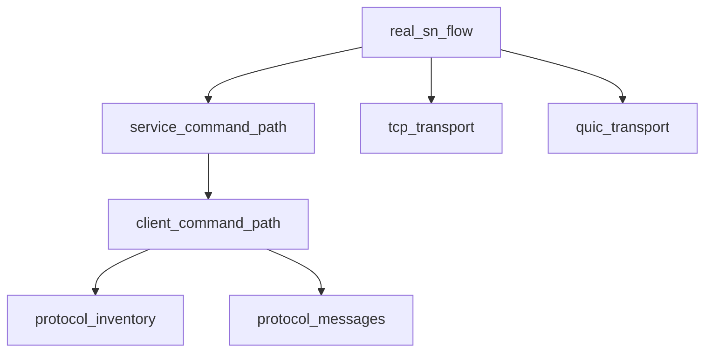

# Pipeline Plan

## Trigger
- Proposal: docs/versions/v0.1/modules/p2p-frame/027-sn-rendezvous-real-network-tests/proposal.md
- User launch confirmed: yes
- User launch statement: “确认，自动完成”
- Per-stage user confirmation: skipped by explicit user auto-pipeline authorization
- Auto-confirm completed document stages: no design/testing Markdown documents generated; repository-local document extensions only
- Auto-pipeline document policy: no design/testing markdown docs; testplan.yaml required
- Version: v0.1
- Packet module: p2p-frame
- Task name: 027-sn-rendezvous-real-network-tests
- Target module(s): p2p-frame
- change_id values: sn_rendezvous_real_socket_command_flow, sn_rendezvous_tcp_quic_transport_matrix, sn_all_command_real_transport_matrix

## Acceptance Baseline
- Final acceptance is judged against:
  - `proposal.md`

## Stage Graph
| Task ID | Stage | Responsibility | Scope | Parent Task | Depends On | Output | Done Condition |
|---------|-------|----------------|-------|-------------|------------|--------|----------------|
| D-1 | design | bind the existing SN command architecture, transport boundaries, state owners and failure behavior without introducing production changes | bound task packet | root | none | this plan and sibling state | pipeline-plan checker passes with every change_id and concrete source scope bound |
| I-1 | implementation | audit the delivered production baseline and confirm the test-only proposal requires no production modification | bound task packet | root | I-INVENTORY-1, I-PROTOCOL-1, I-CLIENT-1, I-SERVICE-1, I-TCP-1, I-QUIC-1 | source audit recorded in state and implementation scope evidence | every active command send/handler and TCP/QUIC command-tunnel path is identified; production diff for this task remains empty |
| T-1 | testing | derive post-baseline cases, implement dedicated real-network tests, generate testplan and task-run evidence | bound task packet | root | I-1 | dedicated tests, testplan.yaml, state coverage and run artifact | coverage checker, task-scoped runner and testing scope check pass |
| A-1 | acceptance | independently falsify protocol inventory completeness, real-network authenticity, transport parity and test adequacy | bound task packet | root | T-1 | acceptance report | report checker passes with accepted conclusion or findings return to their owning automatic stage |

## Submodule Tasks
| Task ID | Stage | Responsibility | Submodule | Parent Task | Depends On | Output | Done Condition |
|---------|-------|----------------|-----------|-------------|------------|--------|----------------|
| I-INVENTORY-1 | implementation | audit the closed `PackageCmdCode` inventory and distinguish registered commands from QA response payload roles | `sn/protocol/common.rs` | I-1 | D-1 | no-change source audit | all ten codes and the rendezvous response payload have one real reachability classification |
| I-PROTOCOL-1 | implementation | audit Report, Query, Call/Called and rendezvous message/version invariants consumed by the runtime matrix | `sn/protocol/sn.rs` | I-1 | D-1 | no-change source audit | field correlation and version boundaries needed by tests are concrete and production-compatible |
| I-CLIENT-1 | implementation | audit client sends, inbound handlers, response validation and active-tunnel selection | `sn/client` | I-1 | I-INVENTORY-1, I-PROTOCOL-1 | no-change source audit | every active client-side command direction has a public real-tunnel entry or an explicit automatic lifecycle entry |
| I-SERVICE-1 | implementation | audit server handlers, target delivery, registration state and failure responses | `sn/service` | I-1 | I-CLIENT-1 | no-change source audit | every active server-side command direction and observable result is mapped without direct-handler substitution |
| I-TCP-1 | implementation | audit the TCP listener/connect path used by SN command tunnels | `networks/tcp` | I-1 | D-1 | no-change source audit | loopback TCP endpoints can form authenticated SN command tunnels through existing public configuration |
| I-QUIC-1 | implementation | audit the QUIC listener/connect path used by SN command tunnels | `networks/quic` | I-1 | D-1 | no-change source audit | loopback QUIC endpoints can form authenticated SN command tunnels through existing public configuration |

## Parallel Scheduling
- Strategy: dependency-ready-set
- Concurrency: use all runtime-available child-agent slots when delegation is permitted by the active runtime instructions
- Shared artifact owner: parent-orchestrator
- Lock directory: `.harness/locks/`
- Dispatch rule: launch the maximum dependency-ready set with disjoint exclusive write scopes before waiting; immediately backfill free slots
- Serialization reasons: explicit dependency, overlapping write scope, or exhausted concurrency capacity only; active runtime instructions may require the parent to execute logical child tasks without spawning delegates
- Design merged-task reason: the task is test-only and the source audits share one immutable plan, so the parent owns plan/state writes while source boundaries remain independently addressable
- Evidence: logical task waves, dependency readiness and concrete serialization reasons are recorded in sibling `pipeline/state.json`

## Dependency Graphs

| Level | Parent | Node | Depends On |
|-------|--------|------|------------|
| submodule | p2p-frame | protocol_inventory | none |
| submodule | p2p-frame | protocol_messages | none |
| submodule | p2p-frame | client_command_path | protocol_inventory, protocol_messages |
| submodule | p2p-frame | service_command_path | client_command_path |
| submodule | p2p-frame | tcp_transport | none |
| submodule | p2p-frame | quic_transport | none |
| submodule | p2p-frame | real_sn_flow | service_command_path, tcp_transport, quic_transport |

## Exported Interfaces
| Interface | Owner | Consumer | Compatibility | Affected Callers | Migration Path |
|-----------|-------|----------|---------------|------------------|----------------|
| `PackageCmdCode` command identifiers and `PackageHeader` framing | `sn/protocol/common.rs` | SN client/server command registries and protocol inventory evidence | backward-compatible | none; test-only task | none; retain all current values and classify their actual direction/response role |
| Report, Query, Call/Called and Rendezvous message types plus version constants | `sn/protocol/sn.rs` and `sn/protocol/v0.rs` | SN client/server send and handler paths | backward-compatible | none; test-only task | none; byte and semantic contracts remain unchanged |
| `SnClientService` report lifecycle, `query`, `call`, `rendezvous_via_sn`, Called and Rendezvous listeners | `sn/client/sn_service.rs` | two-client real-network runtime matrix | backward-compatible | none; existing public/internal consumers | no migration; tests invoke existing production paths |
| SN registered command handlers and local target delivery | `sn/service/service.rs` | authenticated caller and target clients | backward-compatible | none; existing runtime | no migration; tests observe existing handlers through sockets |
| TCP and QUIC `TunnelNetwork` listener/connect implementations | `networks/tcp` and `networks/quic` | SN command client/server | backward-compatible | none; existing network manager | no migration; endpoint protocol selects the existing path |

## API and Build Surface Impact
- Public API impact: none
- Crate-root export change: no
- Build-surface change: no
- Documentation examples affected: no

## Consumer Migration Closure
| Old Symbol | New Path | change_id | Consumer Path | Consumer Kind | Migration Status |
|------------|----------|-----------|---------------|---------------|------------------|
| not-applicable | not-applicable | sn_all_command_real_transport_matrix | verified-none | test-only coverage task with no changed interface | verified-none |

## State Ownership
| State | Owner | Access Interface | Lifecycle | Failure Transitions |
|-------|-------|------------------|-----------|---------------------|
| active SN command tunnel classification and connection id | `SnClientService` | active-SN list and classified command client lookup | disconnected -> authenticated tunnel -> Report accepted/active -> removed on transport error or shutdown | bind/connect/report failure never becomes active; non-timeout command failure removes the unusable connection where current code requires it |
| registered client identity, endpoints and protocol version | `SnService` peer manager | Report handler followed by Query/Call/Rendezvous lookup | absent -> authenticated Report -> current peer entry -> expiry/disconnect cleanup | invalid identity/report fails without publishing a usable peer; missing target returns the protocol-defined empty/failure result |
| Call/Called correlation | SN service call state and client sequence/tunnel fields | Call QA, Called handler and CalledResp command | caller request -> target notification -> target acknowledgement/response -> bounded completion | decode, missing target, callback failure or timeout yields the existing result/error without inventing delivery success |
| Rendezvous correlation and target action | SN rendezvous state plus client sequence/tunnel fields | Rendezvous QA and target listener | request -> target notify/action -> response or generic failure -> bounded cleanup | invalid endpoint/identity, absent listener, rejection, wrong version or timeout fails closed and does not produce a successful target action |

## Failure Flows
| Flow | Boundary | Failure | Handling |
|------|----------|---------|----------|
| listener and client startup | TCP/QUIC socket -> authenticated tunnel -> Report | bind collision, connect timeout, TLS identity failure or Report rejection | bounded setup retry only for address conflicts; otherwise fail the transport case and never count object construction as network evidence |
| Query QA | client -> selected SN tunnel -> service peer manager | unknown target, response mismatch, decode or transport failure | unknown target returns the defined empty response; invalid/mismatched/transport failure is surfaced and cannot reuse unrelated state |
| Call/Called flow | caller -> SN -> target -> SN/caller | missing target, malformed payload, target callback failure, CalledResp loss or timeout | assert the defined NotFound/failed result and bounded completion; never infer delivery from caller send alone |
| Rendezvous flow | caller -> SN -> target -> caller | listener absent/rejects, wrong command version, invalid response, timeout or target disappears | return generic failure/error, do not invoke invalid success callback and release held work within configured timeout |
| transport parity | endpoint selection -> network manager -> command tunnel | advertised transport differs from active tunnel or only one client uses selected transport | fail before protocol assertions unless both clients expose nonzero classified tunnel ids for the exact SN endpoint |

## Rejected Alternatives
| Decision Type | Selected | Rejected | Reason |
|---------------|----------|----------|--------|
| boundary | complete `PackageCmdCode`-owned SN client/server families over one SN and two clients | include inter-SN owner commands, PN commands, NAT-probe UDP or peer-to-peer tunnel protocols | the user topology names client/server SN traffic; expanding to unrelated protocol owners would make completeness unbounded and contradict the proposal boundary |
| technical | real loopback TCP/QUIC listeners, public client APIs and actual command tunnels | direct service/dispatch calls, in-memory `SnInterClient`, mocks or packet-code counts alone | only the selected path exercises socket, TLS, framing, registration, handler and response behavior together |
| collaboration | parent-owned shared plan/state/testplan with one dedicated external integration-test surface | concurrent shared-artifact edits or production test hooks | the task needs no production change, and a single shared owner prevents plan hash and dirty-worktree races |

## Implementation Scope Bindings
| change_id | target_module | proposal_id | design_coverage | scope_paths | design_rules_applied |
|-----------|---------------|-------------|-----------------|-------------|----------------------|
| sn_rendezvous_real_socket_command_flow | p2p-frame | P-SRRN-1 | existing client request QA, server rendezvous handler, target notify QA, identity/correlation validation and bounded generic failure are preserved as the production system under test | `p2p-frame/src/sn/protocol/sn.rs`, `p2p-frame/src/sn/client/sn_service.rs`, `p2p-frame/src/sn/service/service.rs` | source interfaces, state ownership, authenticated boundaries, response ordering, failure recovery, no production migration |
| sn_rendezvous_tcp_quic_transport_matrix | p2p-frame | P-SRRN-2 | existing TCP and QUIC network/listener implementations are selected by the SN endpoint and must expose the same authenticated command behavior | `p2p-frame/src/networks/tcp/network.rs`, `p2p-frame/src/networks/tcp/listener.rs`, `p2p-frame/src/networks/quic/network.rs`, `p2p-frame/src/networks/quic/listener.rs` | acyclic transport boundary, lifecycle ownership, compatibility preservation, no build/API change |
| sn_all_command_real_transport_matrix | p2p-frame | P-SRRN-3 | closed command inventory maps Report, Query, Call/Called and Rendezvous request/notify/response roles to the actual client and service registries and send sites | `p2p-frame/src/sn/protocol/common.rs`, `p2p-frame/src/sn/protocol/sn.rs`, `p2p-frame/src/sn/protocol/v0.rs`, `p2p-frame/src/sn/client/sn_service.rs`, `p2p-frame/src/sn/service/service.rs` | whole-module inventory, concrete consumers, state/failure flows, compatibility and future-command closure |

## File-Level Implementation Sequence
| Sequence | Task ID | File-Level Module | Action | Depends On | change_id | target_module | Scope Paths | Context Sources |
|----------|---------|-------------------|--------|------------|-----------|---------------|-------------|-----------------|
| 1 | I-INVENTORY-1 | `p2p-frame/src/sn/protocol/common.rs` | inspect and preserve; no production modification | none | sn_all_command_real_transport_matrix | p2p-frame | `p2p-frame/src/sn/protocol/common.rs` | proposal closed inventory; current PackageCmdCode and header framing |
| 2 | I-PROTOCOL-1 | `p2p-frame/src/sn/protocol/sn.rs` | inspect and preserve; no production modification | none | sn_rendezvous_real_socket_command_flow | p2p-frame | `p2p-frame/src/sn/protocol/sn.rs` | proposal correlation/version behavior; current message codecs |
| 3 | I-TCP-1 | `p2p-frame/src/networks/tcp/network.rs` | inspect and preserve; no production modification | none | sn_rendezvous_tcp_quic_transport_matrix | p2p-frame | `p2p-frame/src/networks/tcp/network.rs`, `p2p-frame/src/networks/tcp/listener.rs` | existing endpoint-driven TCP network/listener path |
| 4 | I-QUIC-1 | `p2p-frame/src/networks/quic/network.rs` | inspect and preserve; no production modification | none | sn_rendezvous_tcp_quic_transport_matrix | p2p-frame | `p2p-frame/src/networks/quic/network.rs`, `p2p-frame/src/networks/quic/listener.rs` | existing endpoint-driven QUIC network/listener path |
| 5 | I-CLIENT-1 | `p2p-frame/src/sn/client/sn_service.rs` | inspect and preserve; no production modification | I-INVENTORY-1, I-PROTOCOL-1 | sn_all_command_real_transport_matrix | p2p-frame | `p2p-frame/src/sn/client/sn_service.rs` | command inventory; current send/handler/active-tunnel sources |
| 6 | I-SERVICE-1 | `p2p-frame/src/sn/service/service.rs` | inspect and preserve; no production modification | I-CLIENT-1 | sn_rendezvous_real_socket_command_flow | p2p-frame | `p2p-frame/src/sn/service/service.rs` | current server registry, Report/Query/Call/Rendezvous delivery and failure paths |

## Return Rules
- If acceptance finds ambiguity in whether “all protocols” includes a protocol owner outside `PackageCmdCode`, stop and ask the user rather than silently expanding beyond the confirmed proposal.
- Return to design by revising this plan when command inventory, transport selection proof, state ownership or failure semantics are mapped incorrectly; re-hash and rerun the plan checker.
- If source audit discovers production behavior cannot satisfy the confirmed proposal without a production change, stop this test-only task and create a separately governed sibling implementation requirement instead of editing production here.
- Return to testing when production behavior is adequate but a command family, TCP/QUIC variant, normal/boundary/negative/error/lifecycle/compatibility case, unified entry or source-derived completeness assertion is missing or weak.
- For every non-requirement testing finding, repeat testing and rerun acceptance.
- If the same unresolved issue remains after more than 5 unsuccessful iterations, stop and report it to the user.

Execution status, testing evidence, return records, and final acceptance are stored in sibling `state.json`. They are deliberately excluded from this admission-bound plan.
