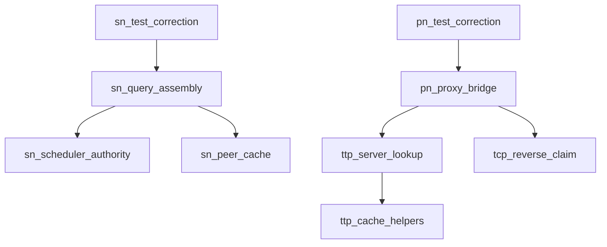

# Pipeline Plan

## Trigger
- Proposal: docs/versions/v0.1/modules/p2p-frame/028-fix-regression-test-authority-readiness/proposal.md
- User launch confirmed: yes
- User launch statement: “确认，自动完成”
- Per-stage user confirmation: skipped by explicit user auto-pipeline authorization
- Auto-confirm completed document stages: existing manual design was user-approved at launch; no automatic design/testing Markdown documents generated
- Auto-pipeline document policy: no design/testing markdown docs; testplan.yaml required
- Version: v0.1
- Packet module: p2p-frame
- Task name: 028-fix-regression-test-authority-readiness
- Target module(s): p2p-frame
- change_id values: distributed_nat_profile_authority_fixture, pn_reverse_tcp_cache_ready_synchronization

## Acceptance Baseline
- Final acceptance is judged against:
  - `proposal.md`

## Stage Graph
| Task ID | Stage | Responsibility | Scope | Parent Task | Depends On | Output | Done Condition |
|---------|-------|----------------|-------|-------------|------------|--------|----------------|
| D-1 | design | bind the approved authority/readiness correction to current production owners without changing their behavior | bound task packet | root | none | this plan and sibling state | pipeline-plan checker passes with both change ids, concrete source scopes, state owners and failure flows |
| I-1 | implementation | audit the production baseline and confirm the test-only task requires no production modification | bound task packet | root | I-SN-SCHEDULER, I-SN-PEER, I-SN-SERVICE, I-TTP-CACHE, I-TTP-SERVER, I-TCP-TUNNEL, I-PN-SERVICE | no-change source audit recorded in state and implementation evidence | all authority/readiness owners are current and the production diff for this task remains empty |
| T-1 | testing | integrate the two corrected dedicated tests, generate testplan/state coverage and produce task-run evidence | bound task packet | root | T-SN-DETAIL, T-PN-READY | test code, testplan.yaml, state evidence and run artifact | coverage checker, task-scoped runner and testing scope check pass |
| A-1 | acceptance | independently falsify authority preservation, readiness boundedness, reverse fallback authenticity and evidence adequacy | bound task packet | root | T-1 | acceptance report | report checker passes with accepted conclusion or findings return to their owning automatic stage |

## Submodule Tasks
| Task ID | Stage | Responsibility | Submodule | Parent Task | Depends On | Output | Done Condition |
|---------|-------|----------------|-----------|-------------|------------|--------|----------------|
| I-SN-SCHEDULER | implementation | audit scheduler-owned profile publication and generation validity | `sn/service/nat_probe_scheduler.rs` | I-1 | D-1 | no-change source audit | current_profile remains the only serving publication source |
| I-SN-PEER | implementation | audit peer cache as mirrored storage rather than publication authority | `sn/service/peer_manager.rs` | I-1 | D-1 | no-change source audit | peer cache cannot independently restore a scheduler-invalid profile |
| I-SN-SERVICE | implementation | audit local detail, remote detail aggregation and final query assembly | `sn/service/service.rs` | I-1 | I-SN-SCHEDULER, I-SN-PEER | no-change source audit | remote detail values survive final response assembly without mutating the querying peer cache |
| I-TTP-CACHE | implementation | audit accepted incoming tunnel availability, pruning and target-match helpers | `ttp/client.rs` | I-1 | D-1 | no-change source audit | helper-owned availability and target matching remain unchanged and cache absence stays distinguishable from real stream-open errors |
| I-TTP-SERVER | implementation | audit accepted incoming tunnel attach and delegation to cache lookup before real stream open | `ttp/server.rs` | I-1 | I-TTP-CACHE | no-change source audit | cache lookup delegates to the current helpers and real stream-open errors propagate unchanged |
| I-TCP-TUNNEL | implementation | audit reverse data registration barrier and requester first-claim ownership | `networks/tcp/tunnel.rs` | I-1 | D-1 | no-change source audit | readiness correction does not relax reverse registration or first-claim rules |
| I-PN-SERVICE | implementation | audit PN target factory timeout/error propagation and real bidirectional bridge | `pn/service/pn_server.rs` | I-1 | I-TTP-SERVER, I-TCP-TUNNEL | no-change source audit | PN delegates one target open through the real TTP factory and preserves cache-miss, claim and transport errors |
| T-SN-DETAIL | testing | correct the dedicated distributed-detail test while preserving production authority | `p2p-frame/tests/unit/sn_tests/service/distributed_nat_profile_tests.rs` | T-1 | I-1 | corrected SN dedicated test | owner lease, remote detail, final response and cold querying cache remain observable |
| T-PN-READY | testing | establish bounded pre-request observation of the real TTP cache, then issue exactly one proxy request through the unchanged target factory | `p2p-frame/src/ttp/server.rs`; `p2p-frame/src/pn/service/pn_server/tests/reverse_tcp_proxy_tests.rs` | T-1 | I-1 | corrected PN dedicated test | cache readiness precedes the sole proxy request, whose real reverse TCP target transfers bytes both ways |

## Parallel Scheduling
- Strategy: dependency-ready-set
- Concurrency: use all runtime-available child-agent slots
- Shared artifact owner: parent-orchestrator
- Lock directory: `.harness/locks/`
- Dispatch rule: launch the maximum dependency-ready set with disjoint exclusive write scopes before waiting; immediately backfill free slots
- Serialization reasons: explicit dependency, overlapping write scope, or exhausted concurrency capacity only
- Shared-artifact coordination: parent-only plan/state/testplan/runner writes are ownership boundaries, not child-task serialization reasons
- Design merged-task reason: one parent-owned plan binds two independent validation boundaries; source audits and testing edits remain independently addressable
- Evidence: scheduler waves and concrete capacity/dependency reasons are recorded in sibling `pipeline/state.json`

## Dependency Graphs

| Level | Parent | Node | Depends On |
|-------|--------|------|------------|
| submodule | p2p-frame | sn_scheduler_authority | none |
| submodule | p2p-frame | sn_peer_cache | none |
| submodule | p2p-frame | sn_query_assembly | sn_scheduler_authority, sn_peer_cache |
| submodule | p2p-frame | ttp_cache_helpers | none |
| submodule | p2p-frame | ttp_server_lookup | ttp_cache_helpers |
| submodule | p2p-frame | tcp_reverse_claim | none |
| submodule | p2p-frame | pn_proxy_bridge | ttp_server_lookup, tcp_reverse_claim |
| submodule | p2p-frame | sn_test_correction | sn_query_assembly |
| submodule | p2p-frame | pn_test_correction | pn_proxy_bridge |

## Exported Interfaces
| Interface | Owner | Consumer | Compatibility | Affected Callers | Migration Path |
|-----------|-------|----------|---------------|------------------|----------------|
| `SnInterClient::query_detail_from_sn` value boundary | `sn/service/service.rs` | `SnService::query_remote_details` | backward-compatible | none; private production trait | no migration; retain signature and result semantics |
| `NatProbeScheduler::current_profile` publication decision | `sn/service/nat_probe_scheduler.rs` | `SnService::local_peer_detail`, query and call assembly | backward-compatible | none; production unchanged | no migration; do not add peer-cache fallback |
| `find_existing_tunnel_in_multi` cache lookup | `ttp/client.rs` | `TtpServer::find_existing_tunnel` | backward-compatible | none; production unchanged | no migration; retain availability pruning and target-match semantics |
| `PnTargetStreamFactory::open_target_stream` | `pn/service/pn_server.rs` | `PnService::handle_proxy_open_req` | backward-compatible | none; internal trait | no migration; delegate once to the real TTP implementation |
| `TtpServer::open_target_stream` lookup/open boundary | `ttp/server.rs` | PN target factory | backward-compatible | none; production unchanged | no migration; cache absence and real tunnel-open errors remain distinct and unchanged |

## API and Build Surface Impact
- Public API impact: none
- Crate-root export change: no
- Build-surface change: no
- Documentation examples affected: no

## Consumer Migration Closure
| Old Symbol | New Path | change_id | Consumer Path | Consumer Kind | Migration Status |
|------------|----------|-----------|---------------|---------------|------------------|
| not-applicable | not-applicable | distributed_nat_profile_authority_fixture | verified-none | test-only correction with no changed interface | verified-none |
| not-applicable | not-applicable | pn_reverse_tcp_cache_ready_synchronization | verified-none | test-only correction with no changed interface | verified-none |

## State Ownership
| State | Owner | Access Interface | Lifecycle | Failure Transitions |
|-------|-------|------------------|-----------|---------------------|
| authoritative per-peer NAT profile and registration generation | `NatProbeScheduler` | `current_profile`, report/control observations and result correlation | absent -> QUIC authority -> correlated profile -> invalidated/removed | tunnel loss, generation/config/address change, timeout or Unknown removes publication; peer cache cannot restore it |
| peer identity/endpoints and mirrored current profile | `PeerManager` | authenticated report update and explicit scheduler-driven set/invalidate | absent -> registered -> mirrored update -> removed | ordinary registration update preserves existing mirror but never grants publication authority |
| accepted incoming TTP tunnel cache | `TtpServer` with cache helpers in `ttp/client.rs` | incoming attach/remember, availability pruning and `open_target_stream` lookup | absent -> accepted/attached -> cached/connected -> closed/pruned | cache absence is detected before stream open; once a tunnel is selected, its stream-open errors propagate unchanged |
| reverse TCP request correlation and first-claim authority | `TcpTunnel` | `OpenDataConnReq/Resp`, data registration and claim state machine | request pending -> creator registered -> requester first claim -> idle/retired | timeout, mismatch, late arrival or wrong claimant fails/retire without exposing business bytes |

## Failure Flows
| Flow | Boundary | Failure | Handling |
|------|----------|---------|----------|
| distributed detail selection | owner lease -> `SnInterClient` remote-detail boundary | serving SN or peer does not match the expected lease selection | return NotFound; final query must not fabricate profile or mutate querying cache |
| final distributed query assembly | remote detail -> `SnQueryResp` | remote detail absent/error or profile missing | retain existing fail-closed response semantics; successful detail profile is copied by value only |
| PN test precondition | accepted TTP tunnel cache -> source request | expected target is not observable as cache-ready before the bounded setup deadline | fail test setup before sending `ProxyOpenReq`; do not consume a request, allocate retries or reinterpret target-open errors |
| PN target open | one `ProxyOpenReq` -> unchanged PN/TTP/TCP path | cache miss, timeout, connect, protocol, claim, permission or any other real open error | preserve the existing response/error path unchanged so a first-claim regression remains visible |
| reverse bridge | PN -> real reverse TCP target stream | target rejects command or either direction fails | preserve existing explicit ProxyOpenResp/result and bounded bridge teardown |

## Rejected Alternatives
| Decision Type | Selected | Rejected | Reason |
|---------------|----------|----------|--------|
| boundary | keep production authority/cache owners unchanged and repair only the dedicated regression tests | add `PeerManager` publication fallback or a new TTP cache-ready production API | both would widen production semantics to accommodate stale/asynchronous test setup |
| technical | bounded read-only cache observation before exactly one request through the unchanged target factory | fixed sleep, repeated source requests, target-factory retry wrappers, larger timeout or reinterpretation of NotFound | pre-request observation establishes the intended setup condition without swallowing a real cache, TCP claim or transport failure |
| collaboration | parent owns plan/state/testplan/runner while two disjoint testing children own their existing files | one child edits both tests and shared artifacts | independent changes can run concurrently and shared plan hashes remain deterministic |

## Implementation Scope Bindings
| change_id | target_module | proposal_id | design_coverage | scope_paths | design_rules_applied |
|-----------|---------------|-------------|-----------------|-------------|----------------------|
| distributed_nat_profile_authority_fixture | p2p-frame | P-RTR-1 | preserve scheduler-owned publication, peer-cache non-authority, local detail semantics and remote-by-value final query assembly | `p2p-frame/src/sn/service/nat_probe_scheduler.rs`, `p2p-frame/src/sn/service/peer_manager.rs`, `p2p-frame/src/sn/service/service.rs` | single state owner, acyclic query boundary, exact identity failure, no API/wire migration |
| pn_reverse_tcp_cache_ready_synchronization | p2p-frame | P-RTR-2 | preserve TTP cache-helper availability/matching, server delegation, PN target-factory timeout/error contract and TCP reverse registration/first-claim state | `p2p-frame/src/ttp/client.rs`, `p2p-frame/src/ttp/server.rs`, `p2p-frame/src/networks/tcp/tunnel.rs`, `p2p-frame/src/pn/service/pn_server.rs` | single cache owner, bounded failure flow, error fidelity, reverse lifecycle preservation |

## File-Level Implementation Sequence
| Sequence | Task ID | File-Level Module | Action | Depends On | change_id | target_module | Scope Paths | Context Sources |
|----------|---------|-------------------|--------|------------|-----------|---------------|-------------|-----------------|
| 1 | I-SN-SCHEDULER | `p2p-frame/src/sn/service/nat_probe_scheduler.rs` | inspect and preserve; no production modification | none | distributed_nat_profile_authority_fixture | p2p-frame | `p2p-frame/src/sn/service/nat_probe_scheduler.rs` | proposal P-RTR-1; current profile publication state |
| 2 | I-SN-PEER | `p2p-frame/src/sn/service/peer_manager.rs` | inspect and preserve; no production modification | none | distributed_nat_profile_authority_fixture | p2p-frame | `p2p-frame/src/sn/service/peer_manager.rs` | proposal P-RTR-1; mirrored profile cache behavior |
| 3 | I-SN-SERVICE | `p2p-frame/src/sn/service/service.rs` | inspect and preserve; no production modification | I-SN-SCHEDULER, I-SN-PEER | distributed_nat_profile_authority_fixture | p2p-frame | `p2p-frame/src/sn/service/service.rs` | local detail, remote aggregation and final query assembly |
| 4 | I-TTP-CACHE | `p2p-frame/src/ttp/client.rs` | inspect and preserve; no production modification | none | pn_reverse_tcp_cache_ready_synchronization | p2p-frame | `p2p-frame/src/ttp/client.rs` | accepted incoming cache availability, pruning and target matching |
| 5 | I-TTP-SERVER | `p2p-frame/src/ttp/server.rs` | inspect and preserve; no production modification | I-TTP-CACHE | pn_reverse_tcp_cache_ready_synchronization | p2p-frame | `p2p-frame/src/ttp/server.rs` | accepted tunnel attach, cache-helper delegation and stream-open error boundary |
| 6 | I-TCP-TUNNEL | `p2p-frame/src/networks/tcp/tunnel.rs` | inspect and preserve; no production modification | none | pn_reverse_tcp_cache_ready_synchronization | p2p-frame | `p2p-frame/src/networks/tcp/tunnel.rs` | reverse registration response and first-claim state |
| 7 | I-PN-SERVICE | `p2p-frame/src/pn/service/pn_server.rs` | inspect and preserve; no production modification | I-TTP-SERVER, I-TCP-TUNNEL | pn_reverse_tcp_cache_ready_synchronization | p2p-frame | `p2p-frame/src/pn/service/pn_server.rs` | target factory timeout/error propagation and bridge |

## Return Rules
- If acceptance finds the proposal's requirement itself ambiguous or unsafe, record a blocking requirement finding, mark rejected and stop for the user.
- Return to design by revising this plan when authority ownership, readiness boundary, error handling or production-preservation mapping is wrong; re-hash and revalidate before downstream work.
- If source audit discovers a production defect is required to satisfy the confirmed proposal, stop this test-only task and create a separately governed sibling implementation requirement rather than editing production here.
- Return to testing when production is adequate but either test-side detail boundary, cold-cache assertion, pre-request readiness bound, sole request, real reverse stream or unified evidence is incomplete.
- For every non-requirement testing finding, repeat testing and rerun acceptance.
- If the same unresolved issue remains after more than 5 unsuccessful iterations, stop and report it to the user.

Execution status, testing evidence, return records, and final acceptance are stored in sibling `state.json`. They are deliberately excluded from this admission-bound plan.
