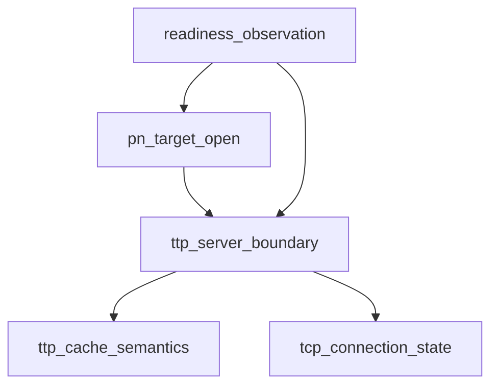

# Pipeline Plan

## Trigger
- Proposal: docs/versions/v0.1/modules/p2p-frame/029-stabilize-pn-control-tunnel-readiness/proposal.md
- User launch confirmed: yes
- User launch statement: “确认，自动完成”
- Per-stage user confirmation: skipped by explicit user auto-pipeline authorization
- Auto-confirm completed document stages: no design/testing Markdown documents generated
- Auto-pipeline document policy: no design/testing markdown docs; testplan.yaml required
- Version: v0.1
- Packet module: p2p-frame
- Task name: 029-stabilize-pn-control-tunnel-readiness
- Target module(s): p2p-frame
- change_id values: pn_cache_readiness_observer_non_destructive

## Acceptance Baseline
- Final acceptance is judged against:
  - `proposal.md`

## Stage Graph
| Task ID | Stage | Responsibility | Scope | Parent Task | Depends On | Output | Done Condition |
|---------|-------|----------------|-------|-------------|------------|--------|----------------|
| D-1 | design | bind the confirmed non-destructive readiness boundary to current state/cache owners without defining testing implementation | bound task packet | root | none | this plan and sibling state | pipeline-plan checker passes with concrete owners, failures, alternatives and production Scope Paths |
| I-1 | implementation | confirm production cache, TCP lifecycle and PN open behavior remain unchanged | bound task packet | root | I-TTP-CACHE, I-TCP-STATE, I-TTP-SERVER, I-PN-SERVICE | no-change source audit recorded in state and admission evidence | production diff for task 029 remains empty and implementation scope passes |
| T-1 | testing | design and implement the observer regression after production preservation is confirmed, then generate task-local runnable evidence | bound task packet | root | T-OBSERVER | test-only code, testplan, runner evidence and testing state | coverage checker, task runner and testing scope pass |
| A-1 | acceptance | independently falsify non-mutation, production preservation, bounded progress and validation adequacy | bound task packet | root | T-1 | acceptance report | report checker passes with accepted conclusion or findings return to their owning automatic stage |

## Submodule Tasks
| Task ID | Stage | Responsibility | Submodule | Parent Task | Depends On | Output | Done Condition |
|---------|-------|----------------|-----------|-------------|------------|--------|----------------|
| I-TTP-CACHE | implementation | audit production availability, pruning and target matching | `ttp/client.rs` | I-1 | D-1 | no-change source audit | availability and target-match definitions remain the only semantic source and production pruning remains unchanged |
| I-TCP-STATE | implementation | audit passive TCP connection promotion ownership | `networks/tcp/tunnel.rs` | I-1 | D-1 | no-change source audit | `PassiveReady` remains Connecting until the real control receive path promotes it to Connected |
| I-TTP-SERVER | implementation | audit attach/cache ordering and preserve the production lookup/open boundary | `ttp/server.rs` | I-1 | I-TTP-CACHE, I-TCP-STATE | no-change production audit | attach/cache and production lookup/open behavior remain unchanged |
| I-PN-SERVICE | implementation | audit the sole PN target-open and error propagation path | `pn/service/pn_server.rs` | I-1 | I-TTP-SERVER | no-change source audit | PN delegates once to real TTP and preserves cache/open/claim/transport errors |
| T-OBSERVER | testing | correct the existing test-only readiness observation and provide post-implementation regression coverage | `ttp` test surface and existing PN regression | T-1 | I-1 | corrected test-only observer and dedicated regression evidence | observation is non-mutating, reports only a matching available tunnel, and the real PN path remains bounded and single-request |

## Parallel Scheduling
- Strategy: dependency-ready-set
- Concurrency: use all runtime-available child-agent slots
- Shared artifact owner: parent-orchestrator
- Lock directory: `.harness/locks/`
- Dispatch rule: launch the maximum dependency-ready set with disjoint exclusive write scopes before waiting; immediately backfill free slots
- Serialization reasons: explicit dependency, overlapping write scope, or exhausted concurrency capacity only
- Shared-artifact coordination: parent owns plan/state/testplan/runner merges; child source audits and test-only edits report their results for integration
- Design merged-task reason: one design task is sufficient because the change has one state boundary and one test-only consumer; production owner audits remain independently addressable
- Evidence: scheduler waves and dependency/capacity reasons are recorded in sibling `pipeline/state.json`

## Dependency Graphs

| Level | Parent | Node | Depends On |
|-------|--------|------|------------|
| submodule | p2p-frame | ttp_cache_semantics | none |
| submodule | p2p-frame | tcp_connection_state | none |
| submodule | p2p-frame | ttp_server_boundary | ttp_cache_semantics, tcp_connection_state |
| submodule | p2p-frame | pn_target_open | ttp_server_boundary |
| submodule | p2p-frame | readiness_observation | ttp_server_boundary, pn_target_open |

## Exported Interfaces
| Interface | Owner | Consumer | Compatibility | Affected Callers | Migration Path |
|-----------|-------|----------|---------------|------------------|----------------|
| existing `TtpServer::has_cached_tunnel_for_test` test-only observation boundary | `ttp/server.rs` | p2p-frame TTP and PN dedicated tests | backward-compatible | crate-private `#[cfg(test)]` callers only | retain signature and test-only visibility; no production migration |
| production `find_existing_tunnel_in_multi` lookup | `ttp/client.rs` | `TtpServer::find_existing_tunnel` | backward-compatible | production TTP server only | no migration; retain pruning, matching and selection semantics |
| production `PnTargetStreamFactory::open_target_stream` | `pn/service/pn_server.rs` | PN proxy request handler | backward-compatible | internal PN service | no migration; delegate once and propagate real errors |

## API and Build Surface Impact
- Public API impact: none
- Crate-root export change: no
- Build-surface change: no
- Documentation examples affected: no

## Consumer Migration Closure
| Old Symbol | New Path | change_id | Consumer Path | Consumer Kind | Migration Status |
|------------|----------|-----------|---------------|---------------|------------------|
| not-applicable | not-applicable | pn_cache_readiness_observer_non_destructive | verified-none | existing test-only interface behavior correction | verified-none |

## State Ownership
| State | Owner | Access Interface | Lifecycle | Failure Transitions |
|-------|-------|------------------|-----------|---------------------|
| passive TCP connection phase | `TcpTunnel` | `state`, control receive loop and `promote_connected` | `PassiveReady/Connecting` -> first valid control frame -> `Connected` -> `Closed/Error` | receive, protocol, heartbeat or transport failure moves to terminal state; tests do not promote it |
| accepted incoming TTP tunnel cache | `TtpServer` with helper semantics in `ttp/client.rs` | attach/remember plus production lookup | absent -> attached/cached -> selected when available -> pruned by production lookup when unavailable | production lookup retains its existing destructive stale-item cleanup; test observation must not add a failure transition |
| readiness observation result | existing `#[cfg(test)]` TTP server boundary | boolean target observation | absent/mismatch/unavailable -> false; matching available tunnel -> true | false leaves cache unchanged; timeout fails setup before any proxy request |
| PN target stream lifecycle | `PnServer` and real TTP/TCP target factory | one proxy request -> one target open -> response/bridge | request accepted -> target open -> response -> bidirectional bridge -> teardown | cache/open/claim/transport failures propagate without retry or reinterpretation |

## Failure Flows
| Flow | Boundary | Failure | Handling |
|------|----------|---------|----------|
| readiness observation | cached tunnel -> test precondition | target absent, mismatched, Connecting, Closed or Error | report false without retain/remove/insert/attach/open/state mutation; bounded setup may time out before request |
| TCP readiness transition | passive control tunnel -> control receive loop | no valid control frame or terminal transport error | remain unavailable or close/error according to existing TCP behavior; observer never manufactures readiness |
| PN target open | sole `ProxyOpenReq` -> unchanged PN/TTP/TCP path | cache miss, close race, timeout, reverse claim or transport failure | preserve the existing response/error path and do not retry |
| production cache maintenance | TTP server -> production lookup helper | stale or unavailable item | preserve current pruning behavior outside the test-only observation boundary |

## Rejected Alternatives
| Decision Type | Selected | Rejected | Reason |
|---------------|----------|----------|--------|
| boundary | keep all production cache/TCP/PN semantics unchanged and correct only the existing test observation boundary | change production cache retention or TCP connection promotion | the demonstrated failure is caused by the observer's destructive read and does not require a production semantic change |
| technical | non-mutating test-only inspection that consumes the current availability and target-match definitions | production lookup reuse, fixed sleep, longer deadline, request/open retry, existence-only readiness or remove-then-restore | lookup reuse prunes the normal Connecting item; the other alternatives hide the defect, create false readiness or add races |
| collaboration | parent owns plan/state/testplan/runner, independent implementation audits precede one test-only correction task | combine production and testing edits in one task | production preservation must be established before post-implementation testing changes the existing test-only item |

## Implementation Scope Bindings
| change_id | target_module | proposal_id | design_coverage | scope_paths | design_rules_applied |
|-----------|---------------|-------------|-----------------|-------------|----------------------|
| pn_cache_readiness_observer_non_destructive | p2p-frame | P-PN-READY-1 | preserve helper-owned availability/matching and production pruning, TCP-owned promotion, TTP attach/cache/open and PN single-open error propagation; implementation is a no-production-change audit | `p2p-frame/src/ttp/client.rs`, `p2p-frame/src/ttp/server.rs`, `p2p-frame/src/networks/tcp/tunnel.rs`, `p2p-frame/src/pn/service/pn_server.rs` | single state owners, acyclic dependency, bounded failure flow, interface compatibility, no production migration |

## File-Level Implementation Sequence
| Sequence | Task ID | File-Level Module | Action | Depends On | change_id | target_module | Scope Paths | Context Sources |
|----------|---------|-------------------|--------|------------|-----------|---------------|-------------|-----------------|
| 1 | I-TTP-CACHE | `p2p-frame/src/ttp/client.rs` | inspect and preserve; no production modification | none | pn_cache_readiness_observer_non_destructive | p2p-frame | `p2p-frame/src/ttp/client.rs` | proposal P-PN-READY-1; production availability, pruning and target matching |
| 2 | I-TCP-STATE | `p2p-frame/src/networks/tcp/tunnel.rs` | inspect and preserve; no production modification | none | pn_cache_readiness_observer_non_destructive | p2p-frame | `p2p-frame/src/networks/tcp/tunnel.rs` | proposal P-PN-READY-1; passive readiness and control-frame promotion |
| 3 | I-TTP-SERVER | `p2p-frame/src/ttp/server.rs` | inspect and preserve production behavior | I-TTP-CACHE, I-TCP-STATE | pn_cache_readiness_observer_non_destructive | p2p-frame | `p2p-frame/src/ttp/server.rs` | proposal P-PN-READY-1; attach/cache and lookup/open boundary |
| 4 | I-PN-SERVICE | `p2p-frame/src/pn/service/pn_server.rs` | inspect and preserve; no production modification | I-TTP-SERVER | pn_cache_readiness_observer_non_destructive | p2p-frame | `p2p-frame/src/pn/service/pn_server.rs` | proposal P-PN-READY-1; sole target open and bridge error propagation |

## Return Rules
- If acceptance finds the proposal requirement ambiguous or unsafe, record a blocking requirement finding, mark rejected and stop for the user.
- Return to design by revising this plan when state ownership, non-mutation, production-preservation or error boundaries are absent or wrong; re-hash and revalidate before downstream execution.
- Return to implementation if any production source changed or the current production owner audit is incorrect.
- Return to testing when the production boundary is adequate but the observer remains mutating, reports unavailable targets as ready, lacks deterministic regression evidence, or the existing PN exact/stress paths are not task-runner reachable.
- For each non-requirement finding, repeat the returned stage and all dependent stages before rerunning acceptance.
- If the same unresolved issue remains after more than 5 unsuccessful iterations, stop and report it to the user.

Execution status, testing evidence, return records, and final acceptance are stored in sibling `state.json`. They are deliberately excluded from this admission-bound plan.
