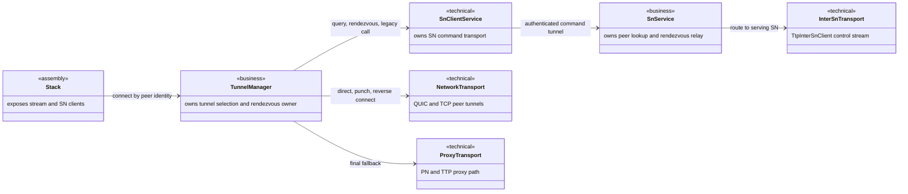
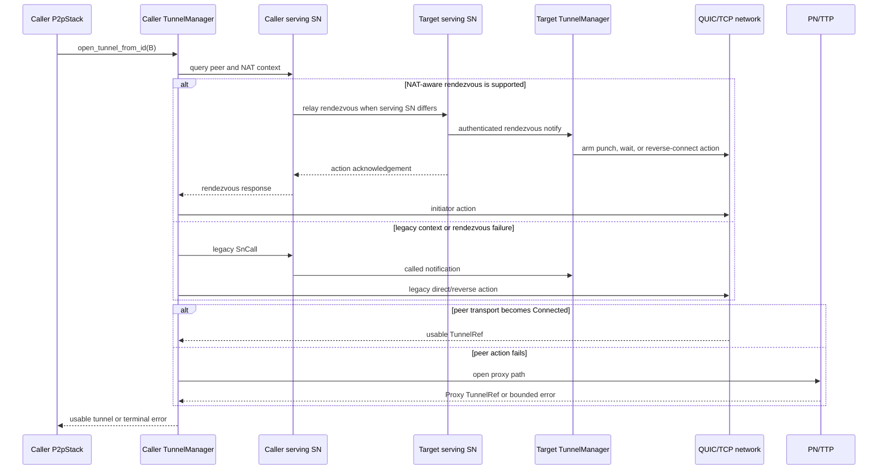
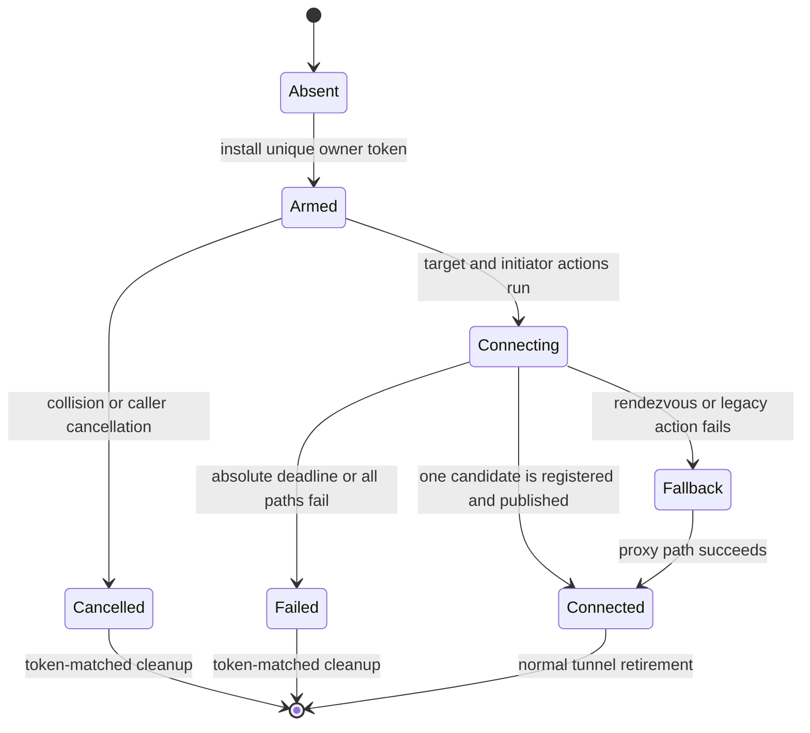

# p2p-frame 真实 socket tunnel 验证边界设计

Risk profile: ./risk-profile.yaml

## Design Scope

### Goals

- 冻结本任务依赖的现有生产模块关系、入口、状态所有权与失败边界，作为后续 Testing 的生产基线。
- 明确本任务不新增或修改生产接口、协议、状态机、依赖或运行时资源；Implementation 阶段只形成“零产品改动”生命周期证据。
- 保持三个已批准 `change_id` 与 `p2p-frame` 目标模块及专用交付路径的直接映射。

### Non-goals

- 不在 Design 阶段定义条件用例、fixture、验证标识、命令或期望结果。
- 不为验证目的增加 production hook、依赖注入接口或替代 transport。
- 不改变 SN、TunnelManager、PN/TTP、TCP 或 QUIC 的生产结构。

## Useful Context

- `TunnelManager::open_tunnel_from_id` 是按远端身份建立或复用 tunnel 的生产入口；它通过 device finder/SN 信息选择 NAT-aware、legacy 或 PN 路径。
- `TunnelManager` 初始化时向 `SNClientService` 安装 called 与 rendezvous listener，目标侧 action 必须经这条生产接线进入，而不是由外部替换 listener。
- `SnTunnelRendezvousResp` 只确认目标 action 已安排并可携带当前 prediction；最终可用性由 `Tunnel` 的 Connected 状态和 stream 数据路径决定。
- NAT mapping/prediction 与 QUIC listener 拥有的 UDP socket 绑定；TCP 不是当前 NAT prediction 的等价数据面。
- inter-SN relay 的生产适配是 `TtpInterSnClient`，进程内 `SnInterClient` 替身不属于本任务的生产闭环。

## Overall Approach

现有生产架构保持不变。本设计只描述后续验证必须消费的真实边界：`P2pStack` 暴露 stream/SN 入口，`TunnelManager` 独占连接编排与 rendezvous owner，SN service 负责同 SN/跨 SN 命令转发，QUIC/TCP network 创建 peer tunnel，PN/TTP 提供最终 proxy 路径。不存在需要先交付的生产实现，因此 Implementation 不修改 `p2p-frame/src/**`、Cargo 依赖或公开导出；后续 Testing 从这些现有接口观察最终 tunnel，而不能加入另一套连接决策。

## Layered Design Document Index

| level | parent_document | unit | design_document | responsibility |
|-------|-----------------|------|-----------------|----------------|
| root | `design.md` | p2p-frame existing tunnel establishment boundary | `design.md` | records unchanged production relationships, interfaces, ownership, and delivery mapping |
| not-applicable: no production submodule is added or changed | `design.md` | none | not-applicable: executable coverage belongs to the later Testing stage, not a production child design | no child design artifact |

## Module Relationship UML



The diagram records existing dependencies only; this task adds no dependency edge.

## File-Level Interfaces

```rust
impl TunnelManager {
    pub async fn open_tunnel_from_id(
        &self,
        remote_id: &P2pId,
    ) -> P2pResult<TunnelRef>;
}

#[async_trait::async_trait]
pub trait Tunnel: Send + Sync + 'static {
    fn tunnel_id(&self) -> TunnelId;
    fn candidate_id(&self) -> TunnelCandidateId;
    fn form(&self) -> TunnelForm;
    fn is_reverse(&self) -> bool;
    fn protocol(&self) -> Protocol;
    fn local_id(&self) -> P2pId;
    fn remote_id(&self) -> P2pId;
    fn state(&self) -> TunnelState;
    async fn open_stream(
        &self,
        purpose: TunnelPurpose,
    ) -> P2pResult<(TunnelStreamRead, TunnelStreamWrite)>;
}

impl SNClientService {
    pub async fn rendezvous_via_sn(
        &self,
        sn_peer_id: &P2pId,
        request: &SnTunnelRendezvous,
    ) -> P2pResult<SnTunnelRendezvousResp>;

    pub async fn call_via_sn(
        &self,
        sn_peer_id: &P2pId,
        tunnel_id: TunnelId,
        reverse_endpoints: Option<&[Endpoint]>,
        remote: &P2pId,
        call_type: TunnelType,
        payload_pkg: Vec<u8>,
        nat_context: Option<&NatTraversalContext>,
    ) -> P2pResult<SnCallResp>;
}
```

- Consumer: all three mapped `change_id` values consume these existing interfaces through `p2p-frame`.
- Compatibility: backward-compatible
- Existing signatures and implementations remain unchanged.

## API and Build Surface Impact

- Public API impact: none
- Crate-root export change: no
- Build-surface change: no
- Documentation examples affected: no

## Consumer Migration Closure

Not applicable: no public API, crate-root export, or build surface changes.

## Key Flows



The same absolute deadlines, authenticated identities, endpoint ownership rules, and owner-token lifecycle remain authoritative on every branch.

## State and Ownership

- Owner: `TunnelManager` exclusively owns registered peer tunnels, inbound waiters, and per-remote rendezvous attempt owners.
- Access path for other modules: `P2pStack` managers and SN callbacks invoke `TunnelManager`; transport modules publish completed candidates through the existing manager boundary.
- Invariants to preserve: one stable winner per remote, stale completion/cancellation cannot mutate a replacement owner, unregistered reverse input is closed, and a response that only arms an action is not published as a Connected tunnel.



## Directly Mapped Change Items

| change_id | target_module | proposal_id | Design Coverage | Scope Paths | Interface / Boundary Impact | Notes |
|-----------|---------------|-------------|-----------------|-------------|-----------------------------|-------|
| real_socket_tunnel_strategy_matrix | p2p-frame | P-033-1 | Existing module UML, interfaces, key flow, and owner invariants define the production boundary consumed later | `p2p-frame/tests/real_p2p_tunnel_socket.rs`, `p2p-frame/tests/real_p2p_tunnel_socket/` | none; production interfaces remain unchanged | No production implementation prerequisite |
| real_socket_legacy_and_proxy_fallbacks | p2p-frame | P-033-2 | Key flow preserves rendezvous-to-legacy and peer-to-proxy boundaries without treating acknowledgements as tunnel success | `p2p-frame/tests/real_p2p_tunnel_socket.rs`, `p2p-frame/tests/real_p2p_tunnel_socket/` | none; existing SN and PN boundaries are consumed | No production implementation prerequisite |
| real_socket_collision_and_cross_sn_paths | p2p-frame | P-033-3 | Module UML, inter-SN flow, state ownership, and token-matched cleanup define the unchanged concurrency boundary | `p2p-frame/tests/real_p2p_tunnel_socket.rs`, `p2p-frame/tests/real_p2p_tunnel_socket/` | none; existing TTP and owner lifecycle are consumed | No production implementation prerequisite |

## Implementation Order

| Phase | Goal | Depends On | Output |
|-------|------|------------|--------|
| 1 | Confirm the existing production boundary needs no code, dependency, resource, or export change | approved proposal and this design | empty product changed-path evidence and handoff to Testing |

## File-Level Implementation Sequence

| sequence | file_level_module | action | depends_on | change_id | scope_path | implementation_task |
|----------|-------------------|--------|------------|-----------|------------|---------------------|
| 1 | `p2p-frame/tests/real_p2p_tunnel_socket.rs` | audit that the existing production entrypoints require no product change before Testing owns this path | none | real_socket_tunnel_strategy_matrix | `p2p-frame/tests/real_p2p_tunnel_socket.rs` | I-1 |
| 2 | `p2p-frame/tests/real_p2p_tunnel_socket/` | audit that the existing rendezvous, legacy, and proxy boundaries require no product change before Testing owns this path | I-1 | real_socket_legacy_and_proxy_fallbacks | `p2p-frame/tests/real_p2p_tunnel_socket/` | I-1 |
| 3 | `p2p-frame/tests/real_p2p_tunnel_socket/` | audit that the existing owner-token and inter-SN boundaries require no product change before Testing owns this path | I-1 | real_socket_collision_and_cross_sn_paths | `p2p-frame/tests/real_p2p_tunnel_socket/` | I-1 |

## Design Notes

- The large `p2p-frame` root does not gain a direct production submodule because the approved outcome adds no product responsibility or exported behavior.
- A production hook was rejected: it would change the system under observation and could make the formal evidence depend on an alternate code path.
- A second connection-decision abstraction was rejected because `TunnelManager` must remain the only owner of plan selection and fallback.
- Case derivation, executable coverage, runner metadata, and environment limitations remain owned by Testing.

## Risks and Rollback

- The primary design risk is accidental production mutation introduced only to simplify later coverage; any such need returns the task to Design and requires a real interface/consumer decision before coding.
- A later inability to observe a required branch without a new production contract is not solved by hidden state mutation or direct private-handler calls; it returns upstream rather than weakening evidence.
- Rollback for this Design is deletion of its unapproved draft. There is no runtime or compatibility rollback because no production change is designed.

## Approval Record

- approver: user
- approval_date: 2026-09-01
- user_statement: "确认，自动完成"
