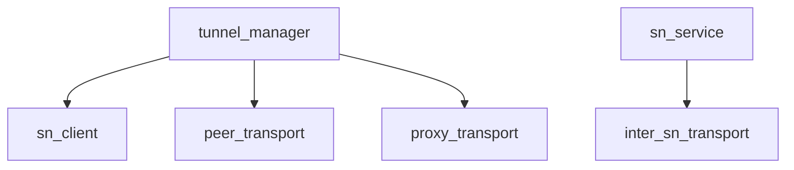

# Pipeline Plan

Workflow tier: high-risk

Risk profile: ../risk-profile.yaml

## Trigger
- Proposal: docs/versions/v0.1/modules/p2p-frame/034-verify-p2p-tunnel-flow-real-sockets/proposal.md
- User launch confirmed: yes
- User launch statement: “确认，自动完成”
- Launch stage: proposal
- First auto stage: design
- Design source: pipeline/plan.md
- Per-stage user confirmation: skipped by explicit user auto-pipeline authorization
- Auto-confirm completed document stages: no design/testing Markdown documents generated; repository-local document extensions only
- Auto-pipeline document policy: stage-selective; no design/testing Markdown docs; automatic design uses pipeline plan; automatic testing uses runtime state; testplan.yaml required for automatic testing
- Version: v0.1
- Packet module: p2p-frame
- Task name: 034-verify-p2p-tunnel-flow-real-sockets
- Target module(s): p2p-frame
- change_id values: real_socket_tunnel_flow_strategy_selection, real_socket_tunnel_flow_fallbacks, real_socket_tunnel_flow_collision_cross_sn

## Acceptance Baseline
- Final acceptance is judged against:
  - `proposal.md`
- NAT-aware operations require correct selection and bounded production control-flow evidence, but do not require loopback punch packets or a connected peer tunnel.
- Public/direct, legacy direct, and PN proxy representative success paths require a real tunnel and bidirectional unique-payload completion.
- Evidence must distinguish expected operation from an actually observable `selected`, `request-sent`, `action-armed`, `fallback`, `connected`, or `payload-complete` boundary. A locally rejected case records `selected: not-observable` and must not promote a requesting log to request-sent evidence.
- `cyfs-p2p-test` is excluded from implementation and formal evidence.

## Stage Graph
| Task ID | Stage | Execution Mode | Responsibility | Scope | Parent Task | Depends On | Output | Done Condition |
|---------|-------|----------------|----------------|-------|-------------|------------|--------|----------------|
| D-1 | design | auto-pipeline | bind the confirmed flow-only boundary to existing tunnel, SN, proxy, and inter-SN owners | task packet and current production relationships | root | none | validated pipeline design mappings | plan checker passes without generating design Markdown |
| I-1 | implementation | auto-pipeline | integrate independent source audits and confirm zero production modification | existing p2p-frame tunnel establishment closure | root | I-STACK, I-SN, I-PROXY | implementation audit and admission evidence | all change ids are implementable exclusively in post-implementation Testing |
| T-1 | testing | auto-pipeline | integrate the dedicated real-socket surface, testplan, runner wiring, and evidence | parent-owned test root and shared artifacts | root | T-MATRIX, T-FALLBACK, T-COLLISION | runnable dedicated tests, testplan, and runtime evidence | coverage, task runner, and testing scope checks pass |
| A-1 | acceptance | auto-pipeline | independently audit proposal, plan, no-change implementation, tests, and evidence | complete task delivery | root | T-1 | `acceptance-report.md` | accepted report passes checker with no blocking finding |

## Submodule Tasks
| Task ID | Stage | Execution Mode | Responsibility | Submodule | Parent Task | Depends On | Output | Done Condition |
|---------|-------|----------------|----------------|-----------|-------------|------------|--------|----------------|
| I-STACK | implementation | auto-pipeline | audit strategy selection and tunnel lifecycle ownership | `stream/stream_manager.rs`, `tunnel/tunnel_manager.rs`, and `tunnel/nat_connect_plan.rs` | I-1 | D-1 | no-change source audit | expected-operation, pre-request rejection, request/action/connection boundaries, and loopback limits are concrete |
| I-SN | implementation | auto-pipeline | audit rendezvous, legacy SnCall, owner collision, and production inter-SN paths | SN service/client and TTP inter-SN boundaries | I-1 | D-1 | no-change source audit | production handlers remain installed and observable public paths suffice |
| I-PROXY | implementation | auto-pipeline | audit PN proxy fallback and data-plane completion boundaries | PN/TTP proxy transport | I-1 | D-1 | no-change source audit | real PN representative path can be exercised without production hooks |
| T-FIXTURE | testing | auto-pipeline | build identities, dynamic real sockets, readiness, deadlines, payload assertions, and teardown | `p2p-frame/tests/real_p2p_tunnel_flow/fixture.rs` | T-1 | I-1 | exclusive fixture source | fixture exposes production-entry real-socket helpers with bounded waits |
| T-MATRIX | testing | auto-pipeline | implement public/direct and six strategy-condition flow cases | `p2p-frame/tests/real_p2p_tunnel_flow/strategy_matrix.rs` | T-1 | T-FIXTURE | exclusive strategy source | expected operations, actual observable boundary or explicit pre-request rejection, and required direct payload completion are proven |
| T-FALLBACK | testing | auto-pipeline | implement rendezvous-to-legacy and PN proxy representative cases | `p2p-frame/tests/real_p2p_tunnel_flow/fallback.rs` | T-1 | T-FIXTURE | exclusive fallback source | fallback boundaries and required real-tunnel payload completion are proven |
| T-COLLISION | testing | auto-pipeline | implement simultaneous-open lifecycle and production TTP inter-SN case | `p2p-frame/tests/real_p2p_tunnel_flow/collision_cross_sn.rs` | T-1 | T-FIXTURE | exclusive collision/cross-SN source | stable winner, bounded cleanup, and real inter-SN control transport are proven |

## Parallel Scheduling
- Strategy: dependency-ready-set
- Concurrency: use all runtime-available child-agent slots
- Shared artifact owner: parent-orchestrator
- Lock directory: `.harness/locks/`
- Dispatch rule: launch the maximum dependency-ready set with practical edit coordination and available capacity; immediately backfill free slots
- Serialization reasons: explicit dependency, edit coordination, or exhausted concurrency capacity only
- Shared-artifact coordination: parent owns plan, state, testplan, test root, runner registration, manifests, and acceptance integration; children own only listed exclusive source or read-only audit scopes
- Design merged-task reason: one design audit is sufficient because the production topology is unchanged and all three testing branches consume the same established interfaces
- Evidence: scheduler waves and dependency/capacity reasons are recorded in `.harness/pipelines/v0.1/p2p-frame/034-verify-p2p-tunnel-flow-real-sockets/state.json`

## Dependency Graphs

| Level | Parent | Node | Depends On |
|-------|--------|------|------------|
| submodule | p2p-frame | sn_client | none |
| submodule | p2p-frame | peer_transport | none |
| submodule | p2p-frame | proxy_transport | none |
| submodule | p2p-frame | inter_sn_transport | none |
| submodule | p2p-frame | tunnel_manager | sn_client, peer_transport, proxy_transport |
| submodule | p2p-frame | sn_service | inter_sn_transport |

## Exported Interfaces
| Interface | Owner | Consumer | Compatibility | Affected Callers | Migration Path |
|-----------|-------|----------|---------------|------------------|----------------|
| existing `StreamManager::connect_from_id` | stream manager | dedicated real-socket tests through `P2pStack` | backward-compatible | none | no migration; observe current behavior |
| existing connection-info cache callback | tunnel manager | dedicated lifecycle evidence recorder | backward-compatible | none | no migration; inject through public config only |
| existing SN query, rendezvous, and legacy call wire paths | SN client/service | tunnel manager and dedicated real-socket peers | backward-compatible | none | no listener replacement and no migration |
| existing owner membership and TTP inter-SN client | SN service | cross-SN rendezvous forwarding | backward-compatible | none | configure production membership through public API |
| existing PN proxy server configuration | P2pStack and PN service | proxy fallback path | backward-compatible | none | no migration; use production proxy configuration |

## API and Build Surface Impact
- Public API impact: none
- Crate-root export change: no
- Build-surface change: no
- Documentation examples affected: no

## Consumer Migration Closure
| Old Symbol | New Path | change_id | Consumer Path | Consumer Kind | Migration Status |
|------------|----------|-----------|---------------|---------------|------------------|
| not-applicable | not-applicable | real_socket_tunnel_flow_strategy_selection | dedicated test-only consumer | existing public API | verified-none |
| not-applicable | not-applicable | real_socket_tunnel_flow_fallbacks | dedicated test-only consumer | existing public API | verified-none |
| not-applicable | not-applicable | real_socket_tunnel_flow_collision_cross_sn | dedicated test-only consumer | existing public API | verified-none |

## State Ownership
| State | Owner | Access Interface | Lifecycle | Failure Transitions |
|-------|-------|------------------|-----------|---------------------|
| tunnel candidate registry and rendezvous owner token | tunnel manager | `connect_from_id` and production SN callbacks | absent -> local validation; when accepted, request built/owner installed/request sent -> action-armed -> connected or fallback/failed -> cleanup | loopback/private candidate rejection exits before request creation; timeout, stale cancellation, or transport failure may remove only its owned candidate while a stable winner remains visible |
| active SN and NAT profile | SN client/service | production Report/Query and tunnel plan selection | unknown -> fresh profile -> invalidated/refreshed | missing, unknown, or expired state follows bounded conservative selection; tests do not manufacture stale production responses |
| legacy call/rendezvous command | SN service and target tunnel manager | authenticated SN wire handlers | local requesting -> SN receipt proves request-sent -> target action armed -> response/fallback | requesting is not request-sent; target action failure triggers the defined legacy or proxy path without implying connection success |
| PN proxy tunnel and bridge | PN/TTP service | production proxy open and stream bridge | configured -> connected -> bidirectional payload -> teardown | open, claim, or transport error is bounded and propagated |
| inter-SN forwarding | SN owner service and TTP inter-SN client | configured owner membership | source request -> owner forwarding -> target delivery or bounded error | unavailable owner/member or transport failure returns a bounded failure without listener replacement |

## Failure Flows
| Flow | Boundary | Failure | Handling |
|------|----------|---------|----------|
| NAT-aware strategy selection | NAT profile -> tunnel plan -> rendezvous candidate validation | loopback/private server-reflexive endpoint is ineligible before request construction | record the real profile and public-rule expected operation, invoke the production entry, assert bounded pre-request local rejection/fallback, and record actual operation/selected/request-sent/action-armed as not observable |
| rendezvous to legacy | rendezvous request -> target action | target cannot complete the requested action | observe bounded fallback to production legacy SnCall and distinguish action armed from connected |
| direct to proxy | direct/legacy attempt -> PN service | direct path is unavailable or times out | observe proxy selection, require a real proxy tunnel, and complete bidirectional payload for the representative success case |
| simultaneous open | two candidate owners -> tunnel registry | stale completion or cancellation races with the winner | verify callers retain a stable connected stream and cleanup is bounded |
| cross-SN rendezvous | serving SN -> owner SN TTP transport | member unavailable, forwarding timeout, or target delivery error | preserve production error and timeout semantics; successful control path proves real TTP transport, not punch success |

## Rejected Alternatives
| Decision Type | Selected | Rejected | Reason |
|---------------|----------|----------|--------|
| boundary | verify production flow stages and require data-plane completion only for representative direct/legacy/proxy success paths | require every NAT operation to send a loopback punch packet and establish a peer tunnel | production address policy intentionally filters loopback/private server-reflexive punch targets; that is outside this task |
| technical | real socket services, public APIs, structured correlation, connection-info observation, and payload assertions | mocks, private handler invocation, listener replacement, production hooks, or fixed sleeps | the selected approach preserves production handler ownership and distinguishes control-plane from data-plane evidence |
| collaboration | independent no-change source audits, exclusive testing files, and parent-owned shared artifacts | concurrent edits to shared plan, state, root module, testplan, or runner registry | exclusive ownership prevents evidence and integration races |

## Implementation Scope Bindings
| change_id | target_module | proposal_id | design_coverage | scope_paths | design_rules_applied |
|-----------|---------------|-------------|-----------------|-------------|----------------------|
| real_socket_tunnel_flow_strategy_selection | p2p-frame | P-034-1 | derive expected operation from the documented public NAT mapping contract; invoke the production entry and observe either SN receipt/action evidence or explicit pre-request local rejection, plus required public/direct payload, without changing production ownership | `p2p-frame/tests/real_p2p_tunnel_flow.rs`, `p2p-frame/tests/real_p2p_tunnel_flow/` | module dependencies, exported interfaces, state ownership, bounded failure flow, no production migration |
| real_socket_tunnel_flow_fallbacks | p2p-frame | P-034-2 | observe existing rendezvous-to-legacy and direct-to-PN fallback boundaries and require representative legacy/proxy payload completion | `p2p-frame/tests/real_p2p_tunnel_flow.rs`, `p2p-frame/tests/real_p2p_tunnel_flow/` | module dependencies, interface compatibility, failure transitions, no production hook |
| real_socket_tunnel_flow_collision_cross_sn | p2p-frame | P-034-3 | observe existing owner-token collision cleanup and production TTP inter-SN forwarding with stable caller-visible results | `p2p-frame/tests/real_p2p_tunnel_flow.rs`, `p2p-frame/tests/real_p2p_tunnel_flow/` | single state owners, concurrency lifecycle, inter-SN dependency, bounded cleanup |

## File-Level Implementation Sequence
| Sequence | Task ID | File-Level Module | Action | Depends On | change_id | target_module | Scope Paths | Context Sources |
|----------|---------|-------------------|--------|------------|-----------|---------------|-------------|-----------------|
| 1 | I-STACK | `p2p-frame/src/stream/stream_manager.rs`, `p2p-frame/src/tunnel/tunnel_manager.rs`, and `p2p-frame/src/tunnel/nat_connect_plan.rs` | inspect and preserve; no production modification | none | real_socket_tunnel_flow_strategy_selection | p2p-frame | `p2p-frame/tests/real_p2p_tunnel_flow.rs`, `p2p-frame/tests/real_p2p_tunnel_flow/` | proposal P-034-1; production entry, candidate validation, plan selection, and lifecycle owners |
| 2 | I-SN | SN client/service, rendezvous owner, and inter-SN transport | inspect and preserve; no production modification | none | real_socket_tunnel_flow_collision_cross_sn | p2p-frame | `p2p-frame/tests/real_p2p_tunnel_flow.rs`, `p2p-frame/tests/real_p2p_tunnel_flow/` | proposal P-034-3; production handlers and TTP forwarding |
| 3 | I-PROXY | PN/TTP proxy transport | inspect and preserve; no production modification | none | real_socket_tunnel_flow_fallbacks | p2p-frame | `p2p-frame/tests/real_p2p_tunnel_flow.rs`, `p2p-frame/tests/real_p2p_tunnel_flow/` | proposal P-034-2; legacy and proxy fallback boundaries |

## Return Rules
- If acceptance finds proposal ambiguity, stop the pipeline and ask the user to decide; do not infer a requirement or modify the approved packet.
- Return to design by revising this plan when flow-stage semantics, ownership, failure boundaries, or test-only Scope Paths are absent or wrong; revalidate before downstream execution.
- Return to implementation when a no-change source audit is wrong or production behavior unexpectedly prevents the approved test-only delivery; do not add a production hook without a new proposal decision.
- Return to testing when fixture, assertions, runner wiring, evidence, or the selected/request/action/fallback/connected/payload distinction is defective.
- For each non-requirement finding, repeat the returned stage and all dependent stages before rerunning acceptance.
- If the same unresolved issue remains after more than 5 unsuccessful iterations, stop and report it to the user.

Execution status, testing evidence, return records, and final acceptance are stored in `.harness/pipelines/v0.1/p2p-frame/034-verify-p2p-tunnel-flow-real-sockets/state.json`. They are deliberately excluded from this immutable design-and-scope plan.
