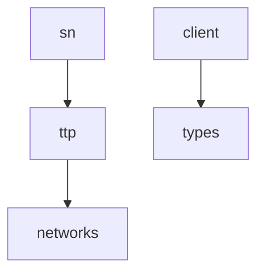
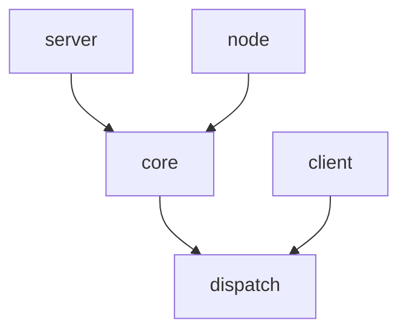
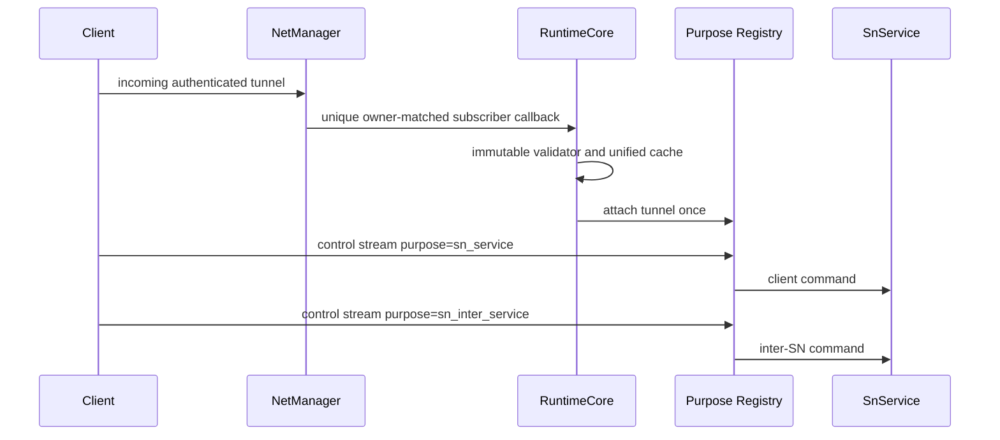
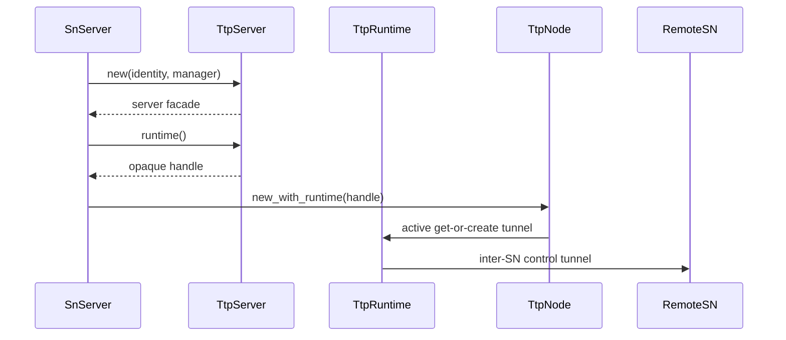
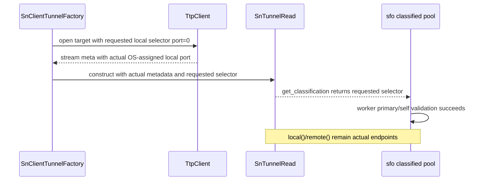

# Pipeline Plan

Workflow tier: high-risk

Risk profile: ../risk-profile.yaml

## Trigger

- Proposal: docs/versions/v0.1/modules/p2p-frame/035-single-ttp-runtime-sn-demux/proposal.md
- User launch confirmed: yes
- User launch statement: “确认，自动完成”
- Launch stage: proposal
- First auto stage: design
- Design source: pipeline/plan.md
- Per-stage user confirmation: skipped by explicit user auto-pipeline authorization
- Auto-confirm completed document stages: no design/testing Markdown documents generated; repository-local document extensions only
- Auto-pipeline document policy: stage-selective; no design/testing Markdown docs; automatic design uses pipeline plan; automatic testing uses runtime state; testplan.yaml required for automatic testing
- Version: v0.1
- Packet module: p2p-frame
- Task name: 035-single-ttp-runtime-sn-demux
- Target module(s): p2p-frame
- change_id values: shared_ttp_runtime_sn_purpose_demux, ttp_incoming_subscription_lifecycle

## Acceptance Baseline

- Final acceptance is judged against `proposal.md`.
- `TtpRuntime` is an opaque public handle: consumers may obtain, clone, retain, and pass it to `TtpServer`/`TtpNode`, but no runtime operational method or core field is public or broadly `pub(crate)`.
- One runtime owns one identity/NetManager subscriber, immutable incoming validator, purpose registries, attached tunnels, and multi-endpoint tunnel cache.
- Existing dynamic local-bind semantics remain compatible: when a TTP target local endpoint has port `0`, cache matching treats only that local port as the OS-assigned-port wildcard while requiring the same protocol and IP; non-zero local ports, remote endpoints, and remote identities remain exact. This does not change endpoint classification or tunnel selection strategy.
- SN command-pool classification preserves the requested bind selector separately from actual socket metadata: a requested local port `0` remains the worker-pool key while `TtpStreamMeta`, `SnTunnelRead::local`, and `SnTunnelWrite::local` retain the OS-assigned endpoint. Endpoint area, protocol/IP, remote endpoint, non-zero port, and tunnel selection semantics remain unchanged.
- Existing `TtpServer` passive connector semantics, `TtpNode` active connector semantics, wire formats, purpose values, and existing public constructors remain compatible.
- Membership-enabled SN must preserve ordinary Report/online while using the shared runtime for production inter-SN Query/Rendezvous.

## Stage Graph

| Task ID | Stage | Execution Mode | Responsibility | Scope | Parent Task | Depends On | Output | Done Condition |
|---------|-------|----------------|----------------|-------|-------------|------------|--------|----------------|
| D-1 | design | auto-pipeline | define opaque runtime ownership, module visibility, lifecycle and consumer compatibility | current TTP, NetManager and SN assembly boundaries | root | none | validated pipeline design mappings | plan checker passes without design Markdown |
| I-1 | implementation | auto-pipeline | integrate owner-matched subscription, shared runtime facades, dynamic-bind command classification and SN assembly | admitted p2p-frame production scope | root | I-NET, I-DISPATCH, I-CORE, I-SERVER, I-NODE, I-RUNTIME-MOD, I-CLIENT, I-TTP-MOD, I-SN | production implementation | all mapped production files, including return tasks I-SN-TYPES and I-SN-CLIENT, follow the approved sequence and implementation scope passes |
| T-1 | testing | auto-pipeline | derive post-implementation API, lifecycle and real-socket cases and wire the task runner | dedicated tests, existing cfg(test) regions where necessary, task testplan and runner | root | I-1 | runnable tests, testplan and runtime evidence | coverage, task runner and testing scope pass |
| A-1 | acceptance | auto-pipeline | independently falsify proposal, design, implementation, tests and lifecycle closure | complete task delivery | root | T-1 | acceptance-report.md | accepted report passes checker with no blocking finding |

## Submodule Tasks

| Task ID | Stage | Execution Mode | Responsibility | Submodule | Parent Task | Depends On | Output | Done Condition |
|---------|-------|----------------|----------------|-----------|-------------|------------|--------|----------------|
| I-NET | implementation | auto-pipeline | add owner-matched incoming subscription ownership without breaking legacy registration | `networks/net_manager.rs` | I-1 | D-1 | additive RAII guard and token-matched cleanup | failed or stale owner cleanup cannot remove incumbent subscription |
| I-DISPATCH | implementation | auto-pipeline | isolate the existing purpose attach/dispatch engine from the public shared handle | `ttp/runtime/dispatch.rs` | I-1 | I-NET | private dispatch runtime | TtpClient and shared core can attach tunnels without exposing shared-handle operations |
| I-CORE | implementation | auto-pipeline | implement opaque handle and private subscriber/cache/validator core | `ttp/runtime/handle.rs` | I-1 | I-DISPATCH | shared runtime ownership core | handle has no public operational surface and core owns one guarded subscriber |
| I-SERVER | implementation | auto-pipeline | move and adapt the passive server facade | `ttp/runtime/server.rs` | I-1 | I-CORE | compatible TtpServer facade | existing connector stays passive and shared constructor/getter are additive |
| I-NODE | implementation | auto-pipeline | move and adapt the active node facade | `ttp/runtime/node.rs` | I-1 | I-CORE | compatible TtpNode facade | active connect uses the shared core and shared constructor/getter are additive |
| I-RUNTIME-MOD | implementation | auto-pipeline | wire the runtime submodule facade | `ttp/runtime/mod.rs` | I-1 | I-SERVER, I-NODE | declarations and re-exports only | no implementation logic exists in mod.rs |
| I-CLIENT | implementation | auto-pipeline | retain TtpClient on its private dispatch runtime and independent cache, and preserve cache reuse for existing dynamic local-port binding | `ttp/client.rs` | I-1 | I-RUNTIME-MOD | private dispatch migration plus bounded local-endpoint matching compatibility fix | TtpClient cannot accept or unpack the shared handle; local target port `0` matches an assigned tunnel port only when protocol/IP match, while non-zero local ports and all remote matching remain exact |
| I-TTP-MOD | implementation | auto-pipeline | preserve crate-visible TTP symbol paths | `ttp/mod.rs` | I-1 | I-CLIENT | module declarations and re-exports only | old public symbols remain available and TtpRuntime is additive |
| I-SN-TYPES | implementation | auto-pipeline | separate actual SN tunnel endpoint metadata from the requested command-pool classification selector | `sn/types.rs` | I-1 | I-TTP-MOD | compatible read-side dual representation with crate-SN-only construction | existing constructors keep actual classification; only the client factory can supply a distinct requested selector without changing actual metadata or equality/hash semantics |
| I-SN-CLIENT | implementation | auto-pipeline | pass the requested dynamic-bind selector into the SN command read side | `sn/client/sn_service.rs` | I-1 | I-SN-TYPES | bounded classified-worker admission fix | requested port `0` validates as the pool primary while actual stream metadata and exact protocol/IP/remote matching remain intact |
| I-SN | implementation | auto-pipeline | assemble one TTP runtime for client and inter-SN purposes | `sn/service/service.rs` | I-1 | I-TTP-MOD | membership-enabled shared runtime assembly | no second incoming subscriber is created and existing inter-SN API remains consumed |

## Parallel Scheduling

- Strategy: dependency-ready-set
- Concurrency: use all runtime-available child-agent slots
- Shared artifact owner: parent-orchestrator
- Lock directory: `.harness/locks/`
- Dispatch rule: launch dependency-ready work with practical edit coordination and available capacity.
- Serialization reasons: explicit dependency, edit coordination, or exhausted concurrency capacity.
- Current serialization reason: I-NET -> I-DISPATCH -> I-CORE -> I-SERVER/I-NODE -> I-RUNTIME-MOD -> I-CLIENT -> I-TTP-MOD -> I-SN-TYPES -> I-SN-CLIENT -> I-SN is the file-level dependency order; T-1 follows the integrated implementation; A-1 follows task evidence.
- Evidence: scheduler waves are recorded in `.harness/pipelines/v0.1/p2p-frame/035-single-ttp-runtime-sn-demux/state.json`.

## Dependency Graphs



| Level | Parent | Node | Depends On |
|-------|--------|------|------------|
| submodule | p2p-frame | networks | none |
| submodule | p2p-frame | ttp | networks |
| submodule | p2p-frame | sn | ttp |
| nested-submodule | sn | types | none |
| nested-submodule | sn | client | types |



| Level | Parent | Node | Depends On |
|-------|--------|------|------------|
| nested-submodule | ttp | dispatch | none |
| nested-submodule | ttp | core | dispatch |
| nested-submodule | ttp | server | core |
| nested-submodule | ttp | node | core |
| nested-submodule | ttp | client | dispatch |

## Exported Interfaces

| Interface | Owner | Consumer | Compatibility | Affected Callers | Migration Path |
|-----------|-------|----------|---------------|------------------|----------------|
| `TtpRuntime` opaque handle | ttp shared runtime | `shared_ttp_runtime_sn_purpose_demux` and external composition | new | none | additive; consumers obtain it only from a server/node getter |
| `TtpServer::new_with_runtime` / `runtime` | ttp server facade | `p2p-frame/src/sn/service/service.rs` | new | none | additive shared-facade assembly |
| `TtpNode::new_with_runtime` / `runtime` | ttp node facade | `p2p-frame/src/sn/service/service.rs` | new | none | additive shared-facade assembly |
| existing `TtpServer` constructors and `TtpConnector` | ttp server facade | PN, SN and OwnerDirectory | backward-compatible | `p2p-frame/src/pn/service/pn_server.rs`, `p2p-frame/src/sn/service/service.rs`, `p2p-frame/src/sn/directory/server.rs` | no migration; passive connector behavior preserved |
| existing `TtpNode` constructors and `TtpConnector` | ttp node facade | OwnerDirectory and inter-SN | backward-compatible | `p2p-frame/src/sn/directory/server.rs`, `p2p-frame/src/sn/inter_sn/mod.rs` | no migration; active connector behavior preserved |
| owner-matched incoming subscription guard | networks | ttp shared runtime core | new | none outside p2p-frame | additive beside legacy registration APIs |

## File-Level Interfaces

`p2p-frame/src/ttp/runtime/handle.rs` owns the public opaque handle and private core. The field and operational methods are not public; only the sibling `runtime::server` and `runtime::node` descendants may use the core interface.

```rust
#[derive(Clone)]
pub struct TtpRuntime(Arc<RuntimeCore>);

struct RuntimeCore {
    local_identity: P2pIdentityRef,
    net_manager: NetManagerRef,
    dispatch: Arc<TtpDispatchRuntime>,
    tunnels: Mutex<TtpTunnelCache>,
    incoming_validator: TtpIncomingTunnelValidatorRef,
    subscription: Mutex<Option<IncomingTunnelSubscriptionGuard>>,
}
```

`p2p-frame/src/ttp/runtime/server.rs` preserves passive server behavior and adds only shared-handle composition.

```rust
impl TtpServer {
    pub fn new(local_identity: P2pIdentityRef, net_manager: NetManagerRef)
        -> P2pResult<TtpServerRef>;
    pub fn new_with_incoming_tunnel_validator(
        local_identity: P2pIdentityRef,
        net_manager: NetManagerRef,
        validator: TtpIncomingTunnelValidatorRef,
    ) -> P2pResult<TtpServerRef>;
    pub fn new_with_runtime(runtime: TtpRuntime) -> TtpServerRef;
    pub fn runtime(&self) -> TtpRuntime;
}
```

`p2p-frame/src/ttp/runtime/node.rs` preserves active connector behavior and adds only shared-handle composition.

```rust
impl TtpNode {
    pub fn new(local_identity: P2pIdentityRef, net_manager: NetManagerRef)
        -> P2pResult<TtpNodeRef>;
    pub fn new_with_runtime(runtime: TtpRuntime) -> TtpNodeRef;
    pub fn runtime(&self) -> TtpRuntime;
}
```

`p2p-frame/src/networks/net_manager.rs` keeps legacy methods and adds a crate-internal owner-matched path.

```rust
pub(crate) struct IncomingTunnelSubscriptionGuard { /* opaque owner token */ }

impl NetManager {
    pub(crate) fn register_owned_incoming_tunnel_subscriber(
        self: &Arc<Self>,
        local_id: P2pId,
        callback: IncomingTunnelSubscriber,
    ) -> P2pResult<IncomingTunnelSubscriptionGuard>;
}
```

`p2p-frame/src/sn/types.rs` keeps actual endpoint metadata and stores the command-pool selector independently. Existing public constructors initialize both views from the actual endpoint; only code inside `crate::sn` may provide an explicit selector.

```rust
pub struct SnTunnelRead {
    local: Endpoint,
    remote: Endpoint,
    classification: SnTunnelClassification,
    /* unchanged stream and identity fields */
}

impl SnTunnelRead {
    pub(in crate::sn) fn new_with_classification(
        read: TunnelStreamRead,
        local: Endpoint,
        remote: Endpoint,
        local_id: P2pId,
        remote_id: P2pId,
        classification: SnTunnelClassification,
    ) -> Self;
}
```

## Boundary Flows







## API and Build Surface Impact

- Public API impact: backward-compatible
- Crate-root export change: yes
- Build-surface change: yes
- Documentation examples affected: no

## Consumer Migration Closure

| Old Symbol | New Path | change_id | Consumer Path | Consumer Kind | Migration Status |
|------------|----------|-----------|---------------|---------------|------------------|
| not-applicable | `p2p_frame::TtpRuntime`, `TtpServer::runtime`, `TtpNode::new_with_runtime` | shared_ttp_runtime_sn_purpose_demux | `p2p-frame/src/sn/service/service.rs` | repository production consumer | migrated |
| not-applicable | existing TTP server constructors remain unchanged | shared_ttp_runtime_sn_purpose_demux | `p2p-frame/src/pn/service/pn_server.rs` | repository production consumer | migrated |
| not-applicable | existing TTP node and inter-SN constructors remain unchanged | shared_ttp_runtime_sn_purpose_demux | `p2p-frame/src/sn/directory/server.rs` | repository production consumer | migrated |
| not-applicable | existing NetManager registration and unregistration APIs remain unchanged | ttp_incoming_subscription_lifecycle | `p2p-frame/src/tunnel/tunnel_manager.rs` | repository production consumer | migrated |

## State Ownership

| State | Owner | Access Interface | Lifecycle | Failure Transitions |
|-------|-------|------------------|-----------|---------------------|
| identity, manager, validator and purpose registries | private `RuntimeCore` | opaque `TtpRuntime` passed only through server/node constructors | constructing -> subscriber registered -> active -> last handle dropped | registration failure returns `AlreadyExists` without a guard; validator reject/error closes only that tunnel and leaves runtime active |
| incoming subscription entry and owner token | `NetManager` | owned registration guard | absent -> token installed -> active -> matching guard dropped -> absent | stale or failed guard drop with a non-matching token is a no-op |
| shared multi-endpoint tunnel cache | private `RuntimeCore` | server existing-only lookup; node get-or-create | empty -> attached/remembered -> reused -> unavailable entries pruned -> runtime dropped | create/attach failure is not cached; remote-id and endpoint mismatch never reuse an entry; endpoint matching uses the bounded dynamic-local-port rule so shared node and private client paths cannot disagree on target identity |
| independent TtpClient tunnel cache | `TtpClient` | private get-or-create and lease lookup | empty -> tunnel created with requested bind selector -> actual local endpoint remembered -> matching tunnel reused -> closed/error entries pruned -> client dropped | local target port `0` ignores only the assigned local port during matching; protocol/IP, remote identity and remote endpoint mismatches never reuse an entry |
| SN command tunnel endpoint views | `SnTunnelRead` | actual endpoint getters plus `ClassifiedCmdTunnelRead::get_classification` | requested selector chosen -> actual socket connected -> both views stored -> worker admitted -> tunnel dropped | pool validation uses the immutable requested selector; actual metadata is never normalized; mismatched non-zero port, protocol, IP, remote endpoint or identity remains invalid |
| facade lifetime | `TtpServer`, `TtpNode`, and `TtpRuntime` Arc strong ownership | public constructors/getter | zero or more facades share one runtime -> individual facade drop -> last runtime handle drop | facade drop never unregisters independently; only core-owned guard performs owner-matched cleanup |

## Failure Flows

| Flow | Boundary | Failure | Handling |
|------|----------|---------|----------|
| exclusive runtime construction | RuntimeCore -> NetManager | identity subscriber already exists | return `AlreadyExists`; no guard is stored and incumbent remains installed |
| incoming tunnel | NetManager -> RuntimeCore validator | reject or validator error | close the incoming tunnel, do not cache/attach it, keep the subscriber active |
| incoming attach | RuntimeCore -> dispatch runtime | stream/control/datagram attach fails | close/propagate according to existing attach semantics and do not remember the tunnel |
| active node connection | RuntimeCore -> TunnelNetwork | endpoint/network/create/attach fails | propagate existing error and do not cache a partial tunnel |
| server open | server facade -> shared cache | no matching incoming tunnel | preserve existing `NotFound`; never trigger an active connection |
| dynamic local-bind cache lookup | TTP target -> private/shared cache | target local endpoint uses port `0` but the established tunnel records the OS-assigned port | treat only the local port as wildcard; require exact protocol/IP plus existing exact remote-id/remote-endpoint checks; reuse the matching tunnel instead of creating duplicates |
| exact local-bind cache lookup | TTP target -> private/shared cache | non-zero local port, protocol, or IP differs | preserve no-match behavior and create/fail through the existing get-or-create path |
| classified worker admission | SN client factory -> `SnTunnelRead` -> sfo pool | requested local port `0` differs from the actual OS-assigned port | retain actual stream metadata but return the original requested selector as the pool classification so self/requested validation succeeds before `ReportSn` write |
| classified worker selector mismatch | SN client factory -> sfo pool | non-zero local port, protocol/IP, remote endpoint, or identity differs | preserve exact mismatch rejection; do not normalize, retry under another selector, or alter tunnel selection |
| purpose registration | facade -> dispatch registry | purpose already registered | preserve registry `AlreadyExists`; do not replace the incumbent callback |
| cleanup | runtime guard -> NetManager | entry was replaced or token differs | no-op; never remove the current owner |

## Rejected Alternatives

| Decision Type | Selected | Rejected | Reason |
|---------------|----------|----------|--------|
| boundary | one shared runtime owns subscriber, validator, cache and dispatch while server remains passive and node remains active | share only the current purpose registry or change server connector to auto-connect | split ownership leaves the defect intact, while auto-connect would change PN and existing server failure semantics |
| technical | nested private core with an opaque public handle and server/node child facades | `pub(crate)` or public runtime operational methods | Rust has no friend visibility; broad methods violate the confirmed access boundary |
| collaboration | one runtime and owner-token guard coordinate cleanup across server/node facades | facade-local unconditional unregister or multiple subscribers per identity | identity-only cleanup permits stale deletion; multiple top-level subscribers cannot choose a stream purpose before tunnel attachment |
| technical | store requested command-pool selector separately from actual endpoint metadata | make port `0` a wildcard in `SnTunnelClassification::PartialEq`/`Hash` | wildcard equality is non-transitive across multiple actual ports and would violate equality/hash map contracts for every classification consumer |
| technical | add a crate-SN-only read constructor carrying both views | replace actual local metadata with port `0`, erase local classification, or modify external sfo pool semantics | replacing metadata loses the real socket endpoint; erasing classification relaxes matching; changing the dependency is broader than the local adapter defect |

## Implementation Scope Bindings

| change_id | target_module | proposal_id | design_coverage | scope_paths | design_rules_applied |
|-----------|---------------|-------------|-----------------|-------------|----------------------|
| shared_ttp_runtime_sn_purpose_demux | p2p-frame | P-035-1 | opaque shared core, nested facade visibility, active/passive connector compatibility, purpose dispatch, dynamic-bind command-pool classification and SN assembly | `p2p-frame/src/ttp/runtime.rs`, `p2p-frame/src/ttp/runtime/`, `p2p-frame/src/ttp/server.rs`, `p2p-frame/src/ttp/node.rs`, `p2p-frame/src/ttp/client.rs`, `p2p-frame/src/ttp/mod.rs`, `p2p-frame/src/sn/types.rs`, `p2p-frame/src/sn/client/sn_service.rs`, `p2p-frame/src/sn/service/service.rs` | acyclic module decomposition, Rust interfaces, immutable validation state, actual/selector endpoint separation, additive public API, consumer closure |
| ttp_incoming_subscription_lifecycle | p2p-frame | P-035-2 | owner-token registration guard with matching cleanup and compatible legacy entrypoints | `p2p-frame/src/networks/net_manager.rs`, `p2p-frame/src/ttp/runtime/` | single state owner, failure-inclusive lifecycle, stale cleanup protection, compatibility |

## File-Level Implementation Sequence

| Sequence | Task ID | File-Level Module | Action | Depends On | change_id | target_module | Scope Paths | Context Sources |
|----------|---------|-------------------|--------|------------|-----------|---------------|-------------|-----------------|
| 1 | I-NET | `p2p-frame/src/networks/net_manager.rs` | add owner-token subscription entry and crate-internal RAII guard while preserving legacy APIs | none | ttp_incoming_subscription_lifecycle | p2p-frame | `p2p-frame/src/networks/net_manager.rs` | proposal P-035-2; subscription lifecycle design |
| 2 | I-DISPATCH | `p2p-frame/src/ttp/runtime/dispatch.rs` | move the existing purpose registry/attach engine from runtime.rs and keep it internal for shared core and TtpClient | I-NET | shared_ttp_runtime_sn_purpose_demux | p2p-frame | `p2p-frame/src/ttp/runtime.rs`, `p2p-frame/src/ttp/runtime/dispatch.rs` | runtime decomposition and visibility design |
| 3 | I-CORE | `p2p-frame/src/ttp/runtime/handle.rs` | create opaque handle/private RuntimeCore with unique registration, validator, cache, attach and active connection ownership | I-DISPATCH | shared_ttp_runtime_sn_purpose_demux | p2p-frame | `p2p-frame/src/ttp/runtime/handle.rs` | exported interface, state and failure-flow design |
| 4 | I-SERVER | `p2p-frame/src/ttp/runtime/server.rs` | move server facade, add shared constructor/getter, preserve passive connector and remove facade-owned subscriber Drop | I-CORE | shared_ttp_runtime_sn_purpose_demux | p2p-frame | `p2p-frame/src/ttp/server.rs`, `p2p-frame/src/ttp/runtime/server.rs` | server interface and compatibility rows |
| 5 | I-NODE | `p2p-frame/src/ttp/runtime/node.rs` | move node facade, add shared constructor/getter, delegate active connection to core and remove facade-owned subscriber Drop | I-CORE | shared_ttp_runtime_sn_purpose_demux | p2p-frame | `p2p-frame/src/ttp/node.rs`, `p2p-frame/src/ttp/runtime/node.rs` | node interface and active connection flow |
| 6 | I-RUNTIME-MOD | `p2p-frame/src/ttp/runtime/mod.rs` | declare/re-export runtime files only; contain no implementation logic | I-SERVER, I-NODE | shared_ttp_runtime_sn_purpose_demux | p2p-frame | `p2p-frame/src/ttp/runtime/mod.rs` | module-interface custom rule |
| 7 | I-CLIENT | `p2p-frame/src/ttp/client.rs` | mechanically consume the private dispatch runtime, retain the independent client cache/lifecycle, and correct target matching so a requested local port `0` reuses the established dynamic-port tunnel without relaxing protocol/IP, non-zero-port, remote-endpoint, or remote-id isolation | I-RUNTIME-MOD | shared_ttp_runtime_sn_purpose_demux | p2p-frame | `p2p-frame/src/ttp/client.rs` | TtpClient isolation decision; proposal P-035-1 cache endpoint isolation and Report/online success boundary |
| 8 | I-TTP-MOD | `p2p-frame/src/ttp/mod.rs` | update facade module declarations/re-exports only, preserving old public symbol paths | I-CLIENT | shared_ttp_runtime_sn_purpose_demux | p2p-frame | `p2p-frame/src/ttp/mod.rs` | module-interface custom rule and API surface |
| 9 | I-SN-TYPES | `p2p-frame/src/sn/types.rs` | add a stored requested classification and crate-SN-only constructor while preserving actual endpoint getters and existing public constructor behavior | I-TTP-MOD | shared_ttp_runtime_sn_purpose_demux | p2p-frame | `p2p-frame/src/sn/types.rs` | classified worker admission flow; actual/selector separation |
| 10 | I-SN-CLIENT | `p2p-frame/src/sn/client/sn_service.rs` | construct client-side `SnTunnelRead` with actual stream endpoints plus the original requested `SnTunnelClassification` selector | I-SN-TYPES | shared_ttp_runtime_sn_purpose_demux | p2p-frame | `p2p-frame/src/sn/client/sn_service.rs` | Report/online success boundary; sfo pool self/requested validation |
| 11 | I-SN | `p2p-frame/src/sn/service/service.rs` | construct TtpNode from `ttp_server.runtime()` for TtpInterSnClient instead of registering a second subscriber; repeat consumer closure after I-SN-CLIENT before I-1 integration | I-TTP-MOD | shared_ttp_runtime_sn_purpose_demux | p2p-frame | `p2p-frame/src/sn/service/service.rs` | SN assembly boundary and inter-SN consumer |

## Return Rules

- Return to design if implementation requires public/broad runtime operational methods, changes passive server semantics, permits validator replacement, splits cache/subscriber ownership, needs paths/interfaces absent from this plan, wildcards local IP/protocol, relaxes non-zero local-port or remote endpoint/identity matching, changes EndpointArea/tunnel selection, changes `SnTunnelClassification` equality/hash semantics, replaces actual endpoint metadata with a selector, or alters `Connecting` readiness semantics.
- Return to implementation for missing owner matching, visibility leaks, cache/attach defects, strict local-port-`0` cache mismatch that causes duplicate TTP tunnel creation, requested/actual command-pool classification conflation that rejects a valid dynamic-bind worker, Report/online failure, or inter-SN assembly mismatch.
- Return to testing for missing contract/lifecycle/real-socket evidence, an unreachable task runner, or inadequate red-green proof.
- If acceptance finds proposal ambiguity, write a blocking requirement finding and stop for user decision.
- Repeat the owning stage and all dependents for routable findings; stop after more than five unsuccessful iterations of the same issue.

Execution status, testing evidence, return records, and final acceptance are stored in `.harness/pipelines/v0.1/p2p-frame/035-single-ttp-runtime-sn-demux/state.json`.
