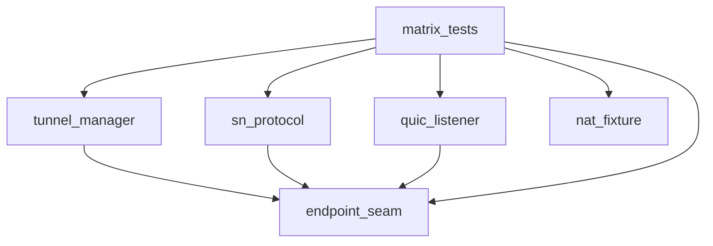

# Pipeline Plan

Workflow tier: high-risk

Risk profile: ../risk-profile.yaml

## Trigger
- Proposal: docs/versions/v0.1/modules/p2p-frame/040-execute-real-p2p-strategy-matrix/proposal.md
- User launch confirmed: yes
- User launch statement: `确认，自动完成`
- Launch stage: proposal
- First auto stage: design
- Design source: pipeline/plan.md
- Per-stage user confirmation: skipped by explicit user auto-pipeline authorization
- Auto-pipeline document policy: stage-selective; no design/testing Markdown docs generated; automatic design uses pipeline plan; testplan.yaml required for automatic testing; automatic testing uses runtime state plus testplan.yaml
- Auto-confirm completed document stages: no design/testing Markdown documents generated; automatic design uses this pipeline plan; automatic testing uses runtime state plus testplan.yaml
- Version: v0.1
- Packet module: p2p-frame
- Task name: 040-execute-real-p2p-strategy-matrix
- Target module(s): p2p-frame
- change_id values: CHG-040-nat-matrix-test-seam, CHG-040-nat-matrix-fixture, CHG-040-nat-matrix-execution

## Acceptance Baseline
- Final acceptance is judged against `proposal.md`.
- All six strategy conditions must execute the production `NatConnectPlan` and SN rendezvous branches and record real `selected` / `request-sent` / `action-armed` evidence.
- SymmetricLike profile evidence must come from one logical internal source socket with per-destination mapping changes observed through real probe reflectors.
- Callee-public, caller-public, and non-symmetric/non-symmetric rows require a real tunnel and bidirectional unique payload; symmetric rows may stop at action-armed with a bounded connect/fallback result.
- A non-test Cargo build must not change endpoint/rendezvous/punch predicate behavior.

## Stage Graph
| Task ID | Stage | Execution Mode | Responsibility | Scope | Parent Task | Depends On | Output | Done Condition |
|---------|-------|----------------|----------------|-------|-------------|------------|--------|----------------|
| D-1 | design | auto-pipeline | bind the approved matrix execution approach to p2p-frame seam, fixture, and matrix sources | task packet and production relationships | root | none | validated pipeline plan mappings | plan checker passes; design mappings completed |
| I-1 | implementation | auto-pipeline | implement the feature-gated eligibility seam, NAT mapping fixture, and matrix execution sources | `p2p-frame/src/**`, `p2p-frame/Cargo.toml`, `p2p-frame/tests/real_p2p_tunnel_flow/**` | root | D-1 | admission evidence and implementation sources | all three change_ids directly covered; targeted verification passes |
| T-1 | testing | auto-pipeline | design and run task tests, write testplan and runtime evidence | parent-owned test root and shared artifacts | root | I-1 | testplan.yaml and runnable matrix evidence | task-scoped test run passes; coverage/scope checks pass |
| A-1 | acceptance | auto-pipeline | independently falsify proposal/design/implementation/testing delivery | complete task delivery | root | T-1 | acceptance-report.md | accepted report passes checker with no blocking finding |

## Merged-Task Reasons
- I-1 merges the seam, fixture, and matrix sub-scopes into one implementation task because the seam and fixture are consumed by the same exclusive test binary and must be edited as one coordinated change set on one orchestrator; no independent child write scope is disjoint.
- T-1 and A-1 remain parent-owned single tasks because this environment runs one primary agent; the acceptance task still performs a fresh independent falsification review after implementation/testing.

## Dependency Graphs

| Level | Parent | Node | Depends On |
|-------|--------|------|------------|
| file | p2p-frame | endpoint_seam | none |
| file | p2p-frame | tunnel_manager | endpoint_seam |
| file | p2p-frame | sn_protocol | endpoint_seam |
| file | p2p-frame | quic_listener | endpoint_seam |
| file | p2p-frame | nat_fixture | none |
| file | p2p-frame | matrix_tests | endpoint_seam, tunnel_manager, sn_protocol, quic_listener, nat_fixture |

## Parallel Scheduling
- Strategy: dependency-ready-set
- Concurrency: use all runtime-available child-agent slots (this environment provides one primary agent; all task execution is serial with practical edit coordination)
- Shared artifact owner: parent-orchestrator
- Lock directory: `.harness/locks/`
- Dispatch rule: launch the maximum dependency-ready set with practical edit coordination and available capacity; immediately backfill free slots
- Serialization reasons: explicit dependency, edit coordination, or exhausted concurrency capacity only
- Shared-artifact coordination: parent owns plan, state, testplan, runner registration, manifests, and acceptance integration; submodule tasks own only their listed source outputs
- Evidence: scheduler waves and capacity reasons are recorded in `.harness/pipelines/v0.1/p2p-frame/040-execute-real-p2p-strategy-matrix/state.json`

## Submodule Tasks
| Task ID | Stage | Execution Mode | Responsibility | Submodule | Parent Task | Depends On | Output | Done Condition |
|---------|-------|----------------|----------------|-----------|-------------|------------|--------|----------------|
| D-MATRIX | design | auto-pipeline | validate plan mappings for the seam, fixture, and matrix execution | p2p-frame strategy-matrix plan | D-1 | root | validated plan mappings | plan checker passes |
| I-SEAM | implementation | auto-pipeline | implement feature-gated eligibility predicate and switch consumers | p2p-frame src seam | I-1 | D-MATRIX | seam source and default-build parity assertion | seam change covered and targeted unit evidence available |
| I-FIXTURE | implementation | auto-pipeline | implement NAT mapping reflectors, SN probe endpoints, profile readiness, and log sink | p2p-frame test fixture | I-1 | I-SEAM | fixture source | fixture compiles and profile readiness path exists |
| I-MATRIX | implementation | auto-pipeline | rewrite the six-row strategy matrix with branch-event and payload assertions | p2p-frame matrix tests | I-1 | I-FIXTURE | matrix source | matrix tests compile and serialize by scope |
| T-SUITE | testing | auto-pipeline | design and run task testplan plus runtime evidence | p2p-frame task tests | T-1 | I-MATRIX | testplan.yaml and task run artifact | task-scoped run passes with coverage |
| A-MATRIX | acceptance | auto-pipeline | independent falsification and acceptance report | p2p-frame task acceptance | A-1 | T-SUITE | acceptance-report.md | accepted conclusion with no blocking finding |

## Exported Interfaces
| Interface | Owner | Consumer | Compatibility | Affected Callers | Migration Path |
|-----------|-------|----------|---------------|------------------|----------------|
| `rendezvous_ipv4_eligible` / `rendezvous_eligible_area` (pub(crate), feature-gated relaxation of loopback/private eligibility) | endpoint.rs | tunnel_manager.rs, sn/protocol/sn.rs, quic listener, sn/service/service.rs | backward-compatible | no production callers | no migration; test feature only |
| controlled NAT probe reflector serving `set_nat_probe_endpoints` | matrix fixture | production SN scheduler and client probe chain | backward-compatible | fixture-only | no migration |
| `StreamManager::connect_from_id` production entry | stream manager | matrix tests through `P2pStack` | backward-compatible | none | no migration; observe current behavior |

## API and Build Surface Impact
- Public API impact: none
- Crate-root export change: no
- Build-surface change: yes
- Documentation examples affected: no

Build-surface detail: a new p2p-frame Cargo feature `test-real-socket-matrix` is additive and opt-in; the default feature set is unchanged.

## Consumer Migration Closure
| Old Symbol | New Path | change_id | Consumer Path | Consumer Kind | Migration Status |
|------------|----------|-----------|---------------|----------------|------------------|
| new-symbol | not-applicable | CHG-040-nat-matrix-test-seam | none-found | library internal consumer | verified-none |
| new-symbol | not-applicable | CHG-040-nat-matrix-fixture | none-found | test-only consumer | verified-none |
| new-symbol | not-applicable | CHG-040-nat-matrix-execution | none-found | test-only consumer | verified-none |

## State Ownership
| State | Owner | Access Interface | Lifecycle | Failure Transitions |
|-------|-------|------------------|-----------|---------------------|
| NAT probe mapping reflectors and relay sockets | real-socket matrix fixture | fixture-owned task handles; SN `set_nat_probe_endpoints` injects target addresses | created before node Report -> serving mappings -> dropped in RAII | bind failure retried with fresh dynamic ports; drop closes sockets |
| SN peer NAT profiles | SN peer manager | production probe/Report/Query chain | unknown -> fresh profile -> invalidated/refreshed | missing/Unknown stays legacy-eligible; queries return fresh profiles only |
| rendezvous owner and incoming waiters | tunnel manager | production `on_sn_rendezvous` and request path | request built -> owner installed -> request sent -> action-armed -> connected/fallback -> cleanup | bounded timeout/cancel removes only the owned attempt |
| connection-info cache | caller/target stacks | injected `ConnectionInfoRecorder` | observed after register/publish | failed direct/action paths do not publish success |

## Failure Flows
| Flow | Boundary | Failure | Handling |
|------|----------|---------|----------|
| profile generation | real reflector probe -> SN query | mapping observation absent/Unknown | fixture waits for fresh expected profiles within absolute deadline; fails setup early |
| strategy selection | profile pair -> plan -> rendezvous candidate construction | loopback endpoint ineligible in non-test build | feature gate enables eligibility; default build records strict predicate unchanged |
| rendezvous request | request -> SN wire -> target action | action connect failure over loopback prediction ports | record request-sent + action-armed events, then bounded fallback/failure result; connected only for reachable rows |
| direct/legacy/PN representative rows | connect -> tunnel -> payload | connection or payload failure | test fails with concrete identity/boundary error and deadline cleanup |

## Rejected Alternatives
| Decision Type | Selected | Rejected | Reason |
|---------------|----------|----------|--------|
| technical | real production Reflect/Report/Query chain through controlled probe reflectors | direct `NatProfile`/`NatTraversalContext` injection | profile comes from production observation path; premature injection would recreate 033/034 fake-coverage defect |
| technical | opt-in Cargo feature predicate relaxation in p2p-frame | privileged network namespace / public-looking loopback alias topology | feature is portable and repeatable without root/OS configuration |
| boundary | all six rows reach request-sent/action-armed; only reachable rows require connected payload | require all six rows connected | loopback symmetric prediction ports are not guaranteed bindable; forcing connected would manufacture an unrealistic success claim |
| collaboration | single-orchestrator serial execution with explicit dependency waves | uncoordinated parallel subagent writes to shared fixture/testplan | this environment exposes one primary agent; serial waves keep edit scopes exclusive and auditable |

## Implementation Scope Bindings
| change_id | target_module | proposal_id | Design Coverage | Scope Paths | design_rules_applied |
|-----------|---------------|-------------|------------------|-------------|----------------------|
| CHG-040-nat-matrix-test-seam | p2p-frame | P-040-1 | add `rendezvous_ipv4_eligible`/`rendezvous_eligible_area` predicates, switch rendezvous/punch consumers, allow loopback SN observed endpoints, preserve Wan area through loopback dedup, and backfill probe endpoints in test-mode Report; feature default off | `p2p-frame/src/endpoint.rs`, `p2p-frame/src/tunnel/tunnel_manager.rs`, `p2p-frame/src/sn/protocol/sn.rs`, `p2p-frame/src/networks/quic/listener.rs`, `p2p-frame/src/sn/service/service.rs`, `p2p-frame/Cargo.toml` | module dependencies, exported interfaces, backward-compatible build-surface policy |
| CHG-040-nat-matrix-fixture | p2p-frame | P-040-2 | controlled probe reflectors keyed by the single real source socket with per-destination mapping policy; SN probe endpoint wiring; profile readiness waits | `p2p-frame/tests/real_p2p_tunnel_flow.rs`, `p2p-frame/tests/real_p2p_tunnel_flow/**` | state ownership, failure flows, no production hook beyond fixture |
| CHG-040-nat-matrix-execution | p2p-frame | P-040-3 | six real cases from connect-by-id with structured branch-event assertions and bounded per-row results | `p2p-frame/tests/real_p2p_tunnel_flow.rs`, `p2p-frame/tests/real_p2p_tunnel_flow/**` | state ownership, failure flows, boundary evidence model |

## File-Level Implementation Sequence
| sequence | task_id | file_level_module | action | depends_on | change_id | target_module | scope_paths | context_sources |
|----------|---------|-------------------|--------|------------|-----------|---------------|-------------|-----------------|
| 1 | I-SEAM | p2p-frame/Cargo.toml, p2p-frame/src/endpoint.rs, p2p-frame/src/tunnel/tunnel_manager.rs, p2p-frame/src/sn/protocol/sn.rs, p2p-frame/src/networks/quic/listener.rs, p2p-frame/src/sn/service/service.rs | modify | root | CHG-040-nat-matrix-test-seam | p2p-frame | p2p-frame/src/endpoint.rs, p2p-frame/src/tunnel/tunnel_manager.rs, p2p-frame/src/sn/protocol/sn.rs, p2p-frame/src/networks/quic/listener.rs, p2p-frame/src/sn/service/service.rs, p2p-frame/Cargo.toml | p2p-frame/src/endpoint.rs, p2p-frame/src/tunnel/tunnel_manager.rs, p2p-frame/src/sn/protocol/sn.rs, p2p-frame/src/networks/quic/listener.rs, p2p-frame/src/sn/service/service.rs, p2p-frame/Cargo.toml |
| 2 | I-FIXTURE | p2p-frame/tests/real_p2p_tunnel_flow/fixture.rs | modify | I-SEAM | CHG-040-nat-matrix-fixture | p2p-frame | p2p-frame/tests/real_p2p_tunnel_flow/fixture.rs | p2p-frame/tests/real_p2p_tunnel_flow/fixture.rs |
| 3 | I-MATRIX | p2p-frame/tests/real_p2p_tunnel_flow/strategy_matrix.rs | modify | I-FIXTURE | CHG-040-nat-matrix-execution | p2p-frame | p2p-frame/tests/real_p2p_tunnel_flow/strategy_matrix.rs, p2p-frame/tests/real_p2p_tunnel_flow.rs | p2p-frame/tests/real_p2p_tunnel_flow/strategy_matrix.rs, p2p-frame/tests/real_p2p_tunnel_flow.rs |
