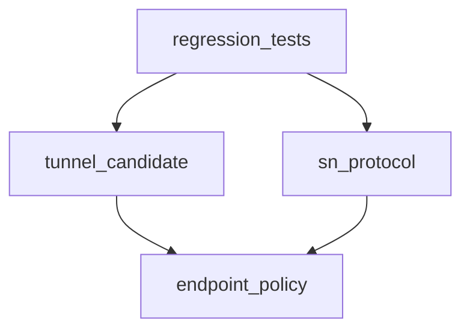

# Pipeline Plan

Workflow tier: high-risk

Risk profile: ./risk-profile.yaml

## Trigger
- Proposal: docs/versions/v0.1/modules/p2p-frame/044-wan-mapped-reverse-connect/proposal.md
- User launch confirmed: yes
- User launch statement: `确认，自动完成`
- Launch stage: proposal
- First auto stage: design
- Design source: pipeline/plan.md
- Per-stage user confirmation: skipped by explicit user auto-pipeline authorization
- Auto-confirm completed document stages: no design/testing Markdown documents generated; automatic design uses this pipeline plan and automatic testing uses runtime state plus testplan.yaml
- Auto-pipeline document policy: stage-selective; no design/testing Markdown docs generated; automatic design uses pipeline plan; automatic testing uses runtime state; testplan.yaml required for automatic testing
- Version: v0.1
- Packet module: p2p-frame
- Task name: 044-wan-mapped-reverse-connect
- Target module(s): p2p-frame
- change_id values: wan_mapped_reverse_connect_eligibility, wan_mapped_rendezvous_protocol_validation, production_default_reverse_connect_regression_tests

## Acceptance Baseline
- Final acceptance is judged against `proposal.md`.
- Production-default caller-public rendezvous must preserve public `Wan` and `Mapped` endpoints for Callee reverse connect and must not fall back to PN solely because of endpoint area.
- Pure punch and prediction endpoints keep their existing `ServerReflexive` production boundary; `ReverseConnectOnly` preserves the protocol's TCP-or-QUIC transport domain while operations containing punch remain QUIC-only; invalid addresses and unauthenticated endpoint ownership remain fail closed.
- Loopback real-socket evidence proves the action and direct tunnel path only, not public-NAT or deployed multi-SN behavior.

## Stage Graph
| Task ID | Stage | Execution Mode | Responsibility | Scope | Parent Task | Depends On | Output | Done Condition |
|---------|-------|----------------|----------------|-------|-------------|------------|--------|----------------|
| D-1 | design | auto-pipeline | bind operation-specific endpoint eligibility and consumer closure | task packet and current p2p-frame call chain | root | none | validated plan mappings | plan and risk-profile checks pass |
| I-1 | implementation | auto-pipeline | integrate the minimal production behavior change | p2p-frame endpoint, tunnel, and protocol sources | root | D-1 | production source changes | endpoint, candidate, and protocol changes are complete |
| T-1 | testing | auto-pipeline | design and run default-build and real-socket regression coverage | p2p-frame task tests | root | I-CANDIDATE, I-PROTOCOL | testplan, tests, and run evidence | task-scoped run and coverage checks pass |
| A-1 | acceptance | auto-pipeline | independently falsify proposal, design, implementation, and validation | complete task delivery | root | T-1, T-REGRESSION | acceptance report | accepted report passes with no blocking finding |

## Submodule Tasks
| Task ID | Stage | Execution Mode | Responsibility | Submodule | Parent Task | Depends On | Output | Done Condition |
|---------|-------|----------------|----------------|-----------|-------------|------------|--------|----------------|
| I-ENDPOINT | implementation | auto-pipeline | add reverse-connect-specific public area eligibility while preserving punch/prediction policy | endpoint eligibility | I-1 | D-1 | endpoint.rs | production and feature boundaries are explicit |
| I-CANDIDATE | implementation | auto-pipeline | select request candidate area and transport by rendezvous operation | tunnel rendezvous request construction | I-1 | I-ENDPOINT | tunnel_manager.rs | ReverseConnectOnly retains TCP/QUIC Wan/Mapped; operations containing punch remain QUIC-only |
| I-PROTOCOL | implementation | auto-pipeline | validate endpoint areas according to rendezvous operation | SN rendezvous validation | I-1 | I-ENDPOINT | sn/protocol/sn.rs | request and notify validation matches action semantics |
| T-REGRESSION | testing | auto-pipeline | add and execute production-default and loopback real-socket regression cases | p2p-frame tests | T-1 | I-CANDIDATE, I-PROTOCOL | test sources and run artifact | positive and negative cases pass through unified runner |

## Merged-Task Reasons
- Each stage remains a distinct dependency-linked task. Production edits are split by file-level responsibility; testing remains one task because the default protocol/candidate assertions and feature-gated caller-public matrix jointly validate one behavior boundary and share the same task testplan.
- Execution is serialized by dependency and edit coordination in this single-primary-agent run; shared plan, state, testplan, manifests, and acceptance integration remain parent-owned.

## Parallel Scheduling
- Strategy: dependency-ready-set
- Concurrency: use all runtime-available child-agent slots; this run has one authorized primary execution slot
- Shared artifact owner: parent-orchestrator
- Lock directory: `.harness/locks/`
- Dispatch rule: launch dependency-ready work with practical edit coordination and available capacity
- Serialization reasons: explicit dependency, edit coordination, or exhausted concurrency capacity
- Evidence: record launched task ids and serialization reasons in `.harness/pipelines/v0.1/p2p-frame/044-wan-mapped-reverse-connect/state.json` scheduler waves

## Dependency Graphs

| Level | Parent | Node | Depends On |
|-------|--------|------|------------|
| file | p2p-frame | endpoint_policy | none |
| file | p2p-frame | tunnel_candidate | endpoint_policy |
| file | p2p-frame | sn_protocol | endpoint_policy |
| file | p2p-frame | regression_tests | tunnel_candidate, sn_protocol |

## Exported Interfaces
| Interface | Owner | Consumer | Compatibility | Affected Callers | Migration Path |
|-----------|-------|----------|---------------|------------------|----------------|
| `rendezvous_reverse_connect_eligible_area` (new pub(crate) policy helper) | endpoint.rs | tunnel_manager.rs and sn/protocol/sn.rs | new | crate-internal consumers only | switch only reverse-connect candidate and validation consumers |
| `rendezvous_eligible_area` (existing punch/prediction helper) | endpoint.rs | tunnel_manager.rs, sn/protocol/sn.rs, and networks/quic/listener.rs | backward-compatible | crate-internal consumers only | retain existing behavior for pure punch and prediction |

## API and Build Surface Impact
- Public API impact: none
- Crate-root export change: no
- Build-surface change: no
- Documentation examples affected: no

## Consumer Migration Closure
| Old Symbol | New Path | change_id | Consumer Path | Consumer Kind | Migration Status |
|------------|----------|-----------|---------------|----------------|------------------|
| not-applicable | `rendezvous_reverse_connect_eligible_area` | wan_mapped_reverse_connect_eligibility | p2p-frame/src/tunnel/tunnel_manager.rs | crate-internal consumer | migrated |
| not-applicable | `rendezvous_reverse_connect_eligible_area` | wan_mapped_rendezvous_protocol_validation | p2p-frame/src/sn/protocol/sn.rs | crate-internal consumer | migrated |

## State Ownership
| State | Owner | Access Interface | Lifecycle | Failure Transitions |
|-------|-------|------------------|-----------|---------------------|
| rendezvous request endpoint snapshot | TunnelManager rendezvous attempt owner | operation-specific candidate builder and immutable SnTunnelRendezvous payload | plan selected -> endpoints filtered -> request validated -> SN ownership validated -> target action -> owner completion | empty/invalid/unowned endpoints fail before action and follow existing bounded PN fallback |
| authenticated initiator endpoint ownership | SN peer manager | rendezvous_endpoints_owned_by against report/certificate IPs | Report registers owned IPs -> request IPs checked -> notify emitted | mismatch returns failure without target notification |

## Failure Flows
| Flow | Boundary | Failure | Handling |
|------|----------|---------|----------|
| caller-public request construction | local reverse endpoints -> operation-specific area and transport filter | Wan or Mapped removed, or TCP removed from a pure reverse operation | ReverseConnectOnly uses reverse area eligibility with TCP/QUIC; PunchAndReverseConnect uses reverse area eligibility but remains QUIC-only; empty candidate remains an error only when no valid endpoint exists |
| SN request validation | wire decode -> endpoint domain -> authenticated ownership | invalid address/area/port/transport/duplicate or unowned IP | reject/failure and retain existing bounded fallback |
| target reverse connect | notify -> open_direct_path | direct dial fails | existing timeout, owner-token cleanup, and PN fallback behavior remains unchanged |
| rolling upgrade | new sender/SN/target -> old validator | old component rejects Wan or Mapped | no wire misdecode; request fails and uses existing compatibility/fallback path until components are upgraded |

## Rejected Alternatives
| Decision Type | Selected | Rejected | Reason |
|---------------|----------|----------|--------|
| boundary | operation-specific reverse eligibility for ServerReflexive, Wan, and Mapped plus TCP/QUIC on pure reverse | globally broaden the existing shared punch/prediction helper or keep the unconditional QUIC candidate filter | global broadening would change pure UDP punch/prediction, while unconditional QUIC would contradict the existing ReverseConnectOnly protocol domain |
| technical | preserve wire shape and branch validation by operation | add a new endpoint area or rendezvous protocol version | existing area values already express the endpoints and no encoding change is needed |
| collaboration | dependency-ordered single-primary-agent stage tasks | parallel edits to the same endpoint policy and consumer files | external execution constraints leave one authorized agent and the consumers depend on the same policy decision |

## Implementation Scope Bindings
| change_id | target_module | proposal_id | design_coverage | scope_paths | design_rules_applied |
|-----------|---------------|-------------|-----------------|-------------|----------------------|
| wan_mapped_reverse_connect_eligibility | p2p-frame | P-WMRC-1 | add operation-specific reverse-connect area eligibility; construct ReverseConnectOnly candidates from TCP or QUIC while operations containing punch stay QUIC-only; do not change pure punch/prediction area eligibility | `p2p-frame/src/endpoint.rs`, `p2p-frame/src/tunnel/tunnel_manager.rs`, `p2p-frame/src/networks/quic/listener.rs` | module dependencies, internal interfaces, failure boundaries, compatibility |
| wan_mapped_rendezvous_protocol_validation | p2p-frame | P-WMRC-2 | select reverse-connect or punch endpoint eligibility from SnTunnelRendezvousOperation while retaining all other validation | `p2p-frame/src/sn/protocol/sn.rs` | protocol domain, authenticated ownership boundary, failure behavior |
| production_default_reverse_connect_regression_tests | p2p-frame | P-WMRC-3 | add default-feature candidate/protocol positives and negatives, retain feature-gated real-socket caller-public direct connection coverage, and update stale feature comments | `p2p-frame/src/endpoint.rs`, `p2p-frame/src/networks/quic/listener.rs`, `p2p-frame/src/tunnel/tunnel_manager.rs`, `p2p-frame/tests/unit/endpoint/rendezvous_endpoint_policy_tests.rs`, `p2p-frame/tests/unit/tunnel/rendezvous_endpoint_policy_tests.rs`, `p2p-frame/tests/tunnel_rendezvous_protocol.rs`, `p2p-frame/tests/real_p2p_tunnel_flow.rs`, `p2p-frame/tests/real_p2p_tunnel_flow/strategy_matrix.rs`, `p2p-frame/Cargo.toml` | lowest-level failure exposure, production-default parity, real-socket evidence boundary |

## File-Level Implementation Sequence
| Sequence | Task ID | File-Level Module | Action | Depends On | change_id | target_module | Scope Paths | Context Sources |
|----------|---------|-------------------|--------|------------|-----------|---------------|-------------|-----------------|
| 1 | I-ENDPOINT | `p2p-frame/src/endpoint.rs` | modify | none | wan_mapped_reverse_connect_eligibility | p2p-frame | `p2p-frame/src/endpoint.rs` | proposal, endpoint area/address predicates, current consumer search |
| 2 | I-CANDIDATE | `p2p-frame/src/tunnel/tunnel_manager.rs` | modify | I-ENDPOINT | wan_mapped_reverse_connect_eligibility | p2p-frame | `p2p-frame/src/tunnel/tunnel_manager.rs` | operation plan mapping, reverse endpoint construction, punch predicate |
| 3 | I-PROTOCOL | `p2p-frame/src/sn/protocol/sn.rs` | modify | I-ENDPOINT | wan_mapped_rendezvous_protocol_validation | p2p-frame | `p2p-frame/src/sn/protocol/sn.rs` | request/notify/response validators, ownership consumer |

## Return Rules
- If acceptance finds proposal ambiguity, stop the pipeline and ask the user to decide; do not infer a new requirement.
- If acceptance finds an implementation defect, return the affected behavior to implementation and regenerate testing evidence.
- If implementation violates this operation-specific design, return the design mapping for correction before changing unrelated punch/prediction behavior.
- If validation is missing or inadequate, return to testing implementation.
- If the same unresolved issue remains after more than 5 unsuccessful iterations, stop and report it.
