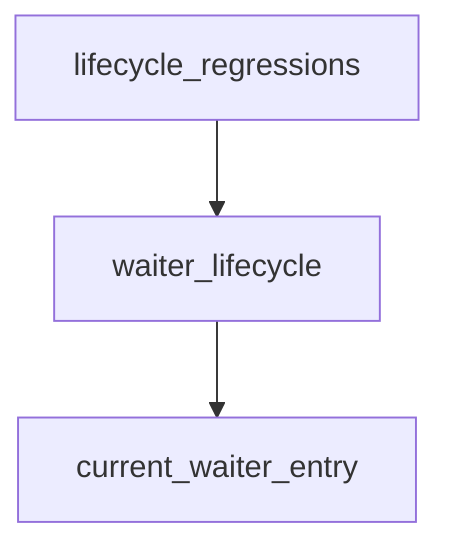

# Pipeline Plan

Workflow tier: high-risk

Risk profile: ./risk-profile.yaml

## Trigger
- Proposal: docs/versions/v0.1/modules/p2p-frame/045-rendezvous-waiter-owner-token/proposal.md
- User launch confirmed: yes
- User launch statement: `确认，自动完成`
- Launch stage: proposal
- First auto stage: design
- Design source: pipeline/plan.md
- Per-stage user confirmation: skipped by explicit user auto-pipeline authorization
- Auto-confirm completed document stages: no design/testing Markdown documents generated; automatic design uses this pipeline plan and automatic testing uses runtime state plus testplan.yaml
- Auto-pipeline document policy: stage-selective; no design/testing Markdown docs generated; automatic design uses pipeline plan; automatic testing uses runtime state; testplan.yaml required for automatic testing
- Version: v0.1
- Packet module: p2p-frame
- Task name: 045-rendezvous-waiter-owner-token
- Target module(s): p2p-frame
- change_id values: rendezvous_waiter_owner_token_lifecycle, rendezvous_waiter_collision_regression_tests

## Acceptance Baseline
- Final acceptance is judged against `proposal.md`.
- Duplicate/colliding inbound rendezvous must not overwrite or remove the current owner's waiter.
- Owner replacement, stale cancel/complete/drop, and displaced-owner abort must not remove a replacement owner's waiter.
- Incoming tunnel delivery continues to consume the current waiter by logical tuple; token ownership remains local and does not change SN wire or public APIs.
- Ordinary reverse/NAT waiter direction matching and RAII cleanup remain compatible.

## Stage Graph
| Task ID | Stage | Execution Mode | Responsibility | Scope | Parent Task | Depends On | Output | Done Condition |
|---------|-------|----------------|----------------|-------|-------------|------------|--------|----------------|
| D-1 | design | auto-pipeline | bind the tokenized waiter state model, single-lock lifecycle, compatibility, and failure transitions | task packet and current TunnelManager call chain | root | none | validated plan mappings | plan, risk-profile, and design stage-scope checks pass |
| I-1 | implementation | auto-pipeline | integrate the minimal owner/waiter lifecycle fix | TunnelManager private state and lifecycle helpers | root | D-1 | production source changes | tokenized entry and atomic lifecycle transitions are complete |
| T-1 | testing | auto-pipeline | design and run lifecycle regression coverage after implementation | p2p-frame task tests | root | I-WAITER | testplan, tests, and run evidence | task-scoped run and coverage checks pass |
| A-1 | acceptance | auto-pipeline | independently falsify proposal, design, implementation, and validation | complete task delivery | root | T-1, T-REGRESSION | acceptance report | accepted report passes with no blocking finding |

## Submodule Tasks
| Task ID | Stage | Execution Mode | Responsibility | Submodule | Parent Task | Depends On | Output | Done Condition |
|---------|-------|----------------|----------------|-----------|-------------|------------|--------|----------------|
| I-WAITER | implementation | auto-pipeline | implement tokenized waiter entries and single-lock rendezvous owner transitions | tunnel waiter lifecycle | I-1 | D-1 | p2p-frame/src/tunnel/tunnel_manager.rs | every owner-managed cleanup is token-checked and existing tuple consumption remains intact |
| T-REGRESSION | testing | auto-pipeline | add and execute deterministic duplicate and replacement-owner lifecycle regressions | NAT-aware TunnelManager tests | T-1 | I-WAITER | p2p-frame/tests/nat_type_aware/tunnel_manager_tests.rs and run artifact | red-green defects plus related lifecycle regressions pass through the unified runner |

## Merged-Task Reasons
- Production state, install, replacement, completion, cancellation, and RAII registration changes are one inseparable single-file invariant and therefore one implementation child task.
- The two requested races share the same existing NAT-aware test module and task runner, so they remain one testing child task.
- Design, implementation, testing, and acceptance remain distinct dependency-linked tasks; shared plan, risk profile, state, testplan, runner registration, and acceptance integration are parent-owned.

## Parallel Scheduling
- Strategy: dependency-ready-set
- Concurrency: use all runtime-available child-agent slots
- Shared artifact owner: parent-orchestrator
- Lock directory: `.harness/locks/`
- Dispatch rule: launch dependency-ready work with practical edit coordination and available capacity
- Serialization reasons: explicit dependency, edit coordination, or exhausted concurrency capacity; this task's single production file makes D-1, I-WAITER, T-REGRESSION, and A-1 sequential
- Evidence: record launched task ids and serialization reasons in `.harness/pipelines/v0.1/p2p-frame/045-rendezvous-waiter-owner-token/state.json` scheduler waves

## Dependency Graphs

| Level | Parent | Node | Depends On |
|-------|--------|------|------------|
| file | p2p-frame | current_waiter_entry | none |
| file | p2p-frame | waiter_lifecycle | current_waiter_entry |
| file | p2p-frame | lifecycle_regressions | waiter_lifecycle |

## Exported Interfaces
| Interface | Owner | Consumer | Compatibility | Affected Callers | Migration Path |
|-----------|-------|----------|---------------|------------------|----------------|
| tokenized `IncomingWaiterEntry` and token-aware private cleanup helpers | TunnelManager | private reverse/NAT/rendezvous registration and lifecycle paths | backward-compatible | crate-internal private callers only | update all tuple-only management cleanup sites; keep incoming tuple consumption unchanged |

## API and Build Surface Impact
- Public API impact: none
- Crate-root export change: no
- Build-surface change: no
- Documentation examples affected: no

## Consumer Migration Closure
| Old Symbol | New Path | change_id | Consumer Path | Consumer Kind | Migration Status |
|------------|----------|-----------|---------------|----------------|------------------|
| tuple-only waiter map value and cleanup | tokenized `IncomingWaiterEntry` plus compare-and-remove | rendezvous_waiter_owner_token_lifecycle | p2p-frame/src/tunnel/tunnel_manager.rs | crate-internal lifecycle consumers | planned-complete |
| not-applicable | deterministic lifecycle regression cases | rendezvous_waiter_collision_regression_tests | p2p-frame/tests/nat_type_aware/tunnel_manager_tests.rs | task test consumer | planned-complete |

## State Ownership
| State | Owner | Access Interface | Lifecycle | Failure Transitions |
|-------|-------|------------------|-----------|---------------------|
| pending incoming waiter entry | current registration token; rendezvous entries reuse current owner token | add registration, atomic rendezvous install, tuple consume, token compare-and-remove | absent -> installed with token -> consumed by matching incoming OR removed by matching owner/guard -> absent | duplicate/conflict/yield never publishes; stale token cleanup is no-op; notifier drop closes only the displaced/removed generation |
| rendezvous attempt owner | `RendezvousAttemptOwner.token` in `ManagerState.rendezvous_attempts` | atomic install, attach, complete, cancel, displacement | absent -> installed with optional same-token waiter -> task attached -> completed/cancelled/displaced -> removed | duplicate returns AlreadyExists without waiter mutation; losing collision returns/yields without waiter mutation; replacement removes old token entry and publishes new state under one lock |

## Failure Flows
| Flow | Boundary | Failure | Handling |
|------|----------|---------|----------|
| duplicate inbound notify | notify validation -> owner install | same initiator/seq/tunnel already owns slot | return AlreadyExists; contender waiter is never published and incumbent waiter remains consumable |
| collision replacement | owner ordering -> state replacement | old owner and new owner share tuple/direction | under one lock remove only old-token waiter, replace owner, publish new-token waiter; cancel/abort old task after unlock |
| stale lifecycle cleanup | registration drop/complete/cancel/abort -> waiter map | stale generation attempts tuple-only removal | compare token with current entry and no-op on mismatch |
| incoming delivery | network callback -> waiter map | current owner completion/cancel races incoming | tuple consume removes at most the current entry; subsequent token cleanup is a no-op and cannot touch a later generation |
| ordinary reverse/NAT cleanup | RAII guard -> waiter map | stale guard outlives a replacement | guard holds its registration token and removes only its own entry; public behavior and direction matching remain unchanged |

## Rejected Alternatives
| Decision Type | Selected | Rejected | Reason |
|---------------|----------|----------|--------|
| boundary | token in every waiter value; rendezvous reuses owner token | token in `IncomingWaitKey` or rendezvous-only optional metadata | incoming tunnels do not carry the local token; one generic entry also protects ordinary stale guards without changing lookup keys |
| technical | owner decision and waiter removal/publication under the same `ManagerState` lock | check owner then insert waiter after unlock, or split locks | both retain TOCTOU or lock-order races and cannot make owner/waiter publication atomic |
| technical | token compare-and-remove at every management path | remove only the duplicate error cleanup | displaced abort, RAII drop, completion, and cancellation would still be able to delete a replacement |
| technical | process-local opaque owner token generation | add seq/generation to SN wire | the defect is local ownership; wire changes add compatibility risk without solving local stale cleanup |
| collaboration | dependency-ordered stage child tasks | parallel production edits | the entire production invariant lives in one file and cannot be safely split into overlapping edits |

## Implementation Scope Bindings
| change_id | target_module | proposal_id | design_coverage | scope_paths | design_rules_applied |
|-----------|---------------|-------------|-----------------|-------------|----------------------|
| rendezvous_waiter_owner_token_lifecycle | p2p-frame | P-RWOT-1 | replace naked notifier values with tokenized entries; make ordinary guards token-aware; atomically install/replace rendezvous owner and same-token waiter; make completion/cancel/displacement cleanup token-bound while preserving tuple-based incoming consumption | `p2p-frame/src/tunnel/tunnel_manager.rs` | lifecycle ownership, concurrency linearization, cancellation, failure transitions, compatibility |
| rendezvous_waiter_collision_regression_tests | p2p-frame | P-RWOT-2 | add deterministic duplicate incumbent-survival and displaced-owner replacement-survival cases using production owner/waiter paths, then run related collision, stale, direction, and timeout coverage | `p2p-frame/tests/nat_type_aware/tunnel_manager_tests.rs` | lowest-level failure exposure, red-green evidence, lifecycle and regression boundaries |

## File-Level Implementation Sequence
| Sequence | Task ID | File-Level Module | Action | Depends On | change_id | target_module | Scope Paths | Context Sources |
|----------|---------|-------------------|--------|------------|-----------|---------------|-------------|-----------------|
| 1 | I-WAITER | `p2p-frame/src/tunnel/tunnel_manager.rs` | modify private waiter state and owner lifecycle | none | rendezvous_waiter_owner_token_lifecycle | p2p-frame | `p2p-frame/src/tunnel/tunnel_manager.rs` | approved proposal, owner/waiter call chain, existing collision and RAII tests |

## Return Rules
- If acceptance finds proposal ambiguity, stop the pipeline and ask the user to decide; do not infer a new requirement.
- If acceptance finds a state-model or linearization defect, return D-1 and then rerun implementation and testing.
- If acceptance finds implementation behavior diverging from the mapped design, return I-WAITER and regenerate test evidence.
- If validation is missing or inadequate, return T-REGRESSION.
- If the same unresolved issue remains after more than 5 unsuccessful iterations, stop and report it.

Execution status, testing evidence, return records, and final acceptance are stored in `.harness/pipelines/v0.1/p2p-frame/045-rendezvous-waiter-owner-token/state.json`.
