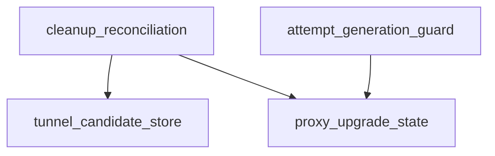

# Pipeline Plan

Workflow tier: high-risk

Risk profile: ./risk-profile.yaml

## Trigger
- Proposal: docs/versions/v0.1/modules/p2p-frame/046-clear-proxy-upgrade-after-tunnel-close/proposal.md
- User launch confirmed: yes
- User launch statement: `确认，自动完成`
- Launch stage: proposal
- First auto stage: design
- Design source: pipeline/plan.md
- Per-stage user confirmation: skipped by explicit user auto-pipeline authorization
- Auto-confirm completed document stages: no design/testing Markdown documents generated; automatic design uses this pipeline plan and automatic testing uses runtime state plus testplan.yaml
- Auto-pipeline document policy: stage-selective; no design/testing Markdown docs generated; automatic design uses pipeline plan; automatic testing uses runtime state; testplan.yaml required for automatic testing
- Version: v0.1
- Packet module: p2p-frame
- Task name: 046-clear-proxy-upgrade-after-tunnel-close
- Target module(s): p2p-frame
- change_id values: CHG-clear-proxy-upgrade-after-close

## Acceptance Baseline
- Final acceptance is judged against `proposal.md`.
- Removing the last unavailable proxy candidate removes the remote's upgrade state, regardless of whether pruning occurs in housekeeping or a read-side availability path.
- A queued or failed attempt may advance retry state only for the generation that launched it; missing or replacement generations are immutable to that failure completion.
- Successfully registering and retaining an available non-proxy candidate is an authoritative remote-topology event, not stale-attempt bookkeeping. Under the fixed `tunnels -> state` lock order it may clear the current upgrade generation and retire proxy candidates, preserving existing successful direct-upgrade behavior.
- A remaining published proxy candidate continues to own an upgrade state, while retry cadence, tunnel selection, public APIs, and SN/PN wire behavior remain unchanged.

## Stage Graph
| Task ID | Stage | Execution Mode | Responsibility | Scope | Parent Task | Depends On | Output | Done Condition |
|---------|-------|----------------|----------------|-------|-------------|------------|--------|----------------|
| D-1 | design | auto-pipeline | bind candidate/state reconciliation, generation ownership, lock ordering, compatibility, and failure transitions | task packet and current TunnelManager call chain | root | none | validated pipeline-plan mappings | plan, risk-profile, and design stage-scope checks pass |
| I-1 | implementation | auto-pipeline | integrate the minimal candidate cleanup and attempt-generation lifecycle fix | TunnelManager private state and pruning paths | root | D-1 | production source changes | implementation child and admission checks complete |
| T-1 | testing | auto-pipeline | design and run post-implementation lifecycle validation through the task runner | p2p-frame task tests | root | I-CLEANUP | testplan, test implementation, run artifact, and runtime testing evidence | task-scoped coverage and run checks pass |
| A-1 | acceptance | auto-pipeline | independently falsify requirement, design, implementation, and validation | complete task delivery | root | T-1, T-REGRESSION | acceptance report | accepted report passes with no blocking finding |

## Submodule Tasks
| Task ID | Stage | Execution Mode | Responsibility | Submodule | Parent Task | Depends On | Output | Done Condition |
|---------|-------|----------------|----------------|-----------|-------------|------------|--------|----------------|
| I-CLEANUP | implementation | auto-pipeline | implement atomic registration/prune reconciliation, generation-bound failure completion, and topology-bound success completion | tunnel cleanup and proxy-upgrade scheduler | I-1 | D-1 | p2p-frame/src/tunnel/tunnel_manager.rs | registration and pruning are atomic with state decisions; failed completions are generation-bound; successful side effects occur only from a currently live registered non-proxy topology |
| T-REGRESSION | testing | auto-pipeline | add and execute focused last-proxy cleanup lifecycle regression coverage | TunnelManager unit and DV tests | T-1 | I-CLEANUP | p2p-frame/tests/unit/tunnel/proxy_upgrade_lifecycle_tests.rs and task run artifact | cleanup removal, retained proxy, and late-failure behavior are covered through the unified runner |

## Merged-Task Reasons
- The scheduler state, candidate pruning, generation allocation, completion guard, and test-module declaration form one private single-file invariant and therefore remain one implementation child task.
- The focused unit regression and lifecycle DV filters use the same dedicated test module and task-scoped runner, so they remain one testing child task.
- Design, implementation, testing, and acceptance remain separate dependency-linked tasks; shared plan, risk profile, runtime state, testplan, and acceptance integration are parent-owned.

## Parallel Scheduling
- Strategy: dependency-ready-set
- Concurrency: use all runtime-available child-agent slots
- Shared artifact owner: parent-orchestrator
- Lock directory: `.harness/locks/`
- Dispatch rule: launch dependency-ready work with practical edit coordination and available capacity
- Serialization reasons: explicit dependency, edit coordination, or exhausted concurrency capacity; this task's single state owner makes D-1, I-CLEANUP, T-REGRESSION, and A-1 sequential
- Evidence: record launched task ids and serialization reasons in `.harness/pipelines/v0.1/p2p-frame/046-clear-proxy-upgrade-after-tunnel-close/state.json` scheduler waves

## Dependency Graphs

| Level | Parent | Node | Depends On |
|-------|--------|------|------------|
| file | p2p-frame | tunnel_candidate_store | none |
| file | p2p-frame | proxy_upgrade_state | none |
| file | p2p-frame | cleanup_reconciliation | tunnel_candidate_store, proxy_upgrade_state |
| file | p2p-frame | attempt_generation_guard | proxy_upgrade_state |

## Exported Interfaces
| Interface | Owner | Consumer | Compatibility | Affected Callers | Migration Path |
|-----------|-------|----------|---------------|------------------|----------------|
| private proxy-upgrade generation and prune-reconciliation helpers | TunnelManager | CHG-clear-proxy-upgrade-after-close and crate-internal scheduler/pruning call sites | backward-compatible | crate-internal callers in tunnel_manager.rs only | update internal collect, completion, and pruning paths; no external migration |

## API and Build Surface Impact
- Public API impact: none
- Crate-root export change: no
- Build-surface change: no
- Documentation examples affected: no

## Consumer Migration Closure
| Old Symbol | New Path | change_id | Consumer Path | Consumer Kind | Migration Status |
|------------|----------|-----------|---------------|---------------|------------------|
| remote-only attempt completion | generation-bound private completion | CHG-clear-proxy-upgrade-after-close | p2p-frame/src/tunnel/tunnel_manager.rs | crate-internal scheduler consumer | migrated |

## State Ownership
| State | Owner | Access Interface | Lifecycle | Failure Transitions |
|-------|-------|------------------|-----------|---------------------|
| live tunnel candidate bucket per remote | `TunnelManager.tunnels` write guard | registration and availability-pruning paths | absent -> candidates registered -> unavailable candidates pruned -> absent when empty | pruning derives the final bucket classification before releasing the write lock; close calls run after manager locks release |
| proxy-upgrade state generation per remote | `ManagerState.proxy_upgrade_states` under `state` mutex | registration reconciliation, due collection, generation-checked failure completion, prune reconciliation, and live-topology success finalization | absent -> tracked with unique generation -> in-progress -> retry scheduled or cleared; proxy registration reset creates a new generation | empty candidate bucket removes the state; stale failure completion is a no-op against a replacement generation; a live non-proxy topology transition may clear any current generation, while success finalization first validates that the returned non-proxy candidate remains registered and available |

## Failure Flows
| Flow | Boundary | Failure | Handling |
|------|----------|---------|----------|
| housekeeping prune | tunnel candidate registry -> upgrade state map | final proxy is unavailable while an upgrade is queued or in progress | while holding `tunnels` then `state`, remove the empty bucket and its state; notify after unlocking so queued work observes no due state |
| read-side availability prune | `get_tunnel_with_filter` or `has_available_tunnel_id` -> upgrade state map | a read removes the last unavailable candidate before housekeeping can observe it | use the same atomic prune reconciliation so removing the bucket cannot orphan upgrade state |
| concurrent proxy registration | registration -> cleanup reconciliation | a new proxy registers around final-candidate cleanup | candidate pruning/insertion and generation reset/clear occur in one fixed `tunnels -> state` critical section, so cleanup either completes first and registration creates a fresh generation, or observes the new live proxy and retains tracking |
| stale failure completion | asynchronous upgrade task -> replacement upgrade state | an old failed attempt completes after cleanup and same-remote re-registration | compare the captured generation with the current state; mismatch or missing state cannot advance retry state |
| old-generation success | asynchronous upgrade task -> current remote topology | an old attempt returns after cleanup and same-remote re-registration | finalize only if the returned non-proxy candidate remains registered and available; then atomically clear the current generation and detach proxy candidates as a topology transition, otherwise reconcile the current bucket without clearing or closing the replacement lifecycle |
| retained proxy candidate | cleanup reconciliation -> scheduler | another closed candidate is removed while a published proxy remains | preserve the current generation or create a missing generation and notify the scheduler once locks are released |

## Rejected Alternatives
| Decision Type | Selected | Rejected | Reason |
|---------------|----------|----------|--------|
| boundary | reconcile every existing pruning path that can remove the final candidate | change only periodic housekeeping | read-side pruning can delete the bucket first, leaving housekeeping unable to discover and clear the orphaned state |
| technical | fixed `tunnels -> state` lock order plus monotonic local generation matching | collect remote ids, unlock, then clear; or key completions only by remote id | post-unlock clearing can delete newly registered state, while remote-only completion can mutate a later generation |
| technical | live registered non-proxy topology validates success finalization | treat missing state (`None`) as proof that an old success is current | missing state proves neither attempt ownership nor that the returned direct candidate remains registered and available |
| technical | topology-bound successful registration/finalization | propagate an attempt generation through every open and registration call | a successful non-proxy candidate is a remote topology event; making it generation-private changes existing successful-upgrade behavior and expands the private call-chain surface unnecessarily |
| technical | registration updates candidates and state in one `tunnels -> state` critical section | track or clear upgrade state after releasing `tunnels` | cleanup can interleave in the gap and either orphan a retry state or clear state still owned by a retained proxy |
| collaboration | one dependency-ordered production child for the single private invariant | parallel edits to scheduler and cleanup regions in the same source file | both changes share state layout, lock order, and call signatures; parallel edits would increase integration and ownership risk |

## Implementation Scope Bindings
| change_id | target_module | proposal_id | design_coverage | scope_paths | design_rules_applied |
|-----------|---------------|-------------|-----------------|-------------|----------------------|
| CHG-clear-proxy-upgrade-after-close | p2p-frame | P-001 | atomically bind candidate registration and every pruning transition to proxy-upgrade state under `tunnels -> state`; generation-bind failed retry completion; topology-bind successful non-proxy clearing and proxy retirement; preserve live proxy retry and all public behavior | `p2p-frame/src/tunnel/tunnel_manager.rs`, `p2p-frame/tests/unit/tunnel/proxy_upgrade_lifecycle_tests.rs` | single state ownership, fixed lock ordering, retry termination, stale failure, live-topology success, failure transitions, backward compatibility |

## File-Level Implementation Sequence
| Sequence | Task ID | File-Level Module | Action | Depends On | change_id | target_module | Scope Paths | Context Sources |
|----------|---------|-------------------|--------|------------|-----------|---------------|-------------|-----------------|
| 1 | I-CLEANUP | `p2p-frame/src/tunnel/tunnel_manager.rs` | modify private registration/pruning atomic transitions, generation-bound failure completion, live-topology-bound success finalization, and cfg-test module declaration | none | CHG-clear-proxy-upgrade-after-close | p2p-frame | `p2p-frame/src/tunnel/tunnel_manager.rs` | approved proposal, current proxy-upgrade scheduler, every candidate retain/remove path, lock-order audit |

## Return Rules
- If acceptance finds proposal ambiguity, stop the pipeline and ask the user to decide; do not infer a new requirement.
- If acceptance finds an ownership, generation, or lock-order design defect, return D-1 before rerunning implementation and testing.
- If delivered behavior diverges from this mapping, return I-CLEANUP and regenerate test evidence.
- If lifecycle or stale-completion validation is missing or inadequate, return T-REGRESSION.
- If the same unresolved issue remains after more than 5 unsuccessful iterations, stop and report it.

Execution status, testing evidence, return records, and final acceptance are stored in `.harness/pipelines/v0.1/p2p-frame/046-clear-proxy-upgrade-after-tunnel-close/state.json`.
