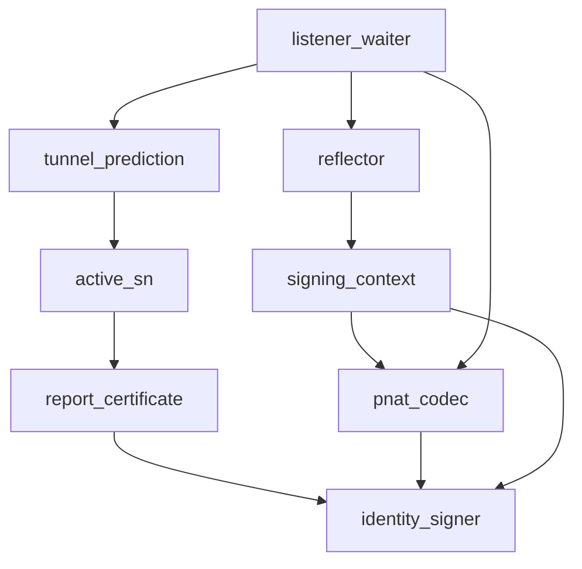

# Pipeline Plan

Workflow tier: high-risk

Risk profile: ./risk-profile.yaml

## Trigger
- Proposal: docs/versions/v0.1/modules/p2p-frame/048-signed-pnat-probe/proposal.md
- User launch confirmed: yes
- User launch statement: `确认，自动完成`
- Launch stage: proposal
- First auto stage: design
- Design source: pipeline/plan.md
- Per-stage user confirmation: skipped by explicit user auto-pipeline authorization
- Auto-confirm completed document stages: no design/testing Markdown documents generated; automatic design uses this pipeline plan and automatic testing uses runtime state plus testplan.yaml
- Auto-pipeline document policy: stage-selective; no design/testing Markdown docs generated; automatic design uses pipeline plan; automatic testing uses runtime state; testplan.yaml required for automatic testing
- Version: v0.1
- Packet module: p2p-frame
- Task name: 048-signed-pnat-probe
- Target module(s): p2p-frame
- change_id values: CHG-signed-pnat-probe

## Acceptance Baseline
- PNAT accepts only fixed-length v2 responses whose signature verifies under the certificate of the expected active SN and covers the protocol context, token, full observed IPv4 endpoint, and encoded signature length.
- The trusted verification certificate is delivered through the authenticated SN report channel and bound to the expected SN ID; UDP packets never introduce trust material.
- Invalid source, malformed packets, missing trust material, wrong signer, tampering, stale tokens, and PNAT v1 fail closed without completing or cancelling a still-valid waiter.
- Requests and responses are equally sized; all reflector sockets for one SN share a rolling 128-signatures-per-second and four-in-flight identity budget before any private-key work; per-datagram signing runs on the blocking pool. The listener performs verification outside the waiter-map lock and consumes at most four PNAT/punch datagrams per poll before yielding. Existing timeout, NAT `Unknown`, legacy tunnel, and PN fallback behavior is preserved.
- There is no PNAT v1 decoder, unsigned fallback, version negotiation, or mixed-version compatibility path.

## Stage Graph
| Task ID | Stage | Execution Mode | Responsibility | Scope | Parent Task | Depends On | Output | Done Condition |
|---------|-------|----------------|----------------|-------|-------------|------------|--------|----------------|
| D-1 | design | auto-pipeline | bind signed wire contract, trusted certificate path, waiter ownership, compatibility, and failure transitions | task packet and current PNAT/SN/QUIC call chain | root | none | validated pipeline-plan mappings | plan, risk-profile, and design completion checks pass |
| I-1 | implementation | auto-pipeline | implement the signed protocol, reflector signing, trusted certificate delivery, and verified listener dispatch | p2p-frame production source | root | D-1 | production source changes | implementation children and admission checks complete |
| T-1 | testing | auto-pipeline | design and run post-implementation protocol/security/runtime validation | task-owned p2p-frame tests outside cyfs-p2p-test | root | I-TUNNEL | testplan, test changes, run artifacts, and runtime testing evidence | task-scoped coverage and runs pass |
| A-1 | acceptance | auto-pipeline | independently falsify proposal, design, implementation, and evidence | complete task delivery | root | T-SIGNED-PNAT | acceptance report | accepted report passes with no blocking finding |

## Submodule Tasks
| Task ID | Stage | Execution Mode | Responsibility | Submodule | Parent Task | Depends On | Output | Done Condition |
|---------|-------|----------------|----------------|-----------|-------------|------------|--------|----------------|
| I-CODEC | implementation | auto-pipeline | replace PNAT v1 with fixed-size signed v2, authenticate the signature length, and provide a shared bounded signing context | PNAT codec and reflector | I-1 | D-1 | p2p-frame/src/sn/nat_probe.rs | v1 is rejected, bytes 0..32 are signed, calibrated output length is stable, and shared rate/in-flight admission precedes blocking-pool signing |
| I-SERVICE | implementation | auto-pipeline | connect the SN service identity to report trust delivery and one shared reflector signing context | SN service assembly | I-1 | I-CODEC | p2p-frame/src/sn/service/service.rs | reports publish the local certificate and every configured reflector shares the same identity budget |
| I-CLIENT | implementation | auto-pipeline | validate and retain an expected-ID-bound active-SN probe certificate | SN client trust state | I-1 | I-SERVICE | p2p-frame/src/sn/client/sn_service.rs | endpoints and usable signer material are exposed as one active-SN snapshot |
| I-NETWORK | implementation | auto-pipeline | extend the prediction trait with the expected signer certificate | network interface | I-1 | I-CLIENT | p2p-frame/src/networks/network.rs | all prediction implementations must accept explicit verification material |
| I-QUIC-NETWORK | implementation | auto-pipeline | forward expected signer material through the QUIC network implementation | QUIC network adapter | I-1 | I-NETWORK | p2p-frame/src/networks/quic/network.rs | listener prediction receives the exact active-SN certificate |
| I-LISTENER | implementation | auto-pipeline | bind each waiter to a unique owner, verify outside the map lock, recheck ownership, clean up on arbitrary drop, and bound auxiliary datagrams per poll | QUIC listener PNAT demultiplexer | I-1 | D-1 | p2p-frame/src/networks/quic/listener.rs | only the same live owner is completed, every exit drops its registration, stale cleanup is ABA-safe, and each poll yields after at most four PNAT/punch datagrams |
| I-TUNNEL | implementation | auto-pipeline | consume the active-SN endpoint-plus-certificate snapshot | tunnel prediction caller | I-1 | I-LISTENER | p2p-frame/src/tunnel/tunnel_manager.rs | rendezvous prediction supplies the expected signer and keeps existing fallback semantics |
| T-SIGNED-PNAT | testing | auto-pipeline | add codec, tamper, signer/source, stateful report-trust refresh, cancellation/ABA, capacity/fairness, replay, anti-amplification, and real-socket matrix coverage | signed PNAT validation | T-1 | I-CODEC, I-SERVICE, I-CLIENT, I-LISTENER, I-TUNNEL | scoped test files, testplan, and run evidence | positive RSA/Ed25519 and production-shaped trailing-tolerant verification plus all negative security/lifecycle cases and the feature-gated real strategy matrix pass through the approved runner without cyfs-p2p-test |

## Merged-Task Reasons
- Each production file is an independently owned implementation child ordered by the public-trait and trust-state dependencies; intermediate revisions may not compile until the full migration sequence completes.
- Protocol vectors and real-listener behavior share the same signer fixtures and public call signature, so one post-implementation testing child owns their coordinated migration.
- Design, implementation, testing, and acceptance remain separate dependency-linked tasks; the parent alone owns the shared plan, risk profile, runtime state, testplan, registrations, and acceptance integration.

## Parallel Scheduling
- Strategy: dependency-ready-set
- Concurrency: use all runtime-available child-agent slots
- Shared artifact owner: parent-orchestrator
- Lock directory: `.harness/locks/`
- Dispatch rule: launch dependency-ready work with practical edit coordination and available capacity
- Serialization reasons: explicit dependency, edit coordination, or exhausted concurrency capacity; D-1, the ordered I-CODEC through I-TUNNEL migration, T-SIGNED-PNAT, and A-1 are sequential because each consumes the prior trust-contract or public-signature output
- Evidence: scheduler waves are recorded in `.harness/pipelines/v0.1/p2p-frame/048-signed-pnat-probe/state.json`

## Dependency Graphs

| Level | Parent | Node | Depends On |
|-------|--------|------|------------|
| submodule | p2p-frame | identity_signer | none |
| submodule | p2p-frame | report_certificate | identity_signer |
| submodule | p2p-frame | pnat_codec | identity_signer |
| submodule | p2p-frame | reflector | signing_context |
| submodule | p2p-frame | signing_context | identity_signer, pnat_codec |
| submodule | p2p-frame | active_sn | report_certificate |
| submodule | p2p-frame | tunnel_prediction | active_sn |
| submodule | p2p-frame | listener_waiter | pnat_codec, reflector, tunnel_prediction |

## Exported Interfaces
| Interface | Owner | Consumer | Compatibility | Affected Callers | Migration Path |
|-----------|-------|----------|---------------|------------------|----------------|
| `NatProbeReflector::bind(bind_addr, local_identity)` and crate-private shared-context binding | `sn::nat_probe` | SN service and real-listener tests | breaking | `p2p-frame/src/sn/service/service.rs`, `p2p-frame/src/networks/quic/listener/rendezvous_prediction_tests.rs` | public single-reflector calls pass the identity; SN assembly creates one calibrated context and clones it across every configured reflector |
| `TunnelNetwork::predict_traversal_endpoints(targets, expected_signer, timeout, ttl)` | `networks::network` | QUIC network and TunnelManager prediction | breaking | `p2p-frame/src/networks/quic/network.rs`, `p2p-frame/src/tunnel/tunnel_manager.rs` | thread the active SN's verified certificate through the existing prediction call |
| `ReportSnResp.peer_info` trusted PNAT signer contract | SN protocol/service | SN client active state | migration-required | `p2p-frame/src/sn/service/service.rs`, `p2p-frame/src/sn/client/sn_service.rs` | populate the existing field with the SN certificate and reject prediction when absent or ID-mismatched |

## API and Build Surface Impact
- Public API impact: breaking
- Crate-root export change: no
- Build-surface change: no
- Documentation examples affected: no

## Consumer Migration Closure
| Old Symbol | New Path | change_id | Consumer Path | Consumer Kind | Migration Status |
|------------|----------|-----------|---------------|---------------|------------------|
| `NatProbeReflector::bind(bind_addr)` | `NatProbeReflector::bind(bind_addr, local_identity)` | CHG-signed-pnat-probe | p2p-frame/src/sn/service/service.rs | production SN service | migrated |
| `NatProbeReflector::bind(bind_addr)` | `NatProbeReflector::bind(bind_addr, local_identity)` | CHG-signed-pnat-probe | p2p-frame/src/networks/quic/listener/rendezvous_prediction_tests.rs | real-socket test | migrated |
| `NatProbeReflector::bind(bind_addr)` | compile-fail old-call fixture | CHG-signed-pnat-probe | p2p-frame/tests/signed_pnat_api_check.py | external negative fixture | allowed-negative-fixture |
| `predict_traversal_endpoints(targets, timeout, ttl)` | `predict_traversal_endpoints(targets, expected_signer, timeout, ttl)` | CHG-signed-pnat-probe | p2p-frame/src/networks/quic/network.rs | trait implementation | migrated |
| `predict_traversal_endpoints(targets, timeout, ttl)` | `predict_traversal_endpoints(targets, expected_signer, timeout, ttl)` | CHG-signed-pnat-probe | p2p-frame/src/tunnel/tunnel_manager.rs | production caller | migrated |
| `predict_traversal_endpoints(targets, timeout, ttl)` | compile-fail old-call fixture | CHG-signed-pnat-probe | p2p-frame/tests/signed_pnat_api_check.py | external negative fixture | allowed-negative-fixture |
| report response without signer publication | `ReportSnResp.peer_info = Some(local certificate)` | CHG-signed-pnat-probe | p2p-frame/src/sn/service/service.rs | protocol producer | migrated |
| active SN without trusted probe signer | active SN stores verified expected-SN certificate | CHG-signed-pnat-probe | p2p-frame/src/sn/client/sn_service.rs | protocol consumer | migrated |

## State Ownership
| State | Owner | Access Interface | Lifecycle | Failure Transitions |
|-------|-------|------------------|-----------|---------------------|
| SN probe signing context | `SnServer` reflector group through one shared signing-context reference | public single-reflector bind creates one context; SN assembly uses the crate-private shared-context bind | identity -> one blocking-pool calibration -> shared rolling budget and reflectors -> dropped after all reflector owners | calibration failure prevents reflector startup; rolling 128-per-second or four-in-flight exhaustion rejects before signing; sign failure or length drift drops the datagram |
| trusted active-SN probe certificate | `SNClientService.active_sn` | authenticated report validation and atomic endpoint-plus-certificate snapshot | absent -> verified and ID-bound -> refreshed or cleared by authenticated report -> removed on disconnect | missing, undecodable, invalid, or wrong-ID material makes probing unavailable and leaves NAT classification fail-closed |
| pending probe token | QUIC listener `NatProbeResponseWaiters` | registration owns an `Arc` identity and Drop guard; dispatch snapshots source/certificate/owner, verifies without the map lock, then rechecks pointer identity | unique owner pending -> completed once by a valid response or owner-only removal on every success/error/timeout/cancellation/drop path | malformed, wrong-source, or bad-signature packets do not remove the pending waiter; stale verification and stale guards cannot consume a replacement owner; stale/no-waiter packets are discarded before crypto |

## Failure Flows
| Flow | Boundary | Failure | Handling |
|------|----------|---------|----------|
| report trust delivery | authenticated SN command tunnel -> active SN | certificate missing, malformed, self-invalid, or ID differs from the expected SN | publish no usable probe signer and return `Unknown` from prediction while preserving control connectivity and legacy/PN fallback |
| reflector response | UDP request decoder -> shared signing context -> blocking signer | request is malformed, rolling/in-flight budget is exhausted, signing fails, output length drifts, or fixed capacity is exceeded | reject before response; budget admission precedes private-key work; never emit a partial or unsigned datagram; request and response remain exactly 1200 bytes |
| listener demultiplex | Quinn UDP receive path -> PNAT waiter | response source, structure, signature, signature length, token, or signed endpoint is forged/tampered | snapshot the live owner, verify outside the map lock, recheck the owner before completion, leave invalid waiters pending, and yield the poll after four PNAT/punch packets so QUIC work can progress |
| replay/correlation | PNAT waiter map -> completed request | token has no live waiter or a prior valid response already completed it | discard without signature verification or state update |
| waiter cancellation | prediction future -> PNAT waiter map | outer timeout, abort, send error, inner timeout, channel close, or arbitrary future drop | registration guard removes only its exact owner; a reused token with a different owner remains intact |
| clean version cutover | v1 peer -> v2 decoder | 32-byte PNAT packet or unsigned response is received | reject with no downgrade or compatibility path; existing tunnel strategy handles the resulting `Unknown` outcome |

## Rejected Alternatives
| Decision Type | Selected | Rejected | Reason |
|---------------|----------|----------|--------|
| boundary | deliver the expected SN certificate over the authenticated report tunnel | carry a certificate in the UDP response or extend `P2pSn` configuration | UDP-carried material is not a trust anchor and increases amplification; changing `P2pSn` widens public construction and configuration migration unnecessarily |
| technical | fixed 1200-byte request and response with signature length and zero padding | retain the 32-byte request with a larger signed response | equal-size datagrams preserve the existing unauthenticated reflector's no-amplification invariant while supporting current RSA and Ed25519 identities |
| technical | one startup calibration signature caches the fixed wire length, then every response signs bytes 0..32 exactly once and checks length stability | add a signature-length method to `P2pIdentity` and modify x509/CYFS implementations, or sign each response twice | calibration keeps this task inside p2p-frame, handles current fixed-width identity encodings, fails closed for variable-width custom identities, and avoids both a cross-project trait migration and doubled attack-controlled signing work |
| technical | one rolling per-identity budget shared by every configured reflector, blocking-pool private-key work, and bounded Quinn auxiliary processing | retain per-socket fixed windows or rate-limit by UDP source address | aggregate admission prevents the eight-socket multiplier, in-flight admission bounds blocking work, and source-address limits are not trusted because UDP sources can be spoofed |
| technical | verify source and signature before removing the waiter | remove the waiter immediately after structural token decoding | an attacker could cancel a legitimate probe by racing a forged response |
| collaboration | file-owned implementation children ordered by the end-to-end trust dependencies | parallel edits to codec, trait, client state, and listener waiter | these edits share public signatures and intermediate state, so dependency-free parallel changes would be uncompilable and create ambiguous ownership |

## Implementation Scope Bindings
| change_id | target_module | proposal_id | design_coverage | scope_paths | design_rules_applied |
|-----------|---------------|-------------|-----------------|-------------|----------------------|
| CHG-signed-pnat-probe | p2p-frame | P-001 | signed-only PNAT v2 codec; SN identity signing; authenticated report certificate delivery and expected-ID validation; endpoint-plus-certificate prediction; source/signature-gated waiter completion; fail-closed timeout and fallback | `p2p-frame/src/sn/nat_probe.rs`, `p2p-frame/src/sn/service/service.rs`, `p2p-frame/src/sn/client/sn_service.rs`, `p2p-frame/src/networks/network.rs`, `p2p-frame/src/networks/quic/network.rs`, `p2p-frame/src/networks/quic/listener.rs`, `p2p-frame/src/tunnel/tunnel_manager.rs`, `p2p-frame/src/networks/quic/listener/rendezvous_prediction_tests.rs`, `p2p-frame/tests/unit/sn_tests/nat_probe/tests.rs`, `p2p-frame/tests/unit/sn_tests/client/nat_probe_directive_tests.rs`, `p2p-frame/tests/nat_type_aware/sn_profile_flow_tests.rs`, `p2p-frame/tests/signed_pnat_api_check.py` | top-down trust path, acyclic dependencies, source-language interface migration, single state ownership, explicit failure transitions, coordinated breaking cutover |

## File-Level Implementation Sequence
| Sequence | Task ID | File-Level Module | Action | Depends On | change_id | target_module | Scope Paths | Context Sources |
|----------|---------|-------------------|--------|------------|-----------|---------------|-------------|-----------------|
| 1 | I-CODEC | `p2p-frame/src/sn/nat_probe.rs` | authenticate signature length, add startup calibration plus a shared rolling/in-flight signing context, and move per-request private signing to the blocking pool | none | CHG-signed-pnat-probe | p2p-frame | `p2p-frame/src/sn/nat_probe.rs` | approved proposal, identity sign/verify traits, fixed-size packet invariant, and acceptance findings F-048-A1-001/F-048-A1-003 |
| 2 | I-SERVICE | `p2p-frame/src/sn/service/service.rs` | publish the local certificate and share one calibrated signing context across every reflector | I-CODEC | CHG-signed-pnat-probe | p2p-frame | `p2p-frame/src/sn/service/service.rs` | local identity ownership, aggregate signing budget, and reflector lifecycle |
| 3 | I-CLIENT | `p2p-frame/src/sn/client/sn_service.rs` | validate expected-SN certificate and atomically expose it with probe endpoints | I-SERVICE | CHG-signed-pnat-probe | p2p-frame | `p2p-frame/src/sn/client/sn_service.rs` | authenticated report handling and ActiveSN lifecycle |
| 4 | I-NETWORK | `p2p-frame/src/networks/network.rs` | extend the prediction trait with the expected signer certificate | I-CLIENT | CHG-signed-pnat-probe | p2p-frame | `p2p-frame/src/networks/network.rs` | TunnelNetwork interface and all implementors |
| 5 | I-QUIC-NETWORK | `p2p-frame/src/networks/quic/network.rs` | forward the expected signer to the listener | I-NETWORK | CHG-signed-pnat-probe | p2p-frame | `p2p-frame/src/networks/quic/network.rs` | QUIC TunnelNetwork implementation |
| 6 | I-LISTENER | `p2p-frame/src/networks/quic/listener.rs` | add owner-bound registration guards, verify outside the map lock with owner recheck, and cap PNAT/punch consumption at four datagrams per poll | none | CHG-signed-pnat-probe | p2p-frame | `p2p-frame/src/networks/quic/listener.rs` | Quinn socket ownership, arbitrary-future cancellation, ABA-safe cleanup, and acceptance findings F-048-A1-001/F-048-A1-002 |
| 7 | I-TUNNEL | `p2p-frame/src/tunnel/tunnel_manager.rs` | consume the active SN endpoint-plus-certificate snapshot for prediction | I-LISTENER | CHG-signed-pnat-probe | p2p-frame | `p2p-frame/src/tunnel/tunnel_manager.rs` | rendezvous endpoint prediction and fallback |

## Return Rules
- Proposal ambiguity returns to proposal and requires user direction; the pipeline does not infer a new security or compatibility requirement.
- Wire contract, trust anchoring, waiter ownership, or anti-amplification defects return to D-1 before implementation and testing rerun.
- Delivered behavior or consumer migration defects return to the owning I-CODEC through I-TUNNEL task and invalidate downstream evidence.
- Missing tamper, signer, timeout, or real-socket validation returns to T-SIGNED-PNAT.
- Acceptance iteration 1 returned F-048-A1-001 and F-048-A1-003 to D-1, F-048-A1-002 to I-LISTENER, and F-048-A1-004 to T-SIGNED-PNAT. The approved proposal remains unchanged.
- Acceptance iteration 2 confirmed F-048-A1-001 through F-048-A1-003 closed, retained F-048-A1-004 for missing stateful ActiveSN refresh coverage, and returned F-048-A2-001 to T-SIGNED-PNAT for the feature-gated v1 matrix fixture and runner gap.
- More than 5 unsuccessful iterations of the same unresolved issue stops the pipeline and reports it to the user.

Execution status, testing evidence, return records, and final acceptance are stored in `.harness/pipelines/v0.1/p2p-frame/048-signed-pnat-probe/state.json`.
