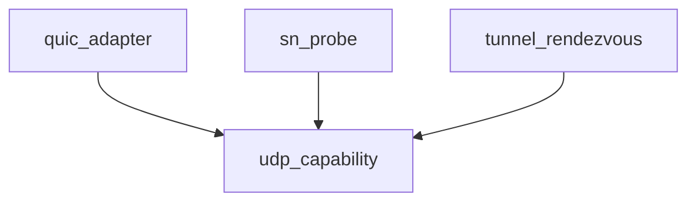

# Pipeline Plan

Workflow tier: high-risk

Risk profile: ./risk-profile.yaml

## Trigger
- Proposal: docs/versions/v0.1/modules/p2p-frame/050-isolate-udp-tunnel-traversal/proposal.md
- User launch confirmed: yes
- User launch statement: `确定，自动完成`
- Launch stage: proposal
- First auto stage: design
- Design source: pipeline/plan.md
- Per-stage user confirmation: skipped by explicit user auto-pipeline authorization
- Auto-confirm completed document stages: no design/testing Markdown documents generated; automatic design uses this pipeline plan and automatic testing uses runtime state plus testplan.yaml
- Auto-pipeline document policy: stage-selective; no design/testing Markdown docs generated; automatic design uses pipeline plan; automatic testing uses runtime state; testplan.yaml required for automatic testing
- Version: v0.1
- Packet module: p2p-frame
- Task name: 050-isolate-udp-tunnel-traversal
- Target module(s): p2p-frame
- change_id values: CHG-isolate-udp-tunnel-traversal

## Acceptance Baseline
- `TunnelNetwork` no longer owns `punch_only`, `predict_traversal_endpoints`, or `validate_traversal_prediction`.
- `UdpTunnelNetwork: TunnelNetwork` owns exactly those UDP traversal operations, so an implementation cannot provide the capability without also implementing the common tunnel-network contract.
- `TunnelNetwork::as_udp_tunnel_network()` is object-safe, defaults to `None`, and returns `Some(self)` for `QuicTunnelNetwork`.
- Existing `NetManager` registration remains unchanged; SN probing and `TunnelManager` retrieve the generic network and explicitly require its UDP capability before calling traversal operations.
- Existing QUIC punch, signed PNAT prediction, generation/TTL validation, timeout, candidate selection, wire format, trust, and fallback behavior remain unchanged.

## Stage Graph
| Task ID | Stage | Execution Mode | Responsibility | Scope | Parent Task | Depends On | Output | Done Condition |
|---------|-------|----------------|----------------|-------|-------------|------------|--------|----------------|
| D-1 | design | auto-pipeline | bind the generic and UDP trait boundary, object-safe capability discovery, caller migration, and compatibility contract | task packet and current network/SN/rendezvous call chain | root | none | validated pipeline-plan mappings | plan and risk profile pass design checks |
| I-1 | implementation | auto-pipeline | implement the trait split and migrate repository consumers without runtime behavior changes | p2p-frame production source | root | D-1 | production code | ordered implementation tasks and admission checks complete |
| T-1 | testing | auto-pipeline | design and run post-implementation API, capability, and traversal regression validation | task-owned p2p-frame tests | root | I-SN, I-TUNNEL | testplan, tests, run artifact, and runtime testing evidence | task-scoped coverage and execution pass |
| A-1 | acceptance | auto-pipeline | independently falsify the boundary, migration, behavior preservation, and evidence | complete task delivery | root | T-UNIT, T-CALLER-TEST, T-API | acceptance report | accepted report passes with no blocking finding |

## Submodule Tasks
| Task ID | Stage | Execution Mode | Responsibility | Submodule | Parent Task | Depends On | Output | Done Condition |
|---------|-------|----------------|----------------|-----------|-------------|------------|--------|----------------|
| I-UDP-MODULE | implementation | auto-pipeline | define `UdpTunnelNetwork: TunnelNetwork` and move the three operations | UDP network interface | I-1 | D-1 | `udp_network.rs` | UDP trait owns all three traversal methods |
| I-NETWORK | implementation | auto-pipeline | add object-safe discovery and remove traversal methods from the generic trait | common network interface | I-1 | I-UDP-MODULE | `network.rs` | generic trait retains only the default-None accessor |
| I-FACADE | implementation | auto-pipeline | expose the new interface using facade-only module wiring | networks facade | I-1 | I-NETWORK | `networks/mod.rs` | UDP trait is publicly reachable without facade logic |
| I-QUIC | implementation | auto-pipeline | opt the existing QUIC network into the capability using the same object instance | QUIC network adapter | I-1 | I-FACADE | QUIC trait implementations | accessor returns `Some(self)` and traversal bodies are behavior-identical |
| I-SN | implementation | auto-pipeline | migrate SN probing to explicit capability discovery | SN client consumer | I-1 | I-QUIC | migrated SN caller | prediction cannot be invoked on generic trait objects |
| I-TUNNEL | implementation | auto-pipeline | migrate rendezvous prediction, validation, and punch callers | tunnel consumer | I-1 | I-QUIC | migrated tunnel callers | all traversal operations require the UDP capability |
| T-UNIT | testing | auto-pipeline | cover default absence and explicit opt-in behavior | network capability unit tests | T-1 | I-SN, I-TUNNEL | dedicated unit tests | both accessor branches and same-instance opt-in pass |
| T-CALLER-TEST | testing | auto-pipeline | migrate traversal validation/punch doubles and exercise callers | tunnel manager integration-style tests | T-1 | I-SN, I-TUNNEL | migrated existing tests | test implementations use the UDP trait boundary |
| T-API | testing | auto-pipeline | verify public positive, negative, removed-symbol, and compile-closure contracts | external compile fixtures | T-1 | I-SN, I-TUNNEL | API test script and contract evidence | new API compiles and old generic calls fail as expected |

## Merged-Task Reasons
- `UdpTunnelNetwork`, the generic accessor, facade export, QUIC opt-in, and callers are file-owned tasks ordered as one public interface migration.
- SN prediction and `TunnelManager` traversal calls can proceed independently after the QUIC implementation, then converge before testing; the long-lived module boundary is synchronized as a D-1 design output.
- The stage responsibilities remain separate and dependency-linked; this execution environment does not provide an independently authorized child-agent dispatch, so the parent executes each recorded task sequentially and records the same stage evidence.

## Parallel Scheduling
- Strategy: dependency-ready-set
- Concurrency: use all runtime-available child-agent slots
- Shared artifact owner: parent-orchestrator
- Lock directory: `.harness/locks/`
- Dispatch rule: launch dependency-ready work with practical edit coordination and available capacity
- Serialization reasons: explicit dependency, edit coordination, or exhausted concurrency capacity
- Current serialization: the public trait split, QUIC opt-in, production caller migration, post-implementation testing, and acceptance are ordered because every task consumes the previous interface state
- Evidence: scheduler waves are recorded in `.harness/pipelines/v0.1/p2p-frame/050-isolate-udp-tunnel-traversal/state.json`

## Dependency Graphs

| Level | Parent | Node | Depends On |
|-------|--------|------|------------|
| submodule | p2p-frame | udp_capability | none |
| submodule | p2p-frame | quic_adapter | udp_capability |
| submodule | p2p-frame | sn_probe | udp_capability |
| submodule | p2p-frame | tunnel_rendezvous | udp_capability |

## Exported Interfaces
| Interface | Owner | Consumer | Compatibility | Affected Callers | Migration Path |
|-----------|-------|----------|---------------|------------------|----------------|
| `UdpTunnelNetwork: TunnelNetwork` with the three traversal methods | `networks::udp_network` | CHG-isolate-udp-tunnel-traversal and future UDP-capable networks | new | none | exported through `networks`; current QUIC implementation opts in |
| `TunnelNetwork::as_udp_tunnel_network()` returning an optional borrowed `dyn UdpTunnelNetwork` | `networks::network` | `sn::client::sn_service` and `tunnel::tunnel_manager` | backward-compatible | all existing `TunnelNetwork` implementations | default `None`; only capable implementations override |
| removal of `TunnelNetwork::{punch_only,predict_traversal_endpoints,validate_traversal_prediction}` | `networks::network` | repository and external trait callers/implementors | breaking | `p2p-frame/src/networks/quic/network.rs`, `p2p-frame/src/sn/client/sn_service.rs`, `p2p-frame/src/tunnel/tunnel_manager.rs`, `p2p-frame/tests/nat_type_aware/tunnel_manager_tests.rs`, `p2p-frame/tests/signed_pnat_api_check.py` | move implementations to `UdpTunnelNetwork`; callers require `as_udp_tunnel_network()` first |

## API and Build Surface Impact
- Public API impact: breaking
- Crate-root export change: yes
- Build-surface change: no
- Documentation examples affected: no

The crate-root-facing `p2p_frame::networks` surface adds `UdpTunnelNetwork`; no dependency, feature, target, build-script, or compiled documentation example changes.

## Consumer Migration Closure
| Old Symbol | New Path | change_id | Consumer Path | Consumer Kind | Migration Status |
|------------|----------|-----------|---------------|---------------|------------------|
| `p2p_frame::networks::TunnelNetwork::punch_only` | `p2p_frame::networks::UdpTunnelNetwork::punch_only` | CHG-isolate-udp-tunnel-traversal | `p2p-frame/src/networks/quic/network.rs` | trait implementation | migrated |
| `p2p_frame::networks::TunnelNetwork::punch_only` | `p2p_frame::networks::UdpTunnelNetwork::punch_only` | CHG-isolate-udp-tunnel-traversal | `p2p-frame/src/tunnel/tunnel_manager.rs` | production caller | migrated |
| `p2p_frame::networks::TunnelNetwork::predict_traversal_endpoints` | `p2p_frame::networks::UdpTunnelNetwork::predict_traversal_endpoints` | CHG-isolate-udp-tunnel-traversal | `p2p-frame/src/sn/client/sn_service.rs` | production caller | migrated |
| `p2p_frame::networks::TunnelNetwork::predict_traversal_endpoints` | `p2p_frame::networks::UdpTunnelNetwork::predict_traversal_endpoints` | CHG-isolate-udp-tunnel-traversal | `p2p-frame/src/tunnel/tunnel_manager.rs` | production caller | migrated |
| `p2p_frame::networks::TunnelNetwork::validate_traversal_prediction` | `p2p_frame::networks::UdpTunnelNetwork::validate_traversal_prediction` | CHG-isolate-udp-tunnel-traversal | `p2p-frame/src/networks/quic/network.rs` | trait implementation | migrated |
| `p2p_frame::networks::TunnelNetwork::validate_traversal_prediction` | `p2p_frame::networks::UdpTunnelNetwork::validate_traversal_prediction` | CHG-isolate-udp-tunnel-traversal | `p2p-frame/src/tunnel/tunnel_manager.rs` | production caller | migrated |
| `p2p_frame::networks::TunnelNetwork::validate_traversal_prediction` | `p2p_frame::networks::UdpTunnelNetwork::validate_traversal_prediction` | CHG-isolate-udp-tunnel-traversal | `p2p-frame/tests/nat_type_aware/tunnel_manager_tests.rs` | test implementation | migrated |
| `p2p_frame::networks::TunnelNetwork::predict_traversal_endpoints` | `p2p_frame::networks::UdpTunnelNetwork::predict_traversal_endpoints` | CHG-isolate-udp-tunnel-traversal | `p2p-frame/tests/signed_pnat_api_check.py` | existing external API fixture | migrated |
| `p2p_frame::networks::TunnelNetwork::{punch_only,predict_traversal_endpoints,validate_traversal_prediction}` | `p2p_frame::networks::UdpTunnelNetwork` | CHG-isolate-udp-tunnel-traversal | `p2p-frame/tests/udp_tunnel_network_api_check.py` | external negative fixture | allowed-negative-fixture |

## State Ownership
| State | Owner | Access Interface | Lifecycle | Failure Transitions |
|-------|-------|------------------|-----------|---------------------|
| UDP traversal capability identity | concrete `TunnelNetwork` implementation | `TunnelNetwork::as_udp_tunnel_network()` borrowed trait object | constructed with network -> available for the same network lifetime -> dropped with network | unsupported implementations return `None`; capable implementations return a borrow of the same object, so no secondary registration or stale state exists |

## Failure Flows
| Flow | Boundary | Failure | Handling |
|------|----------|---------|----------|
| capability discovery | generic network caller -> `as_udp_tunnel_network()` | selected network does not implement UDP traversal | return existing `NotSupport`-class failure at the caller boundary without invoking any traversal operation |
| QUIC traversal | caller -> borrowed `UdpTunnelNetwork` -> existing QUIC listener | listener missing, input unsupported, prediction expired, signature invalid, or timeout | preserve existing QUIC method errors, validation order, timeout, and fallback behavior unchanged |
| source migration | external or repository caller -> removed generic methods | caller still invokes a traversal method on `dyn TunnelNetwork` | fail at compile time and direct the caller to capability discovery plus `UdpTunnelNetwork` |

## Rejected Alternatives
| Decision Type | Selected | Rejected | Reason |
|---------------|----------|----------|--------|
| boundary | `UdpTunnelNetwork: TunnelNetwork` owns all three traversal methods | keep default `NotSupport` methods on `TunnelNetwork` | defaults preserve the incorrect universal contract and keep unrelated implementations coupled to UDP-only behavior |
| technical | object-safe borrowed capability accessor with default `None` | add a second `UdpTunnelNetworkRef` registry to `NetManager` | a second registry can drift or bind a different instance and adds unnecessary lifecycle/state ownership |
| collaboration | sequential interface-first migration | edit callers before the new trait and QUIC implementation exist | the intermediate caller state would not compile and would obscure the exact public migration boundary |

## Implementation Scope Bindings
| change_id | target_module | proposal_id | design_coverage | scope_paths | design_rules_applied |
|-----------|---------------|-------------|-----------------|-------------|----------------------|
| CHG-isolate-udp-tunnel-traversal | p2p-frame | P-001 | split the public trait boundary with an object-safe optional accessor; enforce the UDP supertrait; implement QUIC opt-in on the same instance; migrate SN and rendezvous callers; preserve runtime behavior; close positive, negative, prior-contract, and repository compile contracts | `p2p-frame/src/networks/network.rs`, `p2p-frame/src/networks/udp_network.rs`, `p2p-frame/src/networks/mod.rs`, `p2p-frame/src/networks/quic/network.rs`, `p2p-frame/src/sn/client/sn_service.rs`, `p2p-frame/src/tunnel/tunnel_manager.rs`, `p2p-frame/tests/nat_type_aware/tunnel_manager_tests.rs`, `p2p-frame/tests/unit/networks/network/udp_tunnel_network_tests.rs`, `p2p-frame/tests/udp_tunnel_network_api_check.py`, `p2p-frame/tests/signed_pnat_api_check.py`, `docs/modules/p2p-frame.md` | acyclic capability dependency, Rust trait interfaces, explicit public compatibility and consumer migration, single capability owner, preserved failure semantics, module facade-only export |

## File-Level Implementation Sequence
| Sequence | Task ID | File-Level Module | Action | Depends On | change_id | target_module | Scope Paths | Context Sources |
|----------|---------|-------------------|--------|------------|-----------|---------------|-------------|-----------------|
| 1 | I-UDP-MODULE | `p2p-frame/src/networks/udp_network.rs` | create the `UdpTunnelNetwork: TunnelNetwork` trait with the three traversal operations | none | CHG-isolate-udp-tunnel-traversal | p2p-frame | `p2p-frame/src/networks/udp_network.rs` | approved proposal, existing traversal signatures, public compatibility mapping |
| 2 | I-NETWORK | `p2p-frame/src/networks/network.rs` | remove the three methods and add default-`None` object-safe capability discovery | I-UDP-MODULE | CHG-isolate-udp-tunnel-traversal | p2p-frame | `p2p-frame/src/networks/network.rs` | UDP supertrait interface and all generic implementors |
| 3 | I-FACADE | `p2p-frame/src/networks/mod.rs` | declare and re-export the UDP trait module as facade-only wiring | I-NETWORK | CHG-isolate-udp-tunnel-traversal | p2p-frame | `p2p-frame/src/networks/mod.rs` | module-interface-export custom rule |
| 4 | I-QUIC | `p2p-frame/src/networks/quic/network.rs` | return `Some(self)` and move existing traversal method bodies into `impl UdpTunnelNetwork` | I-FACADE | CHG-isolate-udp-tunnel-traversal | p2p-frame | `p2p-frame/src/networks/quic/network.rs` | common and UDP trait interfaces plus existing QUIC listener ownership |
| 5 | I-SN | `p2p-frame/src/sn/client/sn_service.rs` | require UDP capability before endpoint prediction | I-QUIC | CHG-isolate-udp-tunnel-traversal | p2p-frame | `p2p-frame/src/sn/client/sn_service.rs` | existing Protocol::Quic lookup and signed PNAT flow |
| 6 | I-TUNNEL | `p2p-frame/src/tunnel/tunnel_manager.rs` | require UDP capability before prediction, validation, and punch-only operations | I-QUIC | CHG-isolate-udp-tunnel-traversal | p2p-frame | `p2p-frame/src/tunnel/tunnel_manager.rs` | existing rendezvous and candidate orchestration |

## Return Rules
- Proposal ambiguity stops the pipeline for user direction; no broader UDP transport requirement is inferred.
- Trait object-safety, supertrait, or capability-ownership defects return to D-1 and then I-UDP-MODULE or I-NETWORK.
- Missing QUIC opt-in or behavior changes return to I-QUIC; incomplete SN/rendezvous migration returns to I-SN or I-TUNNEL.
- Missing API, capability branch, compile closure, or existing traversal regression evidence returns to T-UNIT, T-CALLER-TEST, or T-API.
- More than 5 unsuccessful iterations of the same unresolved issue stops the pipeline and reports it to the user.

Execution status, testing evidence, return records, and final acceptance are stored in `.harness/pipelines/v0.1/p2p-frame/050-isolate-udp-tunnel-traversal/state.json`.
