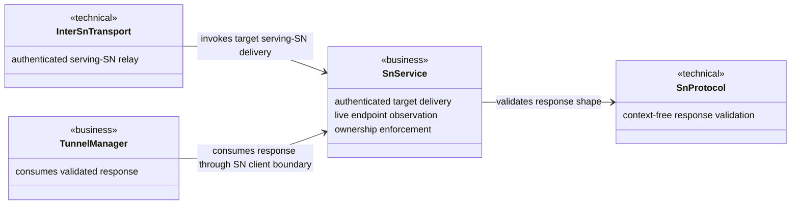

# Bind Rendezvous Response Endpoints to the Target Owner Design

Risk profile: ./risk-profile.yaml

## Design Scope

### Goals

- Enforce predicted-endpoint IP ownership at the target serving SN before a local or inter-SN rendezvous response is returned.
- Derive trusted ownership only from current authenticated command-tunnel remote addresses observed by that SN.
- Preserve the existing response wire format, endpoint structural validation, NAT prediction algorithm, and caller tunnel behavior.

### Non-goals

- No per-port ownership proof or new signed prediction attestation.
- No changes to endpoint encoding, public APIs, tunnel strategy, fallback, prediction TTL, or socket-binding generation.
- No trust in target-reported endpoints, certificate endpoint declarations, or target-submitted NAT profiles.

## Useful Context

- `SnTunnelRendezvousResp::validate` is deliberately context-free and cannot determine which peer owns an endpoint.
- `SnService::deliver_rendezvous_to_local_peer` knows the authenticated target identity, sends the notify over a live command tunnel, and executes on the target serving SN in both same-SN and cross-SN flows.
- `SnService::get_peer_observed_ep` reads the network-observed remote endpoints of currently registered authenticated command tunnels; its output is stronger ownership evidence than `CachedPeerInfo.local_eps` or identity-certificate endpoint declarations.
- Prediction output is QUIC/IPv4/`ServerReflexive`; only its IP is expected to match an observation because the port is intentionally predicted.

## Overall Approach

Add a private `SnService` validator that takes the authenticated target ID and a decoded response. It first relies on the existing structural response validation, then, only for a successful prediction response, collects current non-LAN IPv4 IPs from the target's live command tunnels and requires every returned endpoint IP to be in that set. `deliver_rendezvous_to_local_peer` calls this contextual validator before returning. Since the same method executes on the target serving SN for direct delivery and `relay_rendezvous_from_sn`, the cross-SN path inherits the check without trusting the initiator SN's potentially absent or stale target cache.

## Layered Design Document Index

| level | parent_document | unit | design_document | responsibility |
|-------|-----------------|------|-----------------|----------------|
| root | `design.md` | p2p-frame rendezvous trust boundary | `design.md` | overall service/protocol/inter-SN relationship and task mapping |
| submodule | `design.md` | SN service | `design/sn-service.md` | contextual target ownership validation and enforcement point |

## Module Relationship UML



## File-Level Interfaces

```rust
impl SnService {
    async fn validate_rendezvous_response_owner(
        &self,
        target_peer_id: &P2pId,
        response: &SnTunnelRendezvousResp,
    ) -> P2pResult<()>;

    async fn deliver_rendezvous_to_local_peer(
        &self,
        target_peer_id: &P2pId,
        notify: &SnTunnelRendezvousNotify,
    ) -> P2pResult<SnTunnelRendezvousResp>;
}
```

- Consumer: `SnService::deliver_rendezvous_to_local_peer` / `CHG-bind-rendezvous-response-owner`.
- Compatibility: backward-compatible
- The new helper is private; no public API or wire representation changes.

## API and Build Surface Impact

- Public API impact: none
- Crate-root export change: no
- Build-surface change: no
- Documentation examples affected: no

## Consumer Migration Closure

Not applicable: no public API, crate-root export, build-surface, or wire-format migration is introduced.

## Key Flows

```mermaid
sequenceDiagram
  participant A as Initiator A
  participant ASN as A serving SN
  participant BSN as B serving SN
  participant B as Target B

  A->>ASN: rendezvous request(target B)
  ASN->>BSN: relay notify when B is remote
  BSN->>B: notify over authenticated target tunnel
  B-->>BSN: response with predicted endpoints
  BSN->>BSN: structural validation
  BSN->>BSN: collect current authenticated B remote IPs
  alt every predicted IP is observed for B
    BSN-->>ASN: validated response
    ASN-->>A: validated response
  else missing observation or unowned IP
    BSN-->>ASN: typed failure
    ASN-->>A: failed rendezvous; existing fallback remains eligible
  end
```

## State and Ownership

- Owner: the command server owns the current authenticated tunnel set and their network-observed remote endpoints; the new validator only takes an async snapshot and adds no cache or persistent state.
- Access path for other modules: only `SnService` reads the observation through `get_peer_observed_ep`; protocol and tunnel modules do not gain access to serving-SN connection state.
- Invariants to preserve: an empty prediction list is legal only when prediction was not requested; prediction responses remain bounded and structurally valid; ports may differ from observed ports; no response with an unobserved IP crosses the target serving-SN boundary.

## Directly Mapped Change Items

| change_id | target_module | proposal_id | Design Coverage | Scope Paths | Interface / Boundary Impact | Notes |
|-----------|---------------|-------------|-----------------|-------------|-----------------------------|-------|
| CHG-bind-rendezvous-response-owner | p2p-frame | P-001 | Overall approach, module UML, file interface, key flow, ownership invariants, and `design/sn-service.md` | `p2p-frame/src/sn/service/service.rs`, `p2p-frame/tests/tunnel_rendezvous/**` | backward-compatible runtime validation at the target serving-SN boundary | Existing response encoding and caller behavior remain unchanged |

## Implementation Order

| Phase | Goal | Depends On | Output |
|-------|------|------------|--------|
| 1 | Add target-context ownership validation to the serving-SN response path | existing structural response validation and live tunnel observation | fail-closed production enforcement |

## File-Level Implementation Sequence

| sequence | file_level_module | action | depends_on | change_id | scope_path | implementation_task |
|----------|-------------------|--------|------------|-----------|------------|---------------------|
| 1 | `p2p-frame/src/sn/service/service.rs` | modify | none | CHG-bind-rendezvous-response-owner | `p2p-frame/src/sn/service/service.rs` | I-001 |

## Design Notes

- Keeping ownership out of `SnTunnelRendezvousResp::validate` is intentional: a wire value cannot establish target ownership without authenticated serving-SN context.
- Reusing `rendezvous_endpoints_owned_by` was rejected because it accepts target-controlled `local_eps` and certificate endpoints.
- Validating only at A's serving SN was rejected because the cross-SN origin may not hold B's live authenticated tunnel observation.
- An SN-signed, attempt-bound prediction proof is a stronger future design for shared-IP/per-port abuse, but would change the protocol and exceeds the approved repair.
- Test-stage case design and commands are intentionally deferred to Testing.

## Risks and Rollback

- Legitimate multi-egress B nodes can be rejected if prediction exits through an IP absent from their current authenticated command-tunnel observations. This is a safe false negative and preserves existing fallback.
- A stale cached ownership set would weaken the boundary, so the implementation must read current command tunnels for each response rather than persist a new cache.
- Rollback is the isolated contextual validation call and helper; there is no wire or data migration.

## Approval Record

- approver: user
- approval_date: 2026-09-04
- user_statement: "确认，自动完成"
