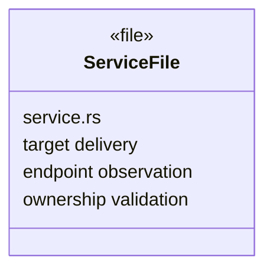

# SN Service Ownership Enforcement Design

Parent design: `../design.md`

## Responsibility

The SN service is the only affected submodule. It combines the authenticated target identity used by the command server with live network-observed remote endpoints and rejects a target-supplied prediction response before it can cross the target serving-SN boundary.

## Same-Level File Relationship UML



The change remains in the existing responsibility-specific `service.rs`; no new production module or dependency edge is needed.

## File-Level Boundary

```rust
impl SnService {
    async fn validate_rendezvous_response_owner(
        &self,
        target_peer_id: &P2pId,
        response: &SnTunnelRendezvousResp,
    ) -> P2pResult<()>;
}
```

- Consumer: `SnService::deliver_rendezvous_to_local_peer` / `CHG-bind-rendezvous-response-owner`.
- Compatibility: backward-compatible
- Failure contract: missing current public observation or any predicted IP outside the observed set returns a permission/invalid-data error and prevents response forwarding.

## Ownership Invariants

- Observation authority remains the live authenticated command-tunnel registry.
- Target reports and certificate endpoint declarations never enter the trusted-IP set.
- Only the IP is ownership-bound; predicted ports remain unconstrained beyond existing nonzero/count/shape limits.
- The helper creates no persistent state, tasks, timers, locks, or cleanup responsibility.
