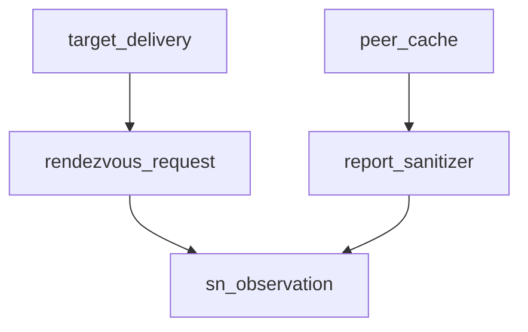

# Pipeline Plan

Workflow tier: high-risk

Risk profile: ./risk-profile.yaml

## Trigger
- Proposal: docs/versions/v0.1/modules/p2p-frame/053-sanitize-sn-reported-endpoints/proposal.md
- User launch confirmed: yes
- User launch statement: `确认，自动完成`
- Launch stage: proposal
- First auto stage: design
- Design source: pipeline/plan.md
- Per-stage user confirmation: skipped by explicit user auto-pipeline authorization
- Auto-confirm completed document stages: no design/testing Markdown documents generated; automatic design uses this pipeline plan and automatic testing uses runtime state plus testplan.yaml
- Auto-pipeline document policy: stage-selective; no design/testing Markdown docs generated; automatic design uses pipeline plan; automatic testing uses runtime state; testplan.yaml required for automatic testing
- Version: v0.1
- Packet module: p2p-frame
- Task name: 053-sanitize-sn-reported-endpoints
- Target module(s): p2p-frame
- change_id values: CHG-sanitize-sn-reported-endpoints

## Acceptance Baseline
- `ReportSn.local_eps` retains only server-classified LAN addresses and public IPv4 addresses whose IP matches the reporting command tunnel's SN-observed source IP.
- Client-supplied endpoint area labels, identity-certificate endpoint declarations, and client-submitted NAT profiles never authorize an unrelated public IP.
- Every non-empty rendezvous request is checked against the exact current authenticated request tunnel observation before local delivery or inter-SN relay; empty `WaitIncoming` remains valid.
- Existing operation, transport, area, port, count, deduplication, routing, and fallback behavior remains unchanged.

## Stage Graph
| Task ID | Stage | Execution Mode | Responsibility | Scope | Parent Task | Depends On | Output | Done Condition |
|---------|-------|----------------|----------------|-------|-------------|------------|--------|----------------|
| D-1 | design | auto-pipeline | bind report sanitization and request-time ownership to current authenticated SN observations | task packet and current SN report/rendezvous flow | root | none | validated pipeline-plan mappings | plan and risk profile pass design checks |
| I-1 | implementation | auto-pipeline | deliver the minimal production trust-boundary fix | p2p-frame SN service production code | root | D-1 | production code | service implementation and admission checks complete |
| T-1 | testing | auto-pipeline | design and run post-implementation unit, authenticated-socket, lifecycle, and relay regression coverage | task-owned p2p-frame tests | root | I-SERVICE | testplan, tests, run artifact, and runtime testing evidence | task-scoped coverage and execution pass |
| A-1 | acceptance | auto-pipeline | independently falsify report retention, request authorization, compatibility, and evidence | complete task delivery | root | T-SOCKET | acceptance report | accepted report passes with no blocking finding |

## Submodule Tasks
| Task ID | Stage | Execution Mode | Responsibility | Submodule | Parent Task | Depends On | Output | Done Condition |
|---------|-------|----------------|----------------|-----------|-------------|------------|--------|----------------|
| I-SERVICE | implementation | auto-pipeline | sanitize ReportSn cache input and bind rendezvous request IPs to the current request tunnel observation | SN service | I-1 | D-1 | `p2p-frame/src/sn/service/service.rs` | no unrelated public report or certificate address authorizes target action |
| T-SOCKET | testing | auto-pipeline | exercise malicious reports and rendezvous admission through authenticated clients and real control sockets | SN rendezvous tests | T-1 | I-SERVICE | dedicated same-SN and source-SN relay regressions, testplan, and run evidence | negative, positive, lifecycle, and routing cases are runnable through the task entrypoint |

## Merged-Task Reasons
- Report sanitization and request-time ownership validation both belong to `SnService` and modify the same file, so splitting them would create overlapping write ownership without an independent interface boundary.
- Existing authenticated command-client access is sufficient to construct task-specific `ReportSn` messages, so no client-side production or test seam is planned unless post-implementation test design proves it necessary.
- Design, implementation, testing, and acceptance remain separate dependency-linked tasks; only the parent orchestrator writes the shared plan, runtime state, task manifest, testplan, and acceptance integration artifacts.

## Parallel Scheduling
- Strategy: dependency-ready-set
- Concurrency: use all runtime-available child-agent slots
- Shared artifact owner: parent-orchestrator
- Lock directory: `.harness/locks/`
- Dispatch rule: launch dependency-ready work with practical edit coordination and available capacity
- Serialization reasons: explicit dependency, edit coordination, or exhausted concurrency capacity
- Current serialization: one production service file owns both security checks; testing depends on that behavior; acceptance depends on fresh testing evidence
- Evidence: scheduler waves are recorded in `.harness/pipelines/v0.1/p2p-frame/053-sanitize-sn-reported-endpoints/state.json`

## Dependency Graphs

| Level | Parent | Node | Depends On |
|-------|--------|------|------------|
| submodule | p2p-frame | sn_observation | none |
| submodule | p2p-frame | report_sanitizer | sn_observation |
| submodule | p2p-frame | peer_cache | report_sanitizer |
| submodule | p2p-frame | rendezvous_request | sn_observation |
| submodule | p2p-frame | target_delivery | rendezvous_request |

## Exported Interfaces
| Interface | Owner | Consumer | Compatibility | Affected Callers | Migration Path |
|-----------|-------|----------|---------------|------------------|----------------|
| private `SnService::sanitize_reported_endpoints` | `sn::service` | CHG-sanitize-sn-reported-endpoints report handler | backward-compatible | `SnService::handle_report_sn` | atomically reject an over-budget report, then sanitize before candidate classification and peer-cache update |
| private async `SnService::rendezvous_endpoints_owned_by` using `PeerId` plus `CmdTunnelId` | `sn::service` | CHG-sanitize-sn-reported-endpoints rendezvous handler | backward-compatible | `SnService::handle_rendezvous` | replace cached/self-asserted ownership with exact request-tunnel observation |

## API and Build Surface Impact
- Public API impact: none
- Crate-root export change: no
- Build-surface change: no
- Documentation examples affected: no

## Consumer Migration Closure
| Old Symbol | New Path | change_id | Consumer Path | Consumer Kind | Migration Status |
|------------|----------|-----------|---------------|---------------|------------------|
| not-applicable | private service helpers only | CHG-sanitize-sn-reported-endpoints | `p2p-frame/src/sn/service/service.rs` | internal caller | verified-none |

## State Ownership
| State | Owner | Access Interface | Lifecycle | Failure Transitions |
|-------|-------|------------------|-----------|---------------------|
| network-observed command-tunnel remote endpoint | command server | `SnService::get_peer_tunnel_remote(peer_id, tunnel_id)` | live authenticated tunnel -> current observation -> removed with tunnel | missing exact tunnel observation causes report public endpoints to be dropped and non-empty rendezvous to fail closed |
| sanitized reported endpoint cache | `PeerManager` | `add_or_update_peer` receives only sanitized `local_eps` | authenticated ReportSn within the private endpoint-count limit replaces the prior sanitized snapshot -> peer removal | over-budget input rejects the whole report before cache mutation; invalid, unrelated public, duplicate, or zero-port endpoints are omitted; identity certificate remains intact but is neither candidate-classification nor authority evidence |

## Failure Flows
| Flow | Boundary | Failure | Handling |
|------|----------|---------|----------|
| authenticated ReportSn -> peer cache | untrusted report data -> SN-owned cache | `local_eps` exceeds the private count limit | reject the whole report before candidate classification or peer-cache mutation |
| authenticated ReportSn -> peer cache | untrusted report data -> SN-owned cache | endpoint has an unsupported transport, zero port, loopback/unspecified/multicast/broadcast address, or public IP other than the exact reporting tunnel source | omit the endpoint; retain only IPv4 private/link-local and IPv6 unique-local/unicast-link-local as server-normalized `Lan`, plus exact-observed non-LAN IPv4 as server-normalized public area; deduplicate normalized protocol/socket tuples |
| rendezvous request -> target delivery | authenticated initiator -> SN service | exact request tunnel is absent or any non-empty request endpoint IP differs from its observed source IP | return generic rendezvous failure before state begin, local target callback, or inter-SN relay |
| valid current request | SN service -> same-SN/inter-SN delivery | endpoint IP matches the exact request tunnel source and structural validation already passed | preserve existing request state, delivery, response, and fallback behavior |

## Rejected Alternatives
| Decision Type | Selected | Rejected | Reason |
|---------------|----------|----------|--------|
| boundary | current exact authenticated request/report tunnel observation | cached `local_eps`, identity-certificate endpoints, client NAT profile, or a union of historical observations | all rejected sources are self-asserted or can become stale and preserve the reported bypass; certificate endpoints remain identity metadata only and are not report-classification candidates |
| technical | retain only IP-classified LAN hints plus observed-IP public candidates, with server-normalized area | trust caller-provided `EndpointArea` or delete all LAN discovery data | area is attacker-controlled, while deleting all LAN hints would unnecessarily change local discovery behavior |
| collaboration | sequential service implementation then post-implementation socket testing | mix production and test edits in one stage task | stage ownership requires test design and test-only seams after production implementation completes |

## Implementation Scope Bindings
| change_id | target_module | proposal_id | design_coverage | scope_paths | design_rules_applied |
|-----------|---------------|-------------|-----------------|-------------|----------------------|
| CHG-sanitize-sn-reported-endpoints | p2p-frame | P-001 | atomically reject over-budget ReportSn input before mutation; sanitize supported nonzero endpoints before cache replacement; derive LAN/public classification from address and the exact live report tunnel observation; exclude certificate endpoints from candidate classification; replace rendezvous cache/certificate ownership with exact request-tunnel matching before local delivery or relay; preserve protocol/routing/fallback; add authenticated same-SN and source-SN relay regression coverage | `p2p-frame/src/sn/service/service.rs`, `p2p-frame/tests/tunnel_rendezvous/sn_same_sn_tests.rs`, `p2p-frame/tests/real_p2p_tunnel_flow/collision_cross_sn.rs`, `p2p-frame/tests/unit/sn_tests/service/distributed_nat_profile_tests.rs` | acyclic service ownership, private Rust interfaces, exact state owner, atomic capacity failure, fail-closed transitions, backward-compatible public surface, explicit trust-source rejection |

## File-Level Implementation Sequence
| Sequence | Task ID | File-Level Module | Action | Depends On | change_id | target_module | Scope Paths | Context Sources |
|----------|---------|-------------------|--------|------------|-----------|---------------|-------------|-----------------|
| 1 | I-SERVICE | `p2p-frame/src/sn/service/service.rs` | sanitize ReportSn cache input and bind request ownership to exact live tunnel observation | none | CHG-sanitize-sn-reported-endpoints | p2p-frame | `p2p-frame/src/sn/service/service.rs` | approved proposal, current report/cache/rendezvous flow, task-052 response boundary |

## Return Rules
- Proposal ambiguity stops the pipeline for user direction; no port-capability or legacy-protocol redesign is inferred.
- Incorrect LAN/public classification, stale observation use, or request authorization defects return to D-1 and then I-SERVICE.
- Missing authenticated socket, positive, lifecycle, same-SN, or inter-SN evidence returns to T-SOCKET.
- More than 5 unsuccessful iterations of the same unresolved issue stops the pipeline and reports it to the user.

Execution status, testing evidence, return records, and final acceptance are stored in `.harness/pipelines/v0.1/p2p-frame/053-sanitize-sn-reported-endpoints/state.json`.
