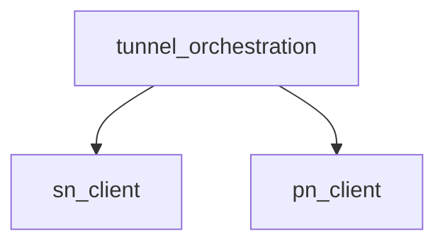

# Pipeline Plan

Workflow tier: high-risk

Risk profile: ./risk-profile.yaml

## Trigger
- Proposal: docs/versions/v0.1/modules/p2p-frame/054-fallback-rendezvous-to-legacy/proposal.md
- User launch confirmed: yes
- User launch statement: `确认，自动完成`
- Launch stage: proposal
- First auto stage: design
- Design source: pipeline/plan.md
- Per-stage user confirmation: skipped by explicit user auto-pipeline authorization
- Auto-confirm completed document stages: no design/testing Markdown documents generated; automatic design uses this pipeline plan and automatic testing uses runtime state plus testplan.yaml
- Auto-pipeline document policy: stage-selective; no design/testing Markdown docs generated; automatic design uses pipeline plan; automatic testing uses runtime state; testplan.yaml required for automatic testing
- Version: v0.1
- Packet module: p2p-frame
- Task name: 054-fallback-rendezvous-to-legacy
- Target module(s): p2p-frame
- change_id values: CHG-fallback-rendezvous-to-legacy

## Acceptance Baseline
- A final rendezvous request or caller-action failure enters the real legacy `SnCall` flow rather than calling PN directly.
- The legacy flow reuses the current lookup-derived endpoints, serving SN id, NAT context, and caller action without another `query_with_context` call.
- PN remains owned by the existing legacy caller-action failure branch and is reached only after that action fails.
- Rendezvous, legacy, and PN work remain under the existing absolute `sn_call_timeout + 2 * conn_timeout` budget.
- The current task intentionally supersedes task 042's rendezvous-error-to-proxy behavior while retaining task 042's single peer-query and bounded-deadline guarantees.

## Stage Graph
| Task ID | Stage | Execution Mode | Responsibility | Scope | Parent Task | Depends On | Output | Done Condition |
|---------|-------|----------------|----------------|-------|-------------|------------|--------|----------------|
| D-1 | design | auto-pipeline | bind the restored rendezvous-to-legacy ordering to current ownership, deadline, and compatibility boundaries | task packet and current tunnel orchestration | root | none | validated pipeline-plan mappings | design, risk, dependency, failure, and scope mappings pass |
| I-1 | implementation | auto-pipeline | deliver the minimal production fallback sequencing change | tunnel manager production orchestration | root | D-1 | production code | admitted implementation follows the file-level sequence and preserves the outer deadline |
| T-1 | testing | auto-pipeline | derive post-implementation regression coverage and run it through the unified task entrypoint | task-owned tunnel-manager tests and testplan | root | I-1 | test implementation, testplan, and machine run evidence | task change and risk checks are covered by passing evidence |
| A-1 | acceptance | auto-pipeline | independently falsify ordering, reuse, deadlines, compatibility, and validation adequacy | complete task delivery | root | T-1 | acceptance report | accepted report has no blocking finding and passes its checker |

## Submodule Tasks
| Task ID | Stage | Execution Mode | Responsibility | Submodule | Parent Task | Depends On | Output | Done Condition |
|---------|-------|----------------|----------------|-----------|-------------|------------|--------|----------------|

## Merged-Task Reasons
- The production change is one private orchestration branch in `tunnel_manager.rs`; splitting it into submodule implementation children would create overlapping ownership without an independent interface boundary.
- The testing change is confined to the existing dedicated NAT-aware tunnel-manager test file; testplan integration is a parent-owned shared artifact.
- Design, implementation, testing, and acceptance remain separate dependency-linked child tasks even though each stage has one merged file-level responsibility.

## Parallel Scheduling
- Strategy: dependency-ready-set
- Concurrency: use all runtime-available child-agent slots
- Shared artifact owner: parent-orchestrator
- Lock directory: `.harness/locks/`
- Dispatch rule: launch dependency-ready work with practical edit coordination and available capacity
- Serialization reasons: explicit dependency, edit coordination, or exhausted concurrency capacity
- Current serialization: the one implementation branch depends on design; post-implementation testing depends on the delivered branch; acceptance depends on fresh test evidence
- Evidence: scheduler waves are recorded in `.harness/pipelines/v0.1/p2p-frame/054-fallback-rendezvous-to-legacy/state.json`

## Dependency Graphs

| Level | Parent | Node | Depends On |
|-------|--------|------|------------|
| submodule | p2p-frame | sn_client | none |
| submodule | p2p-frame | pn_client | none |
| submodule | p2p-frame | tunnel_orchestration | sn_client, pn_client |

## Exported Interfaces
| Interface | Owner | Consumer | Compatibility | Affected Callers | Migration Path |
|-----------|-------|----------|---------------|------------------|----------------|
| private `TunnelManager::open_nat_aware_tunnel` failure sequencing | `tunnel::tunnel_manager` | private `TunnelManager::open_tunnel_from_lookup` | backward-compatible | `open_tunnel_from_lookup` NAT-aware branch | behavior-only restoration; no signature or caller migration |
| private `TunnelManager::open_nat_aware_tunnel_legacy` | `tunnel::tunnel_manager` | `CHG-fallback-rendezvous-to-legacy` | backward-compatible | `open_nat_aware_tunnel` final rendezvous-error branch | unchanged signature gains one restored internal call site |
| private `SNClientService::call_via_sn` | `sn::client` | existing legacy orchestration | backward-compatible | `open_nat_aware_tunnel_legacy` | unchanged behavior and signature; this is an SN command, not another peer query |

## API and Build Surface Impact
- Public API impact: none
- Crate-root export change: no
- Build-surface change: no
- Documentation examples affected: no

## Consumer Migration Closure
| Old Symbol | New Path | change_id | Consumer Path | Consumer Kind | Migration Status |
|------------|----------|-----------|---------------|---------------|------------------|
| not-applicable | private behavior-only change | CHG-fallback-rendezvous-to-legacy | verified-none | internal behavior | verified-none |

## State Ownership
| State | Owner | Access Interface | Lifecycle | Failure Transitions |
|-------|-------|------------------|-----------|---------------------|
| one NAT-aware open attempt's lookup inputs and absolute deadline | `TunnelManager::open_nat_aware_tunnel` stack frame | owned endpoints/name/context plus borrowed remote and serving-SN ids passed to private branch methods | create from one lookup -> rendezvous attempt -> on final error legacy attempt -> on legacy caller-action error PN -> return or outer timeout cancellation | rendezvous error retains the original input bundle for legacy; legacy action failure alone enters PN; outer timeout cancels whichever branch is active without renewing the budget |
| rendezvous owner and incoming waiter | `TunnelManager::ManagerState` through `RendezvousOwnerRegistration` | token-guarded install, complete, cancel, and Drop helpers | installed for rendezvous -> completed or owner-only cleanup before `open_rendezvous_tunnel` returns | final error releases the named tunnel lock and removes only the matching waiter before legacy creates independent state; stale cleanup cannot affect the legacy attempt |
| legacy tunnel id and optional incoming waiter | `open_nat_aware_tunnel_legacy` stack frame and `IncomingPlanWaitRegistration` | existing `drive_nat_rendezvous_and_action` coordination | allocate a new legacy tunnel id -> run `SnCall` and caller action concurrently -> dismiss waiter on success or owner-only removal on Drop | caller-action error enters PN with the same legacy tunnel id; `SnCall` error alone does not force PN when the caller action succeeds |

## Failure Flows
| Flow | Boundary | Failure | Handling |
|------|----------|---------|----------|
| rendezvous to legacy | `open_rendezvous_tunnel` -> `open_nat_aware_tunnel` | rendezvous request, response validation, prediction, collision, or caller action returns a final error | log `path=legacy_sn_call` and invoke `open_nat_aware_tunnel_legacy` with the original lookup-derived inputs and caller action |
| rendezvous cleanup to legacy registration | rendezvous RAII/locker -> legacy RAII/locker | rendezvous ownership, waiter, or named lock survives the returned error | forbidden; enter legacy only after the awaited rendezvous function returns and its registration/lock locals have dropped |
| legacy coordination | `open_nat_aware_tunnel_legacy` -> `SNClientService::call_via_sn` plus `execute_nat_action` | legacy SN command fails while the local action can still establish a tunnel | preserve existing concurrent driver semantics and return the successful local tunnel |
| legacy to PN | `execute_nat_action` -> `open_nat_aware_tunnel_legacy` | legacy caller action fails | preserve the existing branch that invokes `open_proxy_path` with the legacy tunnel id |
| total deadline | outer `runtime::timeout` -> rendezvous/legacy/PN chain | accumulated work exhausts `sn_call_timeout + 2 * conn_timeout` | cancel the active future and return the existing total-deadline timeout error; do not allocate a renewed per-chain budget |

## Rejected Alternatives
| Decision Type | Selected | Rejected | Reason |
|---------------|----------|----------|--------|
| boundary | restore the real legacy `SnCall` flow after every final rendezvous error | retain task 042's direct rendezvous-to-PN branch | the current user and task 034 require legacy coordination to remain usable when rendezvous fails, including when PN is absent |
| technical | retain original branch inputs and call legacy inside the existing outer timeout | re-query peer state, start a new total timeout, or call PN from the rendezvous error branch | re-querying violates lookup reuse, renewing the budget amplifies latency, and direct PN skips the required legacy path |
| collaboration | sequential design, one-file implementation, post-implementation testing, and independent acceptance tasks | edit production and tests together in one stage task | the pipeline requires stage separation and the implementation/test files have a strict behavior dependency |

## Implementation Scope Bindings
| change_id | target_module | proposal_id | design_coverage | scope_paths | design_rules_applied |
|-----------|---------------|-------------|-----------------|-------------|----------------------|
| CHG-fallback-rendezvous-to-legacy | p2p-frame | P-001 | retain the original endpoint/name/context bundle across the rendezvous call; route every final rendezvous error to the existing real legacy `SnCall` orchestration; leave PN exclusively under legacy caller-action failure; preserve one `query_with_context`, existing rendezvous error classification, and the shared absolute timeout | `p2p-frame/src/tunnel/tunnel_manager.rs`, `p2p-frame/tests/nat_type_aware/tunnel_manager_tests.rs` | acyclic private orchestration, single attempt-state owner, explicit failure transitions, compatibility decision against task 042, backward-compatible public surface, ordered stage ownership |

## File-Level Implementation Sequence
| Sequence | Task ID | File-Level Module | Action | Depends On | change_id | target_module | Scope Paths | Context Sources |
|----------|---------|-------------------|--------|------------|-----------|---------------|-------------|-----------------|
| 1 | I-1 | `p2p-frame/src/tunnel/tunnel_manager.rs` | retain rendezvous inputs and replace direct proxy fallback with the existing legacy orchestration inside the outer deadline | none | CHG-fallback-rendezvous-to-legacy | p2p-frame | `p2p-frame/src/tunnel/tunnel_manager.rs` | approved proposal, current open call chain, task 034 fallback contract, task 042 compatibility tradeoff |

## Return Rules
- Proposal ambiguity stops the pipeline for user direction; no wire or plan-selection change is inferred.
- Incorrect fallback ordering, lookup reuse, deadline ownership, or compatibility modeling returns to D-1 and then I-1.
- Missing or inadequate failure-order evidence returns to T-1.
- An implementation defect returns to I-1, followed by a fresh T-1 run and acceptance review.
- More than 5 unsuccessful iterations of the same unresolved issue stops the pipeline and reports it to the user.

Execution status, testing evidence, return records, and final acceptance are stored in `.harness/pipelines/v0.1/p2p-frame/054-fallback-rendezvous-to-legacy/state.json`.
