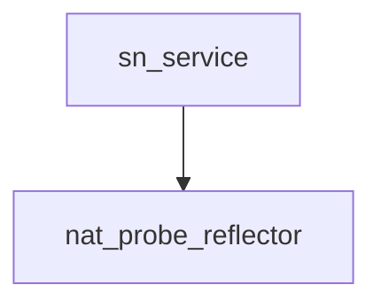

# Pipeline Plan

Workflow tier: high-risk

Risk profile: ./risk-profile.yaml

## Trigger
- Proposal: docs/versions/v0.1/modules/p2p-frame/055-keep-nat-probe-reflector-alive/proposal.md
- User launch confirmed: yes
- User launch statement: `确认，自动完成`
- Launch stage: proposal
- First auto stage: design
- Design source: pipeline/plan.md
- Per-stage user confirmation: skipped by explicit user auto-pipeline authorization
- Auto-confirm completed document stages: no design/testing Markdown documents generated; automatic design uses this pipeline plan and automatic testing uses runtime state plus testplan.yaml
- Auto-pipeline document policy: stage-selective; no design/testing Markdown docs generated; automatic design uses pipeline plan; automatic testing uses runtime state; testplan.yaml required for automatic testing
- Version: v0.1
- Packet module: p2p-frame
- Task name: 055-keep-nat-probe-reflector-alive
- Target module(s): p2p-frame
- change_id values: CHG-keep-nat-probe-reflector-alive

## Acceptance Baseline
- A single UDP response `send_to` error drops only that response and does not return from `NatProbeReflector::run`.
- After the failed send, the same reflector task and bound socket continue receiving and can send a valid signed response to a later legal request.
- A send failure is logged with the response target and error and does not retry the failed datagram.
- Request validation, response signing, admission budgets, fixed packet length, and `recv_from` error propagation remain unchanged.
- `SnServer::start_nat_probe_reflectors` remains the task owner and does not gain restart or socket-rebind behavior.

## Stage Graph
| Task ID | Stage | Execution Mode | Responsibility | Scope | Parent Task | Depends On | Output | Done Condition |
|---------|-------|----------------|----------------|-------|-------------|------------|--------|----------------|
| D-1 | design | auto-pipeline | bind request-level send recovery to the existing reflector/socket lifecycle and failure boundaries | task packet and current SN reflector call chain | root | none | validated pipeline-plan design mappings | lifecycle, failure, interface, risk, and scope mappings pass |
| I-1 | implementation | auto-pipeline | deliver the minimum production send-error recovery branch | NAT probe reflector production loop | root | D-1 | production code | admitted implementation continues after send error without changing receive/protocol behavior |
| T-1 | testing | auto-pipeline | derive and implement deterministic post-error liveness coverage through the unified task entrypoint | dedicated NAT probe unit tests and testplan | root | I-1 | test implementation, testplan, and machine run evidence | red-green evidence and applicable runtime checks are covered by passing task evidence |
| A-1 | acceptance | auto-pipeline | independently falsify recovery, lifetime, logging, capacity, compatibility, and test adequacy | complete task delivery | root | T-1 | acceptance report | accepted report has no blocking finding and passes its checker |

## Submodule Tasks
| Task ID | Stage | Execution Mode | Responsibility | Submodule | Parent Task | Depends On | Output | Done Condition |
|---------|-------|----------------|----------------|-----------|-------------|------------|--------|----------------|

## Merged-Task Reasons
- 生产变更只涉及 `sn::nat_probe` 内一个私有 UDP 发送分支，拆分为多个 implementation 子任务会产生重叠所有权而没有独立接口边界。
- 测试变更位于现有独立 NAT probe unit test 文件；`testplan.yaml` 和 runtime state 由 parent-orchestrator 统一写入。
- Design、implementation、testing、acceptance 仍是严格依赖的四个独立 stage task。

## Parallel Scheduling
- Strategy: dependency-ready-set
- Concurrency: use all runtime-available child-agent slots
- Shared artifact owner: parent-orchestrator
- Lock directory: `.harness/locks/`
- Dispatch rule: launch dependency-ready work with practical edit coordination and available capacity
- Serialization reasons: explicit dependency, edit coordination, or exhausted concurrency capacity
- Current serialization: all four tasks form one dependency chain because each consumes the preceding stage output
- Evidence: scheduler waves are recorded in `.harness/pipelines/v0.1/p2p-frame/055-keep-nat-probe-reflector-alive/state.json`

## Dependency Graphs


| Level | Parent | Node | Depends On |
|-------|--------|------|------------|
| submodule | p2p-frame | nat_probe_reflector | none |
| submodule | p2p-frame | sn_service | nat_probe_reflector |

## Exported Interfaces
| Interface | Owner | Consumer | Compatibility | Affected Callers | Migration Path |
|-----------|-------|----------|---------------|------------------|----------------|
| public `NatProbeReflector::run` runtime behavior | `sn::nat_probe` | `SnServer::start_nat_probe_reflectors` and crate tests that own a reflector future | backward-compatible | `p2p-frame/src/sn/service/service.rs`; `p2p-frame/src/networks/quic/listener/rendezvous_prediction_tests.rs` | unchanged public signature; send errors become request-local instead of resolving the future with `Err` |

```rust
pub async fn run(&self) -> P2pResult<()>;
```

## API and Build Surface Impact
- Public API impact: backward-compatible
- Crate-root export change: no
- Build-surface change: no
- Documentation examples affected: no

## Consumer Migration Closure
| Old Symbol | New Path | change_id | Consumer Path | Consumer Kind | Migration Status |
|------------|----------|-----------|---------------|---------------|------------------|
| not-applicable | private behavior-only change | CHG-keep-nat-probe-reflector-alive | verified-none | internal runtime behavior | verified-none |

## State Ownership
| State | Owner | Access Interface | Lifecycle | Failure Transitions |
|-------|-------|------------------|-----------|---------------------|
| bound UDP socket and reflector receive loop | one `NatProbeReflector::run` task | private owned `runtime::UdpSocket` used by `recv_from` and `send_to` | bind -> receive request -> validate/sign -> send or drop -> receive next request; owner abort/drop stops the task | `send_to` error logs and transitions back to receive without retry; `recv_from` error returns from `run`; signing rejection/failure drops the current response and continues |

## Failure Flows
| Flow | Boundary | Failure | Handling |
|------|----------|---------|----------|
| signed response delivery | response construction -> UDP socket `send_to` | temporary buffer, route, or interface send error | warn with target/error, discard the current response, and continue the receive loop on the same socket |
| reflector receive | UDP socket `recv_from` -> request validation | socket-level receive error | preserve current error propagation so the outer owner logs task termination instead of spinning without backoff |
| signing | admitted request -> blocking identity signature | budget rejection or signing error | preserve current request-level drop-and-continue behavior and signing admission limits |
| service ownership | `SnServer::start_nat_probe_reflectors` -> `NatProbeReflector::run` | run returns on terminal receive failure or cancellation | preserve current outer warning/task ownership; do not rebind or spawn duplicate reflector tasks |

## Rejected Alternatives
| Decision Type | Selected | Rejected | Reason |
|---------------|----------|----------|--------|
| boundary | contain `send_to` failure inside the current request | restart/rebind the reflector from `SnServer` | restart adds task duplication, bind races, and supervision complexity not needed for a transient datagram send failure |
| technical | log once per failed send attempt, drop that datagram, then receive again | retry the same response or continue on `recv_from` errors | same-datagram retry can amplify load; continuing terminal receive errors without backoff can busy-loop |
| collaboration | sequential design, one-file implementation, post-implementation testing, and independent acceptance | mix production and tests in one stage task | the auto-pipeline requires stage separation and the regression test must be designed from delivered control flow |

## Implementation Scope Bindings
| change_id | target_module | proposal_id | design_coverage | scope_paths | design_rules_applied |
|-----------|---------------|-------------|-----------------|-------------|----------------------|
| CHG-keep-nat-probe-reflector-alive | p2p-frame | P-001 | handle the actual UDP response send error as request-local, log target/error, return to the existing receive loop without retry, and preserve the public method signature plus terminal receive/protocol/signing/service-owner behavior | `p2p-frame/src/sn/nat_probe.rs`, `p2p-frame/tests/unit/sn_tests/nat_probe/tests.rs` | acyclic socket ownership, explicit send/receive failure transitions, backward-compatible public runtime semantics, unchanged wire/build surface, ordered stage ownership |

## File-Level Implementation Sequence
| Sequence | Task ID | File-Level Module | Action | Depends On | change_id | target_module | Scope Paths | Context Sources |
|----------|---------|-------------------|--------|------------|-----------|---------------|-------------|-----------------|
| 1 | I-1 | `p2p-frame/src/sn/nat_probe.rs` | replace send-error propagation with request-local logging and loop continuation while preserving all other branches | none | CHG-keep-nat-probe-reflector-alive | p2p-frame | `p2p-frame/src/sn/nat_probe.rs` | approved proposal, current reflector loop, service task owner, runtime risk profile |

## Return Rules
- Proposal ambiguity stops the pipeline for user direction; no retry, restart, or receive-error policy is inferred.
- Incorrect socket ownership, recovery transition, logging/capacity behavior, or compatibility modeling returns to D-1 and then I-1.
- Missing deterministic post-error liveness or unchanged-branch evidence returns to T-1.
- An implementation defect returns to I-1, followed by a fresh T-1 run and acceptance review.
- More than 5 unsuccessful iterations of the same unresolved issue stops the pipeline and reports it to the user.

Execution status, testing evidence, return records, and final acceptance are stored in `.harness/pipelines/v0.1/p2p-frame/055-keep-nat-probe-reflector-alive/state.json`.
