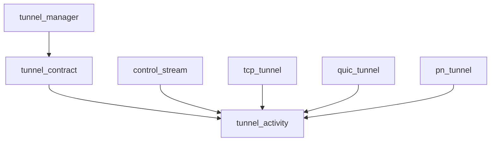
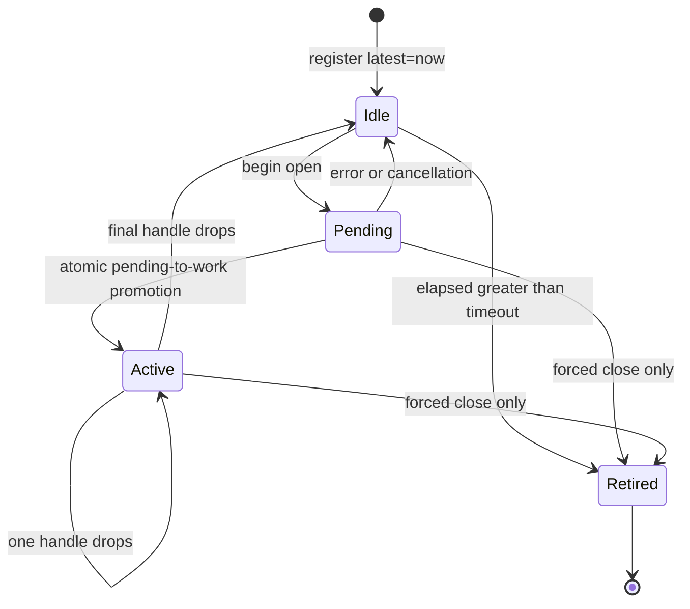
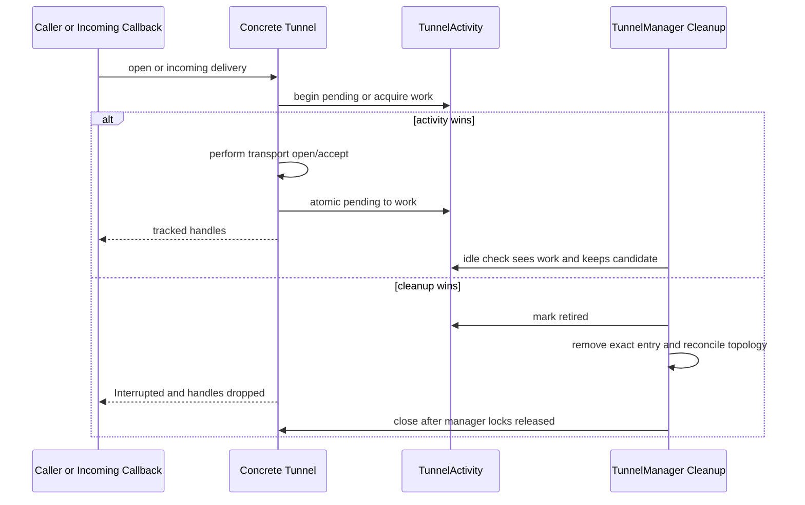

# Pipeline Plan

Workflow tier: high-risk

Risk profile: ./risk-profile.yaml

## Trigger
- Proposal: docs/versions/v0.1/modules/p2p-frame/059-restore-tunnel-idle-cleanup/proposal.md
- User launch confirmed: yes
- User launch statement: `确认，自动完成`
- Launch stage: proposal
- First auto stage: design
- Design source: pipeline/plan.md
- Per-stage user confirmation: skipped by explicit user auto-pipeline authorization
- Auto-confirm completed document stages: no design/testing Markdown documents generated; automatic design uses this pipeline plan and automatic testing uses runtime state plus testplan.yaml
- Auto-pipeline document policy: stage-selective; no design/testing Markdown docs generated; automatic design uses pipeline plan; automatic testing uses runtime state; testplan.yaml required for automatic testing
- Version: v0.1
- Packet module: p2p-frame
- Task name: 059-restore-tunnel-idle-cleanup
- Target module(s): p2p-frame
- change_id values: CHG-restore-tunnel-idle-cleanup

## Acceptance Baseline
- Reproduce the pre-`40f8216` behavior: a candidate is idle-cleanable only when it is connected, has no pending open/accept activity, has zero live read/write work instances, and `now - latest_active_at > P2pStackConfig::idle_timeout`.
- Creating, releasing, failing, or cancelling channel work updates the activity timestamp; a final handle release begins a fresh idle interval.
- A stream or public control-stream remains active until both returned halves are dropped; each datagram read or write handle independently keeps the tunnel active.
- Heartbeat traffic, listener registration, candidate registration, and publish ordering do not count as business-channel activity.
- Cleanup and new activity have one atomic winner inside the concrete Tunnel. Retired candidates reject late opens/callback delivery and release their handles without exposing a successful channel.
- Cleanup removes the exact candidate, reconciles remaining candidate/proxy-upgrade topology under the existing `tunnels -> state` lock order, and closes removed tunnels outside manager locks.
- The public `Tunnel` trait gains one conservative default lifecycle method; existing custom implementations remain source-compatible and opt out of manager idle retirement. Wire formats, heartbeat/default timeout values, endpoint/NAT/SN/PN policies, and independent PN/TTP idle mechanisms remain unchanged.

## Stage Graph
| Task ID | Stage | Execution Mode | Responsibility | Scope | Parent Task | Depends On | Output | Done Condition |
|---------|-------|----------------|----------------|-------|-------------|------------|--------|----------------|
| D-1 | design | auto-pipeline | adapt historical TunnelStat semantics to tunnel-owned reusable activity state and define lifecycle/concurrency boundaries | task packet, Tunnel trait, TCP/QUIC/PN and current TunnelManager call chain | root | none | validated pipeline-plan design mappings | ownership, state, failure, interface, risk, and scope mappings pass |
| I-1 | implementation | auto-pipeline | implement tunnel-owned activity and atomic idle retirement in built-in transports, then consume it from TunnelManager | Tunnel abstraction, TCP/QUIC/PN and TunnelManager production implementation | root | D-1 | production code | admission passes, original transport Arc identity is retained, custom tunnels opt out, and historical idle conditions work with race-safe cleanup |
| T-1 | testing | auto-pipeline | derive and implement red-green lifecycle/concurrency coverage through the task-scoped runner | dedicated TunnelManager idle tests and testplan | root | I-1 | tests, testplan, runtime coverage, and machine run evidence | regression is red on closed-only behavior and green with all required runtime checks covered |
| A-1 | acceptance | auto-pipeline | independently falsify requirement, identity, lifetime, concurrency, compatibility, and test adequacy | complete task delivery | root | T-1 | acceptance report | accepted report has no blocking finding and passes lifecycle/report checks |

## Submodule Tasks
| Task ID | Stage | Execution Mode | Responsibility | Submodule | Parent Task | Depends On | Output | Done Condition |
|---------|-------|----------------|----------------|-----------|-------------|------------|--------|----------------|
| I-1a | implementation | auto-pipeline | define shared activity ownership and trait contract | networks::tunnel | I-1 | D-1 | tunnel activity contract | default compatibility and atomic lifecycle primitives compile |
| I-1b | implementation | auto-pipeline | make incoming control callback ownership synchronous before success acknowledgement | networks::control_stream | I-1 | I-1a | control callback ordering | concrete tunnels acquire activity before a peer observes success |
| I-1c | implementation | auto-pipeline | integrate activity into TCP | networks::tcp | I-1 | I-1a, I-1b | TCP implementation | TCP owns all stream/datagram/control activity |
| I-1d | implementation | auto-pipeline | integrate activity into QUIC | networks::quic | I-1 | I-1a, I-1b | QUIC implementation | QUIC owns all stream/datagram/control activity |
| I-1e | implementation | auto-pipeline | integrate manager-idle activity into PN | pn::client | I-1 | I-1a, I-1b | PN implementation | manager idle ownership and independent PN timeout both remain valid |
| I-1f | implementation | auto-pipeline | consume the Tunnel idle contract | tunnel manager | I-1 | I-1a, I-1c, I-1d, I-1e | manager implementation | original Arc identity and exact topology cleanup are preserved |

## Merged-Task Reasons
- Production ownership spans a shared tunnel activity primitive, the three built-in Tunnel implementations, and TunnelManager cleanup. They are serialized in file-level dependency order because every transport consumes the shared primitive and the manager consumes the trait contract.
- Testing uses one dedicated manager/activity test file plus transport-local coverage where needed; the parent owns shared `testplan.yaml` and runtime state.
- Design, implementation, testing, and acceptance remain four distinct dependency-linked stage tasks.

## Parallel Scheduling
- Strategy: dependency-ready-set
- Concurrency: use all runtime-available child-agent slots
- Shared artifact owner: parent-orchestrator
- Lock directory: `.harness/locks/`
- Dispatch rule: launch dependency-ready work with practical edit coordination and available capacity
- Serialization reasons: explicit dependency, edit coordination, or exhausted concurrency capacity
- Current serialization: D-1, I-1, T-1, and A-1 form one chain because every stage consumes the preceding stage output
- Evidence: scheduler waves are recorded in `.harness/pipelines/v0.1/p2p-frame/059-restore-tunnel-idle-cleanup/state.json`

## Dependency Graphs


| Level | Parent | Node | Depends On |
|-------|--------|------|------------|
| submodule | p2p-frame | tunnel_activity | none |
| submodule | p2p-frame | tunnel_contract | tunnel_activity |
| submodule | p2p-frame | control_stream | tunnel_activity |
| submodule | p2p-frame | tcp_tunnel | tunnel_activity |
| submodule | p2p-frame | quic_tunnel | tunnel_activity |
| submodule | p2p-frame | pn_tunnel | tunnel_activity |
| submodule | p2p-frame | tunnel_manager | tunnel_contract |

## Exported Interfaces
| Interface | Owner | Consumer | Compatibility | Affected Callers | Migration Path |
|-----------|-------|----------|---------------|------------------|----------------|
| `P2pStackConfig::idle_timeout` runtime behavior | `stack` configuration and `TunnelManager` housekeeping | `create_p2p_stack`, StreamManager, DatagramManager, SN/TTP users of manager-returned tunnels | backward-compatible | `p2p-frame/src/stack.rs`; `p2p-frame/src/stream/stream_manager.rs`; `p2p-frame/src/datagram/datagram_manager.rs`; `p2p-frame/src/ttp/runtime/dispatch.rs` | callers unchanged; the previously ignored timeout regains documented behavior |
| `Tunnel::try_retire_idle` | `networks::tunnel` | TCP, QUIC, PN, mocks, and custom network implementations | backward-compatible | `p2p-frame/src/networks/tcp/tunnel.rs`; `p2p-frame/src/networks/quic/tunnel.rs`; `p2p-frame/src/pn/client/pn_tunnel.rs`; repository test Tunnel implementations | default returns false; built-ins opt in; no required downstream implementation change |

```rust
impl TunnelActivity {
    fn begin_pending(&self) -> P2pResult<PendingTunnelActivity>;
    fn try_retire_idle(&self, now: Instant, idle_timeout: Duration) -> bool;
    fn retire(&self);
}

trait Tunnel {
    fn try_retire_idle(&self, now: Instant, idle_timeout: Duration) -> bool { false }
}
```

## API and Build Surface Impact
- Public API impact: backward-compatible
- Crate-root export change: no
- Build-surface change: no
- Documentation examples affected: no

## Consumer Migration Closure
| Old Symbol | New Path | change_id | Consumer Path | Consumer Kind | Migration Status |
|------------|----------|-----------|---------------|---------------|------------------|
| not-applicable | `Tunnel::try_retire_idle` default method | CHG-restore-tunnel-idle-cleanup | `p2p-frame/src/networks/tcp/tunnel.rs`; `p2p-frame/src/networks/quic/tunnel.rs`; `p2p-frame/src/pn/client/pn_tunnel.rs`; repository custom test implementations | default compatibility plus built-in opt-in | allowed-compatibility-shim |

## State Ownership
| State | Owner | Access Interface | Lifecycle | Failure Transitions |
|-------|-------|------------------|-----------|---------------------|
| lifecycle, pending count, work-instance count, latest activity | each built-in TCP/QUIC/PN Tunnel | reusable pending/work RAII leases and `try_retire_idle` | constructed idle -> pending -> active -> partial/final release -> idle -> retired; any forced close retires | cancelled/failed open drops pending and refreshes time; promotion after retirement releases handles; counters never underflow |
| manager-visible candidate identity | `TunnelEntry` | one original concrete `TunnelRef` and exact `Arc::ptr_eq` | transport creation -> registration -> publish/reuse -> exact removal -> lock-free close | duplicate same Arc is rejected without close; different Arc collision retains existing and closes new input |
| candidate topology and proxy upgrade generation | `TunnelManager` | existing `tunnels` then `state` lock order | candidate add/remove reconciles remote topology | idle/closed last candidate clears obsolete upgrade state; remaining proxy state follows current reconciliation rules |

## Lifecycle And Ordering




Inbound ownership begins inside the concrete transport after request/listener validation and before a success acknowledgement is sent. TCP and QUIC hold a pending lease through accept processing; control-stream preparation can synchronously reject retirement and return `Retired` instead of exposing a successful stream. Bytes received before a business open request is validated remain transport framing rather than business-channel activity.

## Failure Flows
| Flow | Boundary | Failure | Handling |
|------|----------|---------|----------|
| outbound open | concrete Tunnel pending lease -> transport open | transport error, timeout, or cancellation | preserve transport error; RAII releases pending and refreshes latest activity; cancellation cannot leak a count |
| open promotion | transport success -> tracked handles | retirement won before promotion | drop handles and return `Interrupted`; never expose an untracked success |
| incoming delivery | concrete Tunnel accept -> decorated callback | retirement already won | drop successful handles and deliver `Interrupted`; callback error completion refreshes activity without claiming work |
| idle cleanup | connected candidate -> activity predicate | pending/work nonzero or elapsed equal/below timeout | keep exact candidate; strict historical `>` comparison applies |
| duplicate registration | candidate -> existing entry | same IDs but different Arc | close only new collision; exact same Arc is recognized and never closes the live source |
| candidate removal | tunnels map -> proxy-upgrade state | one or last candidate removed | reconcile under existing `tunnels -> state` order; notify scheduler after unlock |
| close | removed concrete Tunnel -> transport close | close returns error | candidate remains retired/removed; log candidate context and do not reinsert or hold manager locks |

## Rejected Alternatives
| Decision Type | Selected | Rejected | Reason |
|---------------|----------|----------|--------|
| technical | pending/work RAII plus latest transition time | `TunnelEntry::updated_at` or per-byte timestamps | updated_at is publish preference metadata; per-byte tracking changes historical live-handle semantics |
| boundary | tunnel-owned reusable activity plus a conservative default trait hook | manager-facing `ActivityTrackedTunnel` | the outer wrapper duplicates transport lifecycle, splits Arc identity, observes inbound work late, and requires forwarding every future Tunnel method |
| technical | one original concrete Tunnel Arc in each entry | wrapper identity or `Arc::strong_count` | wrapper identity complicates exact ownership; strong counts cannot distinguish business handles from manager/subscriber/cache ownership |
| boundary | reproduce behavior in current types | restore deleted TunnelStat and obsolete single-session tunnel state types | deleted types do not model current multi-channel callback architecture |
| collaboration | one serialized production child, later dedicated testing, independent acceptance | split one atomic manager file across concurrent workers | overlapping ownership would obscure lifecycle and lock-order reasoning |

## Implementation Scope Bindings
| change_id | target_module | proposal_id | design_coverage | scope_paths | design_rules_applied |
|-----------|---------------|-------------|-----------------|-------------|----------------------|
| CHG-restore-tunnel-idle-cleanup | p2p-frame | P-001 | reusable activity leases live inside built-in TCP/QUIC/PN tunnels; incoming control callbacks acquire ownership before success acknowledgement; a conservative default trait hook atomically opts built-ins into manager idle retirement without changing custom implementations; TunnelManager removes the original exact Arc and reconciles proxy topology | `p2p-frame/src/networks/tunnel.rs`, `p2p-frame/src/networks/control_stream.rs`, `p2p-frame/src/networks/tcp/tunnel.rs`, `p2p-frame/src/networks/tcp/network.rs`, `p2p-frame/src/networks/quic/tunnel.rs`, `p2p-frame/src/networks/quic/network.rs`, `p2p-frame/src/pn/client/pn_tunnel.rs`, `p2p-frame/src/tunnel/tunnel_manager.rs`, `p2p-frame/tests/unit/tunnel/idle_cleanup_tests.rs` | acyclic ownership, explicit state/failure flows, backward-compatible default trait method, unchanged build/wire surface, fixed lock order, original exact candidate identity, ordered stage ownership |

## File-Level Implementation Sequence
| Sequence | Task ID | File-Level Module | Action | Depends On | change_id | target_module | Scope Paths | Context Sources |
|----------|---------|-------------------|--------|------------|-----------|---------------|-------------|-----------------|
| 1 | I-1a | `p2p-frame/src/networks/tunnel.rs` | add reusable tunnel-owned activity leases, tracked IO handles, and a conservative default atomic idle-retirement trait method | none | CHG-restore-tunnel-idle-cleanup | p2p-frame | `p2p-frame/src/networks/tunnel.rs` | approved proposal, pre-40f8216 TunnelStat semantics, current Tunnel trait |
| 2 | I-1b | `p2p-frame/src/networks/control_stream.rs` | construct the incoming callback future before success acknowledgement so concrete tunnel activity ownership begins synchronously | I-1a | CHG-restore-tunnel-idle-cleanup | p2p-frame | `p2p-frame/src/networks/control_stream.rs` | shared activity contract and current control-open ordering |
| 3 | I-1c | `p2p-frame/src/networks/tcp/tunnel.rs` | own the reusable activity state and account outbound/incoming stream, datagram, and control handles | I-1a, I-1b | CHG-restore-tunnel-idle-cleanup | p2p-frame | `p2p-frame/src/networks/tcp/tunnel.rs` | shared activity contract and current TCP lease lifecycle |
| 4 | I-1d | `p2p-frame/src/networks/quic/tunnel.rs` | own the reusable activity state and account outbound/incoming stream, datagram, and control handles | I-1a, I-1b | CHG-restore-tunnel-idle-cleanup | p2p-frame | `p2p-frame/src/networks/quic/tunnel.rs` | shared activity contract and current Quinn stream lifecycle |
| 5 | I-1e | `p2p-frame/src/pn/client/pn_tunnel.rs` | own manager-idle activity state while preserving the independent PN idle scheduler | I-1a, I-1b | CHG-restore-tunnel-idle-cleanup | p2p-frame | `p2p-frame/src/pn/client/pn_tunnel.rs` | shared activity contract and current PN lifecycle |
| 6 | I-1f | `p2p-frame/src/tunnel/tunnel_manager.rs` | remove the manager-facing wrapper and dual identity, then consume the concrete Tunnel atomic idle decision during exact lock-free cleanup | I-1a, I-1c, I-1d, I-1e | CHG-restore-tunnel-idle-cleanup | p2p-frame | `p2p-frame/src/tunnel/tunnel_manager.rs` | Tunnel trait contract and current candidate/proxy lifecycle |

## Return Rules
- Proposal ambiguity or a requirement to observe inbound work before callback invocation stops the pipeline for user direction.
- Incorrect identity, lifecycle, state transition, failure, or lock-order modeling returns to D-1 and then I-1.
- Missing historical predicate, handle/pending/race behavior, candidate isolation, or task-run evidence returns to T-1.
- An implementation defect returns to I-1, followed by fresh T-1 evidence and acceptance.
- More than 5 unsuccessful iterations of the same unresolved issue stops the pipeline and reports it to the user.

Execution status, testing evidence, return records, and final acceptance are stored in `.harness/pipelines/v0.1/p2p-frame/059-restore-tunnel-idle-cleanup/state.json`.
