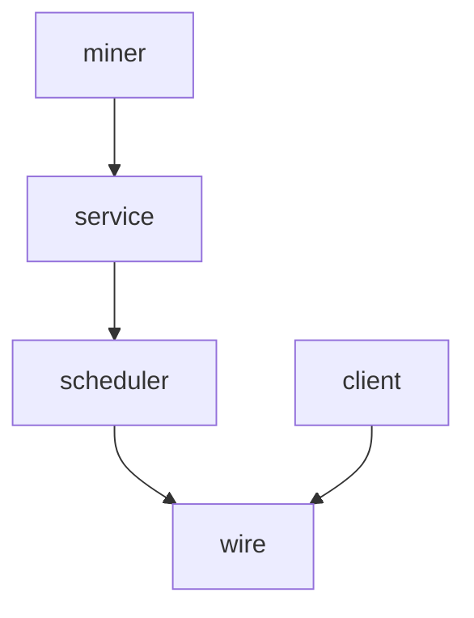

# Pipeline Plan

Workflow tier: high-risk

Risk profile: ./risk-profile.yaml

## Trigger
- Proposal: docs/versions/v0.1/modules/p2p-frame/060-nat-probe-port-only-directive/proposal.md
- User launch confirmed: yes
- User launch statement: `确认，自动完成`
- Launch stage: proposal
- First auto stage: design
- Design source: pipeline/plan.md
- Per-stage user confirmation: skipped by explicit user auto-pipeline authorization
- Auto-confirm completed document stages: no design/testing Markdown documents generated; automatic design uses this plan and automatic testing uses runtime state plus testplan.yaml
- Auto-pipeline document policy: stage-selective; no design/testing Markdown docs generated; automatic design uses pipeline/plan.md; automatic testing uses runtime state; testplan.yaml required for automatic testing
- Version: v0.1
- Packet module: p2p-frame
- Task name: 060-nat-probe-port-only-directive
- Target module(s): p2p-frame
- change_id values: CHG-nat-probe-port-only-directive

## Acceptance Baseline
- `ReportSnResp` and `NatProbeDirective` transmit only bounded, unique, non-zero NAT probe ports; no probe IP is carried in either extension.
- The client binds received ports to the IPv4 of the selected authenticated QUIC SN endpoint and constructs WAN QUIC endpoints locally for immediate and later prediction probes.
- An `ActiveSN` replacement refreshes the address binding; stale `(sn_peer_id, conn_id)` completions cannot overwrite the new snapshot.
- SN probe configuration no longer derives or requires a static-WAN identity IPv4; every reflector continues to bind `0.0.0.0:<port>` and all binds succeed before tasks spawn.
- Correlation generations, replay/deadline checks, signer verification, signed reflector source/token validation, same-socket probing, profile invalidation, timeout behavior, and existing fallback remain unchanged.
- The old endpoint-bearing wire/API contract, dual decoding, and reflectors on a different IP are intentionally unsupported.

## Stage Graph
| Task ID | Stage | Execution Mode | Responsibility | Scope | Parent Task | Depends On | Output | Done Condition |
|---------|-------|----------------|----------------|-------|-------------|------------|--------|----------------|
| D-1 | design | auto-pipeline | map port-only wire, active-SN address ownership, failure behavior, and breaking consumers | bound p2p-frame task packet | root | none | validated pipeline plan and risk checks | design mappings, exact scope, consumer closure, state, and failures pass |
| I-1 | implementation | auto-pipeline | integrate the completed production file tasks | p2p-frame SN plus sn-miner assembly | root | I-WIRE-1, I-SCHEDULER-1, I-SERVICE-1, I-CLIENT-1, I-MINER-1 | production implementation | every production consumer builds with the port-only contract |
| T-1 | testing | auto-pipeline | derive and implement protocol, boundary, lifecycle, and real-socket coverage | task-owned tests and testplan | root | I-1 | tests, testplan, runtime coverage, run artifact | task runner exercises all applicable risks and passes |
| A-1 | acceptance | auto-pipeline | independently falsify requirement, trust binding, state, failure, and test adequacy | complete task delivery | root | T-1 | acceptance report | accepted report has no blocking finding and completion checks pass |

## Submodule Tasks
| Task ID | Stage | Execution Mode | Responsibility | Submodule | Parent Task | Depends On | Output | Done Condition |
|---------|-------|----------------|----------------|-----------|-------------|------------|--------|----------------|
| I-WIRE-1 | implementation | auto-pipeline | replace both endpoint-bearing wire fields with port vectors | sn::protocol | I-1 | D-1 | `sn.rs` port-only structures and codec | no probe IP remains in either wire extension |
| I-SCHEDULER-1 | implementation | auto-pipeline | own, validate, version, and issue configured ports | sn::service::nat_probe_scheduler | I-1 | I-WIRE-1 | port-only scheduler | invalid sets disable probing and config changes preserve invalidation |
| I-SERVICE-1 | implementation | auto-pipeline | remove advertised-IP derivation and return configured ports while retaining wildcard binds | sn::service | I-1 | I-SCHEDULER-1 | service configuration and response assembly | valid ports need no static-WAN identity and bind behavior remains atomic |
| I-CLIENT-1 | implementation | auto-pipeline | bind ports to the selected authenticated QUIC SN endpoint and own the reconstructed snapshot | sn::client | I-1 | I-WIRE-1 | client conversion and ActiveSN lifecycle | immediate/later probes use one connection-bound address and fail closed |
| I-MINER-1 | implementation | auto-pipeline | stop preserving static-WAN identity endpoints only because probe ports are configured | sn-miner assembly | I-1 | I-SERVICE-1 | wildcard serving identity assembly | probe-enabled serving startup no longer retains a local public bind address |

## Parallel Scheduling
- Strategy: dependency-ready-set
- Concurrency: use all runtime-available child-agent slots
- Shared artifact owner: parent-orchestrator
- Lock directory: `.harness/locks/`
- Dispatch rule: launch dependency-ready work with practical edit coordination and available capacity
- Serialization reasons: explicit dependency, edit coordination, or exhausted concurrency capacity
- Current scheduling: D-1 precedes I-WIRE-1; I-SCHEDULER-1 and I-CLIENT-1 can run together after wire; I-SERVICE-1 follows scheduler; I-MINER-1 follows service; I-1 integrates before T-1 and A-1.
- Evidence: scheduler waves are recorded in `.harness/pipelines/v0.1/p2p-frame/060-nat-probe-port-only-directive/state.json`

## Dependency Graphs


| Level | Parent | Node | Depends On |
|-------|--------|------|------------|
| submodule | p2p-frame | wire | none |
| submodule | p2p-frame | scheduler | wire |
| submodule | p2p-frame | service | scheduler |
| submodule | p2p-frame | client | wire |
| submodule | p2p-frame | miner | service |

## Exported Interfaces
| Interface | Owner | Consumer | Compatibility | Affected Callers | Migration Path |
|-----------|-------|----------|---------------|------------------|----------------|
| `NatProbeDirective.ports` u16 port vector replacing `endpoints` | `sn::protocol` | scheduler, SN client, protocol/profile tests | breaking | `p2p-frame/src/sn/service/nat_probe_scheduler.rs`; `p2p-frame/src/sn/client/sn_service.rs`; listed test consumers | direct field migration; no compatibility codec |
| `ReportSnResp.nat_probe_ports` u16 port vector replacing `nat_probe_endpoints` | `sn::protocol` | SN service, SN client, response literals | breaking | `p2p-frame/src/sn/service/service.rs`; `p2p-frame/src/sn/client/sn_service.rs`; listed response tests | direct field migration under the existing extension magic |
| `NatProbeScheduler::{set_ports,ports}` replacing endpoint methods | `sn::service::nat_probe_scheduler` | `SnService` and scheduler tests | breaking | `p2p-frame/src/sn/service/service.rs`; `p2p-frame/tests/unit/sn_tests/service/service/nat_probe_scheduler_tests.rs` | migrate callers to port vectors |
| `SnService::set_nat_probe_ports` replacing `set_nat_probe_endpoints` | `sn::service` | real P2P fixture | breaking | `p2p-frame/tests/real_p2p_tunnel_flow/strategy_matrix.rs` | supply reflector socket ports instead of endpoints |
| active-SN port expansion | `sn::client` | directive execution and `SnNatProbeSnapshot` | new | `p2p-frame/src/sn/client/sn_service.rs` | capture selected QUIC SN endpoint at successful active registration and expand ports internally |

```rust
pub struct NatProbeDirective {
    // Existing identity, registration, request, configuration, and expiry fields remain.
    pub ports: Vec<u16>,
}

pub struct ReportSnResp {
    // Existing base response and directive fields remain.
    pub nat_probe_ports: Vec<u16>,
}

impl NatProbeScheduler {
    pub fn set_ports(&mut self, ports: Vec<u16>) -> Vec<P2pId>;
    pub fn ports(&self) -> &[u16];
}

impl SnService {
    pub fn set_nat_probe_ports(&self, ports: Vec<u16>);
}
```

## API and Build Surface Impact
- Public API impact: breaking
- Crate-root export change: no
- Build-surface change: no
- Documentation examples affected: no

## Consumer Migration Closure
| Old Symbol | New Path | change_id | Consumer Path | Consumer Kind | Migration Status |
|------------|----------|-----------|---------------|---------------|------------------|
| `NatProbeDirective.endpoints` | `NatProbeDirective.ports` | CHG-nat-probe-port-only-directive | `p2p-frame/src/sn/service/nat_probe_scheduler.rs` | production issuer | migrated |
| `NatProbeDirective.endpoints` | `NatProbeDirective.ports` | CHG-nat-probe-port-only-directive | `p2p-frame/src/sn/client/sn_service.rs` | production consumer | migrated |
| `NatProbeDirective.endpoints` | `NatProbeDirective.ports` | CHG-nat-probe-port-only-directive | `p2p-frame/tests/unit/sn_tests/protocol/common/nat_type_wire_tests.rs` | protocol test | migrated |
| `NatProbeDirective.endpoints` | `NatProbeDirective.ports` | CHG-nat-probe-port-only-directive | `p2p-frame/tests/unit/sn_tests/client/nat_probe_directive_tests.rs` | client test | migrated |
| `NatProbeDirective.endpoints` | `NatProbeDirective.ports` | CHG-nat-probe-port-only-directive | `p2p-frame/tests/nat_type_aware/sn_profile_flow_tests.rs` | profile-flow test | migrated |
| `NatProbeDirective.endpoints` | `NatProbeDirective.ports` | CHG-nat-probe-port-only-directive | `p2p-frame/tests/nat_probe_ports_api_check.py` | external negative fixture | allowed-negative-fixture |
| `ReportSnResp.nat_probe_endpoints` | `ReportSnResp.nat_probe_ports` | CHG-nat-probe-port-only-directive | `p2p-frame/src/sn/service/service.rs` | production issuer | migrated |
| `ReportSnResp.nat_probe_endpoints` | `ReportSnResp.nat_probe_ports` | CHG-nat-probe-port-only-directive | `p2p-frame/src/sn/client/sn_service.rs` | production consumer | migrated |
| `ReportSnResp.nat_probe_endpoints` | `ReportSnResp.nat_probe_ports` | CHG-nat-probe-port-only-directive | `p2p-frame/src/sn/tests.rs` | service test | migrated |
| `ReportSnResp.nat_probe_endpoints` | `ReportSnResp.nat_probe_ports` | CHG-nat-probe-port-only-directive | `p2p-frame/tests/unit/sn_tests/protocol/common/nat_type_wire_tests.rs` | protocol test | migrated |
| `ReportSnResp.nat_probe_endpoints` | `ReportSnResp.nat_probe_ports` | CHG-nat-probe-port-only-directive | `p2p-frame/tests/nat_type_aware/sn_profile_flow_tests.rs` | profile-flow test | migrated |
| `ReportSnResp.nat_probe_endpoints` | `ReportSnResp.nat_probe_ports` | CHG-nat-probe-port-only-directive | `p2p-frame/tests/nat_probe_ports_api_check.py` | external negative fixture | allowed-negative-fixture |
| `NatProbeScheduler::set_endpoints` | `NatProbeScheduler::set_ports` | CHG-nat-probe-port-only-directive | `p2p-frame/src/sn/service/service.rs` | production assembly | migrated |
| `NatProbeScheduler::set_endpoints` | `NatProbeScheduler::set_ports` | CHG-nat-probe-port-only-directive | `p2p-frame/tests/unit/sn_tests/service/service/nat_probe_scheduler_tests.rs` | scheduler test | migrated |
| `SnService::set_nat_probe_endpoints` | `SnService::set_nat_probe_ports` | CHG-nat-probe-port-only-directive | `p2p-frame/tests/real_p2p_tunnel_flow/strategy_matrix.rs` | real-socket fixture | migrated |
| `validate_nat_probe_config(ports, advertised_ipv4)` | `validate_nat_probe_config(ports)` | CHG-nat-probe-port-only-directive | `p2p-frame/tests/unit/sn_tests/service/service/nat_probe_config_tests.rs` | configuration test | migrated |
| probe-enabled `load_identity(..., true)` | wildcard identity loading | CHG-nat-probe-port-only-directive | `sn-miner-rust/src/main.rs` | binary assembly | migrated |

## State Ownership
| State | Owner | Access Interface | Lifecycle | Failure Transitions |
|-------|-------|------------------|-----------|---------------------|
| configured probe ports and configuration generation | `NatProbeScheduler` | `set_ports`, `ports`, issued directive | disabled/valid set -> generation increment -> peer profile and in-flight invalidation -> next directive | invalid count, zero, or duplicate becomes disabled empty state and never issues a directive |
| reflector sockets and tasks | `SnServer` | `start_nat_probe_reflectors`, stop/drop task handles | validate ports -> bind every wildcard socket -> spawn all run tasks -> abort on stop/drop | any bind failure returns startup error before any reflector task is spawned |
| selected SN address and reconstructed endpoint snapshot | exact `ActiveSN` entry | active registration publish, guarded `(sn_peer_id, conn_id)` update, `get_nat_probe_snapshot_for_sn` | authenticated QUIC report -> capture selected endpoint -> expand response ports -> refresh only exact connection -> removal/reset drops state | wrong transport/IP or invalid ports yields an empty/unusable snapshot; stale completion cannot mutate replacement |
| immediate directive work | current active report operation | directive validation and client-owned port expansion | validate correlation/replay/deadline/ports/address -> same-socket probe -> correlated result | invalid input or probe/signature/timeout failure returns Unknown and preserves fallback |

## Failure Flows
| Flow | Boundary | Failure | Handling |
|------|----------|---------|----------|
| server configuration | caller -> scheduler/service | fewer than two, over maximum, zero, or duplicate ports | reject startup config or clear invalid runtime set; do not partially advertise |
| server startup | validated ports -> reflector sockets | one wildcard bind fails | return startup error before spawning any reflector run task |
| initial active SN publication | selected SN endpoint plus report response -> ActiveSN | TCP, IPv6, unspecified/multicast/broadcast IPv4, or malformed ports | retain active SN connectivity but expose no probe snapshot and reject directive probing to Unknown |
| immediate probe | directive -> QUIC listener prediction | identity/generation/replay/deadline/ports mismatch or signer missing | reject before send; malformed or untrusted work cannot select another destination IP |
| report refresh | async report completion -> ActiveSN | connection replaced while report/probe was in flight | existing `(sn_peer_id, conn_id)` guard prevents stale snapshot/profile overwrite |
| configuration refresh | scheduler generation -> client report | port set changes during in-flight work | increment generation, cancel old in-flight authority work, invalidate profile, and reconstruct from new response ports |
| signed UDP probe | listener socket -> reflector response | timeout, wrong source/token, malformed packet, or invalid signature | preserve current fail-closed Unknown result and existing tunnel fallback |

## Rejected Alternatives
| Decision Type | Selected | Rejected | Reason |
|---------------|----------|----------|--------|
| boundary | reconstruct only inside SN client and keep `SnNatProbeSnapshot` endpoint-based | move reconstruction into `TunnelManager` | tunnel management should not learn SN wire semantics or duplicate immediate/later conversion logic |
| technical | use the selected authenticated QUIC SN endpoint IPv4 | use `ReportSnResp.end_point_array`, an arbitrary identity endpoint, or a server-supplied IP | response endpoints describe the client, arbitrary identity ordering can differ from the active route, and server-selected IP recreates redirection/config coupling |
| collaboration | dependency-ordered wire, scheduler/service, client, and miner file tasks followed by separate testing and acceptance | one cross-stage edit task or concurrent edits to the shared wire file | the wire must settle before consumers migrate, while tests and acceptance need independent post-implementation ownership |

## Implementation Scope Bindings
| change_id | target_module | proposal_id | design_coverage | scope_paths | design_rules_applied |
|-----------|---------------|-------------|-----------------|-------------|----------------------|
| CHG-nat-probe-port-only-directive | p2p-frame | P-001 | both SN response extensions carry only ports; scheduler owns validated ports; service removes advertised-IP derivation and retains atomic wildcard binding; client binds ports to the exact active authenticated QUIC SN endpoint and preserves endpoint-based internal prediction snapshots; sn-miner no longer retains a public local address for probe configuration | `p2p-frame/src/sn/protocol/sn.rs`, `p2p-frame/src/sn/service/nat_probe_scheduler.rs`, `p2p-frame/src/sn/service/service.rs`, `p2p-frame/src/sn/client/sn_service.rs`, `p2p-frame/src/sn/tests.rs`, `p2p-frame/tests/unit/sn_tests/protocol/common/nat_type_wire_tests.rs`, `p2p-frame/tests/unit/sn_tests/client/nat_probe_directive_tests.rs`, `p2p-frame/tests/unit/sn_tests/service/service/nat_probe_config_tests.rs`, `p2p-frame/tests/unit/sn_tests/service/service/nat_probe_scheduler_tests.rs`, `p2p-frame/tests/nat_type_aware/sn_profile_flow_tests.rs`, `p2p-frame/tests/real_p2p_tunnel_flow/strategy_matrix.rs`, `p2p-frame/tests/nat_probe_ports_api_check.py`, `sn-miner-rust/src/main.rs`, `sn-miner-rust/tests/unit/nat_probe_config_tests.rs`, `sn-miner-rust/tests/real_process.rs` | acyclic wire-to-consumer dependencies, breaking migration closure, single-owner connection-bound snapshot, explicit validation and failure flows, unchanged internal tunnel boundary, ordered stage ownership |

## File-Level Implementation Sequence
| Sequence | Task ID | File-Level Module | Action | Depends On | change_id | target_module | Scope Paths | Context Sources |
|----------|---------|-------------------|--------|------------|-----------|---------------|-------------|-----------------|
| 1 | I-WIRE-1 | `p2p-frame/src/sn/protocol/sn.rs` | replace endpoint-bearing directive/response extensions with port vectors | none | CHG-nat-probe-port-only-directive | p2p-frame | `p2p-frame/src/sn/protocol/sn.rs` | approved proposal, current extension codec, all field consumers |
| 2 | I-SCHEDULER-1 | `p2p-frame/src/sn/service/nat_probe_scheduler.rs` | store, validate, log, version, and issue ports | I-WIRE-1 | CHG-nat-probe-port-only-directive | p2p-frame | `p2p-frame/src/sn/service/nat_probe_scheduler.rs` | port-only wire and current generation/profile lifecycle |
| 3 | I-SERVICE-1 | `p2p-frame/src/sn/service/service.rs` | remove advertised-IP derivation, expose configured ports, and keep wildcard bind atomically started | I-SCHEDULER-1 | CHG-nat-probe-port-only-directive | p2p-frame | `p2p-frame/src/sn/service/service.rs` | scheduler contract, server construction/start/stop flow |
| 4 | I-CLIENT-1 | `p2p-frame/src/sn/client/sn_service.rs` | capture selected SN endpoint, validate ports/IP, reconstruct immediate and retained endpoints | I-WIRE-1 | CHG-nat-probe-port-only-directive | p2p-frame | `p2p-frame/src/sn/client/sn_service.rs` | active publication/update guards and snapshot consumers |
| 5 | I-MINER-1 | `sn-miner-rust/src/main.rs` | remove probe-driven static-WAN preservation and use wildcard identity loading | I-SERVICE-1 | CHG-nat-probe-port-only-directive | p2p-frame | `sn-miner-rust/src/main.rs` | serving assembly and device endpoint normalization |

## Return Rules
- Proposal ambiguity about which SN IP owns reflectors stops the pipeline for user direction; the approved baseline currently selects the active authenticated QUIC SN endpoint.
- Incorrect wire, address ownership, state lifecycle, failure, or consumer modeling returns to D-1 and then the affected implementation file tasks.
- Missing protocol, boundary, stale-state, wildcard startup, real-socket, or task-run evidence returns to T-1.
- A production defect returns to its implementation task, followed by fresh T-1 evidence and acceptance.
- More than 5 unsuccessful iterations of the same unresolved issue stops the pipeline and reports it to the user.

Execution status, test evidence, returns, and final acceptance are stored in `.harness/pipelines/v0.1/p2p-frame/060-nat-probe-port-only-directive/state.json`.
