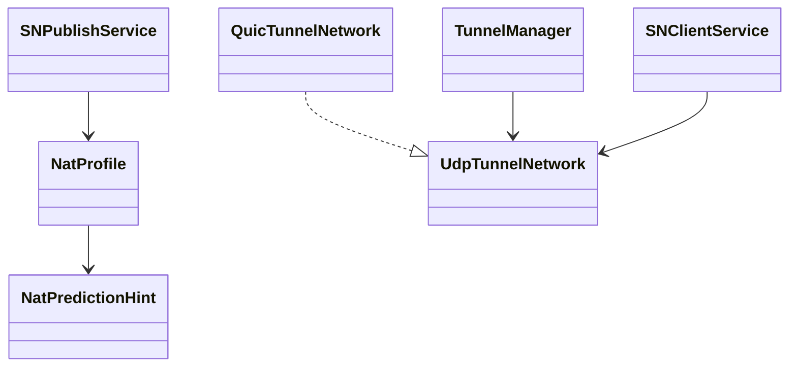
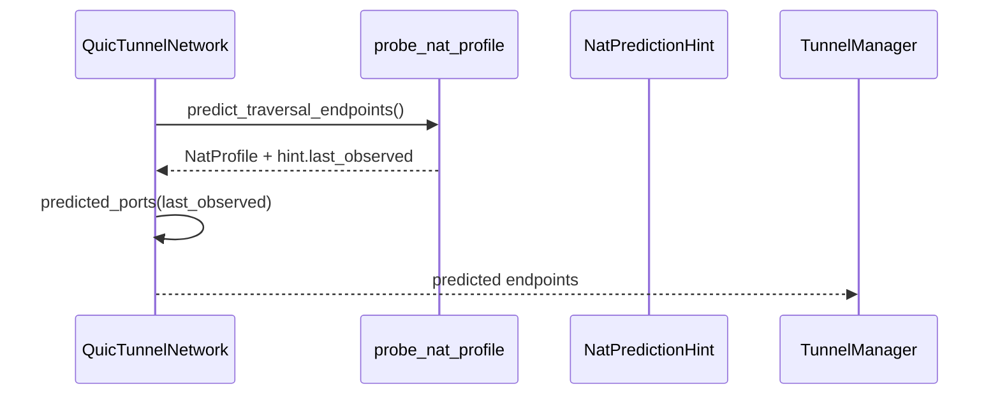
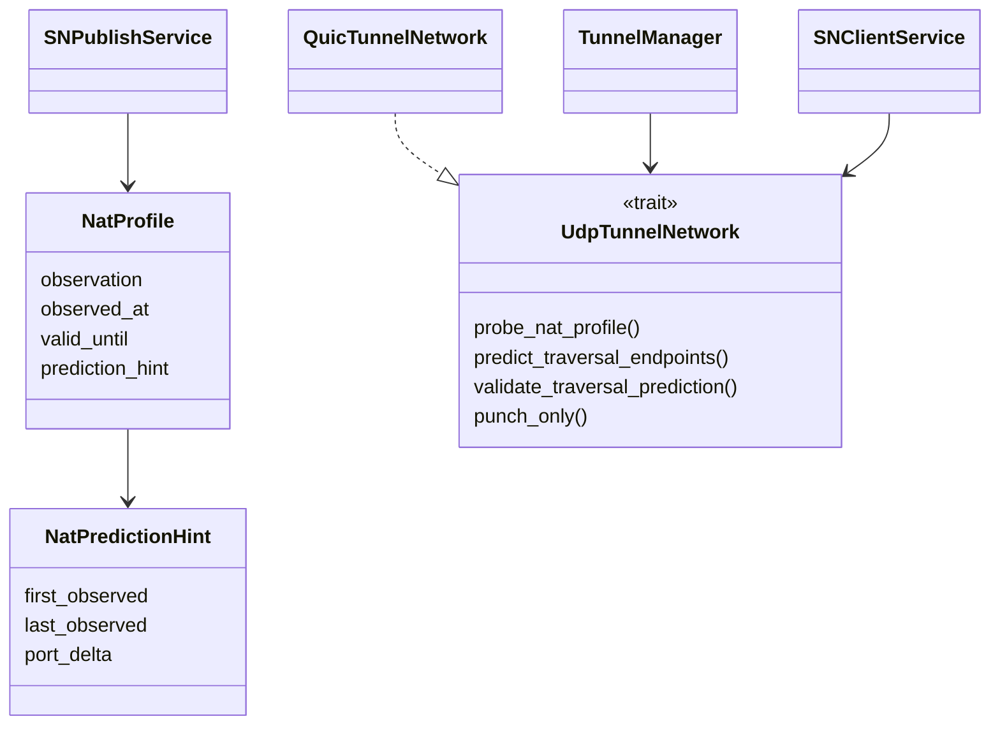

# Design: 移除 NatProfile.observed_endpoint 并限制预测仅来自 live probe

Risk profile: ./risk-profile.yaml

## Scope and Approach
删除 `NatProfile.observed_endpoint` 字段，保留分类、时效和 hint；freshness 去掉 endpoint 要求；预测候选只能来自 live `predict_traversal_endpoints`。`NonSymmetricLike` 直连继续只使用 peer endpoint 候选，不依赖 profile 字段。`nat_candidates(Predicted)` 不再从缓存 remote profile/hint 展开。

## Design Scope
- 修改 `NatProfile` 结构、创建路径和 freshness。
- 修改 live probe/prediction 锚点来源。
- 修改 `nat_candidates(Predicted)` 的资料来源。
- 修改 SN client/service profile 消费与测试。
- 不修改探测 wire、端口向量、TTL、socket 生命周期或 peer endpoint 刷新。

## Useful Context
`NatProfile` 是 SN report/query/call/called 与本地 active-SN 共用的公开 wire 类型。当前 `observed_endpoint` 由实时 `probe_nat_profile` 写入并随 report 上报；`nat_candidates(Predicted)` 仍可能从查询缓存 profile 展开。本任务把端点只保留在 live 探测内部并使用 hint.last_observed 作为本轮锚点，profile 不再保存该值。

## Overall Approach
先收敛 `NatProfile` 结构，再改 live probe 锚点，最后限制 `nat_candidates` 的预测数据来源并迁移测试。全程不新增字段、不保留旧 wire。

## Module Relationship UML


## File-Level Interfaces
- Consumer: CHG-remove-observed-endpoint (nat_type), CHG-live-prediction-only (networks/quic/udp_network)
- Compatibility: breaking

### CHG-remove-observed-endpoint consumer: p2p-frame/src/nat_type.rs
```rust
// p2p-frame/src/nat_type.rs
pub struct NatProfile {
    pub version: u8,
    pub observation: crate::nat_type::NatMappingObservation,
    pub observed_at: crate::types::Timestamp,
    pub valid_until: crate::types::Timestamp,
    pub prediction_hint: Option<crate::nat_type::NatPredictionHint>,
}
```

### CHG-live-prediction-only consumer: p2p-frame/src/networks/udp_network.rs
```rust

// p2p-frame/src/networks/udp_network.rs
pub trait UdpTunnelNetwork: TunnelNetwork {
    async fn predict_traversal_endpoints(
        &self,
        probe_targets: &[Endpoint],
        expected_signer: &P2pIdentityCertRef,
        per_target_timeout: Duration,
        ttl: Duration,
    ) -> P2pResult<TraversalEndpointPrediction>;
}
```

## Key Flows


## State and Ownership
`NatProfile` 由 SN client/service 共享，但只承载分类与 hint；live probe 的当前映射只存在于一次 `predict_traversal_endpoints` 调用的局部结果中，不写入 profile 或 peer manager 持久状态。
- Owner: `p2p-frame/src/sn/client/sn_service.rs` owns `ActiveSN.net_profile`; live prediction result is local to `p2p-frame/src/networks/quic/listener.rs`.

## Implementation Order
| phase | goal | depends_on | output | change_id |
|---|---|---|---|---|
| 1 | 收敛 `NatProfile` 结构 | proposal | `NatProfile` 无 observed_endpoint | CHG-remove-observed-endpoint |
| 2 | live 预测锚点改为 hint.last_observed | phase 1 | listener 不再读 profile.observed_endpoint | CHG-live-prediction-only |
| 3 | 网络层签名与 trait 同步 | phase 2 | `UdpTunnelNetwork` 调用链编译 | CHG-live-prediction-only |
| 4 | SN client/service profile 迁移 | phase 1 | report/query/store 无该字段 | CHG-remove-observed-endpoint |
| 5 | `nat_candidates(Predicted)` 改为 live-only | phase 2、3 | fallback 不再用缓存 hint | CHG-live-prediction-only |
| 6 | 全部测试迁移与定向验证 | phase 1-5 | `p2p-frame` lib 与相关集成测试通过 | CHG-remove-observed-endpoint, CHG-live-prediction-only |

## Risks and Rollback
旧 wire 不再可解析；发布必须整组升级。如果线上出现 profile 解码失败，回滚到旧版本二进制即可恢复旧 `NatProfile` 编码，无需迁移数据。fallback `Predicted` 改为 live-only 可能增加探测频率，需验证 `NAT_PROBE_TARGET_TIMEOUT` 与 rendezvous deadline 内可完成。

## Layered Design


## Layered Design Document Index
| level | parent_document | unit | design_document | responsibility |
|---|---|---|---|---|
| 1 | design.md | nat_type | design/nat_type.md | profile 结构、freshness、hint |
| 1 | design.md | networks/quic | design/networks-quic.md | live probe 与预测锚点 |
| 1 | design.md | tunnel | design/tunnel.md | 候选来源与 fallback |
| 1 | design.md | sn/client | design/sn-client.md | 本地 profile 上报 |
| 1 | design.md | sn/service | design/sn-service.md | profile 存储与发布 |
| 1 | design.md | tests | design/tests.md | 测试迁移与定向覆盖 |

## Directly Mapped Change Items
| change_id | proposal_id | target_module | Design Coverage | Scope Paths |
|-----------|-------------|---------------|-----------------|-------------|
| CHG-remove-observed-endpoint | P-001 | p2p-frame | `design/nat_type.md`、`design/sn-client.md`、`design/sn-service.md`、`design/tests.md` | p2p-frame/src/nat_type.rs, p2p-frame/src/networks/quic/listener.rs, p2p-frame/src/networks/quic/network.rs, p2p-frame/src/networks/udp_network.rs, p2p-frame/src/sn/client/sn_service.rs, p2p-frame/src/sn/service/nat_probe_scheduler.rs, p2p-frame/src/sn/service/peer_manager.rs, p2p-frame/src/sn/service/service.rs, p2p-frame/tests |
| CHG-live-prediction-only | P-002 | p2p-frame | `design/networks-quic.md`、`design/tunnel.md`、`design/tests.md` | p2p-frame/src/tunnel/tunnel_manager.rs, p2p-frame/src/networks/quic/listener.rs, p2p-frame/src/networks/quic/network.rs, p2p-frame/src/networks/udp_network.rs, p2p-frame/tests |

## API and Build Surface Impact
- Public API impact: breaking
- Crate-root export change: no
- Build-surface change: no
- Documentation examples affected: no

## Consumer Migration Closure
| old_symbol | new_path | change_id | consumer_kind | migration_status | consumer_path |
|-------------|----------|-----------|--------------|-----------------|---------------|
| `NatProfile.observed_endpoint` | removed | CHG-remove-observed-endpoint | production | migrated | p2p-frame/src/nat_type.rs |
| `NatProfile.observed_endpoint` | removed | CHG-remove-observed-endpoint | production | migrated | p2p-frame/src/networks/quic/listener.rs |
| `NatProfile.observed_endpoint` | removed | CHG-remove-observed-endpoint | production | migrated | p2p-frame/src/tunnel/tunnel_manager.rs |
| `NatProfile.observed_endpoint` | removed | CHG-remove-observed-endpoint | production | migrated | p2p-frame/src/sn/client/sn_service.rs |
| `NatProfile.observed_endpoint` | removed | CHG-remove-observed-endpoint | tests | migrated | p2p-frame/tests/unit/nat_type/tests.rs |
| `NatProfile.observed_endpoint` | removed | CHG-remove-observed-endpoint | tests | migrated | p2p-frame/tests/nat_type_aware/tunnel_manager_tests.rs |
| `NatProfile.observed_endpoint` | removed | CHG-remove-observed-endpoint | tests | migrated | p2p-frame/tests/nat_type_aware/sn_profile_flow_tests.rs |

## File-Level Implementation Sequence
| sequence | file_level_module | action | scope_path | implementation_task | change_id | depends_on |
|---|---|---|---|---|---|---|
| 1 | `p2p-frame/src/nat_type.rs` | modify | `p2p-frame/src/nat_type.rs` | same packet | CHG-remove-observed-endpoint | proposal |
| 2 | `p2p-frame/src/networks/quic/listener.rs` | modify | `p2p-frame/src/networks/quic/listener.rs` | same packet | CHG-live-prediction-only | nat_type |
| 3 | `p2p-frame/src/networks/quic/network.rs` | modify | `p2p-frame/src/networks/quic/network.rs` | same packet | CHG-live-prediction-only | listener |
| 4 | `p2p-frame/src/networks/udp_network.rs` | modify | `p2p-frame/src/networks/udp_network.rs` | same packet | CHG-live-prediction-only | network |
| 5 | `p2p-frame/src/sn/client/sn_service.rs` | modify | `p2p-frame/src/sn/client/sn_service.rs` | same packet | CHG-remove-observed-endpoint | nat_type |
| 6 | `p2p-frame/src/sn/service/nat_probe_scheduler.rs` | modify | `p2p-frame/src/sn/service/nat_probe_scheduler.rs` | same packet | CHG-remove-observed-endpoint | sn-client |
| 7 | `p2p-frame/src/sn/service/peer_manager.rs` | modify | `p2p-frame/src/sn/service/peer_manager.rs` | same packet | CHG-remove-observed-endpoint | sn-client |
| 8 | `p2p-frame/src/sn/service/service.rs` | modify | `p2p-frame/src/sn/service/service.rs` | same packet | CHG-remove-observed-endpoint | scheduler, peer-manager |
| 9 | `p2p-frame/src/tunnel/tunnel_manager.rs` | modify | `p2p-frame/src/tunnel/tunnel_manager.rs` | same packet | CHG-live-prediction-only | listener, network |
| 10 | `p2p-frame/tests/**` | migrate | `p2p-frame/tests` | same packet | CHG-remove-observed-endpoint, CHG-live-prediction-only | all |

## Design Notes
`NatPredictionHint.last_observed` 是 live probe 完成后唯一的锚点承载；不新增 profile 字段。`NonSymmetricLike` profile 没有 hint 且不再有 endpoint，因此它只负责选择是否进入非预测 Base 分支，具体直连端点仍来自 `remote_endpoints`。旧 wire blob 不兼容，不接受混合版本回滚。
